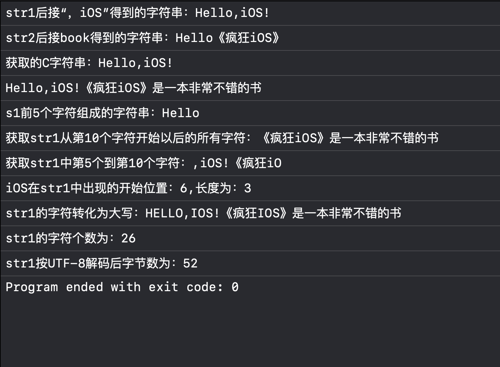
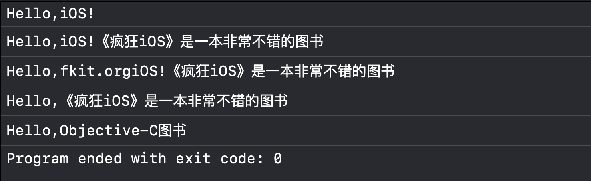

## 一、字符串


NSString代表字符序列不可变的字符串，而NSMutable代表字符序列可变的字符串。


### 1.1 NSString字符串及功能


通过NSString，我们可以：


        1、创建字符串。2、读取文件或网络URL来初始化字符串，或者将字符串写入文件或URL。3、获取字符串长度，即可获取字符串字符个数，也可获取字符串包括的字节个数。4、获取字符串中的字符或字节，即可获取指定位置的字符，也可获取指定范围的字符。5、获取字符串对应的C风格字符串。6、连接、分隔、查找、替换、比较字符串。7、对字符串中的字符进行大小写转换。


```objective-c
#import <Foundation/Foundation.h>

int main(int argc, const char * argv[]) {
    @autoreleasepool {
        //使用Unicode数值数组初始化字符串
        unichar data[6] = {97,98,99,100,101,102};
        NSString *str1 = [[NSString alloc] initWithCharacters: data length: 6];
        NSLog(@"%@",str1);   //abcdef

        //将C风格的字符串转换为NSString对象
        char *cstr = "Hello,iOS!";
        NSString *str2 = [NSString stringWithUTF8String: cstr];
        NSLog(@"%@",str2);   //Hello,iOS!

        //将字符串写入指定对象
        [str2 writeToFile: @"myFile.txt" atomically:YES encoding:NSUTF8StringEncoding error: nil];

        //读取文件内容，用文件内容初始化字符串
        NSString *str3 = [NSString stringWithContentsOfFile:@"NSStringTest.m"encoding:NSUTF8StringEncoding error:nil];
        NSLog(@"%@",str3);    // (null)
    }
    return 0;
}
```


**unichar 是无符号 16 位字符类型，表示 UTF-16 编码；**


接下来的一段代码，我们来演示NSString的其他功能：


```objective-c
#import <Foundation/Foundation.h>

int main(int argc, const char * argv[]) {
    @autoreleasepool {
        NSString *str1 = @"Hello";
        NSString *str2 = @"Hello";
        NSString *book = @"《疯狂iOS》";

        //追加字符串
        str1 = [str1 stringByAppendingString: @",iOS!"];
        NSLog(@"str1后接“，iOS”得到的字符串：%@",str1);

        str2 = [str2 stringByAppendingString: book];
        NSLog(@"str2后接book得到的字符串：%@",str2);

        //获取C风格的字符串
        const char *cstr = [str1 UTF8String];
        NSLog(@"获取的C字符串：%s",cstr);

        str1 = [str1 stringByAppendingFormat: @"%@是一本非常不错的书",book];
        NSLog(@"%@",str1);

        //获取指定字符
        NSString *s1 = [str1 substringToIndex: 5];
        NSLog(@"s1前5个字符组成的字符串：%@",s1);

        NSString *s2 = [str1 substringFromIndex: 10];
        NSLog(@"获取str1从第10个字符开始以后的所有字符：%@",s2);

        NSString *s3 = [str1 substringWithRange: NSMakeRange(5,10)];
        NSLog(@"获取str1中第5个到第10个字符：%@",s3);

        NSRange pos = [str1 rangeOfString: @"iOS"];
        NSLog(@"iOS在str1中出现的开始位置：%ld,长度为：%ld",pos.location,pos.length);

        //对字符进行大小转换
        str1 = [str1 uppercaseString];
        NSLog(@"str1的字符转化为大写：%@",str1);

        //获取字符串长度和字节数
        NSLog(@"str1的字符个数为：%lu",[str1 length]);
        NSLog(@"str1按UTF-8解码后字节数为：%lu",[str1 lengthOfBytesUsingEncoding: NSUTF8StringEncoding]);
    }
    return 0;
}
```


上面的代码使用了一个NSRange类型的变量，NSRange并不是一个类，它只是一个结构体，包括了location和length两个unsigned int整型值，分别代表起始位置和长度。

        还有一个NSMakeRange(loc，len)，它是一个结构体类型，包含两个参数，loc是起始位置，len是长度。表示字符串要传进来的起始位置和长度。





### 1.2 可变字符串 NSMutableString


NSString字符串是不可变的字符串，即一旦NSString对象被创建，其中的字符序列就不能更改了。而NSMutableString字符串就不一样了，它的字符串序列是可更改的。而且NSMutableString是NSString的子类，因此，上一节说的NSString的方法，NSMutableString都可以直接使用。


        NSMutableString提供了以下的方法来改变字符串字符序列：


追加字符串 appendString: / appendFormat: 插入字符串 insertString:atIndex: 删除字符 deleteCharactersInRange: 替换内容 replaceOccurrencesOfString:withString:options:range: 获取长度 length 转为不可变 [NSString stringWithString:mutableStr]


```objective-c
#import <Foundation/Foundation.h>

int main(int argc, const char * argv[]) {
    @autoreleasepool {
        NSString *book = @"《疯狂iOS》";
        NSMutableString *str1 = [NSMutableString stringWithString: @"Hello"];

        [str1 appendString: @",iOS!"];//追加固定字符串
        NSLog(@"%@",str1);

        [str1 appendFormat:@"%@是一本非常不错的图书",book];//追加带变量的字符串
        NSLog(@"%@",str1);

        [str1 insertString:@"fkit.org" atIndex: 6];//在指定位置插入字符串
        NSLog(@"%@",str1);

        [str1 deleteCharactersInRange: NSMakeRange(6, 12)];//删除第六到第十二个字符
        NSLog(@"%@",str1);

        [str1 replaceCharactersInRange:NSMakeRange(6, 15) withString:@"Objective-C"];//将第六到第十五个字符改为“Objective-C”
        NSLog(@"%@",str1);
    }
    return 0;
}
```





## 二、日期与时间


Objective- C为处理日期、时间提供了NSDate，NSCalender 对象，还提供了日期格式器来处理日期与字符串之间的转换


### 2.1 日期与时间（NSDate）


其中，NSDate对象代表日期与时间，OC既提供了类方法来创建NSDate对象，也提供了大量init开头的方法来初始化NSDate对象。创建NSDate的类方法和实例方法基本相似，只是**类方法以date开头，实例方法以init开头。**


```objective-c
//获取代表当前日期，时间的NSDate
        NSDate* date1= [NSDate date];
        NSLog(@"%@", date1);
        //获取从当前时间开始，一天以后的日期
        NSDate* date2 = [[NSDate alloc] initWithTimeIntervalSinceNow:3600*24];
        NSLog(@"%@", date2);
        //获取从当前时间开始，3天以前的日期
        NSDate* date3 = [[NSDate alloc] initWithTimeIntervalSinceNow:-3*3600*24];
        NSLog(@"%@", date3);
### 2.2 日期格式器


 ** NSDateFormatte**r代表一个日期格式器，它的作用就是完成NSDate和NSString之间的转换。在进行转换时，我们首先需要创建一个NSDateFormatter对象，然后调用该对象的setDateStyle：、setTimeStyle：方法设置格式化日期、时间的风格。其中日期、时间风格支持以下几个枚举值：


NSDateFormatterNoStyle    不显示日期、时间的风格

NSDateFormatterShortStyle    显示“短”的日期、时间的风格

NSDateFormatterLongStyle    显示“长”的日期、时间的风格

NSDateFormatterMediumStyle    显示“中等”的日期、时间的风格

NSDateFormatterFullStyle    显示“完整”的日期、时间的风格

        除了这几个枚举值，我们还可以通过调用setDateFormate：方法设置日期、时间的风格模版。


        如果需要将NSDate转换为NSString，可以调用NSDateFormatter的stringFromDate：方法执行格式化即可；如果需要将NSString转换为NSDate，可以调用NSDateFormatter的dateFromString：方法执行格式化即可。


接下来用代码来演示NSDate和NSDateFormatter的功能：


```objective-c
#import <Foundation/Foundation.h>

int main(int argc, const char * argv[]) {
    @autoreleasepool {
        //NSDate的功能演示
        NSLog(@"----------------------以下是NSDate的功能运行结果--------------------");
        NSDate *date1 = [NSDate date]; //获取当前时间
        NSLog(@"%@",date1);

        NSDate *date2 = [[NSDate alloc] initWithTimeIntervalSinceNow:3600 * 24];//获取从当前时间开始的后一天的时间
        NSLog(@"%@",date2);

        NSDate *date3 = [[NSDate alloc] initWithTimeIntervalSinceNow:-3 * 3600 * 24];//获取从现在开始三天前的时间
        NSLog(@"%@",date3);

        NSDate *date4 = [[NSDate alloc] initWithTimeIntervalSince1970:3600 * 24 * 366 * 20];//获取从1970年1月1日开始往后20年的时间
        NSLog(@"%@",date4);

        NSLocale *cn = [NSLocale currentLocale];//NSLocale代表一个语言，这里表示中文
        NSLog(@"%@",[date1 descriptionWithLocale: cn]);//用中文输出date1的时间

        NSDate *earlier = [date1 earlierDate: date2];
        NSLog(@"%@",earlier);//获取两个时间中较早的时间

        NSDate *later = [date1 laterDate: date2];
        NSLog(@"%@",later);//获取两个时间中较晚的时间

        //比较两个日期用：compare：方法，它包括如下三个值
        //三个值分别代表调用compare的日期位于被比较日期之前、相同、之后
        switch([date1 compare: date3]) {
            case NSOrderedAscending: NSLog(@"date1在date3之前");
                break;
            case NSOrderedSame: NSLog(@"date1和date3时间想相同");
                break;
            case NSOrderedDescending: NSLog(@"date1在date3时间之后");
                break;
        }

        NSLog(@"date1和date3的时间差是%g秒",[date1 timeIntervalSinceDate: date3]);//获取两个时间的时间差
        NSLog(@"date2与现在的时间差%g秒",[date2 timeIntervalSinceNow]);//获取指定时间和现在的时间差


        //NSDateFormatter的功能
        NSLog(@"----------------以下是NSDateFormatter的功能的运行结果----------------");
        NSDateFormatter *dt = [NSDate dateWithTimeIntervalSince1970:3600 * 24 * 366 * 20];//格式化时间为从1970年1月1日开始的20年后的时间

        NSLocale *locales[] = {[[NSLocale alloc] initWithLocaleIdentifier:@"zh_CN"],[[NSLocale alloc] initWithLocaleIdentifier:@"en_US"]};//创建两个NSLocale分别表示中国、美国
        NSDateFormatter *df[8];//为上面两个NSLocale创建8个NSDateFormatter对象

        for (int i = 0; i < 2; i++) {
            df[i * 4] = [[NSDateFormatter alloc] init];
            [df[i * 4] setDateStyle:NSDateFormatterShortStyle];//设置NSDateFormatter的日期、时间风格
            [df[i * 4] setTimeStyle:NSDateFormatterShortStyle];
            [df[i * 4] setLocale: locales[i]];//设置NSDateFormatter的NSLocale

            df[i * 4 + 1] = [[NSDateFormatter alloc] init];
            [df[i * 4 + 1]setDateStyle:NSDateFormatterMediumStyle];//设置NSDateFormatter的日期、时间风格
            [df[i * 4 + 1]setDateStyle:NSDateFormatterMediumStyle];
            [df[i * 4 + 1] setLocale: locales[i]];//设置NSDateFormatter的NSLocale

            df[i * 4 + 2] = [[NSDateFormatter alloc] init];
            [df[i * 4 + 2] setDateStyle:NSDateFormatterLongStyle];//设置NSDateFormatter的日期、时间风格
            [df[i * 4 + 2] setTimeStyle:NSDateFormatterLongStyle];
            [df[i * 4 + 2] setLocale: locales[i]];//设置NSDateFormatter的NSLocale

            df[i * 4 + 3] = [[NSDateFormatter alloc] init];
            [df[i * 4 + 3] setDateStyle:NSDateFormatterFullStyle];//设置NSDateFormatter的日期、时间风格
            [df[i * 4 + 3] setTimeStyle:NSDateFormatterFullStyle];
            [df[i * 4 + 3] setLocale: locales[i]];//设置NSDateFormatter的NSLocale
        }
        for (int i = 0; i < 2; i++) {
            switch (i) {
                case 0: NSLog(@"-----中国日期格式------");
                    break;
                case 1: NSLog(@"-----美国日期格式------");
                    break;
            }
            NSLog(@"SHORT格式的日期格式：%@",[df[i * 4] stringFromDate: dt]);
            NSLog(@"MEDIUM格式的日期格式：%@",[df[i * 4 + 1] stringFromDate: dt]);
            NSLog(@"LONG格式的日期格式：%@",[df[i * 4 + 2] stringFromDate: dt]);
            NSLog(@"FULL格式的日期格式：%@",[df[i * 4 + 3] stringFromDate: dt]);
        }
        NSDateFormatter *df2 = [[NSDateFormatter alloc] init];
        [df2 setDateFormat:@"公元yyyy年MM月DD日HH时mm分"];//设置自定义格式器模版
        NSLog(@"%@",[df2 stringFromDate: dt]);//执行格式化
        NSString *dateStr = @"2013-03-02";
        NSDateFormatter *df3 = [[NSDateFormatter alloc] init];
        [df3 setDateFormat: @"yyyy-MM-DD"];//根据日期字符串的格式设置格式模版
        NSDate *date6 = [df3 dateFromString: dateStr];//将字符串转化为NSDate对象
        NSLog(@"%@",date6);
    }
    return 0;
}
### 2.3 日历（NSCalender）与日期组件（NSDateComponents）


 当需要将年、月、日的数值转换为NSDate的时候，或者从NSDate对象中获取其包含的年、月、日信息时，我们就需要将NSDate对象的各个字段数据分开提取。


        为了能分开NSDate对象包含的各个字段数据，Foundation框架提供了NSCalendar对象，该对象包含了以下两个常用方法：


        1、（NSDateComponents*）components： fromDate： ：从NSDate提取年、月、日、时、分、秒各时间字段的信息。


        2、dateFromComponents：（NSDateComponents*）comps：使用comps对象包含的年、月、日、时、分、秒各时间字段的信息来创建NSDate。


        NSDateComponents对象是专门用于封装年、月、日、时、分、秒各时间字段的信息，该对象只包含了对year、month、day、hour、minute、second、week、weekday等各字段的getter和setter方法。


```objective-c
#import <Foundation/Foundation.h>

int main(int argc, const char * argv[]) {
    @autoreleasepool {
        NSCalendar *gregorian = [[NSCalendar alloc] initWithCalendarIdentifier: NSCalendarIdentifierGregorian];//获取代表公历的Calendar对象
        NSDate *dt = [NSDate date];//获取当前日期

        unsigned unitFlags = NSCalendarUnitYear | NSCalendarUnitMonth | NSCalendarUnitDay | NSCalendarUnitHour | NSCalendarUnitMinute | NSCalendarUnitSecond | NSCalendarUnitWeekday;//定义一个时间字段的旗标，指定将会获取指定年、月、日、时、分、秒的信息
        NSDateComponents *comp = [gregorian components: unitFlags fromDate: dt];//获取不同时间字段的信息

        //获取各时间字段的数值
        NSLog(@"现在是%ld年",comp.year);
        NSLog(@"现在是%ld月",comp.month);
        NSLog(@"现在是%ld日",comp.day);
        NSLog(@"现在是%ld时",comp.hour);
        NSLog(@"现在是%ld分",comp.minute);
        NSLog(@"现在是%ld秒",comp.second);
        NSLog(@"现在是星期%ld",comp.weekday);//这里输出的数字会比按照日历的星期数多一，是因为按西方他们是把周天当每周的第一天的

        NSDateComponents *comp2 = [[NSDateComponents alloc] init];//再次创建一个NSDateComponents对象

        //设置各时间字段的数值
        comp2.year = 2023;
        comp2.month = 5;
        comp2.day = 10;
        comp2.hour = 18;
        comp2.minute = 15;

        //通过NSDateComponents所包含的时间字段的数值来恢复NSDate对象
        NSDate *date = [gregorian dateFromComponents: comp2];
        NSLog(@"获取的日期为：%@",date);
    }
    return 0;
}
### 2.4 定时器


  当程序需要让某个方法重复执行，可以借助OC中的定时器来完成。


        通过调用NSTimer的scheduledTimerWithTimeInterval： invocation： repeats：或scheduledTimerWithTimeInterval： targe：selector： userInfo： repeats：类方法来创建NSTimer对象。调用该方法时需要传入以下参数：


        1、timeInterval：指定每隔多少秒执行一次任务


        2、invocation或target与selector：指定重复执行的任务。如果指定target和selector参数，则指定用某个对象的特定方法作为重复执行的任务；如果指定invocation参数，该参数需要传入一个NSInvocation对象，该对象也是封装target和selector的，其实也是指定用某个对象的特定方法作为重复执行的任务。


        3、userInfo：该参数用于传入额外的附加信息。


        4、repeats：该参数需要指定一个BOOL值，该参数控制是否需要重复执行任务。


        在执行完定时器后，也需要销毁定时器，只要调用定时器的invalidate方法即可。

---

原文发布于 CSDN：[OC语言学习——Foundation框架（上）](https://blog.csdn.net/2402_86720949/article/details/147835869)
