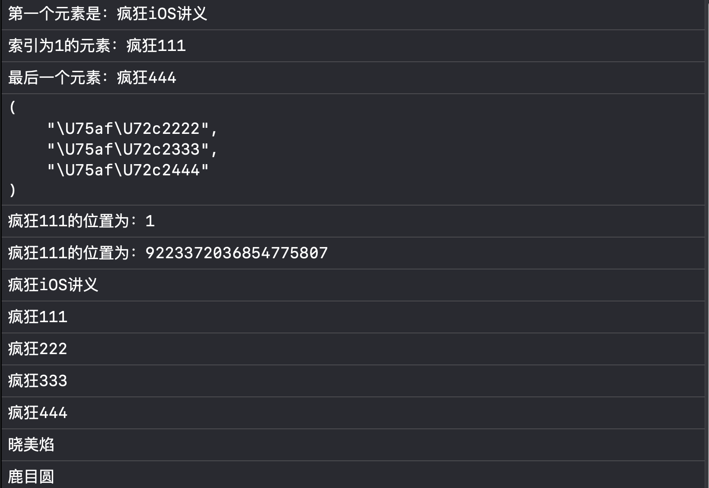
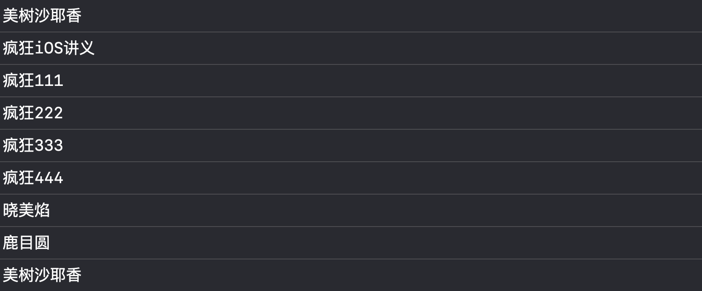
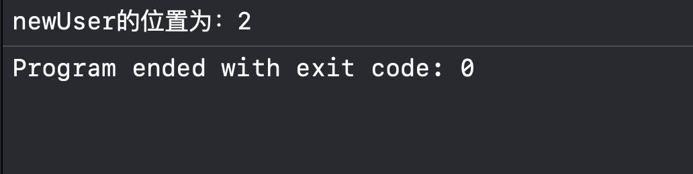
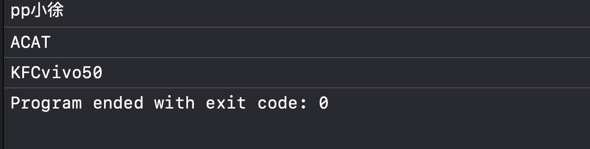
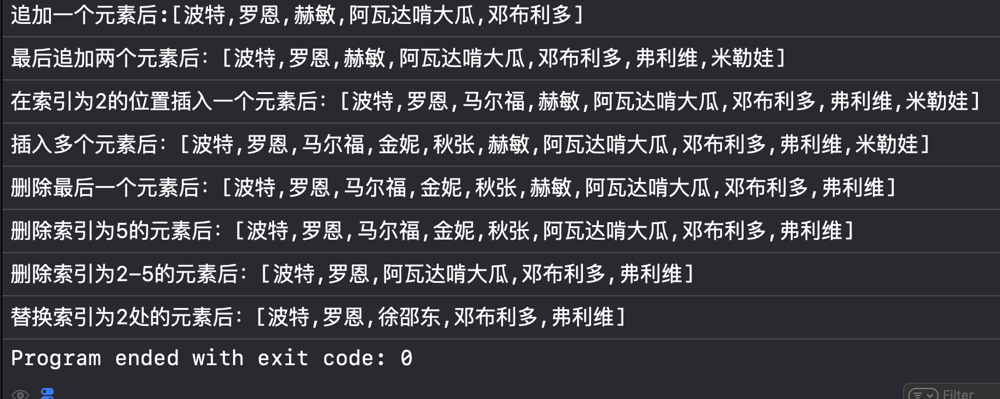
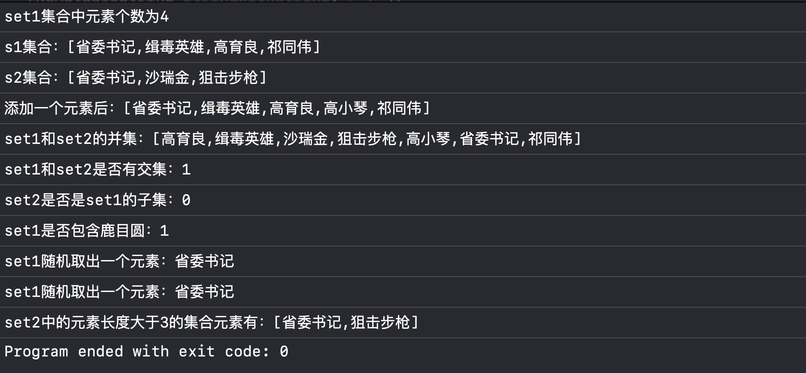
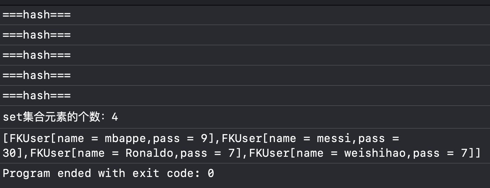
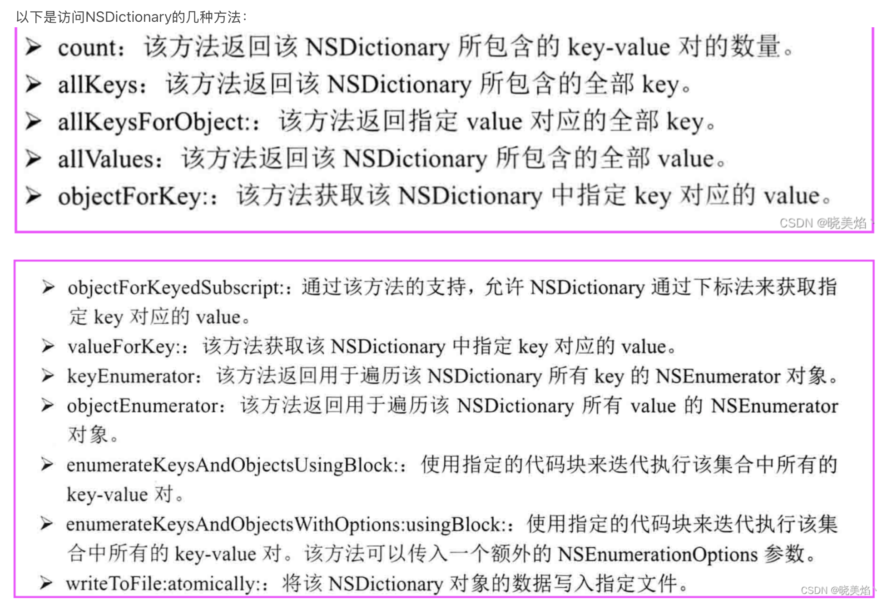

## 四、Objective — C 集合表述


OC集合类可以用于存储数量不等的多个对象，并且可以实现常用的数据结构，例如栈和队列等，除此以外，OC集合还可以用来保存具有映射关系的关联数组。


OC的集合大致上可以分为三种体系：


NSArray                                代表有序、可重复的集合，很像一个数组


NSSet                                   代表无序、不可重复的集合       


NSDictionary                       代表具有映射关系的集合


  在实际编程里，面向的是NSArray（及其子类NSMutableArray）、NSSet（及其子类NSMutableSet）、NSDictionary（及其子类NSMutableDictionary）编程，程序创建的也可能是它们的子类的实例。


        集合类和数组不一样，数组保存的元素既可以是基本类型的值，也可以是对象（实际上是对象的指针变量）；而集合里只能保存对象（实际上是对象的指针变量）。


        OC集合中，NSSet集合类似于一个罐子，把一个对象添加到NSSet集合时，NSSet无法记住添加这个元素的顺序，因此NSSet的元素不可以重复。且访问其元素，只能根据元素本身来访问。


        NSArray类似于一个数组，它可以记住每次添加元素的顺序，因此它的元素可以重复，且NSMutableArray的长度可变。访问其中的元素，只需要根据元素的索引来访问。


        NSDictionary集合也像一个罐子，只是它里面的每一项数据都由两个值组成。访问其中的元素，可以根据每项元素的key值来访问其value。


## 五、数组（NSArray和NSMutableArray）


### 5.1 NSArray的功能与用法


  NSArray分别提供了类方法和实例方法来创建NSArray，两种创建方式要传入的参数基本相似，只是类方法由array开头，实例方法以init开头。


        创建NSArray对象的几个常见方法：


array                                                                                     创建一个不包含任何元素的空NSArray

arrayWithContentsOfFile：/initWithContentsOfFile：    读取文件内容来创建NSArray

arrayWithObject：  /initWithObject：                               创建只包含指定元素的NSArray

arrayWithObjects：/initWithObjects：                              创建包含指定的n个元素的NSArray


```objective-c
#import <Foundation/Foundation.h>

int main(int argc, const char * argv[]) {
    @autoreleasepool {
        //NSArray集合
        NSArray *arr = [NSArray arrayWithObjects:@"疯狂iOS讲义",@"疯狂111",@"疯狂222",@"疯狂333",@"疯狂444", nil];
        NSLog(@"第一个元素是：%@",[arr objectAtIndex: 0]);
        NSLog(@"索引为1的元素：%@",[arr objectAtIndex: 1]);
        NSLog(@"最后一个元素：%@",[arr lastObject]);

        //获取索引从2到5的元素组成的新集合
        NSArray *arr1 = [arr objectsAtIndexes: [NSIndexSet indexSetWithIndexesInRange:NSMakeRange(2, 3)]];
        NSLog(@"%@",arr1);

        //获取元素在集合中的位置
        NSLog(@"疯狂111的位置为：%ld",[arr indexOfObject: @"疯狂111"]);
        //获取元素在集合指定范围中的位置
        NSLog(@"疯狂111的位置为：%ld",[arr indexOfObject: @"疯狂111" inRange:NSMakeRange(2, 3)]);

        //向数组的末尾追加元素
        //原arr的本身没有变，只是将新返回的NSArray赋给arr
        arr = [arr arrayByAddingObject:@"晓美焰"];//追加单个元素
        arr = [arr arrayByAddingObjectsFromArray:[NSArray arrayWithObjects: @"鹿目圆",@"美树沙耶香", nil]];//将另一个数组中所有元素追加到原数组后面
        for (int i = 0; i < arr.count; i++) {
            NSLog(@"%@",[arr objectAtIndex: i]);//也可简写为：NSLog(@"%@",[array objectAtIndex: i]);
        }
        //获取array数组中索引为5到8的所有元素
        NSArray *arr2 = [arr subarrayWithRange: NSMakeRange(5, 3)];
        //将NSArray集合的元素写入文件
        [arr2 writeToFile: @"myFile.txt" atomically: YES];

        for (int j = 0; j < 8; j++) { //也可以用下标法来访问元素
            NSLog(@"%@",arr[j]);
        }

    }
    return 0;
}
```







 在上面的代码中，传入集合的元素中的最后一个是nil，代表NSArray元素结束，其实这个nil元素并不会存入NSArray集合中。


        上面代码还用了一个NSIndexSet集合，这个集合和NSSet的功能基本相似，区别只是NSIndexSet集合主要用于保存索引值，因此它的集合都是NSUInteger对象。


        在iOS 5.0以上的版本可以直接用下标法来访问元素，以下两个代码作用是相同的：


        [array objectAtIndex: i];


        array[i];


#### 5.1.1 NSArray 判断制定元素位置的标志


 NSSArray判断指定元素位置的标准只有一条：只有某个集合元素与被查找的元素通过isEqual：方法比较返回YES，即可认为该NSArray集合包含该元素，并不需要两个元素是同一个元素。


下面用代码来证实NSArray的比较机制：


```objective-c
#import <Foundation/Foundation.h>

NS_ASSUME_NONNULL_BEGIN

@interface FKUser : NSObject

@property (nonatomic,copy) NSString *name;
@property (nonatomic,copy) NSString *pass;

- (id) initWithName: (NSString*) aName pass: (NSString*) aPass;
- (void) say: (NSString*) content;

@end

NS_ASSUME_NONNULL_END
```


```objective-c
#import "FKUser.h"

@implementation FKUser

@synthesize name;
@synthesize pass;

- (id) initWithName:(NSString *)aName pass:(NSString *)aPass {
    if (self = [super init]) {
        name = aName;
        pass = aPass;
    }
    return self;
}
- (void) say: (NSString*) content {
    NSLog(@"%@说：%@",self.name,content);
}
- (BOOL) isEqual:(id)other {
    if (self == other) {
        return YES;
    }
    if ([other class] == FKUser.class) {
        FKUser *target = (FKUser*)other;
        return [self.name isEqualToString: target.name] && [self.pass isEqualToString: target.pass];
    }
    return NO;
}

//为了直接看到FKUser的内部状态，因此改写了description方法
- (NSString*) description {
    return [NSString stringWithFormat:@"<FKUser[name = %@,pass = %@>",self.name,self.pass];
}

@end
```





### 5.2 对集合元素整体调用方法


对于简单的调用集合中的元素的方法，可以通过NSArray的如下两种方法：


        1、makeObjectsPerformSelector：依次调用元素中每个元素的指定方法，该方法需要传入一个SEL参数，用于指定调用哪种方法。


        2、makeObjectsPerformSelector： withObject：：依次调用NSArray集合中的每个元素的指定方法，该方法第一个SEL参数用于指定调用哪个方法；第二个参数用于调用集合元素的方法时传入参数；第三个参数用于控制是否中止迭代，如果在处理某个元素后，将第三个元素赋为YES，该方法就会中止迭代使用。


        如果希望对集合中的所有元素进行隐式访问，并使用集合元素来执行某一段代码，则可通过NSArray的以下方法来完成。


        1、enumerateObjectsUsingBlock：：遍历集合中的所有元素，并依次使用元素来执行指定的代码块。


        2、enumerateObjectsWithOptions： usingBlock：：遍历集合中的所有元素，并依次使用元素来执行指定的代码块。该方法可以额外传入一个参数，用于控制遍历的选项，如反向遍历。


        3、enumerateObjectsAtIndexes：options：usingBlock：：遍历集合中指定范围内的元素，并依次使用元素来执行指定的代码块。该方法可以传入一个选项参数，用于控制遍历的选项，如反向遍历。


        上面方法都必须传入一个代码块参数，该代码块必须带三个参数，前一个参数代表正在遍历的集合元素，第二个参数代表正在遍历的集合元素的索引。


### 5.3 对NSSArray进行排序


**数组类型** **方法名** **传入参数类型** **是否原地修改** **是否返回新数组** **支持 block** **支持 selector** **支持函数指针** **可用于自定义对象排序** **常用程度** NSMutableArray sortUsingSelector: SEL（方法选择器） ✅ 是 ❌ 否 ❌ 否 ✅ 是 ❌ 否 ✅ 是（如 compare:） ⭐⭐⭐ NSMutableArray sortUsingComparator: NSComparator（block） ✅ 是 ❌ 否 ✅ 是 ❌ 否 ❌ 否 ✅ 是 ⭐⭐⭐⭐ NSMutableArray sortUsingFunction:context: 函数指针 + void * ✅ 是 ❌ 否 ❌ 否 ❌ 否 ✅ 是 ✅ 是 ⭐ NSArray sortedArrayUsingSelector: SEL（方法选择器） ❌ 否 ✅ 是 ❌ 否 ✅ 是 ❌ 否 ✅ 是（如 compare:） ⭐⭐⭐ NSArray sortedArrayUsingComparator: NSComparator（block） ❌ 否 ✅ 是 ✅ 是 ❌ 否 ❌ 否 ✅ 是 ⭐⭐⭐⭐ NSArray sortedArrayUsingFunction:context: 函数指针 + void * ❌ 否 ✅ 是 ❌ 否 ❌ 否 ✅ 是 ✅ 是 ⭐ NSArray / NSMutableArray sortedArrayUsingDescriptors: NSSortDescriptor数组 ❌ 否 ✅ 是 ❌ block


```objective-c
#import <Foundation/Foundation.h>

//定义一个比较函数，根据两个对象的intValue进行比较
NSInteger intSort(id num1,id num2,void *context) {
    int v1 = [num1 intValue];
    int v2 = [num2 intValue];
    if (v1 < v2)
        return NSOrderedAscending;
    else if (v1 > v2)
        return NSOrderedDescending;
    else
        return NSOrderedSame;
}

int main(int argc, const char * argv[]) {
    @autoreleasepool {
        NSArray *array1 = [NSArray arrayWithObjects: @"Objective-C",@"C",@"C++",@"Ruby",@"Perl",@"Python",nil];//初始化一个元素为NSString的NSArray对象
        //使用集合的compare：方法进行排序
        array1 = [array1 sortedArrayUsingSelector: @selector(compare:)];
        NSLog(@"%@",array1);

        NSArray *array2 = [NSArray arrayWithObjects: [NSNumber numberWithInt:20],[NSNumber numberWithInt:12],[NSNumber numberWithInt:-8],[NSNumber numberWithInt:50],[NSNumber numberWithInt:19],nil];//初始化一个元素为int的NSArray对象
        //使用intSort函数进行排序
        array2 = [array2 sortedArrayUsingFunction: intSort context: nil];
        NSLog(@"%@",array2);

        //使用代码块对array2的元素进行排序
        NSArray *array3 = [array2 sortedArrayUsingComparator: ^(id obj1,id obj2) {
            //该代码块根据集合元素的intValue进行比较
            if ([obj1 intValue] > [obj2 intValue]) {
                return NSOrderedDescending;
            }
            if ([obj1 intValue] < [obj2 intValue]) {
                return NSOrderedAscending;
            }
            return NSOrderedSame;
        }];
        NSLog(@"%@",array3);
    }
    return 0;
}
```


 在上述代码中，我们可以看见第一种方法使用NSString自身的compare：方法进行排序。这是因为NSString自身已经实现了compare：方法，这意味着NSString对象本身就可以比较大小——NSString自身比较大小的方法是根据字符对应的编码来的。


        compare：方法的比较是：compare在要比较的字符串中，依次取出对应的数组元素,按ascii码值比较,如果ascii值能比较出结果了,就不往后比较。默认返回值为升序


        后两种方法通过调用代码块或者函数来比较大小，代码块相当于一个匿名函数，因此后面两种方式的本质是一样的，它们都可以通过自定义的比较规则来比较集合元素的大小。


### 5.4 使用枚举遍历器遍历NSArray集合元素


        可以调用NSArray对象的如下两个方法来返回枚举器：


        1、objectEnumerator：返回NSArray集合的顺序枚举器。


        2、reverseObjectEnumerator：返回NSArray逆序枚举器。


        上面两个方法都返回一个NSEnumerator枚举器，该枚举器只包含如下两个方法：


        1、allObjects：获取被枚举集合中的所有元素。


        2、nextObject：获取被枚举集合中的下一个元素。


        借助nextObject方法即可对集合元素进行枚举：程序可采用循环不断获取nextObject方法的返回值，直到该方法的返回值为nil结束循环。


用以下代码演示上述方法：


```objective-c
#import <Foundation/Foundation.h>

int main(int argc, const char * argv[]) {
    @autoreleasepool {
        NSArray *array = [NSArray arrayWithObjects: @"健身减脂",@"郑成龙",@"pp小徐",@"阿娜娜自助烤肉",nil];//初始化一个NSArray集合
        //获取NSArray的顺序枚举器
        NSEnumerator *en = [array objectEnumerator];
        id object;
        while (object = [en nextObject]) {
            NSLog(@"%@",object);
        }
        NSLog(@"-----下面是逆序遍历------");
        //获取NSArray的逆序枚举器
        en = [array reverseObjectEnumerator];
        while (object = [en nextObject]) {
            NSLog(@"%@",object);
        }
    }
    return 0;
}
### 5.5 快速枚举（for...in）


        OC提供了一种快速枚举的方法来遍历集合（包括NSArray、NSSet、NSDictionary等集合），使用快速枚举遍历集合元素的时候，无需获取集合的长度，也无需根据索引来访问集合元素，即可快速枚举自动遍历集合的每个元素。其语法格式如下： 


```objective-c
for (type variableName in collection) {
    //variableName自动迭代访问每个元素
}
```


 在上面的语法格式中，type是集合元素的类型，variableName是一个形参名，快速枚举将自动将集合元素赋给该变量。如果使用快速枚举来遍历NSDictionary对象，快速枚举中循环计数器依次代表NSDictionary的每个key值。


        快速枚举的本质是一个foreach循环，foreach循环和普通循环不同的是，它无需循环条件，也无需循环迭代语句，这些部分都是由系统来完成的，foreach循环自动迭代数组的每个元素，当每个元素都被迭代一次后，foreach循环自动结束。


代码示例：


```objective-c
#import <Foundation/Foundation.h>

int main(int argc, const char * argv[]) {
    @autoreleasepool {
        NSArray* array = [NSArray arrayWithObjects:@"pp小徐",@"ACAT",@"KFCvivo50",nil];
        for (id object in array) {
            NSLog(@"%@",object);
        }
    }
    return 0;
}
```





### 5.6 可变数组NSMutableArray


 NSArray代表元素不可变的集合，一旦NSArray创建成功，程序中不能向集合中添加新的元素，不能删除已有的元素，也不能替换集合元素。NSArray只是保存对象的指针，因此，NSArray只保证这些指针变量中的地址不能改变，但指针变量所指向的对象是可改变的。


        NSMutableArray是NSArray的子类，因此它可以当作NSArray使用。它代表一个元素可变的集合，因此它程序可以向它中增添、删除、替换元素。创建NSMutableArray时可以通过参数指定底层数组的初始容量。


        NSMutableArray新增了以下方法：


添加几何元素：                                以为add开头


删除集合元素：                                以remove开头


替换几何元素中的方法：                 以replace开头


对集合本身排序的方法：                 以sort开头


```objective-c
#import <Foundation/Foundation.h>

//定义一个函数，该函数用于把NSArray集合转换为字符串
//这样方便我们调试的时候看到NSArray集合中的元素
NSString *NSCollectionToString(NSArray *array) {
    NSMutableString *result = [NSMutableString stringWithString:@"["];
    for (id obj in array) {
        [result appendString: [obj description]];
        [result appendString:@","];
    }
    NSUInteger len = [result length];//获取字符串长度
    [result deleteCharactersInRange:NSMakeRange(len - 1, 1)];//去掉最后一个字符
    [result appendString:@"]"];
    return result;
}

int main(int argc, const char * argv[]) {
    @autoreleasepool {
        //初始化NSMutableArray集合
        NSMutableArray *array = [NSMutableArray arrayWithObjects:@"晓美焰",@"鹿目圆",@"巴麻美",@"美树沙耶香", nil];

        //向集合最后追加元素
        [array addObject:@"佐仓杏子"];
        NSLog(@"追加一个元素后:%@",NSCollectionToString(array));
        [array addObjectsFromArray:[NSArray arrayWithObjects:@"丘比",@"仁美", nil]];
        NSLog(@"最后追加两个元素后：%@",NSCollectionToString(array));

        //向集合指定位置插入元素
        [array insertObject:@"蓓蓓" atIndex:2];
        NSLog(@"在索引为2的位置插入一个元素后：%@",NSCollectionToString(array));
        [array insertObjects:[NSArray arrayWithObjects:@"吼拉姆",@"馒头卡", nil] atIndexes:[NSIndexSet indexSetWithIndexesInRange:NSMakeRange(3, 2)]];
        NSLog(@"插入多个元素后：%@",NSCollectionToString(array));

        //删除集合中指定位置的元素
        [array removeLastObject];
        NSLog(@"删除最后一个元素后：%@",NSCollectionToString(array));
        [array removeObjectAtIndex:5];
        NSLog(@"删除索引为5的元素后：%@",NSCollectionToString(array));
        [array removeObjectsInRange:NSMakeRange(2, 3)];
        NSLog(@"删除索引为2-5的元素后：%@",NSCollectionToString(array));

        //替换集合中指定位置的元素
        [array replaceObjectAtIndex:2 withObject:@"Q币"];
        NSLog(@"替换索引为2处的元素后：%@",NSCollectionToString(array));
    }
    return 0;
}
```


```objective-c
#import <Foundation/Foundation.h>

//定义一个函数，该函数用于把NSArray集合转换为字符串
//这样方便我们调试的时候看到NSArray集合中的元素
NSString *NSCollectionToString(NSArray *array) {
    NSMutableString *result = [NSMutableString stringWithString:@"["];
    for (id obj in array) {
        [result appendString: [obj description]];
        [result appendString:@","];
    }
    NSUInteger len = [result length];//获取字符串长度
    [result deleteCharactersInRange:NSMakeRange(len - 1, 1)];//去掉最后一个字符
    [result appendString:@"]"];
    return result;
}

int main(int argc, const char * argv[]) {
    @autoreleasepool {
        //初始化NSMutableArray集合
        NSMutableArray *array = [NSMutableArray arrayWithObjects:@"波特",@"罗恩",@"赫敏",@"阿瓦达啃大瓜", nil];

        //向集合最后追加元素
        [array addObject:@"邓布利多"];
        NSLog(@"追加一个元素后:%@",NSCollectionToString(array));
        [array addObjectsFromArray:[NSArray arrayWithObjects:@"弗利维",@"米勒娃", nil]];
        NSLog(@"最后追加两个元素后：%@",NSCollectionToString(array));

        //向集合指定位置插入元素
        [array insertObject:@"马尔福" atIndex:2];
        NSLog(@"在索引为2的位置插入一个元素后：%@",NSCollectionToString(array));
        [array insertObjects:[NSArray arrayWithObjects:@"金妮",@"秋张", nil] atIndexes:[NSIndexSet indexSetWithIndexesInRange:NSMakeRange(3, 2)]];
        NSLog(@"插入多个元素后：%@",NSCollectionToString(array));

        //删除集合中指定位置的元素
        [array removeLastObject];
        NSLog(@"删除最后一个元素后：%@",NSCollectionToString(array));
        [array removeObjectAtIndex:5];
        NSLog(@"删除索引为5的元素后：%@",NSCollectionToString(array));
        [array removeObjectsInRange:NSMakeRange(2, 3)];
        NSLog(@"删除索引为2-5的元素后：%@",NSCollectionToString(array));

        //替换集合中指定位置的元素
        [array replaceObjectAtIndex:2 withObject:@"徐邵东"];
        NSLog(@"替换索引为2处的元素后：%@",NSCollectionToString(array));
    }
    return 0;
}
```





## 六、集合（NSSet和NSMutableSet）


### 6.1 NSSet的功能与用法


NSSet集合像一个罐子，把对象放进去后是无序的，因此里面的元素不能重复。


在前面说过，NSSet集合就像一个罐子，把对象放进去后是无序的，因此里面的元素不能重复。NSSet按Hash算法来存储集合中的元素，因此具有很好的存取和查找功能。与NSArray相比，NSSet最大的区别是元素没有索引，因此前面的NSArray的所有关于索引的方法都不能用于NSSet。


        但是NSSet和NSArray还是有相似之处，比如：1、它们都可以通过count方法来获取集合元素的数量。2、都可以使用快速枚举来集合遍历元素。3、都可以通过objectEnumerator方法获取NSEnumerator枚举器对集合元素进行遍历。4、都提供了makeObjectsPerformSelector：、makeObjectsPerformSelector：withObject：方法对集合元素整体调用某个方法，以及enumerateObjectsUsingBlock：、enumerateObjectsWithOptions：usingBlock对集合整体或部分元素迭代执行代码块。5、都提供了valueForKey：和setValue： forKey：方法对集合元素进行KVC编程。6、都提供了集合所有元素和部分元素进行KVC编程的方法。


        在NSSet集合中同样，以set开头的是类方法，以init开头的是实例方法。


```objective-c
#import <Foundation/Foundation.h>

//定义一个函数，可以把NSSet集合转化为字符串
//方便我们调试观察结果
NSString *NSCollectionToString(id collection) {
    NSMutableString *result = [NSMutableString stringWithString: @"["];
    for (id obj in collection) {
        [result appendString: [obj description]];
        [result appendString:@","];
    }
    NSUInteger len = [result length];//获取字符串长度
    [result deleteCharactersInRange: NSMakeRange(len - 1, 1)];//去除最后一个字符
    [result appendString: @"]"];
    return result;
}

int main(int argc, const char * argv[]) {
    @autoreleasepool {
        //初始化集合set1和set2
        //在初始化集合set1的时候故意传入两个相同的元素，可以看到结果是只保留了一个
        NSSet *set1 = [NSSet setWithObjects: @"缉毒英雄", @"祁同伟", @"省委书记", @"高育良", nil];
        NSLog(@"set1集合中元素个数为%ld", [set1 count]);
        NSLog(@"s1集合：%@",NSCollectionToString(set1));
        NSSet *set2 = [NSSet setWithObjects: @"狙击步枪", @"省委书记", @"沙瑞金",  nil];
        NSLog(@"s2集合：%@", NSCollectionToString(set2));

        //向集合中追加单个元素
        set1 = [set1 setByAddingObject: @"高小琴"];
        NSLog(@"添加一个元素后：%@", NSCollectionToString(set1));

        //获取两个集合的并集
        NSSet *s = [set1 setByAddingObjectsFromSet: set2];
        NSLog(@"set1和set2的并集：%@", NSCollectionToString(s));

        //判断两个集合是否有交集
        BOOL b = [set1 intersectsSet: set2];
        NSLog(@"set1和set2是否有交集：%d", b);

        //判断一个集合是否是另一个集合的子集
        BOOL bo = [set2 isSubsetOfSet: set1];
        NSLog(@"set2是否是set1的子集：%d", bo);

        //判断集合中是否包含某个元素
        BOOL bb = [set1 containsObject: @"祁同伟"];
        NSLog(@"set1是否包含祁同伟：%d", bb);

        //随机从集合中取出一个元素，但是同时写两个下面的代码输出的结果是相同的
        NSLog(@"set1随机取出一个元素：%@", [set1 anyObject]);
        NSLog(@"set1随机取出一个元素：%@", [set1 anyObject]);

        //使用代码块对集合元素进行过滤
        NSSet *filteredSet = [set2 objectsPassingTest: ^(id obj,BOOL *stop) {
            return (BOOL)([obj length] > 3);
        }];
        NSLog(@"set2中的元素长度大于3的集合元素有：%@", NSCollectionToString(filteredSet));
    }
    return 0;
}
```





### 6.2 NSSet判断集合元素重复的标准


        当向NSSet集合中存入一个元素时，NSSet会调用该对象的Hash方法来得到对象的hashCode值，然后根据该值决定该对象在底层Hash表中的存储位置，如果根据hashCode计算出该元素在底层Hash表中的存储位置已经不相同，那么系统自然的将它们存在不同的位置。


        如果两个元素的hashCode相同，接下来就要通过isEqual：方法判断两个元素是否相等，如果有两个元素通过isEqual：方法比较返回NO，NSSet依然认为它们不相等，NSSet会把它们都存在底层的Hash表的同一个位置，只是将在这个位置形成链，后面的元素添加失败。


        因此，HashSet集合判断两个元素相等的标准为：1、两个对象通过isEqual：方法比较返回YES；2、两个对象的hash方法返回值相等。


```objective-c
#import <Foundation/Foundation.h>

NS_ASSUME_NONNULL_BEGIN

@interface FKUser : NSObject

@property (nonatomic,copy) NSString* name;
@property (nonatomic,copy) NSString* pass;

-(id) initWithName: (NSString*) aName pass: (NSString*) aPass;
-(void) say:(NSString*) content;

@end

NS_ASSUME_NONNULL_END
```


```objective-c
#import "FKUser.h"

@implementation FKUser

- (id) initWithName:(NSString *)aName pass:(NSString *)aPass {
    if (self = [super init]) {
        self.name = aName;
        self.pass = aPass;
    }
    return self;
}
-(void) say:(NSString *)content {
    NSLog(@"%@说：",self.name,content);
}
-(BOOL) isEqual:(id)other {
    if (self == other) {
        return YES;
    }
    if ([other class] == FKUser.class) {
        FKUser *target = (FKUser*)other;
        return [self.name isEqualToString:target.name] && [self.pass isEqualToString:target.pass];
    }
    return NO;
}
-(NSString*) description {
    return [NSString stringWithFormat:@"FKUser[name = %@,pass = %@>",self.name,self.pass];
}
@end
```


```objective-c
#import <Foundation/Foundation.h>
#import "FKUser.h"

NSString* NSCollectionToString(id array) {
    NSMutableString *result = [NSMutableString stringWithString:@"["];
    for (id obj in array) {
        [result appendString:[obj description]];
        [result appendString:@","];
    }
    NSInteger len = [result length];
    [result deleteCharactersInRange:NSMakeRange(len - 1, 1)];
    [result appendString:@"]"];
    return result;
}

int main(int argc, const char * argv[]) {
    @autoreleasepool {
        NSSet* set = [NSSet setWithObjects: [[FKUser alloc] initWithName:@"messi" pass: @"30"],[[FKUser alloc] initWithName:@"Ronaldo" pass:@"7"],[[FKUser alloc] initWithName: @"mbappe" pass:@"9"],[[FKUser alloc] initWithName:@"Ronaldo" pass:@"7"],[[FKUser alloc] initWithName:@"weishihao" pass:@"7"],nil];

        NSLog(@"set集合元素的个数：%ld",[set count]);
        NSLog(@"%@",NSCollectionToString(set));
        return 0;
    }
}
```


我在添加时候，故意将C罗添加了两遍，结果在集合中真就出现了两遍，但我们知道NSSet中是不能有重复元素的，这是为什么呢因为程序只重写了isEqual方法但是没有重写hash方法，然后导致两个新元素的hashcode不相同，使得NSSet认为他们两个不相等，就都存到集合中了。因此，应该在重写hash方法：


```objective-c
-(NSUInteger) hash  {
    NSLog(@"===hash===");
    NSUInteger nameHash = self.name == nil ? 0 : [self.name hash];
    NSUInteger passHash = self.pass == nil ? 0 : [self.pass hash];
    return nameHash * 31 + passHash;
}
```





> 重写hash方法的基本原则： 1，程序运行过程中，同一个对象多次调用hash方法应该返回相同的值 2，当两个对象通过isEqual：方法返回YES时，两个对象的hash应该返回相同的值 3，对象中作为isEqual：比较表村的实例变量，都应该用来hashcode值


### 6.3 NSMutableSet的功能和用法


 和前面类似，NSMutableSet和NSSet的区别是前者可变后者不可变。NSMutableSet在NSSet的基础上新增了这几个方法：


addObject：                                 向集合中添加单个元素

removeObject：                          从集合中删除单个元素

removeAllObject：                      删除集合中所有元素

addObjectsFromArray：            使用NSArray数组作为参数，向NSSet集合中添加参数数组中的所有元素

unionSet：                                   计算两个NSSet元素的并集

minusSet：                                  计算两个NSSet集合的差集

intersectSet：                             计算两个NSSet集合的交集

setSet：                                       用后一个集合的元素替换已有集合中所有元素


```objective-c
#import <Foundation/Foundation.h>

//定义一个函数，可以把NSSet集合转化为字符串
//方便我们调试观察结果
NSString *NSCollectionToString(id collection) {
    NSMutableString *result = [NSMutableString stringWithString: @"["];
    for (id obj in collection) {
        [result appendString: [obj description]];
        [result appendString: @","];
    }
    NSUInteger len = [result length];//获取字符串长度
    [result deleteCharactersInRange: NSMakeRange(len - 1, 1)];//去除最后一个字符
    [result appendString: @"]"];
    return result;
}

int main(int argc, const char * argv[]) {
    @autoreleasepool {
        //创建一个初始容量为10的set集合
        NSMutableSet *set = [NSMutableSet setWithCapacity: 10];

        //向集合中添加一个元素
        [set addObject: @"疯狂iOS讲义"];
        NSLog(@"set添加一个元素后：%@", NSCollectionToString(set));

        //利用NSArray向集合中添加多个元素
        [set addObjectsFromArray: [NSArray arrayWithObjects: @"疯狂andro讲义", @"疯狂Ajax讲义", @"疯狂XML讲义", nil]];
        NSLog(@"set使用NSArray添加三个元素后：%@", NSCollectionToString(set));

        //删除集合中指定元素
        [set removeObject: @"疯狂XML讲义"];
        NSLog(@"set删除一个元素后：%@", NSCollectionToString(set));

        NSSet *set2 = [NSSet setWithObjects: @"埃德加", @"疯狂iOS讲义", nil];
        //计算两个集合的并集
        [set unionSet: set2];
        NSLog(@"set和set2的并集：%@", NSCollectionToString(set));
        //计算两个集合的差集
        [set minusSet: set2];
        NSLog(@"set和set2的差集：%@", NSCollectionToString(set));
        //计算两个集合的交集
        [set intersectSet: set2];
        NSLog(@"set和set2的交集：%@", NSCollectionToString(set));
        //用set2的集合元素替换set集合的所有元素
        [set setSet: set2];
        NSLog(@"用set2的集合元素替换set集合的所有元素：%@", NSCollectionToString(set));
    }
    return 0;
}
### 6.4 NSCountedSet的功能和用法


        NSCountedSet是NSMutableSet的子类，它与NSMutableSet集合不同的是：NSCountedSet为每个元素额外维护一个添加次数的状态。当程序向NSCountedSet中添加一个元素的时候，如果NSCountedSet集合中不包含该元素，NSCountedSet接纳该元素，并将该元素的添加次数标记为1；当程序向NSCountedSet中添加一个元素的时候，如果NSCountSet集合中已经包含该元素，NSCountedSet不会接纳该元素，但会将该元素添加次数加一。


        当程序从NSCountedSet中删除元素时，NSCountedSet只是将该元素的添加次数减一，只有当该元素添加次数变为0的时候，该元素才会真正的从NSCountedSet中删除。


        它提供了countForObject：方法来获取指定元素的添加次数。


```objective-c
#import <Foundation/Foundation.h>

//定义一个函数，可以把NSSet集合转化为字符串
//方便我们调试观察结果
NSString *NSCollectionToString(id collection) {
    NSMutableString *result = [NSMutableString stringWithString: @"["];
    for (id obj in collection) {
        [result appendString: [obj description]];
        [result appendString: @","];
    }
    NSUInteger len = [result length];//获取字符串长度
    [result deleteCharactersInRange: NSMakeRange(len - 1, 1)];//去除最后一个字符
    [result appendString: @"]"];
    return result;
}

int main(int argc, const char * argv[]) {
    @autoreleasepool {
        NSCountedSet *set = [NSCountedSet setWithObjects: @"疯狂iOS讲义", @"疯狂andro讲义", @"疯狂Ajax讲义", nil];

        //向set里添加两次对应字符串
        [set addObject: @"疯狂iOS讲义"];
        [set addObject: @"疯狂iOS讲义"];
        NSLog(@"%@", NSCollectionToString(set));
        NSLog(@"疯狂iOS讲义的添加次数为：%ld", [set countForObject: @"疯狂iOS讲义"]);

        //从set中删除对应字符串但不删完
        [set removeObject: @"疯狂iOS讲义"];
        NSLog(@"删除疯狂iOS讲义一次后的结果：%@", NSCollectionToString(set));
        NSLog(@"删除疯狂iOS讲义一次后的添加次数：%ld", [set countForObject: @"疯狂iOS讲义"]);

        //从set中删除对应字符串且删完
        [set removeObject: @"疯狂iOS讲义"];
        [set removeObject: @"疯狂iOS讲义"];
        NSLog(@"删除疯狂iOS讲义3次后的结果：%@", NSCollectionToString(set));
        NSLog(@"删除疯狂iOS讲义3次后的添加次数：%ld", [set countForObject: @"疯狂iOS讲义"]);
    }
    return 0;
}
```


## 七、有序集合


 NSOderedSet和NSMutableOrderedSet既具有NSSet集合的特征，又具有NSArray类似的功能。它有以下两个特点：


        1、NSOrderedSet不允许元素重复。


        2、NSOrderedSet可以保持元素的添加顺序，而且每个元素都有索引，可以根据索引来操作元素。


        NSMutableOrderedSet是NSOrderedSet的子类，代表集合元素可变的有序集合。与前面一样，它可以增添，删除，替换，排序元素。


```objective-c
#import <Foundation/Foundation.h>

//定义一个函数，可以把NSSet集合转化为字符串
//方便我们调试观察结果
NSString *NSCollectionToString(id collection) {
    NSMutableString *result = [NSMutableString stringWithString: @"["];
    for (id obj in collection) {
        [result appendString: [obj description]];
        [result appendString: @","];
    }
    NSUInteger len = [result length];//获取字符串长度
    [result deleteCharactersInRange: NSMakeRange(len - 1, 1)];//去除最后一个字符
    [result appendString: @"]"];
    return result;
}

int main(int argc, const char * argv[]) {
    @autoreleasepool {
        //创建集合时故意用重复的元素，可看到程序只会保留其中一个
        NSOrderedSet *set = [NSOrderedSet orderedSetWithObjects: [NSNumber numberWithInt: 40], [NSNumber numberWithInt: 12], [NSNumber numberWithInt: -9], [NSNumber numberWithInt: 28], [NSNumber numberWithInt: 12], [NSNumber numberWithInt: 17], nil];
        NSLog(@"%@", NSCollectionToString(set));

        //根据索引获取元素
        NSLog(@"set集合中的第一个元素：%@", [set firstObject]);
        NSLog(@"set集合中的最后一个元素：%@", [set lastObject]);
        NSLog(@"set集合中索引为2的元素：%@", [set objectAtIndex: 2]);
        NSLog(@"28在set集合中的索引为：%ld", [set indexOfObject: [NSNumber numberWithInt:28]]);

        //对集合进行过滤，获取元素值大于20的元素的索引
        NSIndexSet *indexSet = [set indexesOfObjectsPassingTest: ^(id obj, NSUInteger idx, BOOL *stop) {
            return (BOOL)([obj intValue] > 20);
        }];
        NSLog(@"set中元素值大于20的元素的索引为：%@", indexSet);
    }
    return 0;
}
```


## 八、字典（NSDictionary和NSMutableDictionary）


NSDictionary用于保存具有映射关系的数据，因此NSDictionary中保存着两组值，一组值用于保存key，另一组用于保存value。key和value都可以是任何引用类型的数据，Map的key不允许重复。


        key和value之间存在单向一对一的关系，即通过指定的key，总能找到唯一的、确定的value。


        NSDictionary包含了一个allKeys方法，用于返回NSDictionary中所有key组成的NSArray集合。


### 8.1 NSDictionary的功能和用法


        NSDictionary由多组key-value对组成，因此创建NSDictionary时需要同时指定多组key、value对。NSDictionary分别提供了dictionary开头的类方法和init开头的实例方法。下面是创建NSDIctionary常见的几种方法：


**方法名** **说明** **示例** dictionary 创建一个空的 NSDictionary NSDictionary *dict = [NSDictionary dictionary]; dictionaryWithContentsOfFile: / initWithContentsOfFile: 通过读取指定文件（通常是 .plist）初始化字典 NSDictionary *dict = [NSDictionary dictionaryWithContentsOfFile:@"/path/to/file.plist"]; dictionaryWithDictionary: / initWithDictionary: 用另一个 NSDictionary 的 key-value 对创建新的字典 NSDictionary *dict2 = [NSDictionary dictionaryWithDictionary:dict1]; dictionaryWithObjects:forKeys:/ initWithObjects:forKeys: 通过两个 NSArray（对象数组和值数组）来创建字典 NSDictionary *dict = [NSDictionary dictionaryWithObjects:@[@"张三", @"25"] forKeys:@[@"name", @"age"]]; dictionaryWithObject:forKey: 使用单个 key-value 对来创建字典 NSDictionary *dict = [NSDictionary dictionaryWithObject:@"张三" forKey:@"name"]; dictionaryWithObjectsAndKeys:/ initWithObjectsAndKeys: 使用多个 value-key 对按顺序传入（最后以 nil 结尾）创建字典 NSDictionary *dict = [NSDictionary dictionaryWithObjectsAndKeys:@"张三", @"name", @"25", @"age", nil];





  在用代码演示上述功能之前，我们先写一个代码为NSDictionary扩展了一个print类别，在类别中扩展了一个print方法，用于打印NSDictionary中key-value对的详情：


这是接口部分：


```objective-c
#import <Foundation/Foundation.h>

NS_ASSUME_NONNULL_BEGIN

@interface NSDictionary (printf)

- (void) print;

@end

NS_ASSUME_NONNULL_END
```


```objective-c
#import "NSDictionary+printf.h"

@implementation NSDictionary (printf)

- (void) print {
    NSMutableString *result = [NSMutableString stringWithString: @"{"];//创建一个可变字符串，初始化为左花括号
    //快速枚举遍历调用该方法的对象的所有key元素
    for (id key in self) {
        [result appendString: [key description]];//向最开始的result对象后面追加访问到的key调用的改写过的description方法的返回值
        [result appendString: @"="];
        [result appendString: [self[key] description]];//使用下标访问法根据key获取对应的value
        [result appendString: @","];
    }
    NSUInteger len = [result length];//获取字符串长度
    [result deleteCharactersInRange: NSMakeRange(len - 2, 2)];//去掉字符串最后两个字符
    [result appendString: @"}"];
    NSLog(@"%@", result);
}

@end
```


        上面的代码演示了NSDictionary的两个基本用法，程序可以使用快速枚举来遍历NSDictionary的所有key。除此之外，程序也可以根据key来获取对应的value。通过key来获取value有如下两种语法：


        1、调用NSDictionary的objectForKey：方法即可根据key来获取对应的value。


        2、直接使用下标法根据key来获取对应的value。使用这个语法获取时实际上就是调用NSDictionary的objectForKeyedSubscript：方法访问。


上面两个方法对应下面两个代码，它们的功能是相同的：


```objective-c
[dictionary objectForKey: key];
dictionary[key];
```


然后又要用到之前写的那个FKUser类，类的接口和实现部分如下：


```objective-c
#import <Foundation/Foundation.h>

NS_ASSUME_NONNULL_BEGIN

@interface FKUser : NSObject

@property (nonatomic,copy) NSString *name;
@property (nonatomic,copy) NSString *pass;

- (id) initWithName: (NSString*) aName pass: (NSString*) aPass;//重写初始化方法
- (void) say: (NSString*) content;//定义一个say方法

@end

NS_ASSUME_NONNULL_END
```


```objective-c
#import "FKUser.h"

@implementation FKUser

@synthesize name;
@synthesize pass;

- (id) initWithName:(NSString *) aName pass:(NSString *) aPass {
    if (self = [super init]) {
        name = aName;
        pass = aPass;
    }
    return self;
}
- (void) say: (NSString*) content {
    NSLog(@"%@说：%@", self.name, content);
}

//重写自定义isEqual方法
- (BOOL) isEqual: (id)other {
    if (self == other) {
        return YES;
    }
    if ([other class] == FKUser.class) {
        FKUser *target = (FKUser*) other;
        return [self.name isEqualToString: target.name] && [self.pass isEqualToString: target.pass];
    }
    return NO;
}
//重写description方法
- (NSString*) description {
    return [NSString stringWithFormat:@"<FKUser[name = %@, pass = %@>", self.name, self.pass];
}

@end
```


```objective-c
#import <Foundation/Foundation.h>
#import "FKUser.h"
#import "NSDictionary+printf.h"

int main(int argc, const char * argv[]) {
    @autoreleasepool {
        //使用多个key-value对初始化创建NSDictionary对象
        NSDictionary *dict = [NSDictionary dictionaryWithObjectsAndKeys: [[FKUser alloc] initWithName: @"晓美焰" pass: @"123"], @"one", [[FKUser alloc] initWithName: @"鹿目圆" pass: @"345"], @"two", [[FKUser alloc] initWithName: @"晓美焰" pass: @"123"], @"three", [[FKUser alloc] initWithName: @"巴麻美" pass: @"178"], @"four", [[FKUser alloc] initWithName: @"美树沙耶香" pass: @"155"], @"five", nil];
        //对dict对象调用print方法，输出value和key的值
        [dict print];
        //调用count方法获得key-value对的数量
        NSLog(@"dict包含%ld个key-value对", [dict count]);
        //调用allKey方法获得所有的key值
        NSLog(@"dict的所有key是：%@", [dict allKeys]);
        //调用allKeysForObject方法获取指定value对应的全部key
        NSLog(@"<FKUser[name = 晓美焰, pass = 123]>对应的所有的key为：%@", [dict allKeysForObject: [[FKUser alloc] initWithName: @"晓美焰" pass: @"123"]]);

        //获取遍历dict所有value的枚举器
        NSEnumerator *en = [dict objectEnumerator];
        NSObject *value;
        //使用枚举器遍历dict中的所有value
        while (value = [en nextObject]) {
            NSLog(@"%@", value);
        }

        //使用指定代码块来迭代执行该集合中所有key-value对
        [dict enumerateKeysAndObjectsUsingBlock: ^(id key, id value, BOOL *stop) {
            if (![key  isEqual: @"two"]) {
                NSLog(@"key的值为：%@", key);
                [value say: @"圆神怎么你了"];
            } else {
                NSLog(@"key的值为：%@", key);
                [value say: @"我怎么你了"];
            }
        }];
    }
    return 0;
}
### 8.2 对NSDictionary的key排序


  NSDictionary还提供了方法对NSDictionary的所有key执行排序，这些方法执行完成后将返回排序完成后所有key组成的NSSArray。NSDictionary提供的排序方法如下：


        1、keysSortedByValueUsingSelector:：根据NSDictionary的所有value的指定方法的返回值对key排序；调用value的该方法必须返回NSOrderedAscending（升序）、NSOrderedDesending（降序）、NSOrderedSame（同序）的三个值之一。


        2、keysSortedByValueUsingComparator:：该方法使用指定的代码块来遍历key-value对，并根据执行结果返回NSOrderedAscending（升序）、NSOrderedDesending（降序）、NSOrderedSame（同序）的三个值之一来对NSDictionary的所有key排序。


        3、keysSortedByValueWithOptions：usingComparator:：与前一个方法的功能相似，只是该方法可以传入一个额外的NSEnumerationOptions参数。


下面用代码演示：


```objective-c
#import <Foundation/Foundation.h>
#import "NSDictionary+print.h"

int main(int argc, const char * argv[]) {
    @autoreleasepool {
        //使用多个key-value对创建NSDictionary
        NSDictionary *dict = [NSDictionary dictionaryWithObjectsAndKeys: @"OC", @"one", @"Ruby", @"two", @"Python", @"three", @"Perl", @"four", nil];
        [dict print];//调用print打印dict中所有的元素

        //
        NSArray *keyArr1 = [dict keysSortedByValueUsingSelector: @selector(compare:)];
        NSLog(@"%@", keyArr1);
        NSArray *keyArr2 = [dict keysSortedByValueUsingComparator: ^(id value1, id value2) {
            if ([value1 length] > [value2 length]) {
                return NSOrderedDescending;
            }
            if ([value1 length] < [value2 length]) {
                return NSOrderedAscending;
            }
            return NSOrderedSame;
        }];
        NSLog(@"%@", keyArr2);
        [dict writeToFile: @"myFile.txt" atomically: YES];
    }
    return 0;
}
### 8.3 对NSDictionary的key进行过滤


NSDictionary提供了以下两个过滤方法：


        1、keysOfEntriesPassingTest:：使用代码块迭代处理NSDictionary中的每个key-value对，并对其进行过滤，该代码必须返回BOOL类型的值，只有当该代码返回YES的时候，该key才会被保留下来；该代码块可以接受三个参数，第一个参数表示正在迭代处理的key，第二个参数代表正在迭代处理的value，第三个参数代表是否需要继续迭代。


        2、keysOfEntriesWithOptions: passingTest:：该方法的功能与前一个方法的功能基本相同，只是该方法额外传入一个NSEnumerationOptions选项参数。


```objective-c
#import <Foundation/Foundation.h>
#import "NSDictionary+print.h"

int main(int argc, const char * argv[]) {
    @autoreleasepool {
        NSDictionary *dict = [NSDictionary dictionaryWithObjectsAndKeys: [NSNumber numberWithInt: 89], @"Objective-C", [NSNumber numberWithInt: 69], @"Ruby", [NSNumber numberWithInt: 75], @"Python", [NSNumber numberWithInt: 109], @"Perl",  nil];
        [dict print];

        //对NSDictionary的所有key过滤
        NSSet *KeySet = [dict keysOfEntriesPassingTest: ^(id key, id value, BOOL *stop) {
        //对NSDictionary的value进行比较
        //当value的值大于80的key才会被保留
            return (BOOL)([value intValue] > 80);
        }];
        NSLog(@"%@", KeySet);
    }
    return 0;
}
### 8.4 使用自定义类作为NSDictionary的key


 


如果程序打算使用自定义类作为key，需要满足以下要求：


        1、该自定义类正确重写过isEqual和hash方法，即当两个对象通过isEqual：方法判断相等时它们的hash方法的返回值也相等。


        2、该自定义类必须实现了copyWithZone：方法，该方法最好能返回对象的不可变副本。


以下是代码演示：


首先还是要有扩展的print，和上面一样就不写了


FKUser的接口和实现，在实现中，要重写isEqual和hash方法


```objective-c
#import <Foundation/Foundation.h>

NS_ASSUME_NONNULL_BEGIN

@interface FKUser : NSObject<NSCopying>

@property (nonatomic,copy) NSString *name;
@property (nonatomic,copy) NSString *pass;

- (id) initWithName: (NSString*) aName pass: (NSString*) aPass;
- (void) say: (NSString*) content;

@end

NS_ASSUME_NONNULL_END
```


 


```objective-c
#import "FKUser.h"

@implementation FKUser

@synthesize name;
@synthesize pass;

- (id) initWithName:(NSString *) aName pass:(NSString *) aPass {
    if (self = [super init]) {
        self.name = aName;
        self.pass = aPass;
    }
    return self;
}
- (void) say: (NSString *) content {
    NSLog(@"%@说:%@", self.name, content);
}
- (BOOL) isEqual: (id)object {
    if (self == object) {
        return YES;
    }
    if ([object class] == FKUser.class) {
        FKUser *target = (FKUser*) object;
        return [self.name isEqualToString: target.name] && [self.pass isEqualToString: target.pass];
    }
    return NO;
}
- (NSString*) description {
    return [NSString stringWithFormat: @"<FKUSer[name = %@, pass = %@]>", self.name, self.pass];
}
- (id) copyWithZone: (NSZone *) zone {
    NSLog(@"-----正在复制-----");
    FKUser *newUser = [[[self class] allocWithZone: zone] init];
    newUser.name = self.name;
    newUser.pass = self.pass;
    return newUser;
}

//重写hash方法，重写该方法的比较标准是：
//如果两个FKUser的name、pass相等，两个FKUser的Hash方法返回值相等
- (NSUInteger) hash {
    NSUInteger nameHash = name == nil ? 0 : [name hash];
    NSUInteger passHash = pass == nil ? 0 : [pass hash];
    return nameHash * 31 + passHash;
}

@end
```


```objective-c
#import <Foundation/Foundation.h>
#import "NSDictionary+print.h"
#import "FKUser.h"

int main(int argc, const char * argv[]) {
    @autoreleasepool {
        FKUser *u1 = [[FKUser alloc] initWithName: @"晓美焰" pass: @"345"];
        NSDictionary *dict = [NSDictionary dictionaryWithObjectsAndKeys: @"one", [[FKUser alloc] initWithName: @"鹿目圆" pass: @"123"], @"two", u1, @"three", [[FKUser alloc] initWithName: @"鹿目圆" pass: @"123"], @"four", [[FKUser alloc] initWithName: @"巴麻美" pass: @"178"], @"five", [[FKUser alloc] initWithName: @"美树沙耶香" pass: @"155"], nil];
        u1.pass = nil;
        [dict print];
    }
    return 0;
}
### 8.5 NSMutableDictionary的功能和用法


      NSMutableDictionary继承了NSDictionary，代表一个key-value可变的NSDictionary集合。


```objective-c
#import <Foundation/Foundation.h>
#import "NSDictionary+print.h"

int main(int argc, const char * argv[]) {
    @autoreleasepool {
        NSMutableDictionary *dict = [NSMutableDictionary dictionaryWithObjectsAndKeys: [NSNumber numberWithInt: 89], @"疯狂iOS讲义", nil];

        //使用下标法设置key-value对，由于NSDictionary中存在该key
        //所以此处设置的value会覆盖之前的value
        dict[@"疯狂iOS讲义"] = [NSNumber numberWithInt: 99];
        [dict print];
        NSLog(@"--再次添加key-value对--");
        dict[@"疯狂XML讲义"] = [NSNumber numberWithInt: 69];
        dict[@"疯狂Android讲义"] = [NSNumber numberWithInt: 69];
        [dict print];
        NSDictionary *dict2 = [NSDictionary dictionaryWithObjectsAndKeys: [NSNumber numberWithInt: 79], @"疯狂Ajax讲义", [NSNumber numberWithInt: 89], @"Struts 2.x权威指南", nil];

        //将另一个NSDictionary中的key-value对添加到该集合中
        [dict addEntriesFromDictionary: dict2];
        [dict print];
        //根据key来删除key-value对
        [dict removeObjectForKey: @"Struts 2.x权威指南"];
        [dict print];
    }
    return 0;
}
```

---

原文发布于 CSDN：[OC语言学习——Foundation框架（下）](https://blog.csdn.net/2402_86720949/article/details/147879235)
