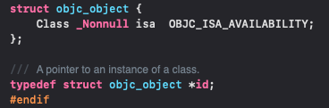
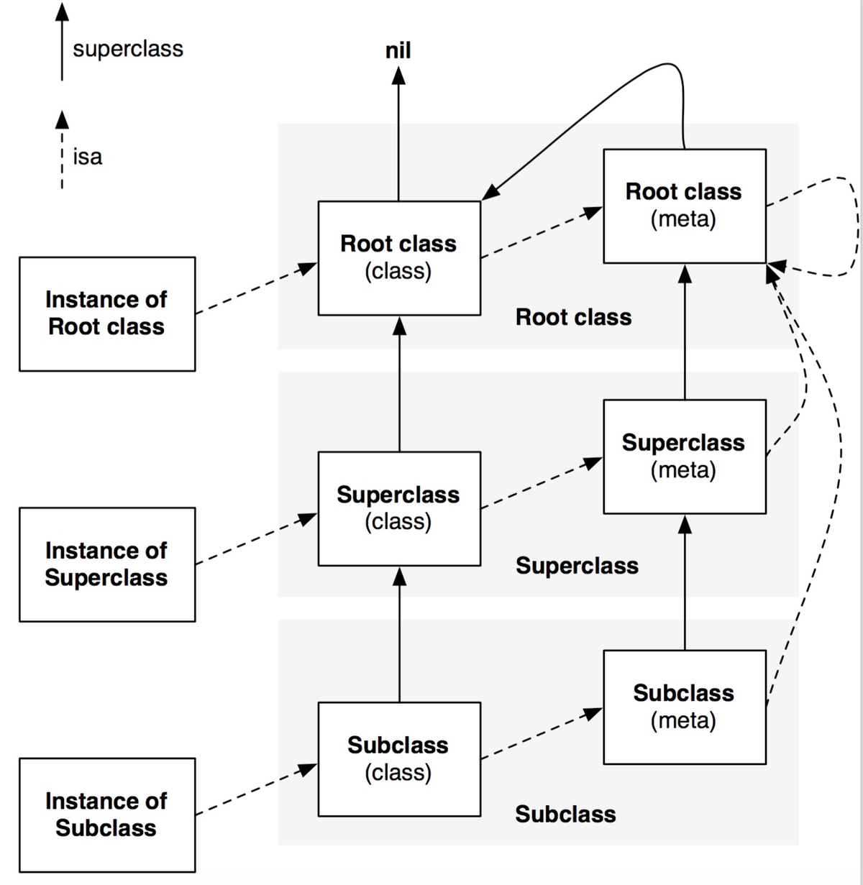
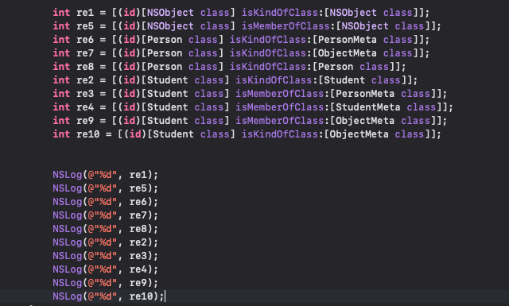
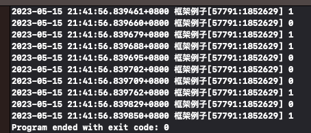
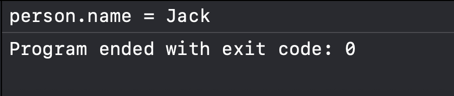
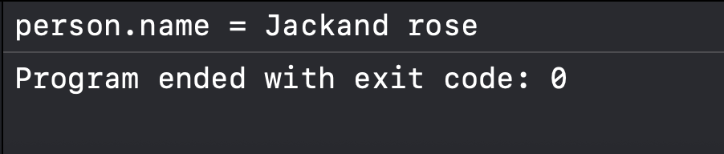
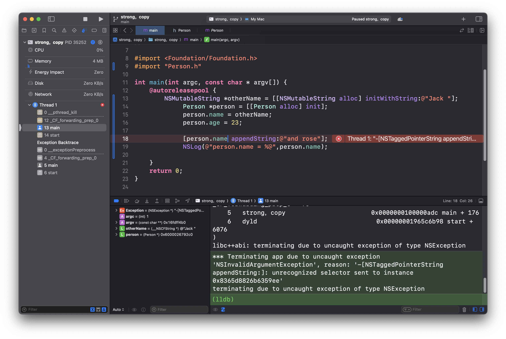

**目录**


[隐藏和封装](#%E9%9A%90%E8%97%8F%E5%92%8C%E5%B0%81%E8%A3%85)


[访问控制符](#%E8%AE%BF%E9%97%AE%E6%8E%A7%E5%88%B6%E7%AC%A6)


[理解@package访问控制符](#%E7%90%86%E8%A7%A3%40package%E8%AE%BF%E9%97%AE%E6%8E%A7%E5%88%B6%E7%AC%A6)


[对象初始化](#%E5%AF%B9%E8%B1%A1%E5%88%9D%E5%A7%8B%E5%8C%96)


[一、为对象分配空间](#%E4%B8%80%E3%80%81%E4%B8%BA%E5%AF%B9%E8%B1%A1%E5%88%86%E9%85%8D%E7%A9%BA%E9%97%B4)


[二、初始化方法与对象初始化](#%E4%BA%8C%E3%80%81%E5%88%9D%E5%A7%8B%E5%8C%96%E6%96%B9%E6%B3%95%E4%B8%8E%E5%AF%B9%E8%B1%A1%E5%88%9D%E5%A7%8B%E5%8C%96)


[OC属性及属性关键字](#OC%E5%B1%9E%E6%80%A7%E5%8F%8A%E5%B1%9E%E6%80%A7%E5%85%B3%E9%94%AE%E5%AD%97)


[类、元类、父类的关系](#%E7%B1%BB%E3%80%81%E5%85%83%E7%B1%BB%E3%80%81%E7%88%B6%E7%B1%BB%E7%9A%84%E5%85%B3%E7%B3%BB)


[isKindOfClass && isMemberOfClass](#isKindOfClass%20%26%26%20isMemberOfClass)


[关键字](#%E5%85%B3%E9%94%AE%E5%AD%97)


[单例模式](#%E5%8D%95%E4%BE%8B%E6%A8%A1%E5%BC%8F)


[基本创建](#%E5%9F%BA%E6%9C%AC%E5%88%9B%E5%BB%BA)


[使用dispatch_once](#%E4%BD%BF%E7%94%A8dispatch_once)


[我们还需要重写alloc函数，使alloc函数返回同一个对象地址。](#%E6%88%91%E4%BB%AC%E8%BF%98%E9%9C%80%E8%A6%81%E9%87%8D%E5%86%99alloc%E5%87%BD%E6%95%B0%EF%BC%8C%E4%BD%BFalloc%E5%87%BD%E6%95%B0%E8%BF%94%E5%9B%9E%E5%90%8C%E4%B8%80%E4%B8%AA%E5%AF%B9%E8%B1%A1%E5%9C%B0%E5%9D%80%E3%80%82)


[至于两种不同模式：](#%E8%87%B3%E4%BA%8E%E4%B8%A4%E7%A7%8D%E4%B8%8D%E5%90%8C%E6%A8%A1%E5%BC%8F%EF%BC%9A)


[重写description方法](#%E9%87%8D%E5%86%99description%E6%96%B9%E6%B3%95)


[==与isEqual与hash](#%3D%3D%E4%B8%8EisEqual%E4%B8%8Ehash)


## 隐藏和封装


有四种访问控制符：==@private(当前类访问权限)，@package(与映像访问权限相同)，@protect(子类访问权限)，@public(公共访问权限)。


### 访问控制符


**1.private（当前类访问权限）**
 成员变量只能在当前类的内部被访问，用于彻底隐藏成员变量。在类的实现部分定义的成员变量默认使用这种访问权限。


**2.package（与映像访问权限相同）**
 成员变量可以在当前类以及当前类实现的同一个映像的任意地方进行访问。用于部分隐藏成员变量


**3.protected（子类访问权限）**
 成员变量可以在当前类，当前类的子类的任意地方进行访问。类的接口部分定义的成员变量默认这个访问权限


**4.public（公共访问权限）**
 这个成员变量可以在任意地方进行访问。


### 理解@package访问控制符


@package使受他控制的成员变量不仅可以在当前类访问，还可以在相同映像的其他程序中访问。关键何为相同映像？


**同一映像**的概念：
 简单的说，就是
编译后生成的同一个框架或同一个执行文件
，当我们想开发一个基础框架时，如果用private就限制的太死了，其他函数可能需要直接访问这个成员变量，但是该框架又不希望外部程序访问我们的成员变量，就可以考虑用package了


**
当编译器最后把@package限制的成员变量所在的类，其他类，函数编译成一个框架库后，这些类、函数就都在一个映像中（注意这里的函数包括我们的主函数）
**。也就是说当我们使用@package之后我们的主函数也可以调用我们的成员变量，但是当其他程序引用这个框架库时，由于其他程序与这个框架库不在一个映像中，其他程序就无法访问我们的被@package限制的成员变量。


## 对象初始化


### 一、为对象分配空间


无论创建哪个对象，我们都先需要使用alloc方法来分配我们的内存，alloc方法来自NSObject类，而所有的类都是他的子类。
 我们调用alloc方法时，系统帮我们完成以下的事情。


1、系统为我们的所有实例变量分配内存空间
 2、将每个实例变量的内存空间都置为0，同时对应的类型置为对应的空值。
      仅仅分配内存空间的对象还不能使用，还需要执行初始化，也就是init才可以使用它。


###


### 二、初始化方法与对象初始化


重写一个init来代替NSObject的init


```objective-c
#import "Person.h"

@implementation Person

-(id) init {
    if (self = [super init]) {
        self.name = @"四川芬达";
        self.saying = @"他们朝我扔粑粑";
        self.age = 123;
    }
    return self;
}

@end
```


```objective-c
NS_ASSUME_NONNULL_BEGIN

@interface Person : NSObject

@property (nonatomic,copy) NSString* name;
@property (nonatomic,copy) NSString* saying;
@property (nonatomic,assign) NSInteger age;

@end

NS_ASSUME_NONNULL_END
```


```objective-c
#import <Foundation/Foundation.h>
#import "Person.h"

int main(int argc, const char * argv[]) {
    @autoreleasepool {
        Person* singer = [[Person alloc] init];
        NSLog(@"%@",singer.name);
        NSLog(@"%@",singer.saying);
        NSLog(@"%ld",singer.age);
    }
    return 0;
}
```


## OC属性及属性关键字


**@property**


属性用于封装对象中数据，属性的本质是 ivar + setter + getter。


可以用 @property 语法来声明属性。@property 会帮我们自动生成属性的 setter 和 getter 方法的声明。


**@synthesize**


帮我们自动生成 setter 和 getter 方法的实现以及 _ivar。


你还可以通过 @synthesize 来指定实例变量名字，如果你不喜欢默认的以下划线开头来命名实例变量的话。但最好还是用默认的，否则影响可读性。


如果不想令编译器合成存取方法，则可以自己实现。如果你只实现了其中一个存取方法 setter or getter，那么另一个还是会由编译器来合成。但是需要注意的是，如果你实现了属性所需的全部方法（如果属性是 readwrite 则需实现 setter and getter，如果是 readonly 则只需实现 getter 方法），那么编译器就不会自动进行 @synthesize，这时候就不会生成该属性的实例变量，需要根据实际情况自己手动 @synthesize 一下。


```objective-c
@synthesize ivar = _ivar
```


**@dynamic**


告诉编译器不用自动进行 @synthesize，你会在运行时再提供这些方法的实现，无需产生警告，但是它不会影响 @property 生成的 setter 和 getter 方法的声明。@dynamic 是 OC 为动态运行时语言的体现。动态运行时语言与编译时语言的区别：动态运行时语言将函数决议推迟到运行时，编译时语言在编译器进行函数决议。


## 类、元类、父类的关系


我们先给出类与对象源码的定义：


我们的类实际上就是一个结构体指针。


```objective-c
typedef struct objc_class *Class;
struct objc_class {
    Class isa;
    Class super_class;
    const char *name;
    long version;
    long info;
    long instance_size;
    struct objc_ivar_list *ivars;
    struct objc_method_list **methodLists;
    struct objc_cache *cache;
    struct objc_protocol_list *protocols;
};
```


我们再来看看对象的定义：





> OC的类其实也是一个对象，一个对象就要有一个它属于的类，意味着类也要有一个isa指针，指向其所属的类。那么类的类是什么？就是我们所说的元类，所以，元类就是类的所属类。





这样我们便可以总结出我们类、元类、父类的基本关系：


**isa指向**
 实例对象的所属类实际上就是其所属类，我们的实例对象就是图中的Instance of Subclass。
 接下来我们的isa指向了我们的类，那么继续研究我们类的所属类。
 从图中可以看出，我们类的所属类实际上就指向了我们的元类。
 接下来我们再看我们的元类，我们所有元类的所属类实际上都是根元类，在笔者参考的资料中是这样理解的，因为我们OC中几乎所有的类都是NSObject的子类，所以我们的根元类也可以认为是我们的NSObject的元类。
 接着我们再看图中根元类的虚线，根元类所属的类指向了它本身。


 **superClass指向**
 我们这里的superClass指向就是我们类的父类，到了这里其实就比较好理解了，元类与我们的类一样，其父类都是一层层往上的，而不像元类所属的类一样，全部指向我们的根元类


在这里唯一需要注意的是我们的根元类的父类是我们的根类，也可以理解为NSObject类。而NSObject类的父类就是nil了。


## isKindOfClass && isMemberOfClass


```objective-c
re1：1    [NSObject类对象 isKindOfClass:[NSObject class]]
NSObject 的元类的继承链最终指向 NSObject 类本身（因为根元类的父类是 NSObject），因此返回 YES（1）

re2：0    [NSObject类对象 isMemberOfClass:[NSObject class]]
NSObject 的类对象的元类是 NSObject 的元类（metaclass），而非 NSObject 类本身，因此返回 NO（0）。

re3：0    [GGObject类对象 isKindOfClass:[GGObject class]]
GGObject 的元类的继承链未指向 GGObject 类本身（除非显式修改元类继承关系），因此 isKindOfClass: 返回 NO（0）。

re4：0    [GGObject类对象 isMemberOfClass:[GGObject class]]
类对象的元类与目标类 GGObject 不匹配，因此 isMemberOfClass: 返回 NO（0）。

re5：1    [[NSObject分配的对象] isKindOfClass:[NSObject class]]
实例对象是 NSObject 的直接实例，且 isKindOfClass: 会检查类的继承链。
NSObject 是所有类的根类，因此返回 YES（1）。

re6：1    [[NSObject分配的对象] isMemberOfClass:[NSObject class]]
实例对象直接属于 NSObject 类，因此 isMemberOfClass: 返回 YES（1）。

re7：1    [[GGObject分配的对象] isKindOfClass:[GGObject class]]
GGObject 实例的类继承自 NSObject，但 isKindOfClass: 会检查到其自身类 GGObject，因此返回 YES（1）。

re8：1    [[GGObject分配的对象] isMemberOfClass:[GGObject class]]
实例对象直接属于 GGObject 类，因此 isMemberOfClass: 返回 YES（1）。
```


isKindOfClasss：判断类或元类继承链是否包含目标类


isMemberOfClass：严格匹配当前类或元类是否等于目标类


**特殊**：`NSObject` 的元类的父类是 `NSObject` 类本身，因此 `[NSObject class] isKindOfClass:[NSObject class]` 返回 `YES`，而其他类（如 `GGObject`）的元类无此特性


> +isKindOfClass 类方法是从当前类的isa指向 (也就是当前类的元类) 开始，沿着 superclass 继承链查找判断和对比类是否相等。 -isKindOfClass 对象方法是从 [self class] (当前类) 开始，沿着 superclass 继承链查找判断和对比类是否相等。 +isMemberOfClass 类方法是直接判断当前类的isa指向 (也就是当前类的元类) 和对比类是否相等。 -isMemberOfClass 对象方法是直接判断 [self class] (当前类) 和对比类是否相等。


 




编译结果：





## 关键字


**关键字** **含义与用途** @interface 声明一个类或协议 @implementation 实现一个类或协议 @end 结束一个类、实现或协议的定义 @class 向前声明类，解决循环引用 @public @private @protected 成员变量访问控制 @property 声明属性（自动生成 getter/setter） @synthesize 合成属性对应的实例变量（早期） @dynamic 声明属性由开发者手动实现 @protocol 声明协议（类似 Java 中 interface） @optional / @required 协议方法的实现可选或必须 @selector 获取方法选择器 SEL @encode 获取类型的编码 @defs 获取结构体定义（已弃用） @try @catch @finally 异常处理 @throw 抛出异常 @autoreleasepool 自动释放池，用于内存管理 @import 模块导入（代替 #import，更现代） @synchronized 线程同步


```objective-c
@interface MyClass : NSObject {
    int _value;
}
- (void)doSomething;
@end

@implementation MyClass
- (void)doSomething {
    NSLog(@"Doing something");
}
@end

int main(int argc, const char * argv[]) {
    @autoreleasepool {
        NSString *str = [[NSString alloc] initWithFormat:@"Hello"];
        NSLog(@"%@", str);
    } // 自动释放池在此处释放
    return 0;
}

@interface MyClass : NSObject
@property (nonatomic, strong) NSString *name;
@end

@implementation MyClass
@synthesize name; // 自动生成 _name 和 name 的 getter/setter
@end

@protocol MyDelegate <NSObject>
@required
- (void)doTask;

@optional
- (void)optionalTask;
@end

SEL s = @selector(doSomething);


@class AnotherClass;

@interface MyClass : NSObject
@property (nonatomic, strong) AnotherClass *obj;
@end


@synchronized(self) {
    // 线程安全的代码
}
```


**assign**


 assign：对属性只是简单赋值，不更改对所赋的值的引用计数，这个指示符主要适用于NSInteger等基本类型，以及short、float、double、结构体等各种C数据类型。它是一个弱引用声明类型，我们一般不使用assign来修饰对象，因为被assign修饰的对象，在被释放掉以后，指针的地址还是存在的，也就是说指针不会被置为nil，造成野指针，可能导致程序崩掉。那为什么assign就能用来修饰基本数据类型呢，是因为基本数据类型一般分布在栈上，栈的内存会由系统自动处理，因此不会造成野指针
  


**weak**


  weak：该属性也是一个弱引用声明类型，使用weak修饰的对象是不会造成引用计数器+1的，并且引用的对象如果被释放了以后会自动变成nil，不会出现野指针，很好的解决了内存引起的崩溃情况。通常我们会在block和协议的时候使用weak修饰，通过这样的修饰，我们可以规避掉循环引用的问题。


**strong**


        strong：该属性是一个强引用声明类型，只要该强引用指向被赋值的对象，那么该对象就不会自动回收。


**retain    **     


retain：释放旧的对象，将旧对象的值赋予输入对象，再提高输入对象的索引计数为1；在ARC模式下很少使用，通常用于指针变量，就是说你定义了一个变量，然后这个变量在程序的运行过程当中会改变，并且影响到其他方法。一般用于字符串、数组等


**copy**


        copy：若使用copy指示符，则调用setter方法给变量赋值的时候，会将被赋值的对象复制一个副本，再将该副本赋值给成员变量。copy指示符会将原成员变量所引用对象的计数减1。
          相当于就是说，不用copy的话，会创建一个新的空间，它的内容和原对象内容一模一样，然后指针是指向新空间的。当再有什么操作在对那个对象操作的话，只是在原空间上操作，对新空间没有影响。当成员变量的类型是可变类型，或其子类是可变类型的时候，被赋值的对象有可能在赋值后被修改，如果程序不需要这种修改影响setter方法设置的成员变量的值，此时就可考虑用copy指示符。


**strong、copy**


**
如果属性声明中指定了copy特性，合成方法会使用类的copy方法
**
，这里注意：**属性并没有MutableCopy特性。**
即使是可变的实例变量，也是使用copy特性，正如方法copyWithZone：的执行结果。所以，按照约定会生成一个对象的不可变副本。


相同之处：用于修饰标识拥有关系的对象


不同之处：strong赋值是多个指针指向同一个地址，而copy的复制是每次会在内存中复制一份对象，指针指向不同的地址。所有对于不可变对象我们都应该用copy修饰，为确保对象中的字符串值不会无意变动，应该在设置新属性时拷贝一份。


回顾一下深浅拷贝


深拷贝就是内容拷贝，浅拷贝就是指针拷贝。


深拷贝就是拷贝出来和原来仅仅是值一样，但是内存地址完全不一样的新的对象，创建后和原对象没有任何关系。浅拷贝就是拷贝指向原来对象的指针，使原来的对象的引用计数➕1，可以理解为创建了一个指向原对象的指针的新指针而已，并没有创建一个全新的对象。


```objective-c
#import <Foundation/Foundation.h>
#import "Person.h"

int main(int argc, const char * argv[]) {
    @autoreleasepool {
        NSMutableString *otherName = [[NSMutableString alloc] initWithString:@"Jack "];
             Person *person = [[Person alloc] init];
             person.name = otherName;
             person.age = 23;

             [otherName appendString:@"and rose"];
             NSLog(@"person.name = %@",person.name);

    }
    return 0;
}
```


copy的结果：





strong的结果： 




因为otherName是可变的，person.name属性是copy，所以创建了新的字符串，属于深拷贝，内容拷贝，我们拷贝出来了一个对象，后面的赋值操作都是针对新建的对象进行操作，而我们实际的调用还是原本的对象。所以值并不会改变。
 如果设置为strong，strong会持有原来的对象，使原来的对象引用计数+1，其实就是浅拷贝、指针拷贝。这时我们进行操作，更改其值就使本对象发生了改变。


 我们既然创建的是不可变类型，那我们就不希望其发生改变，所以这个时候我们就应该使用copy关键字，strong会使其在外部被修改时发生改变


那么对于可变类型字符串 ，我们使用copy时，按约定会生成一个对象的不可变副本，此时我们进行增删改操作就会因为找不到对象而崩溃


 




**readonly、readwrite**


这是访问权限的控制，决定该属性是否可读和可写，默认是readwrite，所以我们定义属性的时候，一般不需要这个修饰。只有只读属性才加上readonly


readonly来控制读写权限的方式就是**只生成setter，**不生成getter


## 单例模式


单例模式是因为在某些时候，程序多次创建这一类的对象没有实际的意义，那么我们就只在程序运行的时候只初始化一次，自然就产生了一个单例模式。


**定义：**


> **如果一个类始终只能创建一个实例，则这个类被称为单例类。在程序中，单例类只在程序中被初始化一次，所以单例类是存储在全局区域，在编译时分配内存，只要程序还在运行就一只占用内存，只要在程序结束的时候释放这一部分内存**


有三个注意点


- 单例类只有一个实例
- 单例类只能自己创建自己的实例
- 单例类必须给其他对象提供这一实例


### 基本创建


单例模式最简单的创建方法是先定义一个static全局变量用于保存已创建的Singleton对象。每次需要获取该实例时，程序先判断，该static变量是否为nil，如果该全局变量为nil，则初始化一个实例并赋值给static全局变量。


这里只展示此方法下Singleton类的实现部分：


```objective-c
static id _instance = nil;  //定义static全局变量

@implementation Singleton

+ (id) shareInstance {
	// 先判断_instance是否为空
    if (_instance == nil) {
    	// 为空则初始化
        _instance = [[self alloc] init];
    }
    // 返回实例
    return _instance;
}

@end
### 使用dispatch_once


上面方法在单线程下可以保证单例只被初始化一次；但是多线程的出现，使得在极端条件下，单例也可能返回了不同的对象。如在单例初始化完成前，多个进程同时访问单例，那么这些进程可能都获得了不同的单例对象。


苹果提供了 dispatch_once(dispatch_once_t *predicate,dispatch_block_t block);函数来避免这个问题，该函数保证相关的块必定会执行，且执行一次。此操作完全是线程安全的。


同样只有实现部分代码：


```objective-c
static id _instance = nil;  //定义static全局变量

@implementation Singleton

+ (id) shareInstance {
    // static修饰标记变量
    static dispatch_once_t onceToken;
    dispatch_once(&onceToken, ^{
        _instance = [[self alloc] init];
    });
    return _instance;
}

@end
### 我们还需要 重写alloc函数 ，使alloc函数返回同一个对象地址。


```objective-c
#import "Singleton.h"

@implementation Singleton

// 懒汉式线程安全单例
+ (instancetype)sharedInstance {
    static Singleton *instance = nil;
    static dispatch_once_t onceToken;
    dispatch_once(&onceToken, ^{
        instance = [[super allocWithZone:NULL] init];
    });
    return instance;
}

// 防止通过 alloc/init 创建新实例
+ (instancetype)allocWithZone:(struct _NSZone *)zone {
    return [self sharedInstance];
}

// 防止 copy
- (id)copyWithZone:(NSZone *)zone {
    return self;
}

// 防止 mutableCopy
- (id)mutableCopyWithZone:(NSZone *)zone {
    return self;
}

@end
### 至于两种不同模式：


**懒汉模式**：


· 优点：
 **延迟加载**：懒汉模式只有在第一次访问单例实例时才会进行初始化，可以节省资源，提高性能，因为实例只有在需要时才会被创建。
 **节省内存：**如果单例对象很大或者初始化过程开销较大，懒汉模式可以避免在程序启动时就创建不必要的对象。
 **线程安全性：**可以通过加锁机制（如双重检查锁定）来实现线程安全。


 · 缺点：
 **线程安全性开销：**懒汉模式在实现线程安全时可能需要额外的同步机制，这会引入一些性能开销。
 **复杂性增加：**实现线程安全的懒汉模式可能需要编写复杂的代码，容易引入错误。
 缺点：
 **线程安全性开销：**懒汉模式在实现线程安全时可能需要额外的同步机制，这会引入一些性能开销。
 **复杂性增加：**实现线程安全的懒汉模式可能需要编写复杂的代码，容易引入错误。


 **饿汉模式：**


**优点：**
 **简单：**饿汉模式实现简单，不需要考虑线程安全问题，因为实例在类加载时就已经创建。
 **线程安全性：**由于实例在类加载时创建，不会存在多个实例的风险，因此线程安全。


 **缺点：**
 **无法实现延迟加载：**饿汉模式在程序启动时就创建实例，无法实现延迟加载，可能会浪费资源，特别是当实例很大或初始化开销较大时。
 **可能引起性能问题：**如果单例类的实例在程序启动时没有被使用，那么创建实例的开销可能是不必要的。
 不适用于某些情况：如果单例对象的创建依赖于某些外部因素，而这些因素在程序启动时无法确定，那么饿汉模式可能不适用。


 总的来说，懒汉模式适用于需要延迟加载实例的情况，可以节省资源和提高性能，但需要考虑线程安全性。饿汉模式适用于需要简单实现和线程安全性的情况，但不支持延迟加载。选择哪种模式应根据具体需求和性能考虑来决定。


## 重写description方法


我们将我们的值包装成对象后我们肯定就需要打印他了。**当我们用NSLog单独打印我们的对象时，实际上是调用我们的description方法来返回我们的类的十六位进制**，但是我们并不想要得到这个东西，我们想要得到的是他的值，所以我们就要重写我们的description方法。


```objective-c
@implementation Person

- (NSString *)description {
    return [NSString stringWithFormat:@"Person: name = %@, age = %ld", self.name, (long)self.age];
}

@end
```


## ==与isEqual与hash


**比较方式** **方法/符号** **作用** **是否可重写** **比较内容** 指针比较 == 判断两个对象地址是否相同 不可重写 **内存地址** 内容比较 isEqual: 判断两个对象内容是否相等 通常需重写 **对象内容** 哈希值比较 hash 通常与 isEqual: 搭配使用 通常需重写 **内容生成的整数**


isEqual 默认是实现是==（也就是地址比较）因此，如果你定义自己的类，**要比较内容，必须重写该方法 **


```objective-c
@implementation Person

- (BOOL)isEqual:(id)object {
    if (![object isKindOfClass:[Person class]]) return NO;
    Person *other = (Person *)object;
    return [self.name isEqualToString:other.name] && self.age == other.age;
}
```


hash：对象的哈希值，用于快速查找和集合操作。默认NSObject会返回一个基于地址的hash。当你重写了isEqual，**必须配套重写hash**


**下面举几个例子：**


```objective-c
@interface Person : NSObject
@property (nonatomic, copy) NSString *name;
@property (nonatomic, assign) NSInteger age;
@end

@implementation Person

- (BOOL)isEqual:(id)object {
    if (![object isKindOfClass:[Person class]]) return NO;
    Person *other = (Person *)object;
    return [self.name isEqualToString:other.name] && self.age == other.age;
}

- (NSUInteger)hash {
    return self.name.hash ^ self.age;
}

@end
```


```objective-c
@interface Book : NSObject
@property (nonatomic, copy) NSString *title;
@property (nonatomic, copy) NSString *isbn;
@end

@implementation Book

- (BOOL)isEqual:(id)object {
    if (![object isKindOfClass:[Book class]]) return NO;
    return [self.isbn isEqualToString:((Book *)object).isbn];
}

- (NSUInteger)hash {
    return self.isbn.hash; // 因为只看 isbn 是否相同
}

@end
```


```objective-c
@interface UserAccount : NSObject
@property (nonatomic, copy) NSString *username;
@property (nonatomic, copy) NSString *email;
@end

@implementation UserAccount

- (BOOL)isEqual:(id)object {
    if (![object isKindOfClass:[UserAccount class]]) return NO;
    UserAccount *other = object;
    return [self.username isEqualToString:other.username] &&
           [self.email isEqualToString:other.email];
}

- (NSUInteger)hash {
    return self.username.hash ^ self.email.hash;
}

@end
```


特别鸣谢：感谢iOS各级学长学姐的博客分享

---

原文发布于 CSDN：[【OC】OC语言学习 —— 重点内容总结与拓展（上）](https://blog.csdn.net/2402_86720949/article/details/147934508)
