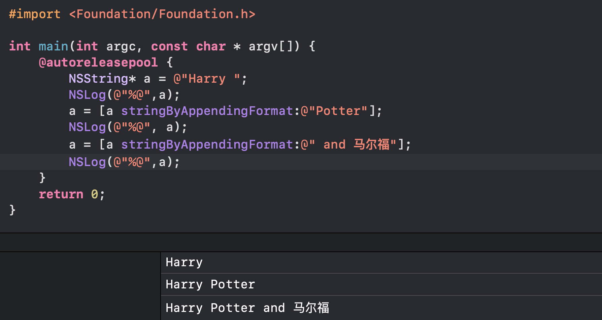
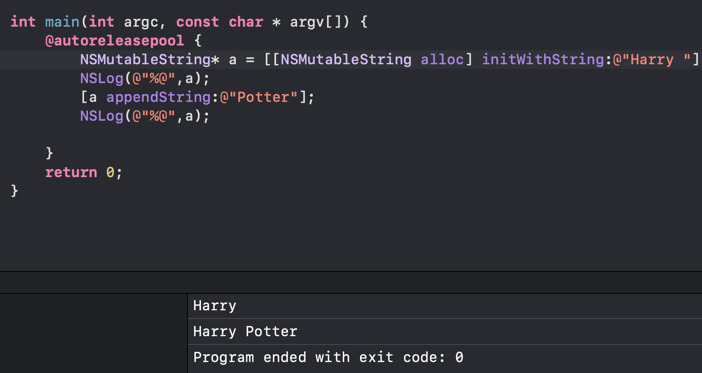
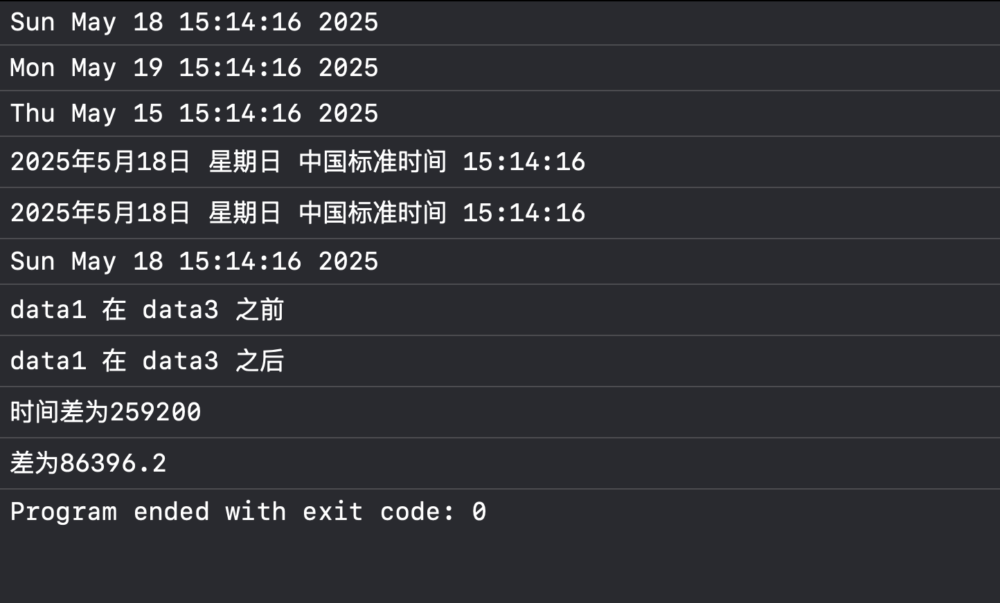
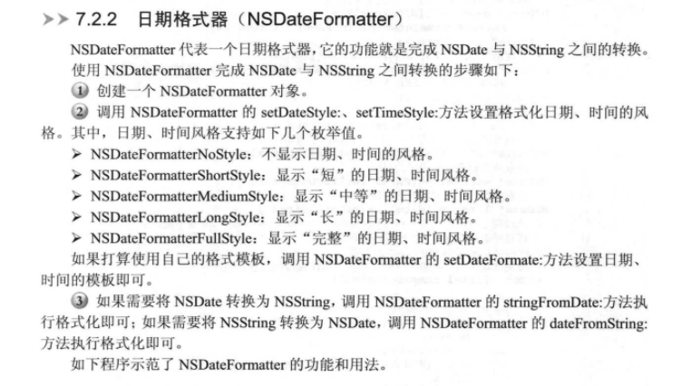
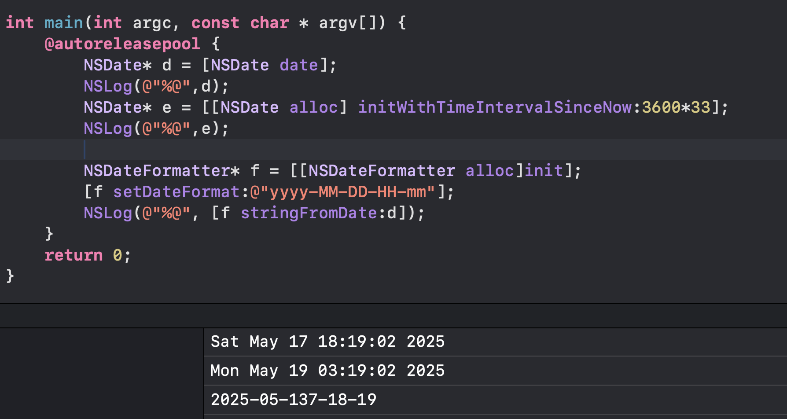
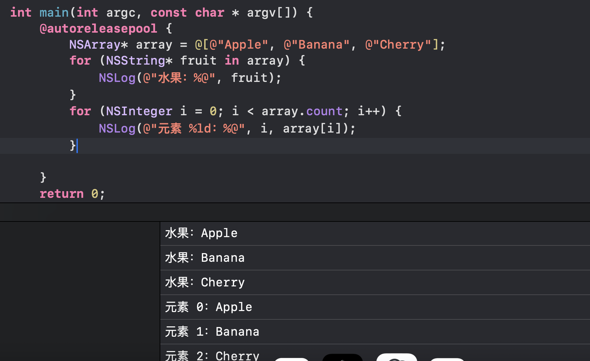
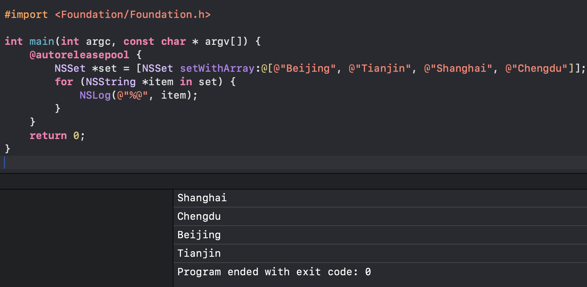
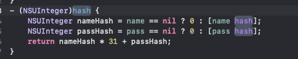

## 1、NSString类


我们对一个NSString对象赋值的方法是直接将字符串常量赋给对象，例如：`NSString *str = @"hello";`
 因为我们的NSString是不可变的，所以我们只能通过一些方法来在我们原来的字符串后面追加或初始化我们的字符串来间接修改我们的对象，例如：


 




这两种方法都是
对象不改变
，将新生成的字符串重新赋值给str指针变量


## 2、NSMutableString类


我们这个类与上面不同，他的字符序列可以改变，我们通过一些方法对其调用





注意，我们的a在初始化时不可使用NSString式的方法。


在这里我们可以注意一下我们的的可变与不可变的区别：我们对我们的NSString对象进行赋值时，**必须要将调用后的方法返回的值重新赋给我们的对象**，例如a = [a stringByAppendingString:@"iii"];，而我们的NSMutableString就不用重新赋值，可以直接修改。 两个类方法的不同就是**一个有stringby前缀，另一个没有。**


## 3、日期与时间


 oc为处理这些提供了NSDate，NSCalender对象


```objective-c
//
//  main.m
//  日期与时间
//
//  Created by 吴桐 on 2025/5/18.
//

#import <Foundation/Foundation.h>

int main(int argc, const char * argv[]) {
    @autoreleasepool {
        NSDate *data1 = [NSDate date];
        NSDate *data2 = [[NSDate alloc] initWithTimeIntervalSinceNow:3600 * 24];
        //获得后一天的时间
        NSLog(@"%@", data1);
        NSLog(@"%@", data2);
        NSDate *data3 = [[NSDate alloc] initWithTimeIntervalSinceNow:-3 * 3600 * 24];
        //获得三天前的日期
        NSLog(@"%@", data3);
//        NSDate *data4 = [[NSDate alloc] initWithTimeIntervalSince1970:3600 * 24 * 366 * 30];
//        NSLog(@"%@", data4);//获得1970一月一日之后30年的日期
        NSLocale* cn = [NSLocale currentLocale];
        // 获取NSdate
        NSLog(@"%@", [data1 descriptionWithLocale:cn]);
        //将data1赋给cn，获得当前地区的时间
        //获取系统当前的locale
//        NSLocale *cn1 = [NSLocale currentLocale];
//        NSLog(@"%@", cn1);
        //获取NSdata在当前locale下对应的字符串
        NSLog(@"%@", [data1 descriptionWithLocale:cn]);
        //获取两个之间较早的
        NSLog(@"%@", [data1 earlierDate:data2]);

        //compare 方法返回NScomparisonResult枚举值
       // 枚举包含
        //NSOrderedAscending,NSOrderedSame, NSOrderedDescending
        // 分别代表了 调用compare 的日期位于被比较日期的之前 相同 之后
        switch ([data1 compare:data2]) {
            case NSOrderedSame:
                NSLog(@"date1 == date3");
            case NSOrderedAscending:
                NSLog(@"data1 在 data3 之前");
            case NSOrderedDescending:
                NSLog(@"data1 在 data3 之后");
        }
        NSLog(@"时间差为%g", [data1 timeIntervalSinceDate:data3]);
        //interval的意思是间隔，上述是data1 与 data3 的时间间隔
        NSLog(@"差为%g", [data2 timeIntervalSinceNow]);
        //与现在的时间间隔


    }
    return 0;
}
```





## 4、日期格式器








## 5、定时器


## 6、对象复制


[OC语言学习——对象复制-CSDN博客](https://blog.csdn.net/2402_86720949/article/details/147851035?fromshare=blogdetail&sharetype=blogdetail&sharerId=147851035&sharerefer=PC&sharesource=2402_86720949&sharefrom=from_link)


## 7、array


这里我们需要着重记忆的是我们向数组内传参数的方法：arrayWithObjects


然后我们需要看一下如何遍历集合类的元素





## 8、set


 set中元素没有固定顺序，自动去重，查找比array快。





我们在使用set时需要注意的是我们一般会对hash进行重写，因为我们集合中判断2个元素相等的条件是：方法isEqual返回yes与两个对象的hash方法返回值也相等，set才会判断这两个对象相等。





## 9、dictionary


Dictionary是一种**键值对结构**的集合。每个元素是一个key-value对，**key必须唯一**。与数组不同，字典中**通过key查找value，**而不是下标

---

原文发布于 CSDN：[Oc语言学习 —— Foundation框架总结](https://blog.csdn.net/2402_86720949/article/details/148030438)
