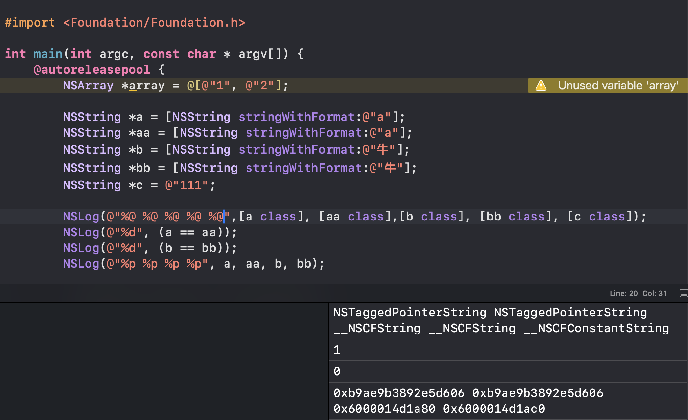

oc里的NSString有三种实现方式，为_ _NSCFConstantString、__NSCFString、NSTaggedPointerString


## 1._ _NSCFConstantString(字面量字符串)


从字面意思上可以看出，_ _NSCFContantString可以理解为常量字符串，这种类型的字符串在编译期就确定了，也就是我们常说的字面量字符串，如 NSString *str = @“Hello, World!”，它们被存储在常量区，不可变，这种类型的字符串效率较高，因为在程序的生命周期内，
它的值和内存地址都不会改变
，即其有如下特点：


内存特性：存储在**常量区**，程序启动时分配，生命周期贯穿整个程序运行期间，不可修改。

创建方式：**使用字符串字面量 如 @"Hello"创建的字符串**。

相同的常量字符串会共享同一内存地址。


无法通过release释放，是一个单例模式


```objective-c
NSString* str1 = @"iOS";
```


> 官方解释：在计算机科学中，字面量（literal）是用于表达源代码中一个固定值的表示法（notation）。几乎所有计算机编程语言都具有对基本值的字面量表示，诸如：整数、浮点数以及字符串；而有很多也对布尔类型和字符类型的值也支持字面量表示；还有一些甚至对枚举类型的元素以及像数组、记录和对象等复合类型的值也支持字面量表示法。 说人话就是 代码中直接写出的固定值，是编译时可知、不可变的常量，比如数字、字符串、布尔值、数组等，具有“所见即所得”的特性。例如上述的语句，@"iOS"为子面量， str为变量


## 2._ _NSCFString


_ _NSCFString是动态分配的不可变字符串，用使用 stringWithFormat:、initWithString: 等方法动态创建 本质上不可变，但是其具备了可变接口(__NSCFString 是 Core Foundation 的 CFMutableStringRef 和 Foundation 的 NSMutableString 的桥接类型),简要来说,即：NSMutableString 底层也是 __NSCFString，只是它具备“可变接口”，而NSString没有


**即使两个对象的内容相同，它们在堆上的内存地址也是不同的。每个对象都在独立的内存空间中存储，具有自己的地址。这意味着通过不同的对象引用访问这两个对象时，实际上访问的是不同的内存地址。**


该底层下的不可变声明:


```objective-c
NSString *str2 = [NSString stringWithFormat:@"hello %d", 123];
NSLog(@"%@", [str2 class]); // 输出：__NSCFString
```


可变声明如下：


```objective-c
NSMutableString *mStr = [NSMutableString stringWithString:@"abc"];
NSLog(@"%@", [mStr class]); // 输出：__NSCFString
```


## 3.NSTaggedPointerString


在 64 位系统上，当字符串的内容较短（7 个字节以内）时，会使用这种类型来保存字符串。这是一种优化存储的手段，因为它将字符串内容直接保存在指针中，而不是在堆或者栈中创建一个实际的对象，从而节省了内存空间。但是这种方式只适用于较短的字符串。例如：


```objective-c
NSString *str2 = [NSString stringWithFormat:"%c%c%c", 'i', 'O', 'S'];
```


> TaggedPointer的意思是标签指针，这是苹果在 64 位环境下对 NSString,NSNumber 等对象做的一些优化。简单来讲可以理解为把指针指向的内容直接放在了指针变量的内存地址中，因为在 64 位环境下指针变量的大小达到了 8 位足以容纳一些长度较小的内容。于是使用了标签指针这种方式来优化数据的存储方式。从他的引用计数可以看出，这货也是一个释放不掉的单例常量对象。在运行时根据实际情况创建





附上实例一个⬆️

---

原文发布于 CSDN：[NSString的三种实现方式](https://blog.csdn.net/2402_86720949/article/details/148049357)
