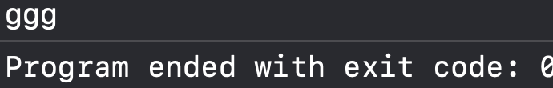
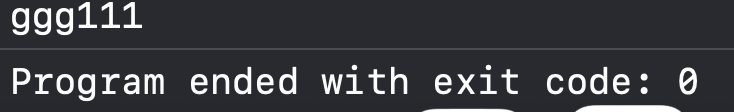
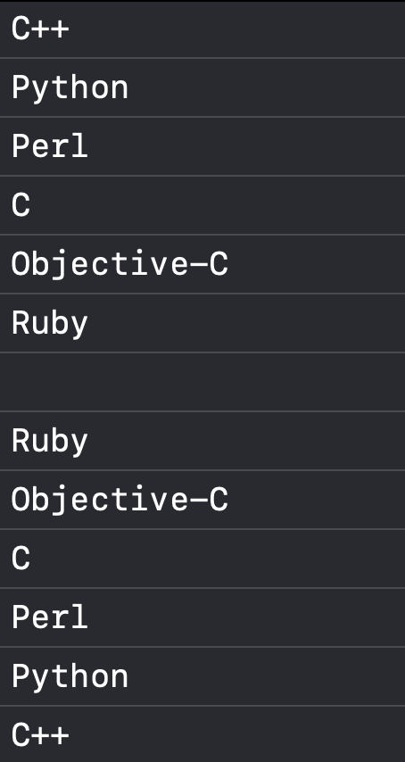
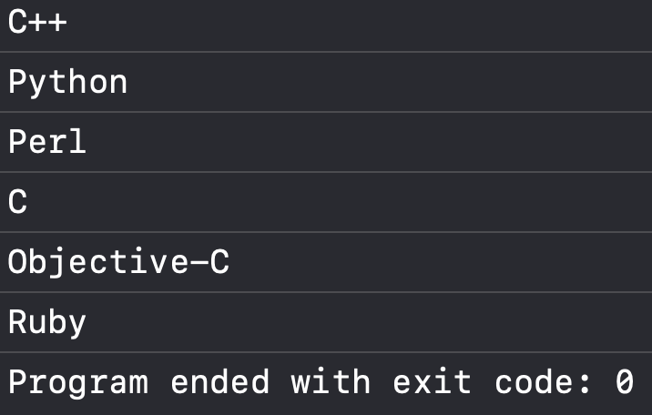
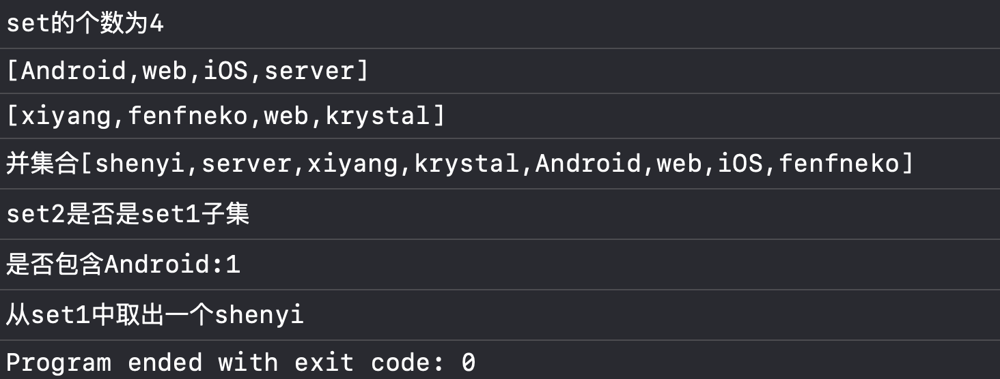
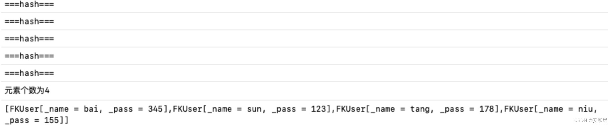
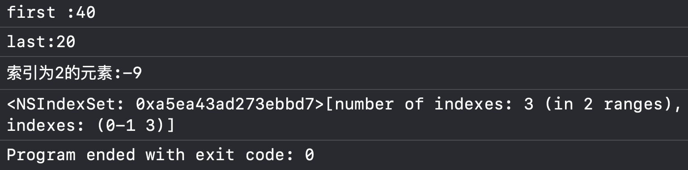

**目录**


[->和点语法区别：](#-%3E%E5%92%8C%E7%82%B9%E8%AF%AD%E6%B3%95%E5%8C%BA%E5%88%AB%EF%BC%9A)


[属性关键字](#%E5%B1%9E%E6%80%A7%E5%85%B3%E9%94%AE%E5%AD%97)


[Foundation框架](#Foundation%E6%A1%86%E6%9E%B6%C2%A0)


[数组（NSArray和NSMutableArray）](#%E6%95%B0%E7%BB%84%EF%BC%88NSArray%E5%92%8CNSMutableArray%EF%BC%89%C2%A0)


[对几何元素的整体调用方法](#%E5%AF%B9%E5%87%A0%E4%BD%95%E5%85%83%E7%B4%A0%E7%9A%84%E6%95%B4%E4%BD%93%E8%B0%83%E7%94%A8%E6%96%B9%E6%B3%95)


[排序](#%E6%8E%92%E5%BA%8F)


[使用枚举器遍历元素](#%E4%BD%BF%E7%94%A8%E6%9E%9A%E4%B8%BE%E5%99%A8%E9%81%8D%E5%8E%86%E5%85%83%E7%B4%A0)


[可变数组](#%E5%8F%AF%E5%8F%98%E6%95%B0%E7%BB%84%C2%A0)


[集合（NSSet与NSMutableSet）](#%E9%9B%86%E5%90%88%EF%BC%88NSSet%E4%B8%8ENSMutableSet%EF%BC%89)


[NSMutableSet](#NSMutableSet)


[NSCountedSet的用法](#NSCountedSet%E7%9A%84%E7%94%A8%E6%B3%95)


[有序集合](#%E6%9C%89%E5%BA%8F%E9%9B%86%E5%90%88)


[字典](#%E5%AD%97%E5%85%B8)


[NSDictionary](#NSDictionary%C2%A0)


[NSMutableDictionary](#NSMutableDictionary)


因作者在考核中被倪神殴打，痛定思痛决定对部分内容开展回头看。


## ->和点语法区别：


**1. ->这个方式的访问是直接调用所指向的一个内存，这样子更快，而点语法实际上是调用他的setter语句和getter语句,这个语句调用的速度更慢**


 **2. 需要注意的是使用点语法访问属性的时候可以直接用“.”+属性名，而使用“->"访问属性的时候则不能省略成员变量名前的下划线“_”否则会报错。**


 3. 我们一般不采用->的方式访问成员变量，但是成员变量默认受保护，所以常常报错。


 self在类方法里指向的是（调用当前类方法的）类


self在对象方法中，self指的是对象。


## 属性关键字


**atomic和nonatomic**


- atomic：在OC中属性的默认声明为atomic，他可以保证对于属性的赋值和取值是一定线程安全的，但是如果对于数组这种对象的话他有存在问题，他对于数组对象的删除和添加操作是不安全的。保证读写操作的安全。
- nonatomic：这个是不保证线程安全的，这个访问速度更快

**stong和weak**


- strong：这个关键字会让修饰的对象引用计数加一。strong可以保证被该属性引用的对象被不被回收
- weak：这个关键字表示对这个对象进行一个弱引用，该指示符主要的用处是可以避免循环引用。

**strong和copy**


**如果属性声明中指定了copy方法，合成方法会使用类的copy方法，这里注意：属性没有mutablecopy属性。即使是可变的实例变量，也是使用copy特性，正如方法copyWithZone：的执行结果。所以，按照约定会生成一个对象的不可变副本。**


```objective-c
@interface Person : NSObject
@property (nonatomic, copy) NSString* name;
@property (nonatomic, assign) NSInteger age;
@end
```


使用copy修饰NSString 


```objective-c
int main(int argc, const char * argv[]) {
    @autoreleasepool {
        Person* p1 = [[Person alloc] init];
        NSMutableString *s1 = [NSMutableString stringWithString:@"ggg"];
        p1.name = s1;
        [s1 appendString:@"111"];
        NSLog(@"%@", p1.name);
    }
    return 0;
}
```





如果我们用strong修饰，那么就





> 因为s1是可变的，person.name属性是copy，所以创建了新的字符串，属于深拷贝，内容拷贝，我们拷贝出来了一个对象，后面的赋值操作都是针对新建的对象进行操作，而我们实际的调用还是原本的对象。所以值并不会改变。 如果设置为strong，strong会持有原来的对象，使原来的对象引用计数+1，其实就是浅拷贝、指针拷贝。这时我们进行操作，更改其值就使本对象发生了改变。


## Foundation框架


### 数组（NSArray和NSMutableArray）


**增**


```objective-c
NSArray *array = @[@"苹果", @"香蕉", @"橘子"];
```


```objective-c
NSMutableArray *mutableArray = [NSMutableArray array]; // 空数组
[mutableArray addObject:@"苹果"];                     // 添加一个元素
[mutableArray addObjectsFromArray:@[@"香蕉", @"橘子"]]; // 添加多个元素
```


**查**


```objective-c
NSString *fruit = [mutableArray objectAtIndex:1];  // 访问第2个元素
NSLog(@"第二个水果是：%@", fruit);

NSLog(@"数组元素总数：%lu", (unsigned long)[mutableArray count]);
```


```objective-c
for (NSString *item in mutableArray) {
    NSLog(@"%@", item);
}
```


改


```objective-c
[mutableArray replaceObjectAtIndex:0 withObject:@"西瓜"]; // 替换第一个元素
```


删


```objective-c
[mutableArray removeObjectAtIndex:1];     // 删除索引为1的元素
[mutableArray removeObject:@"西瓜"];       // 删除指定值（第一次出现的）
[mutableArray removeLastObject];          // 删除最后一个元素
[mutableArray removeAllObjects];          // 删除所有元素
```


创建数组的常见方法介绍：


arrary：创建一个不包含任何元素的空NSArray
 arrayWithContentsOfFile:/initWithContentsOfFile:读取文件内容来创建
 arrayWithObject：创建仅包含指定元素的NSArray
 arrayWithObjects：创建包含指定的N个元素的NSArray；


```objective-c
#import <Foundation/Foundation.h>

int main(int argc, const char * argv[]) {
    @autoreleasepool {
        NSArray* array = [NSArray arrayWithObjects:@"LV", @"Burberry",@"BV",@"LR" ,@"miumiu",nil];
        NSLog(@"first:%@",[array objectAtIndex:1]);
        NSLog(@"last:%@",[array lastObject]);

        //截取索引2开始长度为1的数组
        NSArray* array1 = [array objectsAtIndexes:[NSIndexSet indexSetWithIndexesInRange:NSMakeRange(2, 1)]];
        NSLog(@"%@",array1);
        //查找对象在数组中的索引
        NSLog(@"miumiu: %ld", [array indexOfObject:@"miumiu"]);
        //在索引范围2，3中查找BV，结果是：
        NSLog(@"BV in(2,2) :%ld", [array indexOfObject:@"BV" inRange: NSMakeRange(2, 2)]);
        array = [array arrayByAddingObject:@"Mr.Dandy"];
        array = [array arrayByAddingObjectsFromArray:[NSArray arrayWithObjects:@"alo", @"an", nil]];
        for (int i = 0; i < array.count; i++) {
            NSLog(@"%@", [array objectAtIndex:i]);
        }
        //从索引2开始截取1个元素，得到新数组array2，只包含“BV”
        NSArray* array2 = [array subarrayWithRange:NSMakeRange(2, 1)];
        for (int i = 0; i < array2.count; i++) {
            NSLog(@"%@", [array2 objectAtIndex:i]);
        }
    }
    return 0;
}
#### 对几何元素的整体调用方法


笔者暂时还未理解，后续补全


#### 排序


> _sortedArrayUsingFunction:contes_:该方法使用排序函数对集合元素进行一个排序,该排序函数必须返回NSOrderedDesceding,NSOrderedAscending,NSOrderedSame三个枚举常量。 _sortedArrayUsingSelector:_该方法使用集合元素自身的方法对集合元素进行排序，它的排序函数同样会返回上面给出的三个枚举值。 _sortedArrayUsingComparator:_该方法使用代码块对与集合元素进行排序


三个方法的返回值都是一个排序好的NSArray对象。


```objective-c
NSInteger inSort (id num1, id num2, void* context) {
    int v1 = [num1 intValue];
    int v2 = [num2 intValue];
    if (v1 < v2) {
        return NSOrderedAscending;
    } else if (v1 == v2) {
        return NSOrderedSame;
    } else {
        return NSOrderedDescending;
    }
}
int main(int argc, const char * argv[]) {
    @autoreleasepool {
        NSArray* array1 = [NSArray arrayWithObjects:@"C++",@"Python",@"Perl",@"C",@"Objective-C",@"Ruby", nil];
        array1 = [array1 sortedArrayUsingSelector:@selector(compare:)];
        NSLog(@"%@", array1);
        NSArray* array2 = [NSArray arrayWithObjects:[NSNumber numberWithInt:20], [NSNumber numberWithInt:12], [NSNumber numberWithInt:-8],[NSNumber numberWithInt:50], [NSNumber numberWithInt:19],nil];
        array2 = [array2 sortedArrayUsingFunction:inSort context:nil];
        NSLog(@"%@", array2);
        NSArray* array3 = [array2 sortedArrayUsingComparator:^(id obj1, id obj2) {
            if ([obj1 intValue] > [obj2 intValue]) {
                return NSOrderedDescending;
            } else if ([obj1 intValue] < [obj2 intValue]) {
                return NSOrderedAscending;
            } else {
                return NSOrderedSame;
            }
        }];
        NSLog(@"%@", array3);
    }
    return 0;
}
#### 使用枚举器遍历元素


我们有两个方法获得枚举器


- objectEnumerator:正序遍历
- reverseObjectEnumerator:逆序遍历

枚举器的方法有以下两个


- allObjects:获取枚举集合中所有的元素
- reverseObjectEnumerator:获取被枚举集合中的下一个元素。


```objective-c
int main(int argc, const char * argv[]) {
    @autoreleasepool {
        NSArray* array1 = [NSArray arrayWithObjects:@"C++",@"Python",@"Perl",@"C",@"Objective-C",@"Ruby", nil];
        NSEnumerator* en = [array1 objectEnumerator];
        id object;
        while (object = [en nextObject]) {
            NSLog(@"%@", object);
        }
        NSLog(@"");
        NSEnumerator* an = [array1 reverseObjectEnumerator];
        while (object = [an nextObject]) {
            NSLog(@"%@", object);
        }

    }
    return 0;
}
```





我们也可以使用（for  in）语法快速枚举


```objective-c
for(type variableName in collection) {
  //variableName自动迭代访问每一个元素
}
```


```objective-c
int main(int argc, const char * argv[]) {
    @autoreleasepool {
        NSArray* array1 = [NSArray arrayWithObjects:@"C++",@"Python",@"Perl",@"C",@"Objective-C",@"Ruby", nil];
        for (id object in array1) {
            NSLog(@"%@", object);
        }

    }
    return 0;
}
```





### 可变数组


NSArray表示元素不可变的集合，一旦创建成功，程序不能向集合调价新的元素。


可变数组给出了增加，删除，替换元素方法。


```objective-c
#import <Foundation/Foundation.h>

int main(int argc, const char * argv[]) {
    @autoreleasepool {
        NSArray* initArray = [[NSArray alloc] initWithObjects:@"BV",@"Barbour",@"miumiu", nil];
        NSLog(@"initArray: %@", initArray);
        NSArray* initArray2 = [NSArray arrayWithObjects:@"BV",@"Barbour",@"miomio", nil];
        NSArray* initArray3 = @[@"BV",@"On",@"Lulu"];
        NSArray* initArray4 = [[NSArray alloc] initWithArray:initArray2];
        NSLog(@"initArray2: %@", initArray2);
        NSLog(@"initArray3: %@", initArray3);
        NSLog(@"initArray4: %@", initArray4);

        NSInteger count = [initArray4 count];
        NSLog(@"%ld",(long)count);

        NSString* str = [initArray objectAtIndex:1];  //从零开始，所以是第二个
        NSLog(@"%@", str);
        NSLog(@"%@", initArray[1]);

        BOOL flag = [initArray containsObject:@"BV"];
        NSLog(@"%d", flag);

        for (NSString* name in initArray) {
            NSLog(@"%@", name);
        }
        for (int i = 0; i < initArray.count; i++) {
            NSLog(@"%@", initArray[i]);
        }

        // 空数组
        NSMutableArray* mutableArray = [NSMutableArray array];
        NSMutableArray* mutableArray2 = [[NSMutableArray alloc] init];
        NSArray* origin = @[@"A", @"B"];
        NSMutableArray* mutableArray3 = [NSMutableArray arrayWithArray:origin];

        [mutableArray insertObject:@"Burberry" atIndex:0];
        NSLog(@"mutableArray:%@", mutableArray);
        [mutableArray addObject:@"ecco"];
        NSLog(@"mutableArray:%@", mutableArray);

        NSMutableArray* mutableArray4 = [@[@"a", @"b",@"c", @"d"]mutableCopy];
        NSLog(@"mutableArray4:%@", mutableArray4);

        [mutableArray4 replaceObjectAtIndex:3 withObject:@"dd"];
        NSLog(@"mutableArray4:%@", mutableArray4);

        [mutableArray4 removeObject:@"c"];
        NSLog(@"mutableArray4:%@", mutableArray4);

        [mutableArray4 removeObjectAtIndex:2];
        NSLog(@"mutableArray4:%@", mutableArray4);


    }
    return 0;
}
```


## 集合（NSSet与NSMutableSet）


NSSet集合不允许包含相同元素（他没有明显顺序），如果试图将两个相同的元素放在同一个NSSet集合，则只会保留一个


功能与用法


**实际上，NSArray与NSSet依然有大量的相似之处。**


·都可以通过count方法获取集合元素数量
 ·可以用快速枚举遍历集合元素
 ·可以通过objectEnumerator方法获取NSEnumerator枚举器对集合元素遍历。
 ·提供了makeObjectsPerformSelector:方法对集合元素真题调用某个方法


 **接下来我们介绍一下NSSet的常用方法**


setByAddingObject:向集合中添加一个新元素，返回添加元素后的新集合
 setByAddingObjectsFromSet:使用NSSet集合向集合中添加多个新元素，返回新集合
 setByAddingObjectsFromArray:使用NSArray集合向集合中添加多个新元素，返回新集合
 allObjects:返回集合中所有元素组成的NSArray
 anyObject:返回集合中的某个元素。（但是并不保证随机返回集合元素）。
 containsObject:判断集合是否包含指定元素
 Member:判断该集合是否包括与该参数相等的元素，如果包含就返回相等的元素，反之则返回nil。
 objectsPassingTest：需要传入一个代码块对集合元素进行一个过滤，满足该代码块的集合元素会被保留下来并组成一个新的NSSet集合作为返回值
 objectsWithOptions:passingTest:和前一个方法的功能基本相似，只是可以额外地传入一个NSEnumerationOptions作为迭代参数
 isSubsetOfSet:判断是否为一个子集
 intersectsSet:判断是否有交集
 isEqualToset:判断集合是否相同


```objective-c
#import <Foundation/Foundation.h>

NSString *NSCollectionToString(id array) {
    NSMutableString *result = [NSMutableString stringWithString:@"["];
    for (id obj in array) {
        [result appendString: [obj description]];
        [result appendString:@","];
    }
    NSUInteger len = [result length];
    [result deleteCharactersInRange:NSMakeRange(len - 1, 1)];//去掉最后一个字符
    [result appendString:@"]"];
    return result;
}

int main(int argc, const char * argv[]) {
    @autoreleasepool {
        NSSet* set1 = [NSSet setWithObjects:@"iOS",@"Android", @"web", @"server", nil];
        NSLog(@"set的个数为%ld", [set1 count]);
        NSLog(@"%@", NSCollectionToString(set1));
        NSSet* set2 = [NSSet setWithObjects:@"krystal",@"xiyang",@"fenfneko",@"web", nil];
        NSLog(@"%@", NSCollectionToString(set2));
        set1 = [set1 setByAddingObject: @"shenyi"];
        NSSet* s1 = [set1 setByAddingObjectsFromSet:set2];
        NSLog(@"并集合%@", NSCollectionToString(s1));
        BOOL bo = [set2 isSubsetOfSet:set1];
        NSLog(@"set2是否是set1子集", bo);
        BOOL bb = [set1 containsObject:@"Android"];
        NSLog(@"是否包含Android:%d",bb);
        NSLog(@"从set1中取出一个%@", [set1 anyObject]);
    }
    return 0;
}
```





**判断元素重复的标准**


> 这里涉及到了一个Hash表的内容，我们每存入一个元素那么我们的NSSet会带调用该对象的一个Hash方法来计算一个Hash值，然后根据HashCode计算出元素在底层Hash表中的存储位置。如果出现了两个元素通过了isEqual方法但是它俩的值相同，那么我们这里的方式是通过链表将这两个元素连接起来。


 NSSet中判断两个元素相等的标准如下：


两个对象通过isEqual方法返回YES；


两个对象的hash方法的返回值也相等；


```objective-c
int main(int argc, const char * argv[]) {
    @autoreleasepool {
        NSSet* array = [NSSet setWithObjects:
                                  [[FKUser alloc] initWithName:@"sun" pass:@"123"],
                                  [[FKUser alloc] initWithName:@"bai" pass:@"345"],
                                   [[FKUser alloc] initWithName:@"zhu" pass:@"123"],
                                    [[FKUser alloc] initWithName:@"tang" pass:@"178"],
                                     [[FKUser alloc] initWithName:@"niu" pass:@"155"], nil];
        NSLog(@"元素个数为%ld", [array count]);
        NSLog(@"%@", NSCollectionToString(array));
    }
    return 0;
}
```


我们会发现输出两个相同的 “sun”和“123”；因此我们要重写一下hash方法


```objective-c
- (NSUInteger) hash {
    NSLog(@"===hash===");
    NSUInteger nameHash = _name == nil ? 0 : [_name hash];
    NSUInteger passHash = _pass == nil ? 0 : [_pass hash];
    return nameHash * 31 + passHash;
}
```


修改后结果就正常了





这里我们执行了5次hash方法，这一步说明我们每次添加一个集合与元素，总会先调用该元素的hash方法，在重写这两种方法的时候，我们的目的主要是为了满足NSSet性质，为了保证我们的NSSet保持一个较高的性能。


**tips：Hash方法对于NSSet是非常重要的，下面给出重写Hash方法的基本原则。**


**同一对象返回的Hash值应该是相同的
 isEqual:方法比较返回YES的时候，这两个对象的Hash应返回相等的值·
 对象中所有被isEqual比较标准的实例变量都应该用来就算hashCode值。
 一般情况我们的返回值都写成[f1 hash] * (质数) + [f2 hash]。**


### NSMutableSet


和array相似，add（增加），remove（删除）。


主要要记住交，并，交，差集的函数


- unionSet:计算并集
- minusSet:计算差集
- intersectSet:计算交集
- setSet:用后一个元素替换已有集合中的所有元素


### NSCountedSet的用法


> NSCountedSet主要是有一个特色就是它会为每一个元素增加一个该元素出现的个数，我们可以不可以添加元素，但是如果我们添加的元素重复了，但是会将该元素的添加次数加1.删除元素的时候也是将这个元素添加次数减1，知道它为0的时候，这个元素才会真正的从NSCountedSet中删除。


```objective-c
int main(int argc, const char * argv[]) {
    @autoreleasepool {
        NSCountedSet* set1 = [NSCountedSet setWithObjects:@"iOS讲义",@"Android",@"Java", nil];
        [set1 addObject:@"Java"];
        [set1 addObject:@"Java"];
        NSLog(@"%@", NSCollectionToString(set1));
        NSLog(@"Java的添加次数为%ld", [set1 countForObject:@"Java"]);
        [set1 removeObject:@"Java"];
        NSLog(@"%@", NSCollectionToString(set1));
        NSLog(@"Java的添加次数为%ld", [set1 countForObject:@"Java"]);
        [set1 removeObject:@"Java"];
        [set1 removeObject:@"Java"];
        NSLog(@"%@", NSCollectionToString(set1));
        NSLog(@"Java的添加次数为%ld", [set1 countForObject:@"Java"]);
    }
    return 0;
}
### 有序集合


NSOrderedSet最主要的点在于可以保持与安素的添加顺序，而且每一个元素都有缩影，可以根据缩影来操作元素。


```objective-c
int main(int argc, const char * argv[]) {
    @autoreleasepool {
        NSOrderedSet* set = [NSOrderedSet orderedSetWithObjects:[NSNumber numberWithInt:40],[NSNumber numberWithInt:12],[NSNumber numberWithInt:-9],[NSNumber numberWithInt:20], nil];
        NSLog(@"first :%@", [set firstObject]);
        NSLog(@"last:%@", [set lastObject]);
        NSLog(@"索引为2的元素:%@", [set objectAtIndex:2]);
        NSIndexSet* indexSet = [set indexesOfObjectsPassingTest:^(id obj, NSUInteger idx, BOOL* stop) {
            return (BOOL)([obj intValue] > 10); // 返回大于10的值
        }];
        NSLog(@"%@", indexSet);
    }
    return 0;
}
```


```objective-c
[mdict setObject:@"西邮" forKey:@"university"];
```





```objective-c
NSSet* initSet = [[NSSet alloc] initWithObjects:@"a",@"b",@"c", nil];
        NSLog(@"%@", initSet);

        NSSet* initSet2 = [NSSet setWithObjects:@"a",@"b",@"c", nil];
        NSLog(@"%@", initSet2);

        NSString* str = [initSet2 anyObject];
        NSLog(@"%@", str);

NSMutableSet *mInitSet = [[NSMutableSet alloc]initWithCapacity:2];

            //添加 (再次添加后输出时还是只有一个，但是不会报错)
            [mInitSet addObject:@"xiaohong"];
            NSLog(@"mInitSet = %@",mInitSet);
            //重复添加是无效的，但是不会报错
            [mInitSet addObject:@"xiaohuang"];
            NSLog(@"mInitSet = %@",mInitSet);

            //删除
            [mInitSet removeObject:@"xiaohong"];
            NSLog(@"mInitSet = %@",mInitSet);

            //删除所有
            [mInitSet removeAllObjects];
            NSLog(@"mInitSet = %@",mInitSet);
```


## 字典


这里的字典和C++的map大致相同，他拥有一个键值对，所以key放在一个set集合，但是如果我们采用一个allKeys方法来返回一个NSArray。


```objective-c
NSDictionary *dict = @{@"name": @"胖猫", @"age": @18};


NSMutableDictionary *mdict = [NSMutableDictionary dictionary];
[mdict setObject:@"胖猫" forKey:@"name"];
[mdict setObject:@18 forKey:@"age"];
```


如果key不存在，新增。如果key已存在，相当于修改


```objective-c
[mdict setObject:@"西邮" forKey:@"university"];
```


**查：**


```objective-c
NSString *name = [mdict objectForKey:@"name"];
```


```objective-c
NSString *name = mdict[@"name"];
```


**改：**


```objective-c
[mdict setObject:@"乌萨奇" forKey:@"name"]; // 原来的 "胖猫" 被覆盖
```


**删：**


```objective-c
[mdict removeObjectForKey:@"age"];
### NSDictionary


键值对：NSDictionary 由键（key）和相应的值（value）组成。键必须是对象类型，通常为 NSString，而值可以是任何对象类型，甚至可以是 nil。每个键在 NSDictionary 中必须是唯一的，但值可以重复。


**不可变性**：一旦创建 NSDictionary，就不能修改其内容。如果需要进行修改操作，可以使用可变版本的数据结构 NSMutableDictionary。


**无序性**：NSDictionary 中的键值对是无序的，即没有固定的顺序。如果需要按照特定顺序访问键值对，可以使用 NSArray 来存储键的顺序，并通过键来访问对应的值。


快速查找：NSDictionary 使用散列表（hash table）实现，对于大多数情况下的查找操作具有很高的效率。通过给定键，可以快速检索对应的值。


**创建 NSDictionary 对象的方法：**


使用字面量语法创建：
@{key1: value1, key2: value2, ...}

 使用类方法创建：+[NSDictionary dictionaryWithObjectsAndKeys:] 或 +[NSDictionary dictionaryWithObjects:forKeys:]
 使用初始化方法创建：-initWithObjectsAndKeys: 或 -initWithObjects:forKeys:


 **访问数据：**


通过键获取值：-objectForKey: 或 [] 语法。
 获取所有键或值的集合：-allKeys 和 -allValues 方法。


 **遍历字典：**可以使用快速枚举语法 for-in，或者使用 -enumerateKeysAndObjectsUsingBlock: 方法传入一个 block 进行遍历操作。
 **判断是否包含某个键或值**：可以使用 -containsKey: 和 -containsObject: 方法来判断是否存在指定的键或值。


需要注意的是，NSDictionary 是不可变的，一旦创建就不能修改其内容。如果需要在运行时进行增加、删除或修改操作，可以使用可变版本的 NSMutableDictionary。


```objective-c
#import <Foundation/Foundation.h>

void demoNSDictionary() {
    NSLog(@"\n=== NSDictionary 示例 ===");

    // 创建方式
    NSDictionary *dict1 = @{@"name": @"胖猫", @"age": @3};
    NSDictionary *dict2 = [NSDictionary dictionaryWithObjectsAndKeys:@"胖猫", @"name", @3, @"age", nil];
    NSArray *keys = @[@"name", @"age"];
    NSArray *values = @[@"胖猫", @3];
    NSDictionary *dict3 = [[NSDictionary alloc] initWithObjects:values forKeys:keys];

    // 访问数据
    NSLog(@"name = %@", [dict1 objectForKey:@"name"]);
    NSLog(@"age = %@", dict1[@"age"]);

    // 获取所有键 / 值
    NSLog(@"所有键: %@", [dict1 allKeys]);
    NSLog(@"所有值: %@", [dict1 allValues]);

    // 遍历 for-in
    for (id key in dict1) {
        NSLog(@"%@ => %@", key, dict1[key]);
    }

    // 遍历 block
    [dict1 enumerateKeysAndObjectsUsingBlock:^(id key, id obj, BOOL *stop) {
        NSLog(@"(block) %@ = %@", key, obj);
    }];
}
### NSMutableDictionary


 当涉及到 NSDictionary 的可变版本时，我们可以使用 NSMutableDictionary 来进行增加、删除和修改操作。NSMutableDictionary 继承自 NSDictionary，因此它具有 NSDictionary 的所有特性，并添加了一些额外的方法来修改其内容。


下面是一些常用的 NSMutableDictionary 方法：


添加和修改操作：
 -setObject:forKey:：将指定的值与键关联，如果键已存在，则替换对应的值。
 -setObject:forKeyedSubscript:：通过下标语法为指定键设置值，与 -setObject:forKey: 等效。
 -addEntriesFromDictionary:：将另一个字典中的键值对添加到当前字典中。
 删除操作：
 -removeObjectForKey:：移除指定键的键值对。
 -removeAllObjects：移除所有的键值对。
 替换操作：
 -replaceObjectForKey:withObject:：用指定的值替换指定键的当前值。
 -setDictionary:：用另一个字典中的键值对替换当前字典的内容。
 键值对的获取和遍历：
 -objectForKey:：通过给定的键获取对应的值。
 -allKeys 和 -allValues：获取所有键或所有值的集合。
 -enumerateKeysAndObjectsUsingBlock:：通过 block 遍历字典的键值对。
 判断是否包含某个键或值：
 -containsKey: 和 -containsObject:：判断字典中是否包含指定的键或值。
  


```objective-c
NSDictionary* init = [[NSDictionary alloc] initWithObjectsAndKeys:@"wutong",@"name",@18,@"age",@"RDFZ",@"school", nil];
        //键在前，指在后
        NSLog(@"init: %@",init);

        NSDictionary* init2 = @{@"name":@"tommy",@"age":@19, @"school":@"xupt"};
        NSLog(@"init2: %@",init2);

        NSInteger count = [init count];
        NSLog(@"count: %ld",count);

        //字典只能通过键去获取对应的值
        //字典中键是唯一的
        //获取所以的键-key
        NSArray* allkey = [init allKeys];
        NSLog(@"%@",allkey);

        //获取value同上
        //通过key获取对应的value
        NSString* name = [init objectForKey:@"name"];
        NSLog(@"%@", name);
        NSLog(@"%@", init[@"age"]);

        NSArray* testkey = [init allKeys];
        for (id key in init) {
            NSLog(@"%@ => %@", key, init[key]);
        }


        NSMutableDictionary* initDic = [[NSMutableDictionary alloc] initWithCapacity:2];

        NSMutableDictionary* initDic2 = [@{@"name": @"a", @"age": @"10"}mutableCopy];
        NSLog(@"%@", initDic2);

        [initDic2 setObject:@"Cici" forKey:@"friend"];
        NSLog(@"%@", initDic2);

        [initDic2 setObject:@"ypt" forKey:@"name"];
        NSLog(@"%@", initDic2);

        initDic2[@"age"] = @199;
        NSLog(@"%@", initDic2);

        [initDic2 setValue:nil forKey:@"age"];
        NSLog(@"%@", initDic2);

        [initDic2 removeObjectForKey:@"name"];
        NSLog(@"%@", initDic2);
```

---

原文发布于 CSDN：[OC语言学习——Foundation框架回顾及考核补缺](https://blog.csdn.net/2402_86720949/article/details/148107284)
