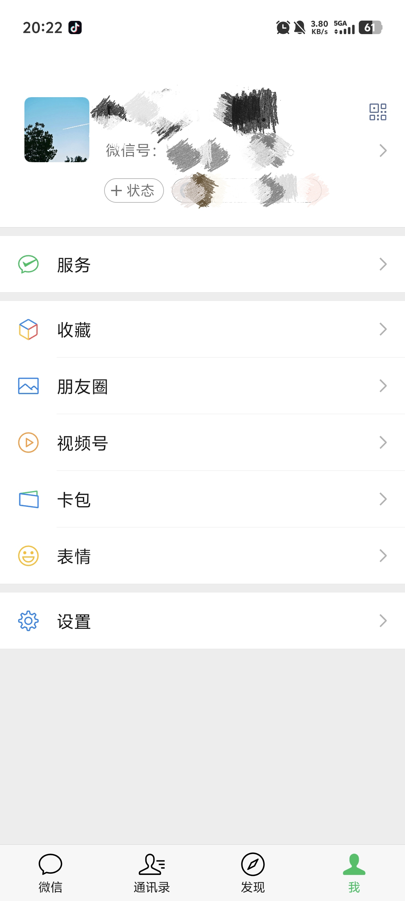

本着what how why的法则，我们首先要了解什么是cell。


## 一、Cell简介


在 **Objective-C（OC）** 中，**cell** 通常指的是 UITableViewCell 或 UICollectionViewCell，也就是**表格或网格视图中的“单元格”**。


> - UITableViewCell 是 Apple 提供的标准类，用于 UITableView； - UICollectionViewCell 是用于 UICollectionView； - 可以使用系统提供的，也可以自定义 cell 样式。


比如在我们的微信 在“我”页面中的每一项就是一个cell。


每一个 cell 可以显示：


- 图标（imageView）
- 文字（textLabel）
- 副标题（detailTextLabel）
- 指示箭头（accessoryView）





如下图为UITableViewDelegate和UITableViewDataSource:


## 二、cell的复用机制


如果你创建了 1000 行数据，滚动时不会创建 1000 个 cell，而是 **只创建屏幕显示范围内的 cell + 少量缓存**，来回复用。


> 初始化的时候他会先创建cell的缓存字典 和 section的缓存array，以及一个用于存放复用cell的mutableSet（可变的集合）。并且它会去创建显示的（n+1）个cell，其他都是从中取出来重用。 当有cell滑出屏幕时，会将其放入到一个set中（相当于一个重用池），当UITableView要求返回cell的时候，datasource会先在集合中查找是否有闲置的cell，若有则会将数据配置到这个cell中，并将cell返回给UITabelView。 这大大减少了内存的开销。 因为我在滚动的过程中会出现一个将cell滚出屏幕外的时候，这时候如果我们一直创建cell的话，如果cell太多了就会出现一个内存开销过多的一个问题。所以我们要采用这个复用的方式来提高内存利用率。


在表视图显示的时候，会创建（视图中可看的单元格个数+1）个单元格，一旦单元格因为滑动的而消失在我们的视野中的时候，消失的单元格就会进入缓存池（或叫复用池），当有新的单元格需要显示的时候，会先从缓存池中取可用的单元格，获取成功则使用获取到的单元格，获取失败则重新创建新的单元格，这就是整个的复用机制。


**cell的复用与两种不同方式：**


### 手动进行Cell复用（非注册）：


设置复用标识符：在创建Cell的时候，我们需要给每个Cell设置一个复用标识符，这个标识符通常是一个字符串，用来表示这个Cell的类型。在创建Cell的时候，我们会把这个标识符作为参数传入。


 请求重用的Cell：在需要显示新的Cell时，我们会使用复用标识符去请求一个已经不再显示，但是还没有被销毁的Cell。这个请求的过程是通过调用UITableView或UICollectionView的dequeueReusableCell(withIdentifier:)方法来完成的，这个方法会返回一个可选类型的Cell，如果有可用的重用Cell，就会返回一个Cell，否则返回nil。


 配置Cell：无论是新创建的Cell还是重用的Cell，都需要进行配置，以显示新的数据。配置Cell通常会在tableView(:cellForRowAt:)或collectionView(:cellForItemAt:)方法中完成。


dequeueReusableCellWithIdentifier：意思是出列的可用的cell，即使用这个方法可以获取通过滚动创建过并放回对象池中的可以复用的cell对象。


```objective-c
- (void)viewDidLoad {
    [super viewDidLoad];
    _tableView = [[UITableView alloc] initWithFrame:self.view.bounds style: UITableViewStyleGrouped];
    //设置两个代理
    _tableView.delegate = self;
    _tableView.dataSource = self;
    [self.view addSubview:_tableView];
    // Do any additional setup after loading the view.
}
-(UITableViewCell*) tableView:(UITableView *)tableView cellForRowAtIndexPath:(NSIndexPath *)indexPath {
    NSString* cellStr = @"cell";
    UITableViewCell* cell = [tableView dequeueReusableCellWithIdentifier:cellStr];
    if (cell == nil) {
        cell = [[UITableViewCell alloc] initWithStyle:UITableViewCellStyleDefault reuseIdentifier:cellStr];
    }
    return cell;
```


## 自动（注册）：


使用cell的注册机制，在cell的复用的时候不需要判空，在viewDidLoad中先对需要复用的cell使用registerClass进行注册，然后在创建cell的函数中使用dequeueReusableCellWithIdentifier获取可复用的cell，如果没有可复用的cell，就自动利用注册cell时提供的类创建一个新的cell并返回。


- ```objective-c
- (void)viewDidLoad {
    [super viewDidLoad];
    self.tableView = [[UITableView alloc] initWithFrame:self.view.frame style:UITableViewStyleGrouped];
    self.tableView.delegate = self;
    self.tableView.dataSource = self;
    self.ary = @[@"头像", @"名字", @"微信号"];
    [self.view addSubview:_tableView];
    [self.tableView registerClass:[cell02 class] forCellReuseIdentifier:@"cell"]; //使用代码自定义cell
    // Do any additional setup after loading the view.
}
- (UITableViewCell *)tableView:(UITableView *)tableView cellForRowAtIndexPath:(NSIndexPath *)indexPath {
    cell02* cell = [tableView dequeueReusableCellWithIdentifier:@"cell" forIndexPath:indexPath];
    return cell;
}
```


> 非注册和注册的区别在于： 非注册每一次使用都要判空，注册的方法需要先注册要复用的cell，当不需要在获取cell的时候手动判断cell是否为nil


这两种方式都是可以复用，两者有部分区别，引用学长的学长的话：


> 上述代码的区别在于注册方法需要提前对我们要使用的cell类进行注册，如此一来就不需要在后续过程中对我们的单元格进行判空。 这是因为我们的注册方法： (void)registerClass:(nullable Class)cellClass forCellReuseIdentifier:(NSString *)identifier API_AVAILABLE(ios(6.0)); 在调用过程中会自动返回一个单元格实例，如此一来我们就避免了判空操作


> 引用的方法不同 - (nullable __kindof UITableViewCell *)dequeueReusableCellWithIdentifier:(NSString *)identifier; (__kindof UITableViewCell *)dequeueReusableCellWithIdentifier:(NSString *)identifier forIndexPath:(NSIndexPath *)indexPath NS_AVAILABLE_IOS(6_0); 第一个 method 用在了非注册的方式里，第二个 method 用在了需要注册的方式里。经过验证，第一个 method 也可以用在注册的方式里，但是第二个 method 如果用于非注册的方式，则会报错崩溃:


## 三、自定义cell


> 自定义 cell 就是你自己创建一个 UITableViewCell 的子类，并在其中添加你需要的控件（UILabel、UIImageView、UIButton 等），然后在表格中使用它。


我们首先要实现自定义cell需要两个协议


UITableViewDelegate和UITableViewDataSource。


前者的主要用于实现显示单元格，设置单元格的行高和对于制定的单元格的操作设置头视图和尾视图。


```objective-c
- (void)tableView:(UITableView *)tableView willDisplayCell:(UITableViewCell *)cell forRowAtIndexPath:(NSIndexPath *)indexPath;
- (void)tableView:(UITableView *)tableView willDisplayHeaderView:(UIView *)view forSection:(NSInteger)section API_AVAILABLE(ios(6.0));
- (void)tableView:(UITableView *)tableView willDisplayFooterView:(UIView *)view forSection:(NSInteger)section API_AVAILABLE(ios(6.0));
- (void)tableView:(UITableView *)tableView didEndDisplayingCell:(UITableViewCell *)cell forRowAtIndexPath:(NSIndexPath*)indexPath API_AVAILABLE(ios(6.0));
- (void)tableView:(UITableView *)tableView didEndDisplayingHeaderView:(UIView *)view forSection:(NSInteger)section API_AVAILABLE(ios(6.0));
- (void)tableView:(UITableView *)tableView didEndDisplayingFooterView:(UIView *)view forSection:(NSInteger)section API_AVAILABLE(ios(6.0));
- (CGFloat)tableView:(UITableView *)tableView heightForRowAtIndexPath:(NSIndexPath *)indexPath;
- (CGFloat)tableView:(UITableView *)tableView heightForHeaderInSection:(NSInteger)section;
- (CGFloat)tableView:(UITableView *)tableView heightForFooterInSection:(NSInteger)section;
```


后者主要用于设置UITableView的section和row的数量


```objective-c
- (NSInteger)tableView:(UITableView *)tableView numberOfRowsInSection:(NSInteger)section;

// Row display. Implementers should *always* try to reuse cells by setting each cell's reuseIdentifier and querying for available reusable cells with dequeueReusableCellWithIdentifier:
// Cell gets various attributes set automatically based on table (separators) and data source (accessory views, editing controls)

- (UITableViewCell *)tableView:(UITableView *)tableView cellForRowAtIndexPath:(NSIndexPath *)indexPath;
```


 我们的UIVIewContorller中要实现上面的部分协议函数，后面就是我们有关自定义cell的核心部分，就是我们的自定义的cell的类的部分。
 我们自定义cell先要创建一个类继承UITableViewCell


```objective-c
#import <UIKit/UIKit.h>

NS_ASSUME_NONNULL_BEGIN
@interface myCustomCell : UITableViewCell
@property (nonatomic, strong) UIButton* btn;
@property (nonatomic, strong) UILabel* label1;
@property (nonatomic, strong) UILabel* label2;
@property (nonatomic, strong) UIImageView* imageView01;
@end

NS_ASSUME_NONNULL_END
```


然后需要重写一个方法`- (instancetype)initWithStyle:(UITableViewCellStyle)style reuseIdentifier:(NSString *)reuseIdentifier`


```objective-c
-(instancetype)initWithStyle:(UITableViewCellStyle)style reuseIdentifier:(NSString *)reuseIdentifier {
    self = [super initWithStyle:style reuseIdentifier:reuseIdentifier];

    if ([self.reuseIdentifier isEqualToString:@"picture"]) {
        _label1 = [[UILabel alloc] init];
        _label1.textColor = UIColor.blackColor;
        _label1.font = [UIFont systemFontOfSize:17];
        [self.contentView addSubview:_label1];

        _label2 = [[UILabel alloc] init];
        _label2.textColor = UIColor.grayColor;
        _label2.font = [UIFont systemFontOfSize:10];
        [self.contentView addSubview:_label2];

        _imageView01 = [[UIImageView alloc] init]; // 创建UIImageView对象
        [self.contentView addSubview:_imageView01];

        _btn = [UIButton buttonWithType:UIButtonTypeCustom];
        [self.contentView addSubview:_btn];
    }
    return self;
}
```


然后我们对cell中的控件进行布局


```objective-c
-(void) layoutSubviews {
    self.name.frame = CGRextMake(50,0,200,60);
    self.icon.frame = CGRectMake(15, 20, 20, 20);

}
```


## 四、cell的复用原理


在上上届学长的博客中有完整提及，本人能力有限，还望大家移步进行了解5


[【iOS】自定义cell及其复用机制_表视图复用机制原理-CSDN博客](https://blog.csdn.net/weixin_72437555/article/details/131273183?fromshare=blogdetail&sharetype=blogdetail&sharerId=131273183&sharerefer=PC&sharesource=2402_86720949&sharefrom=from_link)

---

原文发布于 CSDN：[Cell的复用与自定义cell](https://blog.csdn.net/2402_86720949/article/details/148500158)
