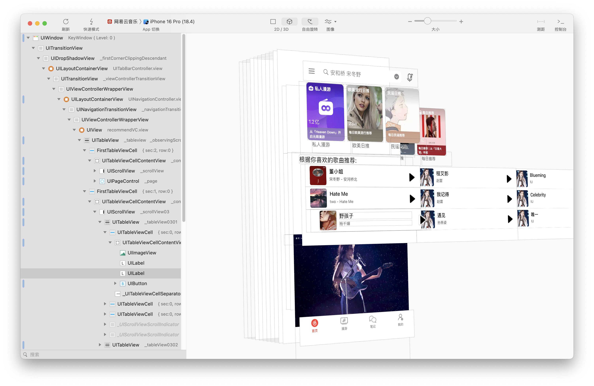
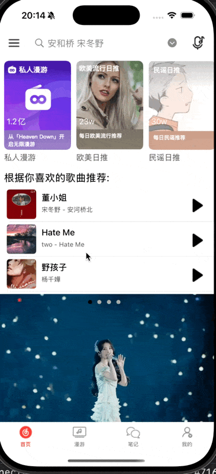
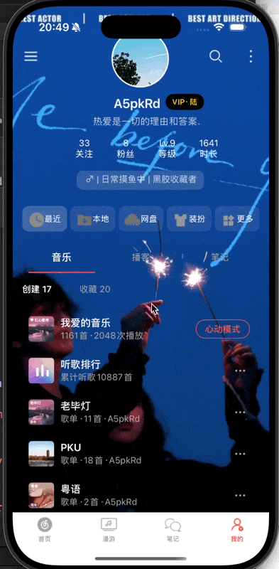

**目录**


[首页​编辑​编辑](#%E9%A6%96%E9%A1%B5%E2%80%8B%E7%BC%96%E8%BE%91%E2%80%8B%E7%BC%96%E8%BE%91)


[上方导航栏](#%E4%B8%8A%E6%96%B9%E5%AF%BC%E8%88%AA%E6%A0%8F)


[主页内容](#%E4%B8%BB%E9%A1%B5%E5%86%85%E5%AE%B9)


[海报](#%E6%B5%B7%E6%8A%A5)


[推荐内容](#%E6%8E%A8%E8%8D%90%E5%86%85%E5%AE%B9)


[猜你喜欢](#%E7%8C%9C%E4%BD%A0%E5%96%9C%E6%AC%A2)


[“我的”页面](#%E2%80%9C%E6%88%91%E7%9A%84%E2%80%9D%E9%A1%B5%E9%9D%A2)


[​编辑](#%C2%A0%E2%80%8B%E7%BC%96%E8%BE%91)


[导航栏](#%E5%AF%BC%E8%88%AA%E6%A0%8F)


[主要内容](#%E4%B8%BB%E8%A6%81%E5%86%85%E5%AE%B9)


[我的信息](#%E6%88%91%E7%9A%84%E4%BF%A1%E6%81%AF)


[工具栏：](#%E5%B7%A5%E5%85%B7%E6%A0%8F%EF%BC%9A)


[歌单部分：](#%E6%AD%8C%E5%8D%95%E9%83%A8%E5%88%86%EF%BC%9A)


[设置页面](#%E8%AE%BE%E7%BD%AE%E9%A1%B5%E9%9D%A2)


与网易云相比，我只完成了首页以及“我的”页面的仿写。


## 首页


首页实现效果如上图。


### 上方导航栏


```objective-c
self.leftbtn = [[UIBarButtonItem alloc] initWithImage: [UIImage imageNamed: @"caidan"] style: UIBarButtonItemStylePlain target: self action: @selector(pressMenu)];
    self.rightbtn = [[UIBarButtonItem alloc] initWithImage: [UIImage imageNamed: @"tinggeshiqu"] style: UIBarButtonItemStylePlain target: nil action: nil];
    self.navigationItem.leftBarButtonItem = self.leftbtn;
    self.navigationItem.rightBarButtonItem = self.rightbtn;
    self.navigationItem.leftBarButtonItem.tintColor = [UIColor blackColor];
    self.navigationItem.rightBarButtonItem.tintColor = [UIColor blackColor];
    self.searchbar = [[UISearchBar alloc] init];
    self.searchbar.placeholder = @"安和桥 宋冬野";
    self.searchbar.showsSearchResultsButton = YES;
    self.navigationItem.titleView = self.searchbar;
```


导航栏的左右按钮和搜索栏代码如上


### 主页内容





如上图Lookin，我把主页分成了三个部分：poster , recommend , guessyoulike


分别对应显示效果中的无线轮播海报 ， 私人漫游 ， 根据你喜欢的歌曲推荐。


#### 海报


```objective-c
- (void)pageChanged:(UIPageControl *)sender {
    NSInteger page = sender.currentPage;
    CGFloat width = WIDTH;
    [self.scrollView setContentOffset:CGPointMake((page + 1) * width, 0) animated:YES];
}

//自动翻页
- (void)autoScroll {
    CGFloat screenWidth = self.scrollView.bounds.size.width;
    CGFloat currentOffset = self.scrollView.contentOffset.x;
    NSInteger nextPage = (NSInteger)(currentOffset / screenWidth) + 1;

    NSInteger realPageCount = self.page.numberOfPages;

    if (nextPage >= realPageCount + 2) {
        [self.scrollView setContentOffset:CGPointMake(screenWidth, 0) animated:NO];
        self.page.currentPage = 0;
        return;
    }

    [self.scrollView setContentOffset:CGPointMake(nextPage * screenWidth, 0) animated:YES];

    self.page.currentPage = (nextPage - 1) % realPageCount;
}

- (void)scrollViewDidScroll:(UIScrollView *)scrollView {
    if (scrollView != self.scrollView) return;

    CGFloat screenWidth = scrollView.bounds.size.width;
    CGFloat offsetX = scrollView.contentOffset.x;
    NSInteger realPageCount = self.page.numberOfPages;
    NSInteger totalPages = realPageCount + 2;
    if (offsetX <= 0) {
        scrollView.contentOffset = CGPointMake(screenWidth * (totalPages - 2), 0);
        self.page.currentPage = realPageCount - 1;
    }
    else if (offsetX >= screenWidth * (totalPages - 1)) {
        scrollView.contentOffset = CGPointMake(screenWidth, 0);
        self.page.currentPage = 0;
    }
    else {
        NSInteger currentPage = (NSInteger)(offsetX / screenWidth) - 1;
        if (currentPage < 0) currentPage = realPageCount - 1;
        if (currentPage >= realPageCount) currentPage = 0;

        self.page.currentPage = currentPage;
    }
}

- (void)scrollViewWillBeginDragging:(UIScrollView *)scrollView {
    [self.timer invalidate];
    self.timer = nil;
}

- (void)scrollViewDidEndDragging:(UIScrollView *)scrollView willDecelerate:(BOOL)decelerate {
    [self startAutoScrollTimer];
}

- (void)startAutoScrollTimer {
    if (self.timer) {
        [self.timer invalidate];
        self.timer = nil;
    }

    self.timer = [NSTimer timerWithTimeInterval:5.0 target:self selector:@selector(autoScroll) userInfo:nil repeats:YES];
    [[NSRunLoop currentRunLoop] addTimer:self.timer forMode:NSRunLoopCommonModes];
}
```


一些控制轮播的关键函数如上图，如代码可简化或有误烦请指出。


同时，我添加了一个点击海报放大功能，


```objective-c
- (void)bannerTapped:(UITapGestureRecognizer *)gesture {
    //取出被点击的对象
    UIImageView *imgView = (UIImageView *)gesture.view;
    UIImage *image = imgView.image;
    if (!image) return;

    UIWindow *keyWindow = [UIApplication sharedApplication].keyWindow;
    UIView *backgroundView = [[UIView alloc] initWithFrame:keyWindow.bounds];
    backgroundView.backgroundColor = [UIColor whiteColor];
    backgroundView.alpha = 0.5;
    UIImageView *fullImageView = [[UIImageView alloc] initWithFrame:backgroundView.bounds];
    fullImageView.contentMode = UIViewContentModeScaleAspectFit;
    fullImageView.image = image;
    fullImageView.userInteractionEnabled = YES;

    UITapGestureRecognizer *tapClose = [[UITapGestureRecognizer alloc] initWithTarget:self action:@selector(dismissFullScreenImage:)];
    [fullImageView addGestureRecognizer:tapClose];

    [backgroundView addSubview:fullImageView];
    [keyWindow addSubview:backgroundView];
}
```


与此同时，我也添加了一个点击后取消


```objective-c
- (void)dismissFullScreenImage:(UITapGestureRecognizer *)tap {
    UIView *backgroundView = tap.view.superview;
    [UIView animateWithDuration:0.3 animations:^{
        backgroundView.alpha = 0;
    } completion:^(BOOL finished) {
        [backgroundView removeFromSuperview];
    }];
}
```





#### 推荐内容


我建立一个数组用于储存内容，代码难度较低 


```objective-c
- (void)setupRecommandCell {
    self.scrollView02 = [[UIScrollView alloc] initWithFrame:CGRectMake(0, 0, WIDTH, 211)];
    self.scrollView02.scrollEnabled = YES;
    self.scrollView02.pagingEnabled = YES;
    self.scrollView02.alwaysBounceHorizontal = YES;
    self.scrollView02.alwaysBounceVertical = NO;
    self.scrollView02.contentSize = CGSizeMake(WIDTH * 2.1, 211);
    self.scrollView02.showsHorizontalScrollIndicator = NO;
    [self.contentView addSubview:self.scrollView02];

    NSArray* arrayLabel02 = @[@"私人漫游", @"欧美日推", @"民谣日推", @"快乐旅行", @"电音日推", @"每日推荐"];
    NSArray* arrayLabel2 = @[@"1.2亿", @"23w", @"30w", @"460w", @"521w", @"6亿"];
    BOOL isNight = [NightModeManager sharedManager].isNightMode;

    for (int i = 0; i < 6; i++) {
        NSString* strName = [NSString stringWithFormat: @"guess%d", i + 1];
        UIImageView* iView = [[UIImageView alloc] initWithImage: [UIImage imageNamed: strName]];
        iView.frame = CGRectMake(10 + 135 * i, 5, 125, 166);
        iView.layer.cornerRadius = 9;
        iView.layer.masksToBounds = YES;
        [self.scrollView02 addSubview: iView];

        self.label02 = [[UILabel alloc] initWithFrame: CGRectMake(10 + 135 * i, 160, 130, 50)];
        self.label02.font = [UIFont systemFontOfSize: 15];
        self.label02.text = arrayLabel02[i];
        self.label02.textColor = [UIColor darkGrayColor];
        self.label02.numberOfLines = 2;
        [self.scrollView02 addSubview: self.label02];

        self.label2 = [[UILabel alloc] initWithFrame: CGRectMake(5, 88, 100, 50)];
        self.label2.font = [UIFont systemFontOfSize: 15];
        self.label2.text = arrayLabel2[i];
        self.label2.textColor = [UIColor whiteColor];
        [iView addSubview: self.label2];
    }
}
#### 猜你喜欢


因为猜你喜欢部分有三个横向栏目，我分别建立tableView0301 0302 0303


以其中0301为例： 


```objective-c
- (UITableViewCell *)createCellForTableView0301:(NSIndexPath *)indexPath {

    static NSString *cellIdentifier = @"CustomSongCell";
    UITableViewCell *cell = [self.tableView0301 dequeueReusableCellWithIdentifier:cellIdentifier];
    BOOL isNight = [NightModeManager sharedManager].isNightMode;
    if (!cell) {
        cell = [[UITableViewCell alloc] initWithStyle:UITableViewCellStyleDefault reuseIdentifier:cellIdentifier];

        UIImageView *albumImageView = [[UIImageView alloc] initWithFrame:CGRectMake(15, 5, 55, 55)];
        albumImageView.tag = 100;
        albumImageView.layer.cornerRadius = 5;
        albumImageView.layer.masksToBounds = YES;
        albumImageView.contentMode = UIViewContentModeScaleAspectFill;
        [cell.contentView addSubview:albumImageView];
        UILabel *songLabel = [[UILabel alloc] initWithFrame:CGRectMake(80, 10, WIDTH - 150, 20)];
        songLabel.tag = 101;
        songLabel.textColor = isNight ? [UIColor whiteColor] : [UIColor blackColor];
        songLabel.font = [UIFont systemFontOfSize:16 weight:UIFontWeightMedium];
        [cell.contentView addSubview:songLabel];

        UILabel *artistLabel = [[UILabel alloc] initWithFrame:CGRectMake(80, 35, WIDTH - 150, 15)];
        artistLabel.tag = 102;
        artistLabel.font = [UIFont systemFontOfSize:12];
        artistLabel.textColor = [UIColor grayColor];
        [cell.contentView addSubview:artistLabel];

        UIButton *playButton = [UIButton buttonWithType:UIButtonTypeCustom];
        playButton.frame = CGRectMake(WIDTH - 45, 20, 30, 30);
        playButton.tag = 103;
        [playButton setImage:[UIImage imageNamed:@"bofang.png"] forState:UIControlStateNormal];
        playButton.tintColor = [UIColor systemPurpleColor];
        [playButton addTarget:self action:@selector(playButtonTapped:) forControlEvents:UIControlEventTouchUpInside];
        [cell.contentView addSubview:playButton];
    }

    NSArray* array01 = @[@"董小姐", @"Hate Me", @"野孩子"];
    NSArray* array011 = @[@"宋冬野 - 安河桥北", @"two - Hate Me", @"杨千嬅"];
    NSArray* imageNames = @[@"011", @"012", @"013"];

    UIImageView *albumImageView = [cell.contentView viewWithTag:100];
    albumImageView.image = [UIImage imageNamed:imageNames[indexPath.row]];

    UILabel *songLabel = [cell.contentView viewWithTag:101];
    songLabel.text = array01[indexPath.row];

    UILabel *artistLabel = [cell.contentView viewWithTag:102];
    artistLabel.text = array011[indexPath.row];

    return cell;
}
```


## “我的”页面


##


我依旧把这个页面分成三个cell文件 UserInfoCell.  ToolbarCell.  SegmentTabCell


分别对应我的用户信息、工具栏：例如最近、本地、网盘等、和下方的音乐、博客、笔记分栏。


### 导航栏


导航栏设置与之前无异


### 主要内容


#### 我的信息


```objective-c
- (void)setupViews {
    _avatarImageView = [[UIImageView alloc] initWithFrame:CGRectMake( 155, -30, 90, 90)];
    _avatarImageView.layer.cornerRadius = 45;
    _avatarImageView.image = [UIImage imageNamed:@"avater"];
    _avatarImageView.layer.masksToBounds = YES;
    _avatarImageView.layer.borderColor = [UIColor whiteColor].CGColor;
    _avatarImageView.layer.borderWidth = 2.0;
    _avatarImageView.userInteractionEnabled = YES;

    UITapGestureRecognizer *tapGesture = [[UITapGestureRecognizer alloc] initWithTarget:self action:@selector(avatarTapped:)];
    [_avatarImageView addGestureRecognizer:tapGesture];

    [self.contentView addSubview:_avatarImageView];
    _vipLabel = [[UILabel alloc] initWithFrame:CGRectMake(240, 70, 60, 25)];
    _vipLabel.textColor = [UIColor colorWithRed:1.0 green:0.8 blue:0.2 alpha:1.0];
    _vipLabel.font = [UIFont boldSystemFontOfSize:12];
    _vipLabel.textAlignment = NSTextAlignmentCenter;
    _vipLabel.backgroundColor = [UIColor blackColor];
    _vipLabel.layer.cornerRadius = 12;
    _vipLabel.layer.masksToBounds = YES;
    [self.contentView addSubview:_vipLabel];

    _usernameLabel = [[UILabel alloc] initWithFrame:CGRectMake(35, 70, self.contentView.bounds.size.width, 30)];
    _usernameLabel.textColor = [UIColor whiteColor];
    _usernameLabel.font = [UIFont boldSystemFontOfSize:20];
    _usernameLabel.textAlignment = NSTextAlignmentCenter;
    [self.contentView addSubview:_usernameLabel];

    _bioLabel = [[UILabel alloc] initWithFrame:CGRectMake(50, 100, self.contentView.bounds.size.width, 25)];
    _bioLabel.textColor = [UIColor colorWithWhite:1.0 alpha:0.7];
    _bioLabel.font = [UIFont systemFontOfSize:15];
    _bioLabel.textAlignment = NSTextAlignmentCenter;
    [self.contentView addSubview:_bioLabel];

    _statusButton = [UIButton buttonWithType:UIButtonTypeCustom];
    _statusButton.frame = CGRectMake(150, -60, 100, 24);
    [_statusButton setTitle:@"+添加状态" forState:UIControlStateNormal];
    [_statusButton setTitleColor:[UIColor systemMintColor] forState:UIControlStateNormal];
    _statusButton.titleLabel.font = [UIFont systemFontOfSize:14];
    _statusButton.layer.borderColor = [UIColor colorWithRed:0.0 green:0.6 blue:1.0 alpha:1.0].CGColor;
    _statusButton.layer.borderWidth = 0;
    _statusButton.layer.cornerRadius = 12;
    [self.contentView addSubview:_statusButton];

    _statsView = [[UIView alloc] initWithFrame:CGRectMake(80, 130, self.contentView.bounds.size.width - 60, 50)];
    [self.contentView addSubview:_statsView];

    NSArray *statTitles = @[@"33\n关注", @"8\n粉丝", @"Lv.9\n等级", @"1641\n时长"];
    CGFloat statWidth = _statsView.bounds.size.width / statTitles.count;

    for (int i = 0; i < statTitles.count; i++) {
        UILabel *statLabel = [[UILabel alloc] initWithFrame:CGRectMake(i * statWidth, 0, statWidth, 50)];
        statLabel.text = statTitles[i];
        statLabel.numberOfLines = 2;
        statLabel.textColor = [UIColor whiteColor];
        statLabel.font = [UIFont systemFontOfSize:14];
        statLabel.textAlignment = NSTextAlignmentCenter;
        [_statsView addSubview:statLabel];
    }

    _badgeView = [[UIView alloc] initWithFrame:CGRectMake(100, 190, 200, 30)];
    _badgeView.backgroundColor = [UIColor colorWithWhite:1.0 alpha:0.15];
    _badgeView.layer.cornerRadius = 10;
    [self.contentView addSubview:_badgeView];

    UILabel *badgeDesc = [[UILabel alloc] initWithFrame:CGRectMake(14, 3, 300, 20)];
    badgeDesc.text = @"♂ | 日常摸鱼中 | 黑胶收藏者";
    badgeDesc.textColor = [UIColor colorWithWhite:1.0 alpha:0.7];
    badgeDesc.font = [UIFont systemFontOfSize:14];
    [_badgeView addSubview:badgeDesc];
}
```


同时，我增加了照片墙换头像功能。


**代理传值：**


UserInfoCell：


```objective-c
- (void)avatarTapped:(UITapGestureRecognizer *)gesture {
    NSLog(@"头像被点击");
    if ([self.delegate respondsToSelector:@selector(didTapAvatarInCell:)]) {
        [self.delegate didTapAvatarInCell:self];
    }
}

- (void)setAvatarImageView:(UIImageView *)avatarImageView {
    _avatarImageView.image = avatarImageView;
}
```


myVC控制器：


```objective-c
- (void)didTapAvatarInCell:(UserInfoCell *)cell {

    NSLog(@"代理方法");
    PhotoWallVC *photoVC = [[PhotoWallVC alloc] init];
    photoVC.delegate = self;
    [self presentViewController:photoVC animated:YES completion:nil];
}

#pragma mark - PhotoWallDelegate

- (void)didSelectAvatar:(UIImage *)selectedAvatar {
    NSLog(@"接收头像");

    self.currentAvatar = selectedAvatar;

    NSIndexPath *indexPath = [NSIndexPath indexPathForRow:0 inSection:0];
    UserInfoCell* cell = [self.tableView cellForRowAtIndexPath:indexPath];
    [cell setAvatarImageView: _currentAvatar];
}
#### 工具栏：


我还是通过两个数组记录每个工具的文字和图片


```objective-c
- (void)setupUI {
    self.backgroundColor = [UIColor clearColor];
    self.selectionStyle = UITableViewCellSelectionStyleNone;
    self.contentView.backgroundColor = [UIColor clearColor];

    _buttons = [NSMutableArray array];
    _backgroundViews = [NSMutableArray array];

    for (int i = 0; i < 5; i++) {
        UIView *backgroundView = [[UIView alloc] init];
        backgroundView.backgroundColor = [UIColor colorWithWhite:1.0 alpha:0.1];
        backgroundView.layer.cornerRadius = 10;
        [self.contentView addSubview:backgroundView];
        [_backgroundViews addObject:backgroundView];

        UIButton *button = [UIButton buttonWithType:UIButtonTypeCustom];
        button.tag = i;
        button.titleLabel.font = [UIFont systemFontOfSize:13];
        button.titleLabel.textAlignment = NSTextAlignmentCenter;
        button.titleLabel.adjustsFontSizeToFitWidth = YES;
        button.titleLabel.minimumScaleFactor = 0.8;
        [button setTitleColor:[UIColor whiteColor] forState:UIControlStateNormal];
        [button addTarget:self action:@selector(buttonTapped:) forControlEvents:UIControlEventTouchUpInside];
        [self.contentView addSubview:button];
        [_buttons addObject:button];
    }
}

- (void)layoutSubviews {
    [super layoutSubviews];

    CGFloat padding = 15.0;
    CGFloat buttonSpacing = 5.0;
    CGFloat contentWidth = CGRectGetWidth(self.contentView.bounds) - padding * 2;
    CGFloat contentHeight = 40.0;

    CGFloat buttonWidth = (contentWidth - (4 * buttonSpacing)) / _buttons.count;

    for (int i = 0; i < _buttons.count; i++) {
        CGFloat xPosition = padding + i * (buttonWidth + buttonSpacing);


        UIView *backgroundView = _backgroundViews[i];
        backgroundView.frame = CGRectMake(xPosition, -30, buttonWidth, contentHeight);

        UIButton *button = _buttons[i];
        button.frame = CGRectMake(xPosition, -30, buttonWidth, contentHeight);

        [self layoutButtonContent:button];
    }
}
```


最终实现效果如图：


#### 歌单部分：


我加入了一个分栏实现音乐、播客、笔记之间的切换


```objective-c
_segmentedControl = [[UISegmentedControl alloc] init];
    _segmentedControl.selectedSegmentTintColor = [UIColor colorWithRed:0.98 green:0.30 blue:0.30 alpha:1.0];
    [_segmentedControl setBackgroundImage:[UIImage new] forState:UIControlStateNormal barMetrics:UIBarMetricsDefault];
    [_segmentedControl setBackgroundImage:[UIImage new] forState:UIControlStateSelected barMetrics:UIBarMetricsDefault];
    [_segmentedControl setDividerImage:[UIImage new] forLeftSegmentState:UIControlStateNormal rightSegmentState:UIControlStateNormal barMetrics:UIBarMetricsDefault];
    UIFont *selectedFont = [UIFont boldSystemFontOfSize:16];
    UIFont *normalFont = [UIFont systemFontOfSize:14];

    [_segmentedControl setTitleTextAttributes:@{
        NSForegroundColorAttributeName: [UIColor whiteColor],
        NSFontAttributeName: selectedFont
    } forState:UIControlStateSelected];

    [_segmentedControl setTitleTextAttributes:@{
        NSForegroundColorAttributeName: [UIColor lightGrayColor],
        NSFontAttributeName: normalFont
    } forState:UIControlStateNormal];

    [_segmentedControl addTarget:self action:@selector(segmentChanged:) forControlEvents:UIControlEventValueChanged];
    [self.contentView addSubview:_segmentedControl];
```


## 设置页面


我实现了一个抽屉视图，并设置了黑夜模式





recommendVC：


```objective-c
-(void) pressMenu {
    settingViewController *settingView = [[settingViewController alloc] init];
        settingView.modalPresentationStyle = UIModalPresentationOverFullScreen;
        settingView.modalTransitionStyle = UIModalTransitionStyleCrossDissolve;

        [self presentViewController:settingView animated:YES completion:nil];
}
```


settingViewController：


```objective-c
[[NSNotificationCenter defaultCenter] addObserver:self
                                               selector:@selector(updateAppearance)
                                                   name:@"NightModeChangedNotification"
                                                 object:nil];
```


先通过这段代码接收通知


```objective-c
- (void)updateAppearance {
    BOOL isNightMode = [NightModeManager sharedManager].isNightMode;

    if (isNightMode) {
        self.tableView.backgroundColor = [UIColor blackColor];
        self.tabBarController.tabBar.backgroundColor = [UIColor darkGrayColor];
        self.tabBarController.tabBar.barTintColor = [UIColor darkGrayColor];
        self.tabBarController.tabBar.tintColor = [UIColor redColor]; // 设置选中颜色
    } else {
        UIColor *wechatBackgroundColor = [UIColor colorWithRed:247/255.0 green:247/255.0 blue:247/255.0 alpha:1.0];
        self.tableView.backgroundColor = wechatBackgroundColor;
        self.tabBarController.tabBar.barTintColor = [UIColor whiteColor];
        self.tabBarController.tabBar.backgroundColor = [UIColor whiteColor];
        self.tabBarController.tabBar.tintColor = [UIColor grayColor];
    }
    [self.tableView reloadData];
}


//在当前页面上加一个半透明黑色的背景蒙层，并且能点击关闭设置面板
- (void)setupBackgroundDimmingView {
    self.backgroundDimmingView = [[UIView alloc] initWithFrame:self.view.bounds];
    self.backgroundDimmingView.backgroundColor = [UIColor colorWithWhite:0 alpha:0.5];
    self.backgroundDimmingView.alpha = 0;
    [self.view addSubview:self.backgroundDimmingView];

    UITapGestureRecognizer *tapGesture = [[UITapGestureRecognizer alloc] initWithTarget:self action:@selector(dismissSetting)];
    [self.backgroundDimmingView addGestureRecognizer:tapGesture];
}

//通知中心取消
- (void)dealloc {
    [[NSNotificationCenter defaultCenter] removeObserver:self];
}
```


然后实现白天黑夜模式切换。

---

原文发布于 CSDN：[iOS —— 网易云仿写](https://blog.csdn.net/2402_86720949/article/details/149338308)
