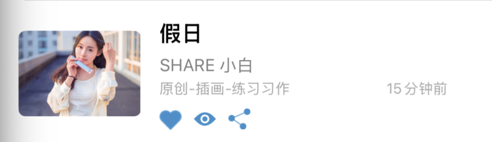
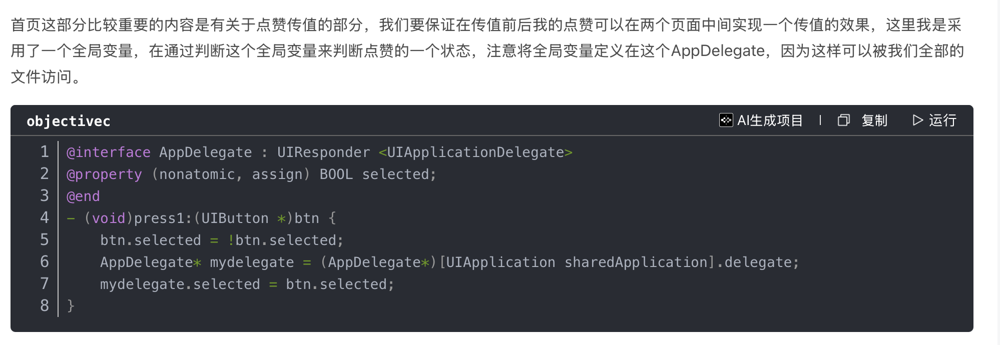
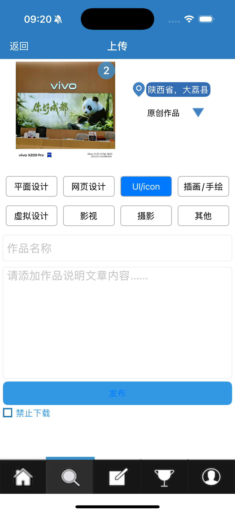
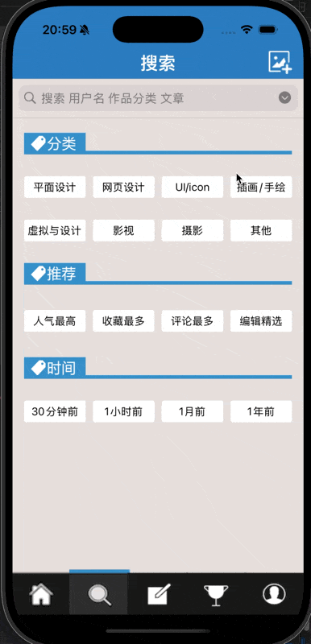
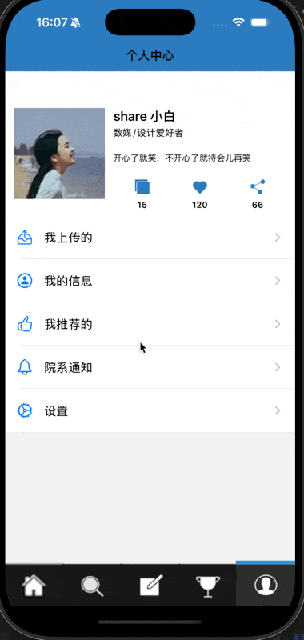
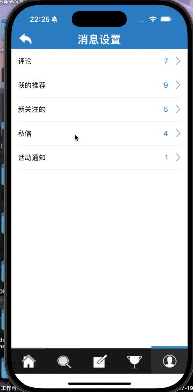
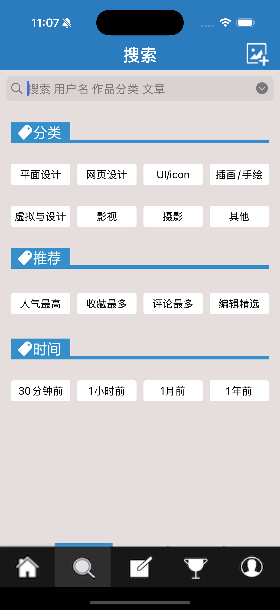

**目录**


[登陆注册及推出主页面](#%E7%99%BB%E9%99%86%E6%B3%A8%E5%86%8C%E5%8F%8A%E6%8E%A8%E5%87%BA%E4%B8%BB%E9%A1%B5%E9%9D%A2)


[自动登录](#%E8%87%AA%E5%8A%A8%E7%99%BB%E5%BD%95)


[登陆](#%E7%99%BB%E9%99%86)


[自动收起键盘](#%E8%87%AA%E5%8A%A8%E6%94%B6%E8%B5%B7%E9%94%AE%E7%9B%98)


[注册](#%E6%B3%A8%E5%86%8C)


[HomeVC](#HomeVC)


[SearchVC](#SearchVC)


[上传图片：](#%E4%B8%8A%E4%BC%A0%E5%9B%BE%E7%89%87%EF%BC%9A%C2%A0)


[ArticleVC](#ArticleVC)


[MyVC](#MyVC)


[我的信息](#%E6%88%91%E7%9A%84%E4%BF%A1%E6%81%AF)


[评论 && 活动通知 && 我的推荐](#%E8%AF%84%E8%AE%BA%20%26%26%20%E6%B4%BB%E5%8A%A8%E9%80%9A%E7%9F%A5%20%26%26%20%E6%88%91%E7%9A%84%E6%8E%A8%E8%8D%90)


[新关注的](#%E6%96%B0%E5%85%B3%E6%B3%A8%E7%9A%84)


[私信：](#%E7%A7%81%E4%BF%A1%EF%BC%9A)


[设置](#%E8%AE%BE%E7%BD%AE)


[Tips：](#Tips%EF%BC%9A)


## 登陆注册及推出主页面


这部分有两种写法：一种是在SceneDelegate中推出LoginVC，后在判断登陆成功后退去主要程序。另一种则是先加载主程序，后推出登陆页面。通过同组同学实践证明，后者在推出登陆页面时会闪一下，因此还是建议采用第一种方法。


本人的登陆页面在最初使用数组储存用户名和密码，后来发现在修改密码时会较为困难，因此我创建了一个单例类。


同时我简单了解了一种轻量化本地存储方式 setObject: forKey: 


他支持的对象类型包括：


**类型** **示例** NSString 用户名、token 等 NSNumber 整数、布尔值等 NSArray 字符串数组、数字数组等 NSDictionary 键值对结构 NSDate 时间 NSData 二进制数据（如图片、加密）


```objective-c
- (void)saveLoginStatus {
    NSUserDefaults *defaults = [NSUserDefaults standardUserDefaults];
    [defaults setObject:@"wutong" forKey:@"username"];
    [defaults setBool:YES forKey:@"isLoggedIn"];
    [defaults synchronize]; // 可选
}


//读取时

NSString *name = [[NSUserDefaults standardUserDefaults] objectForKey:@"username"];
BOOL isLoggedIn = [[NSUserDefaults standardUserDefaults] boolForKey:@"isLoggedIn"];
```


> NSUserDefaults 的 setObject:forKey: 是用于保存简单用户数据的 API，轻量、易用，适合设置类数据（如用户名、偏好设置、登录状态等）。


```objective-c
//  UserManager.m
//  3GShareee
//
//  Created by 吴桐 on 2025/7/18.
//

#import "UserManager.h"

@implementation UserManager

//单例
+ (instancetype)sharedManager {
    static UserManager *manager = nil;
    static dispatch_once_t onceToken;
    dispatch_once(&onceToken, ^{
        manager = [[UserManager alloc] init];
        [manager loadUserData];
    });
    return manager;
}

- (id)init {
    self = [super init];
    if (self) {
        _usernames = [NSMutableArray array];
        _passwords = [NSMutableArray array];
        [_usernames addObject:@"1"];
        [_passwords addObject:@"1"];
    }
    return self;
}


//保存到本地
- (void)saveUserData {
    [[NSUserDefaults standardUserDefaults] setObject:self.usernames forKey:@"savedUsernames"];
    [[NSUserDefaults standardUserDefaults] setObject:self.passwords forKey:@"savedPasswords"];
    [[NSUserDefaults standardUserDefaults] synchronize];    //不懂，好像是保存
}

- (void)loadUserData {
    NSArray *savedUsernames = [[NSUserDefaults standardUserDefaults] objectForKey:@"savedUsernames"];
    NSArray *savedPasswords = [[NSUserDefaults standardUserDefaults] objectForKey:@"savedPasswords"];
    NSDictionary *savedGenders = [[NSUserDefaults standardUserDefaults] objectForKey:@"savedUserGenders"];

    if (savedUsernames) {
        self.usernames = [savedUsernames mutableCopy];
    }
    if (savedPasswords) {
        self.passwords = [savedPasswords mutableCopy];
    }

    if (![self.usernames containsObject:@"1"]) {
        [self.usernames addObject:@"1"];
        [self.passwords addObject:@"1"];
    }
}


- (BOOL)updatePasswordForUser:(NSString *)username oldPassword:(NSString *)oldPassword newPassword:(NSString *)newPassword {
    NSUInteger index = [self.usernames indexOfObject:username];

    if (index == NSNotFound) {  //NSNotFound 是 Objective-C 中的一个常量，表示“没有找到”的情况，常用于查找操作的结果。
        return NO;
    }
    if (![oldPassword isEqualToString:self.passwords[index]]) {
        return NO;
    }

    // 更新密码
    self.passwords[index] = newPassword;
    [self saveUserData];

    return YES;
}

@end
```


同时，我设置了管理员密码1 1，用于绕过调试时便捷登陆，不必输入较长密码。注册功能和修改密码功能中，密码为不小于6位的数字或字母。


#### 自动登录


我设置了autoBtn，和autoBtn01。前者为切换的按钮主体，后者为一个辅助按钮，当用户点击文字时，也会触发和前者相同的函数从而实现按钮图标的切换，更加人性化。


```objective-c
[self.autoBtn setImage: [UIImage imageNamed: @"autoreserved.png"] forState: UIControlStateNormal];
    [self.autoBtn setImage: [UIImage imageNamed: @"autohighlighted.png"] forState: UIControlStateSelected];
    self.autoBtn.selected = NO;
    [self.autoBtn addTarget: self action: @selector(pressAuto) forControlEvents: UIControlEventTouchUpInside];

self.autoBtn1 = [UIButton buttonWithType: UIButtonTypeRoundedRect];
    self.autoBtn1.frame = CGRectMake(67, 550, 64, 16);
    [self.autoBtn1 setTitle: @"自动登录" forState: UIControlStateNormal];
    [self.autoBtn1 setTintColor: [UIColor colorWithDisplayP3Red: 14.0 / 255 green: 46.0 / 255 blue: 121.0 / 255 alpha: 1.0]];
    [self.autoBtn1 addTarget: self action: @selector(pressAuto) forControlEvents: UIControlEventTouchUpInside];
#### 登陆


```objective-c
UserManager *userManager = [UserManager sharedManager];
    self.arrayUsername = userManager.usernames;
    self.arrayPassword = userManager.passwords;
```


```objective-c
-(void) pressLeft:(UIButton *) button{
    NSString *username = self.userName.text;
    NSString *password = self.passWord.text;

    // 非空检查
    if (username.length == 0 || password.length == 0) {
        [self showAlertWithMessage:@"用户名和密码不能为空"];
        return;
    }

    // 长度限制
    if (username.length > 10 || password.length > 10) {
        [self showAlertWithMessage:@"用户名和密码不能超过10个字符"];
        return;
    }

    // 正则判断是否仅包含字母、数字、下划线
    // 本人暂时还没学...
    NSRegularExpression *regex = [NSRegularExpression regularExpressionWithPattern:@"^[A-Za-z0-9_]+$" options:0 error:nil];
    if ([regex numberOfMatchesInString:username options:0 range:NSMakeRange(0, username.length)] == 0 ||
        [regex numberOfMatchesInString:password options:0 range:NSMakeRange(0, password.length)] == 0) {
        [self showAlertWithMessage:@"用户名和密码只能包含字母、数字和下划线"];
        return;
    }

    BOOL correct = NO;
    for (int i = 0; i < self.arrayUsername.count; i++) {
            if ([self.arrayUsername[i] isEqualToString: self.userName.text] &&
                [self.arrayPassword[i] isEqualToString: self.passWord.text] &&
                (self.userName.text != nil) &&
                (self.passWord.text != nil)) {
                correct = YES;

                // 保存当前登录用户
                UserManager *userManager = [UserManager sharedManager];
                userManager.currentUser = self.userName.text;

                break;
            }
        }
    if (!correct) {
        UIAlertController* wrongWarning  = [UIAlertController alertControllerWithTitle:@"❗️" message:@"账号密码错误！" preferredStyle:UIAlertControllerStyleAlert];
        UIAlertAction* sure = [UIAlertAction actionWithTitle:@"O K" style:UIAlertActionStyleDefault handler:nil];
        [wrongWarning addAction:sure];
        [self presentViewController:wrongWarning animated:YES completion:nil];
    } else {
        FirstVC* firstView = [[FirstVC alloc] init];
        firstView.view.backgroundColor = [UIColor colorWithRed: (230.0 / 255) green: (222.0 / 255) blue: (220.0 / 255) alpha: 1];
        firstView.tabBarItem = [[UITabBarItem alloc] initWithTitle: nil image: [[UIImage imageNamed: @"FirstVC.png"]  imageWithRenderingMode: UIImageRenderingModeAlwaysOriginal] selectedImage: [[UIImage imageNamed: @"FirstVC_tapped.png"] imageWithRenderingMode: UIImageRenderingModeAlwaysOriginal] ];
        SecondVC* secondView = [[SecondVC alloc] init];
        secondView.view.backgroundColor = [UIColor colorWithRed: (230.0 / 255) green: (222.0 / 255) blue: (220.0 / 255) alpha: 1];
        secondView.tabBarItem = [[UITabBarItem alloc] initWithTitle: nil image: [[UIImage imageNamed: @"SecondVC.png"] imageWithRenderingMode: UIImageRenderingModeAlwaysOriginal] selectedImage: [[UIImage imageNamed: @"SecondVC_tapped.png"] imageWithRenderingMode: UIImageRenderingModeAlwaysOriginal] ];
        ThirdVC* thirdView = [[ThirdVC alloc] init];
        thirdView.view.backgroundColor = [UIColor colorWithRed: (230.0 / 255) green: (222.0 / 255) blue: (220.0 / 255) alpha: 1];
        thirdView.tabBarItem = [[UITabBarItem alloc] initWithTitle: nil image: [[UIImage imageNamed: @"ThirdVC.png"] imageWithRenderingMode: UIImageRenderingModeAlwaysOriginal] selectedImage: [[UIImage imageNamed: @"ThirdVC_tapped.png"] imageWithRenderingMode: UIImageRenderingModeAlwaysOriginal] ];
        FourthVC* fourthView = [[FourthVC alloc] init];
        fourthView.view.backgroundColor = [UIColor colorWithRed: (230.0 / 255) green: (222.0 / 255) blue: (220.0 / 255) alpha: 1];
        fourthView.tabBarItem = [[UITabBarItem alloc] initWithTitle: nil image: [[UIImage imageNamed: @"FourthVC.png"] imageWithRenderingMode: UIImageRenderingModeAlwaysOriginal] selectedImage: [[UIImage imageNamed: @"FourthVC_tapped.png"] imageWithRenderingMode: UIImageRenderingModeAlwaysOriginal] ];
        FifthVC* fifthView = [[FifthVC alloc] init];
        fifthView.view.backgroundColor = [UIColor colorWithRed: (230.0 / 255) green: (222.0 / 255) blue: (220.0 / 255) alpha: 1];
        fifthView.tabBarItem = [[UITabBarItem alloc] initWithTitle: nil image: [[UIImage imageNamed: @"FifthVC.png"] imageWithRenderingMode: UIImageRenderingModeAlwaysOriginal] selectedImage: [[UIImage imageNamed: @"FifthVC_tapped.png"] imageWithRenderingMode: UIImageRenderingModeAlwaysOriginal] ];

        //用NavigationController将每个视图包起来
        UINavigationController* navigationFirst = [[UINavigationController alloc] initWithRootViewController:firstView];
        UINavigationController* navigationSecond = [[UINavigationController alloc] initWithRootViewController:secondView];
        UINavigationController* navigationThird = [[UINavigationController alloc] initWithRootViewController:thirdView];
        UINavigationController* navigationFourth = [[UINavigationController alloc] initWithRootViewController:fourthView];
        UINavigationController* navigationFifth = [[UINavigationController alloc] initWithRootViewController:fifthView];

        //组装
        UINavigationBarAppearance* appearance = [[UINavigationBarAppearance alloc] init];
        appearance.backgroundColor = [UIColor colorWithRed: (43.0 / 255) green: (123.0 / 255) blue: (191.0 / 255) alpha: 1];
        firstView.navigationController.navigationBar.standardAppearance = appearance;
        firstView.navigationController.navigationBar.barStyle = UIBarStyleDefault;

        firstView.navigationController.navigationBar.scrollEdgeAppearance = appearance;
        secondView.navigationController.navigationBar.scrollEdgeAppearance = appearance;
        thirdView.navigationController.navigationBar.scrollEdgeAppearance = appearance;
        fourthView.navigationController.navigationBar.scrollEdgeAppearance = appearance;
        fifthView.navigationController.navigationBar.scrollEdgeAppearance = appearance;

        NSArray* arrayViewController = [NSArray arrayWithObjects: navigationFirst, navigationSecond, navigationThird, navigationFourth, navigationFifth, nil];
        UITabBarController* tabBarViewController = [[UITabBarController alloc] init];
        tabBarViewController.viewControllers = arrayViewController;
        // 在tabBar上方添加自定义覆盖视图
        UIView* overlayView = [[UIView alloc] initWithFrame:CGRectMake(0, 50, WIDTH, tabBarViewController.tabBar.bounds.size.height)];
        overlayView.backgroundColor = [UIColor blackColor];
        overlayView.tag = 1001;
        [tabBarViewController.tabBar addSubview:overlayView];
        [tabBarViewController.tabBar bringSubviewToFront:overlayView];
        tabBarViewController.modalPresentationStyle = UIModalPresentationFullScreen;
        [self presentViewController: tabBarViewController animated: YES completion: nil];
    }

}
#### 自动收起键盘


```objective-c
- (void)touchesBegan:(NSSet<UITouch *> *)touches withEvent:(UIEvent *)event {
    [self.view endEditing:YES];
}
```


这两个方法笔者暂时也不算很清楚讲述，只算一知半解，只知道能实现这个功能 


```objective-c
- (void)keyboardWillAppear:(NSNotification *)notification{
    CGRect keyboardFrame = [notification.userInfo[UIKeyboardFrameEndUserInfoKey] CGRectValue];
    CGFloat keyboardY = keyboardFrame.origin.y;
    [UIView animateWithDuration:0.3 animations:^{
        self.view.transform = CGAffineTransformMakeTranslation(0, keyboardY - self.view.frame.size.height + 20);
    }];
}

- (void)keyboardWillDisAppear:(NSNotification *)notification{
    [UIView animateWithDuration:0.3 animations:^{
        self.view.transform = CGAffineTransformIdentity;
    }];
}
#### 注册


核心代码如下


```objective-c
-(void) pressConfirm {
    NSString *username = self.usernameTextField.text;
    NSString *password = self.passwordTextField.text;
    UserManager *userManager = [UserManager sharedManager];


    if (username.length == 0 || password.length == 0) {
        UIAlertController* warning = [UIAlertController alertControllerWithTitle:@"提示"
                                                                         message:@"账号或密码不能为空"
                                                                  preferredStyle:UIAlertControllerStyleAlert];

        UIAlertAction* warn = [UIAlertAction actionWithTitle:@"确定"
                                                       style:UIAlertActionStyleDefault
                                                     handler:nil];

        [warning addAction:warn];
        [self presentViewController:warning animated:YES completion:nil];
        return;
    }

    // 检查密码长度是否大于6位
    if (password.length < 6) {
        UIAlertController* warning = [UIAlertController alertControllerWithTitle:@"提示"
                                                                         message:@"密码长度必须大于6位"
                                                                  preferredStyle:UIAlertControllerStyleAlert];

        UIAlertAction* warn = [UIAlertAction actionWithTitle:@"确定"
                                                       style:UIAlertActionStyleDefault
                                                     handler:nil];

        [warning addAction:warn];
        [self presentViewController:warning animated:YES completion:nil];
        return;
    }

    // 检查用户名是否已存在
    if ([userManager.usernames containsObject:username]) {
        UIAlertController* warning = [UIAlertController alertControllerWithTitle:@"提示"
                                                                         message:@"该用户名已被注册"
                                                                  preferredStyle:UIAlertControllerStyleAlert];

        UIAlertAction* warn = [UIAlertAction actionWithTitle:@"确定"
                                                       style:UIAlertActionStyleDefault
                                                     handler:nil];
        [warning addAction:warn];
        [self presentViewController:warning animated:YES completion:nil];
        return;
    }

    // 所有检查通过，注册新用户
    [userManager.usernames addObject:username];
    [userManager.passwords addObject:password];
    [userManager saveUserData]; // 保存到磁盘

    // 显示注册成功提示
    UIAlertController* successAlert = [UIAlertController alertControllerWithTitle:@"注册成功"
                                                                         message:@"您已成功注册"
                                                                  preferredStyle:UIAlertControllerStyleAlert];

    UIAlertAction* okAction = [UIAlertAction actionWithTitle:@"确定"
                                                       style:UIAlertActionStyleDefault
                                                     handler:^(UIAlertAction * _Nonnull action) {
        // 关闭注册页面
        [self dismissViewControllerAnimated:YES completion:nil];
    }];

    [successAlert addAction:okAction];
    [self presentViewController:successAlert animated:YES completion:nil];

    // 清空输入框
    self.usernameTextField.text = @"";
    self.passwordTextField.text = @"";
    self.emailTextField.text = @"";
}
```


## HomeVC


因为文章的格式类似如图，我新建了一个cell用于设置所有类似的页面，textTableViewCell




首页中，我们需要在点击假日时跳转到另一个页面，同时实现两个页面之间的点赞同步。


先来说说推出假日页面。


我在texttableView中添加了一个手势识别


```objective-c
UITapGestureRecognizer *tapGesture = [[UITapGestureRecognizer alloc]
                                                    initWithTarget:self
                                                    action:@selector(CellTap)];
                [self.contentView addGestureRecognizer:tapGesture];
```


```objective-c
- (void)CellTap {
    if ([self.delegate respondsToSelector:@selector(textTableViewCellDidTap:)]) {
        [self.delegate textTableViewCellDidTap:self];
    }
}
```


在首页中： 我们只处理第一行的情况


```objective-c
- (void)textTableViewCellDidTap:(textTableViewCell *)cell {
    NSIndexPath *indexPath = [self.tableView indexPathForCell:cell];
    if (indexPath.section == 1 && indexPath.row == 0) {
        NSMutableDictionary *holidayData = [self.dataArray[0] mutableCopy];

        HolidayDetailViewController *detailVC = [[HolidayDetailViewController alloc] init];
        detailVC.holidayData = holidayData;
        detailVC.delegate = self;
        detailVC.isLiked = [holidayData[@"isLiked"] boolValue]; // 传递当前点赞状态

        // 推入导航栈
        [self.navigationController pushViewController:detailVC animated:YES];
    }
}
```


再来说说点赞。


其实下图中的方法更为简便





列表页点赞：
 textTableViewCell (按钮点击) → FirstVC (更新数据源) → 刷新UI


详情页点赞：
 HolidayDetailViewController → FirstVC (通过代理回调) → 更新数据源刷新列表页单元格


我单独有一篇博客讲解这部分：


[细说3Gshare 项目中的点赞双向传值-CSDN博客](https://blog.csdn.net/2402_86720949/article/details/149515719?fromshare=blogdetail&sharetype=blogdetail&sharerId=149515719&sharerefer=PC&sharesource=2402_86720949&sharefrom=from_link)


## SearchVC


搜索大白时，推出页面。


```objective-c
- (void)searchBarSearchButtonClicked:(UISearchBar *)searchBar {
    if ([self.searchBar.text isEqualToString:@"大白"]) {
        SearchResultViewController* searchResultsView = [[SearchResultViewController alloc] init];
        [self.navigationController pushViewController: searchResultsView animated: YES];
    }
}
```


还有一部分是上传页面 





实现效果如图。两个textField用来输入作品名称和文章内容


#### 上传图片：


一个choosePhoto按钮用来弹出照片墙，另一个numbersOfPhotolabel用来显示选中的照片数量。如上文示范图。


```objective-c
- (void)pressChoosePhotoButton {
    PhotoWallViewController* photoWallViewController = [[PhotoWallViewController alloc] init];
    photoWallViewController.delegate = self;
    [self.navigationController pushViewController: photoWallViewController animated: YES];
}
```


```objective-c
- (void)pressPhoto: (UIButton*)button {
    if (button.selected == NO) {
        int selectNumber = (int)(button.tag - 100);
        self.numbersOfPhoto++;
        [self.imageNameArray addObject: [NSString stringWithFormat: @"photo%d.jpg", selectNumber]];
        button.selected = YES;
    } else {
        int selectNumber = (int)(button.tag - 100);
        self.numbersOfPhoto--;
        [self.imageNameArray removeObject: [NSString stringWithFormat: @"photo%d.jpg", selectNumber]];
        button.selected = NO;
    }
}
```


```objective-c
UIAlertAction* boomAction= [UIAlertAction actionWithTitle: @"确定" style: UIAlertActionStyleDefault handler: ^(UIAlertAction *action) {
            // 返回前调用代理方法
            if ([self.delegate respondsToSelector:@selector(changedPhotoName:andNumber:)]) {
                [self.delegate changedPhotoName:self.imageNameArray.firstObject andNumber:self.numbersOfPhoto];
            }
            [self.navigationController popViewControllerAnimated: YES];
        }];
        [boomAlert addAction: boomAction];
        [self presentViewController: boomAlert animated:YES completion:nil];
```


注意，在这里我们传回来的是数组的第一个元素


```objective-c
- (void)changedPhotoName:(NSString *)nameOfPhoto andNumber:(int)numbersOfPhoto {
    self.numbersOfPhoto = numbersOfPhoto;
    if (nameOfPhoto) {
        [self.choosePhoto setBackgroundImage:[UIImage imageNamed:nameOfPhoto] forState:UIControlStateNormal];
        [self.choosePhoto setTitle:@"" forState:UIControlStateNormal];
    }

    //更新图片数量标签
    self.numbersOfPhotoLabel.text = [NSString stringWithFormat:@"%d", numbersOfPhoto];
    self.numbersOfPhotoLabel.hidden = (numbersOfPhoto == 0);
}
```


 在发布页面修改照片数量，同时修改那个背景。效果如下：





## ArticleVC


直接注册三个一模一样的cell，以实现互不干涉。古老简单但是有效


```objective-c
- (void)setupTableViews {
    CGFloat tableHeight = HEIGHT - 150;

    self.tableView01 = [[UITableView alloc] initWithFrame:CGRectMake(0, 0, WIDTH, tableHeight) style:UITableViewStylePlain];
    self.tableView01.delegate = self;
    self.tableView01.dataSource = self;
    self.tableView01.backgroundColor = [UIColor whiteColor];
    self.tableView01.showsVerticalScrollIndicator = NO;
    self.tableView01.separatorStyle = UITableViewCellSeparatorStyleNone;

    self.tableView02 = [[UITableView alloc] initWithFrame:CGRectMake(WIDTH, 0, WIDTH, tableHeight) style:UITableViewStylePlain];
    self.tableView02.delegate = self;
    self.tableView02.dataSource = self;
    self.tableView02.backgroundColor = [UIColor whiteColor];
    self.tableView02.showsVerticalScrollIndicator = NO;
    self.tableView02.separatorStyle = UITableViewCellSeparatorStyleNone;

    self.tableView03 = [[UITableView alloc] initWithFrame:CGRectMake(WIDTH * 2, 0, WIDTH, tableHeight) style:UITableViewStylePlain];
    self.tableView03.delegate = self;
    self.tableView03.dataSource = self;
    self.tableView03.backgroundColor = [UIColor whiteColor];
    self.tableView03.showsVerticalScrollIndicator = NO;
    self.tableView03.separatorStyle = UITableViewCellSeparatorStyleNone;

    // 注册cell
    [self.tableView01 registerClass:[textTableViewCell class] forCellReuseIdentifier:@"cell"];
    [self.tableView02 registerClass:[textTableViewCell class] forCellReuseIdentifier:@"cell"];
    [self.tableView03 registerClass:[textTableViewCell class] forCellReuseIdentifier:@"cell"];

    [self.scrollView addSubview:self.tableView01];
    [self.scrollView addSubview:self.tableView02];
    [self.scrollView addSubview:self.tableView03];
}

- (void)createArticles {
    UIImage *defaultImage = [UIImage systemImageNamed:@"photo"];

    self.articlesSection0 = [NSMutableArray arrayWithArray:@[
        @{@"thumbnail": [UIImage imageNamed:@"article1"] ?: defaultImage, @"title": @"如期而至", @"author": @"SHARE 钢蛋", @"category": @"", @"time": @"16", @"isLiked": @NO},
        @{@"thumbnail": [UIImage imageNamed:@"article2"] ?: defaultImage, @"title": @"duck的学问", @"author": @"SHARE 王二麻", @"category": @"", @"time": @"20", @"isLiked": @NO},
        @{@"thumbnail": [UIImage imageNamed:@"article3"] ?: defaultImage, @"title": @"您的故事", @"author": @"SHARE 和尚", @"category": @"", @"time": @"25", @"isLiked": @NO},
        @{@"thumbnail": [UIImage imageNamed:@"article4"] ?: defaultImage, @"title": @"八月的故事", @"author": @"SHARE 二五", @"category": @"", @"time": @"60", @"isLiked": @NO},
        @{@"thumbnail": [UIImage imageNamed:@"article5"] ?: defaultImage, @"title": @"我们终将再见", @"author": @"SHARE 小唐", @"category": @"", @"time": @"60", @"isLiked": @NO}
    ]];

    self.articlesSection1 = [self.articlesSection0 mutableCopy];
    self.articlesSection2 = [self.articlesSection0 mutableCopy];
}
```


## MyVC


#### 我的信息


##### 评论 && 活动通知 && 我的推荐


这段代码我也没有很懂，只知道能实现一个类似这样的效果


```objective-c
UIAlertController *alert = [UIAlertController alertControllerWithTitle:nil message:@"没有新内容" preferredStyle:UIAlertControllerStyleAlert];
        [self presentViewController:alert animated:YES completion:nil];
        dispatch_after(dispatch_time(DISPATCH_TIME_NOW, (int64_t)(2.0 * NSEC_PER_SEC)), dispatch_get_main_queue(), ^{
            [alert dismissViewControllerAnimated:YES completion:nil];
        });
```





##### 新关注的


这部分需要实现一个关注的留存如下图





 通过如下方式可以确保只创建一个followVC，进而保存之前的关注。


```perl
@property (nonatomic, strong) followViewController *followVC;


else if ([messageType isEqualToString:@"新关注的"]) {
        // 使用强引用确保只创建一次 followViewController
        if (!_followVC) {
            _followVC = [[followViewController alloc] init];
            _followVC.title = @"关注列表";
            _followVC.view.backgroundColor = [UIColor whiteColor];
        }
        [self.navigationController pushViewController:_followVC animated:YES];
##### 私信：


首先要隐藏tabBar


```objective-c
// 隐藏tabBar
- (void)viewWillAppear:(BOOL)animated {
    [super viewWillAppear:animated];
    self.tabBarController.tabBar.hidden = YES;
}

// 恢复tabBar
- (void)viewWillDisappear:(BOOL)animated {
    [super viewWillDisappear:animated];
    self.tabBarController.tabBar.hidden = NO;
}
```


```objective-c
- (void)setupMessages {
    _messageArray = [NSMutableArray array];
    _rowHeightArray = [NSMutableArray array];

    [self addMessage:@"1" isOutgoing:NO];
    [self addMessage:@"2" isOutgoing:YES];
    [self addMessage:@"3" isOutgoing:NO];
    [self addMessage:@"4" isOutgoing:YES];
    [self addMessage:@"5" isOutgoing:NO];
    [self addMessage:@"6" isOutgoing:YES];
    [self addMessage:@"7" isOutgoing:YES];
    [self scrollToBottom];
}
```


这段代码是我设置的初始聊天，isoutgoing属性用来表示是发送还是接收，实现信息的交替出现


```objective-c
- (void)addMessage:(NSString *)message isOutgoing:(BOOL)isOutgoing {
    NSDictionary *messageDict = @{
        @"text": message,
        @"outgoing": @(isOutgoing)
    };
    [_messageArray addObject:messageDict];

    NSDictionary *attri = @{NSFontAttributeName: [UIFont systemFontOfSize:16]};
    /*
     boundingRectWithSize:... 是 NSString 的一个方法
     你告诉他最大容纳的尺寸 会帮你计算出这段字符串在这些限制下需要多大的空间
    */
    CGSize size = [message boundingRectWithSize:CGSizeMake(WIDTH * 0.6, CGFLOAT_MAX)
                                       options:NSStringDrawingUsesLineFragmentOrigin
                                    attributes:attri
                                       context:nil].size;
    CGFloat height = MAX(60, size.height + 40);
    [_rowHeightArray addObject:@(height)];
}
```


```objective-c
- (void)sendMessage {
    if (self.textField.text.length == 0) return;

    [self addMessage:self.textField.text isOutgoing:self.isNextOutgoing];
    self.isNextOutgoing = !self.isNextOutgoing; //实现交替发送
    NSIndexPath *indexPath = [NSIndexPath indexPathForRow:self.messageArray.count - 1 inSection:0];
    [self.tableView insertRowsAtIndexPaths:@[indexPath] withRowAnimation:UITableViewRowAnimationBottom];
    /*
     直接到底部
     */
    [self scrollToBottom];
    self.textField.text = @"";
}

- (void)scrollToBottom {
    if (self.messageArray.count > 0) {
        NSIndexPath *indexPath = [NSIndexPath indexPathForRow:self.messageArray.count - 1 inSection:0];
        [self.tableView scrollToRowAtIndexPath:indexPath atScrollPosition:UITableViewScrollPositionBottom animated:YES];
        /*
         取出最后一条消息然后直接滚动到该条消息处
         */
    }
}

- (NSInteger)tableView:(UITableView *)tableView numberOfRowsInSection:(NSInteger)section {
    return self.messageArray.count;
}

- (UITableViewCell *)tableView:(UITableView *)tableView cellForRowAtIndexPath:(NSIndexPath *)indexPath {
    MessageTableViewCell *cell = [tableView dequeueReusableCellWithIdentifier:@"MessageCell" forIndexPath:indexPath];
    NSDictionary *message = self.messageArray[indexPath.row];
    [cell configureWithText:message[@"text"] isOutgoing:[message[@"outgoing"] boolValue]];
    return cell;
}
### 设置


基本资料需要保存之前修改后的男女性别 不能人家改成女的推出去以后又成男的了


还是以前那个方法，只创建一次


```objective-c
- (void)showBasicInfo {
    if (!_basicsVC) {
            _basicsVC = [[basicsViewController alloc] init];
            _basicsVC.view.backgroundColor = [UIColor whiteColor];
        }
        [self.navigationController pushViewController:_basicsVC animated:YES];
}
```


## Tips：


```objective-c
self.tableView.separatorStyle = UITableViewCellSeparatorStyleNone; // 移除分隔线
```


这个代码可以用来移除cell间的分界线


```objective-c
UIBarButtonItem* btn = [[UIBarButtonItem alloc] initWithImage: [UIImage imageNamed: @"holidayfanhui.png"] style: UIBarButtonItemStylePlain target: self action: @selector(pressReturn)];
    self.navigationItem.leftBarButtonItem = btn;
    btn.tintColor = [UIColor whiteColor];


- (void)pressReturn {
    [self.navigationController popViewControllerAnimated: YES];
}
```


这段代码可以用来自定义返回键类


```objective-c
// 在tabBar上方添加自定义覆盖视图
        UIView* overlayView = [[UIView alloc] initWithFrame:CGRectMake(0, 50, WIDTH, tabBarViewController.tabBar.bounds.size.height)];
        overlayView.backgroundColor = [UIColor blackColor];
        [tabBarViewController.tabBar addSubview:overlayView];
```





这个代码可以实现遮挡tabBar和屏幕底部之间的区域，更加美观，当然如果为了更加自然可以自己调颜色。

---

原文发布于 CSDN：[iOS —— 3Gshare项目总结与思考](https://blog.csdn.net/2402_86720949/article/details/149467095)
