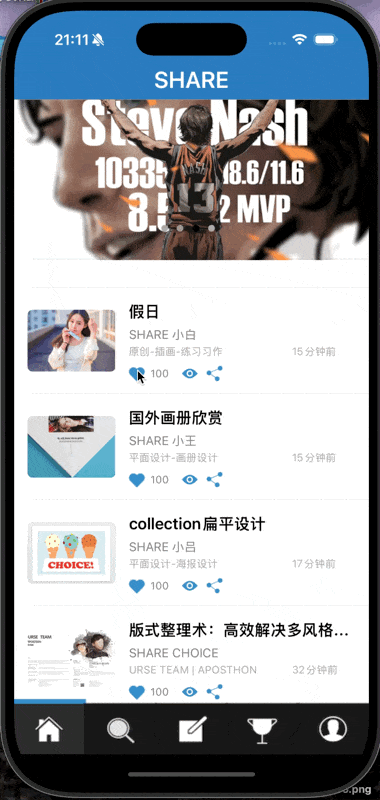

首先附上最终效果图




笔者写这篇文章主要是为了进行一个自我总结。今天在修改这方面bug中思路有些混乱，也借此机会重新总结复盘一下。 


## 一、简介


首先，我们介绍一下代理传值：


> “代理”本质上是一个 **协议（protocol）+ 指针属性 + 回调方法** 的组合，它允许 **一个控制器（如 A）把数据传回另一个控制器（如 B）**。


## 二、从假日页传值到首页


因为这个是我在实操中遇到bug的地方，因此先说这个。


#### 在 HolidayDetailViewController.h中声明协议


```objective-c
@protocol HolidayDetailViewControllerDelegate <NSObject>
- (void)holidayDetail:(HolidayDetailViewController *)detail didChangeLikeStatus:(BOOL)isLiked newLikeCount:(NSInteger)likeCount;
```


> 这段代码是定义一个“协议”，告诉别人：“只要你成为我的代理，我就会在用户点赞后通知你，并传给你点赞状态和数量。”


随后，我们定义了一个代理属性


```objective-c
@property (nonatomic, weak) id<HolidayDetailViewControllerDelegate> delegate;
```


下面这段代码将点赞的信息从textCell传到详情页再传到首页


```objective-c
- (void)textTableViewCell:(TextTableViewCell *)cell
       didChangeLikeStatus:(BOOL)isLiked
              newLikeCount:(NSInteger)likeCount
{
    self.isLiked = isLiked;
    self.holidayData[@"isLiked"] = @(isLiked);
    self.holidayData[@"likeCount"] = @(likeCount);
    if ([self.delegate respondsToSelector:@selector(holidayDetail:didChangeLikeStatus:newLikeCount:)]) {
        [self.delegate holidayDetail:self
                didChangeLikeStatus:isLiked
                       newLikeCount:likeCount];
    }
}
#### HomeVC遵守协议并设置自己为代理人


```objective-c
- (void)holidayDetail:(HolidayDetailViewController *)detail
  didChangeLikeStatus:(BOOL)isLiked
         newLikeCount:(NSInteger)likeCount
{
//取出第一行“假日”，然后进行修改，然后替换
    NSMutableDictionary *item = [self.dataArray[0] mutableCopy];
    item[@"isLiked"] = @(isLiked);
    item[@"likeCount"] = @(likeCount);
    [self.dataArray replaceObjectAtIndex:0 withObject:item];

//刷新第一行，
    NSIndexPath *indexPath = [NSIndexPath indexPathForRow:0 inSection:1];
    [self.tableView reloadRowsAtIndexPaths:@[indexPath] withRowAnimation:UITableViewRowAnimationFade];
}
```


## 三、 从首页传值到详情页


cell中：按钮点击后，触发这个函数，把点赞告诉控制器


```objective-c
- (void)likeButtonTapped:(UIButton *)sender {
    sender.selected = !sender.selected;
    NSInteger currentCount = [self.likeCountLabel.text integerValue];
    if (sender.selected) {
        currentCount++;
    } else {
        currentCount--;

    }
    self.likeCountLabel.text = [NSString stringWithFormat:@"%ld", (long)currentCount];
    if ([self.delegate respondsToSelector:@selector(textTableViewCell:didChangeLikeStatus:newLikeCount:)]) {
            [self.delegate textTableViewCell:self
                          didChangeLikeStatus:sender.selected
                                 newLikeCount:currentCount];
        }
}
```


在HomeVC中：


```objective-c
- (void)textTableViewCellDidTap:(TextTableViewCell *)cell {
    // --------用于获取点击单元格的索引----------
    NSIndexPath *indexPath = [self.tableView indexPathForCell:cell];

    if (indexPath.section == 1 && indexPath.row == 0) {
        NSMutableDictionary *holidayData = self.dataArray[0];
        HolidayDetailViewController *detailVC = [[HolidayDetailViewController alloc] init];
        detailVC.holidayData = [self.dataArray[0] mutableCopy];
        detailVC.delegate = self;
        detailVC.isLiked = [self.dataArray[0][@"isLiked"] boolValue];
        /*
         boolValue用于读取YES / NO
         在oc中，字典数组等职能存储对象（指针类型），不能储存基本数据类型，因此储存时候，将基本类型包装成NSNumber对象：
         BOOL isLiked = YES;
         NSNumber *numberObj = @(isLiked); // 或者 [NSNumber numberWithBool:isLiked]
         读取时，将NSNumber解包为基本类型：
         NSNumber *numberObj = data[@"isLiked"];
         BOOL isLiked = [numberObj boolValue];
        */
        [self.navigationController pushViewController:detailVC animated:YES];
    }
}
```


```objective-c
- (void)textTableViewCell:(textTableViewCell *)cell
   didChangeLikeStatus:(BOOL)isLiked
          newLikeCount:(NSInteger)likeCount
{
    NSIndexPath *indexPath = [self.tableView indexPathForCell:cell];
    if (indexPath.row >= self.dataArray.count) return;
    NSDictionary *originalItem = self.dataArray[indexPath.row];
    NSMutableDictionary *item = [originalItem mutableCopy];
    item[@"isLiked"] = @(isLiked);
    item[@"likeCount"] = @(likeCount);
    [self.dataArray replaceObjectAtIndex:indexPath.row withObject:item];
}
```

---

原文发布于 CSDN：[细说3Gshare 项目中的点赞双向传值](https://blog.csdn.net/2402_86720949/article/details/149515719)
