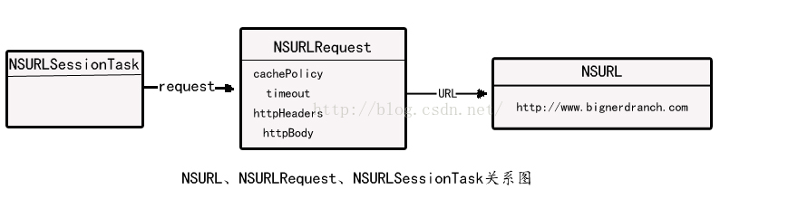
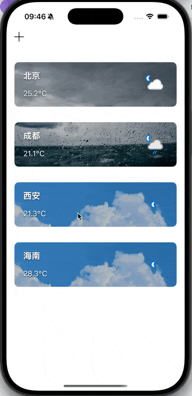
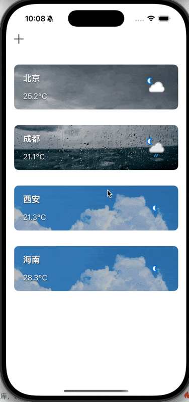

**目录**


[网络请求](#%E7%BD%91%E7%BB%9C%E8%AF%B7%E6%B1%82)


[为什么你的图片要异步加载？](#%E4%B8%BA%E4%BB%80%E4%B9%88%E4%BD%A0%E7%9A%84%E5%9B%BE%E7%89%87%E8%A6%81%E5%BC%82%E6%AD%A5%E5%8A%A0%E8%BD%BD%EF%BC%9F)


[​编辑](#)


[什么是“异步网络请求”](#%E4%BB%80%E4%B9%88%E6%98%AF%E2%80%9C%E5%BC%82%E6%AD%A5%E7%BD%91%E7%BB%9C%E8%AF%B7%E6%B1%82%E2%80%9D)


[GET 与 POST](#GET%20%E4%B8%8E%20POST)


[GET](#GET)


[POST](#POST)


## 网络请求


1，用NSString创建URL


2，创建NSURL对象：用URLSession对象进行网络请求


3，创建URLRequeset对其进行相关请求，分为GET和POST方法


4，根据会话创建任务


5，启动任务





在与web服务器进行通信的过程中，这些类各自扮演了重要的角色。


**NSURL**对象负责以URL的格式保存web应用的位置。对大多数web服务，URL将包含基地址（base address）、web应用名和需要传送的参数。


**NSURLRequest**对象负责保存需要传送给web服务器的全部数据，这些数据包括：一个**NSURL**对象、缓存方案（caching policy）、等待web服务器响应的最长时间和需要通过HTTP协议传送的额外信息（**NSMutableURLRequest** 是** NSURLRequest** 的可变子类）。


每一个**NSURLSessionTask**对象都表示一个**NSURLRequest** 的生命周期。**NSURLSessionTask**可以跟踪NSURLRequest的状态，还可以对NSURLRequest执行取消、暂停和继续操作。NSURLSessionTask有多种不同功能 的子类，包括**NSURLSessionDataTask**，**NSURLSessionUploadTask** 和** NSURLSessionUDownloadTask** 。


**NSURLSession**对象可以看作是一个生产**NSURLSessionTask**对象的工厂。可以设置其生产出的**NSURLSessionTask**对象的通用属性，例如请求头的内容、是否允许在蜂窝网络下发送请求等。NSURLSession对象还有一个功能强大的委托，可以跟踪NSURLSessionTask对象的状态、处理服务器的认证要求等。


```objective-c
-(void) fetchData {
    //1、创建URL
    NSString *key = @"2db0265c1d084416b9275428252207";
    NSString *urlString = [NSString stringWithFormat:@"https://api.weatherapi.com/v1/forecast.json?key=%@&q=%@&days=7&lang=zh&aqi=yes", key, self.cityName];
    urlString = [urlString stringByAddingPercentEncodingWithAllowedCharacters:[NSCharacterSet URLQueryAllowedCharacterSet]];
    //2、创建URL对象
    NSURL *url = [NSURL URLWithString:urlString];
    //3、创建URL Request，创建任务
    NSURLSessionDataTask *task = [[NSURLSession sharedSession] dataTaskWithURL:url completionHandler:^(NSData *data, NSURLResponse *response, NSError *error) {
        NSDictionary *weatherDic = [NSJSONSerialization JSONObjectWithData:data options:0 error:nil];
        self.weatherData = weatherDic;  //最终数据落脚在weatherData
        NSLog(@"%@",weatherDic);
        dispatch_async(dispatch_get_main_queue(), ^{
            /*
             分别显示基本天气
             每日天气
             每小时天气
             */
            [self setupWeatherData];
            [self setupDailyForecastData];
            [self setupHourlyForecastData];
        });
    }];
    //启动任务
    [task resume];
}
```





## 为什么你的图片要异步加载？


在仿写天气预报时，我们常常需要从网络加载天气图标，例如显示某个小时的天气状态图标。这看似简单的事情，如果处理不当，却很容易造成界面卡顿，甚至影响整个 App 的用户体验。


```
NSData *data = [NSData dataWithContentsOfURL:[NSURL URLWithString:urlString]];
self.weatherIcon.image = [UIImage imageWithData:data];
```


这段代码会直接在主线程中进行网络请求和图片解码：


- 如果网络慢，用户界面会卡住。如果在滑动列表（比如 TableView）中这么做，滚动会非常不流畅

在 iOS 中，**主线程负责所有界面渲染、用户交互**。一旦主线程被“堵住”，就会引发体验崩溃。


而且在使用同步加载时：编译器会提示如下：


##


因此，我们需要异步网络请求。


## 什么是“异步网络请求”


> 发起请求后不阻塞主线程（UI 线程），系统在线程池里做网络 I/O；等到有结果再通过回调/代理/await 把数据交回来。UI 始终流畅，你再把需要的 UI 更新切回主线程执行。


**1，URLSession + completion handler（块回调）**


最常用、简单。适合大多数 GET/POST、加载图片等。


**2，URLSession + delegate（代理）**


适合需要“边下边写文件/显示进度/断点续传”的下载或大文件上传。


**3，URLSession + background session**


App 退到后台仍能传输（系统托管），适合较大文件上传下载。


**异步加载 + 主线程更新 UI**


下面是一段优化后的代码：


```objective-c
- (void)loadWeatherIcon:(NSString *)urlString {
    NSURL *url = [NSURL URLWithString:urlString];
    NSURLSessionTask *task = [[NSURLSession sharedSession] dataTaskWithURL:url
        completionHandler:^(NSData *data, NSURLResponse *response, NSError *error) {
            if (data) {
                UIImage *image = [UIImage imageWithData:data];
                dispatch_async(dispatch_get_main_queue(), ^{
                    self.weatherIcon.image = image;
                });
            }
        }];
    [task resume];
}
```


这段代码我们使用的是第一种：URLSession + completion handler 的 dataTask 异步请求。


**解释：**


        dataTask : 适合获取内存数据（图片，JSON）


        回调方式： completion handler block -> 请求完成后系统会在后台线程池调用


        配置：sharedSession 


- dataTaskWithURL: 异步方法，不会阻塞主线程。默认就在系统分配的后台线程池中运行
- dispatch_async(dispatch_get_main_queue(), ^{ ... }) 是我们手动回到主线程更新 UI


使用异步请求后，会显著提升页面响应速度。


至于线程及其他本人暂时还未了解，以后再来填坑。





## GET 与 POST


#### GET


优点：3个全在一起（接口、链接、数据）可以在浏览器查看，书写简单。所有信息附加都在地址后面
 缺点：明文，保密性差，通过GET提交数据，用户名和密码将明文出现在URL上。文件操作不方便


```objective-c
NSString *urlString = @"https://api.weatherapi.com/v1/current.json?key=xxx&q=beijing";
NSURL *url = [NSURL URLWithString:urlString];
NSURLSessionDataTask *task = [[NSURLSession sharedSession] dataTaskWithURL:url
    completionHandler:^(NSData *data, NSURLResponse *response, NSError *error) {
        if (!error) {
            NSDictionary *json = [NSJSONSerialization JSONObjectWithData:data options:0 error:nil];
            NSLog(@"%@", json);
        }
    }];
[task resume];
#### POST


优点：密文，保密性好，文件类操作方便，后面不会出现?bjngh
 缺点：无法在浏览器里面查看，实现复杂
 POST把提交的数据则放置在是HTTP包的包体中，GET方式提交的数据最多只能是1024字节，理论上POST没有限制
  


因为post我还没详细了解，给出一段ai代码：


```objective-c
NSURL *url = [NSURL URLWithString:@"https://example.com/api/login"];
NSMutableURLRequest *request = [NSMutableURLRequest requestWithURL:url];
request.HTTPMethod = @"POST";

// 参数放在请求体
NSString *bodyString = @"username=wutong&password=123456";
request.HTTPBody = [bodyString dataUsingEncoding:NSUTF8StringEncoding];

// 设置请求头
[request setValue:@"application/x-www-form-urlencoded" forHTTPHeaderField:@"Content-Type"];

NSURLSessionDataTask *task = [[NSURLSession sharedSession] dataTaskWithRequest:request
    completionHandler:^(NSData *data, NSURLResponse *response, NSError *error) {
        if (!error) {
            NSDictionary *json = [NSJSONSerialization JSONObjectWithData:data options:0 error:nil];
            NSLog(@"%@", json);
        }
    }];
[task resume];
```


因为本人的这个天气预报类似于一个小demo，所以使用GET，较为简便

---

原文发布于 CSDN：[【iOS】网络请求与异步加载](https://blog.csdn.net/2402_86720949/article/details/149614611)
