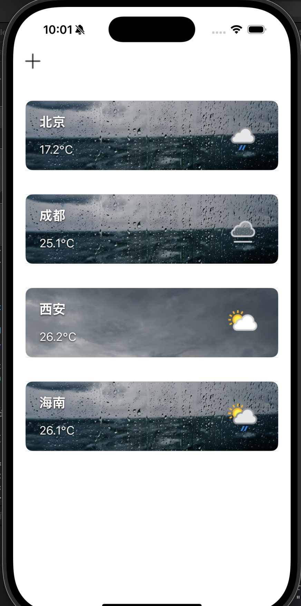
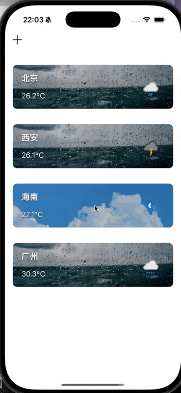
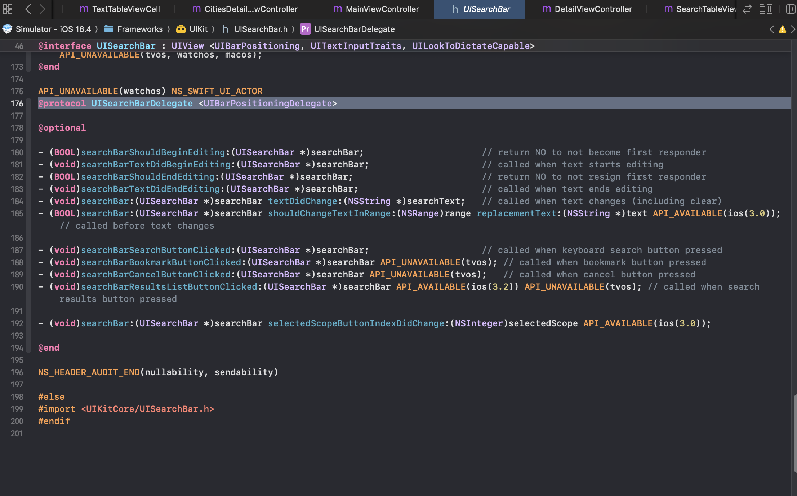
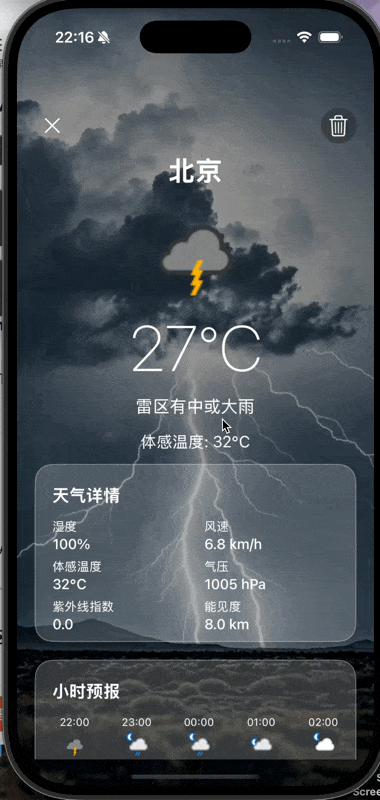
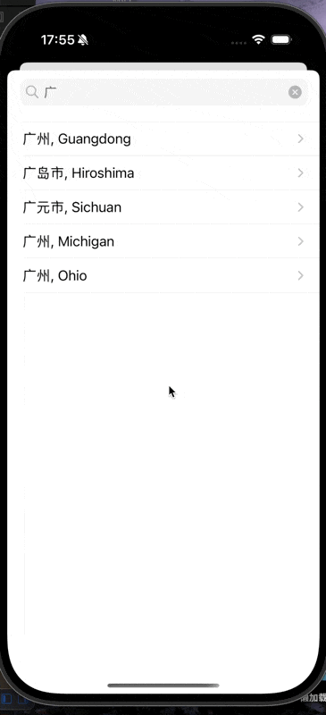
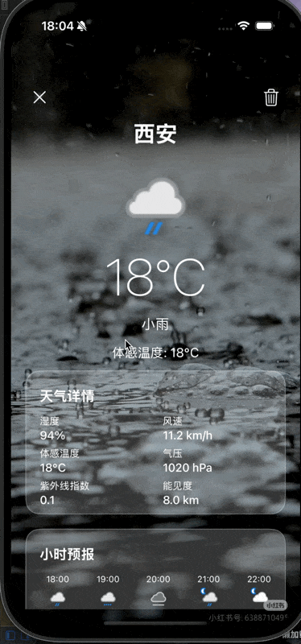
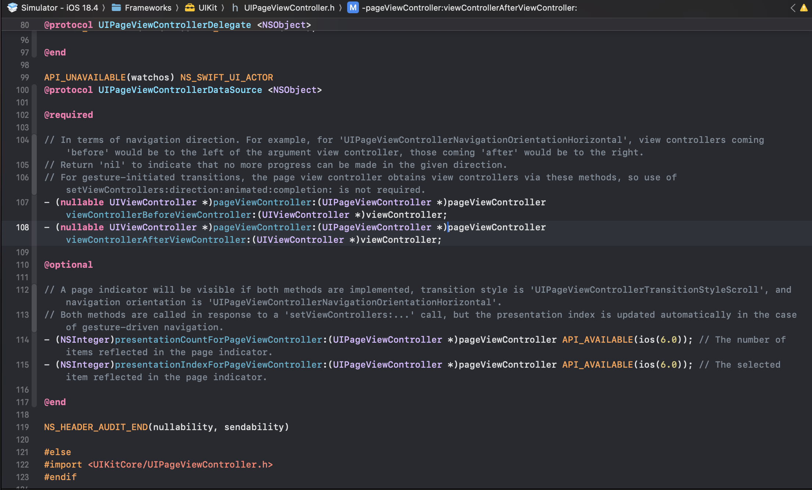
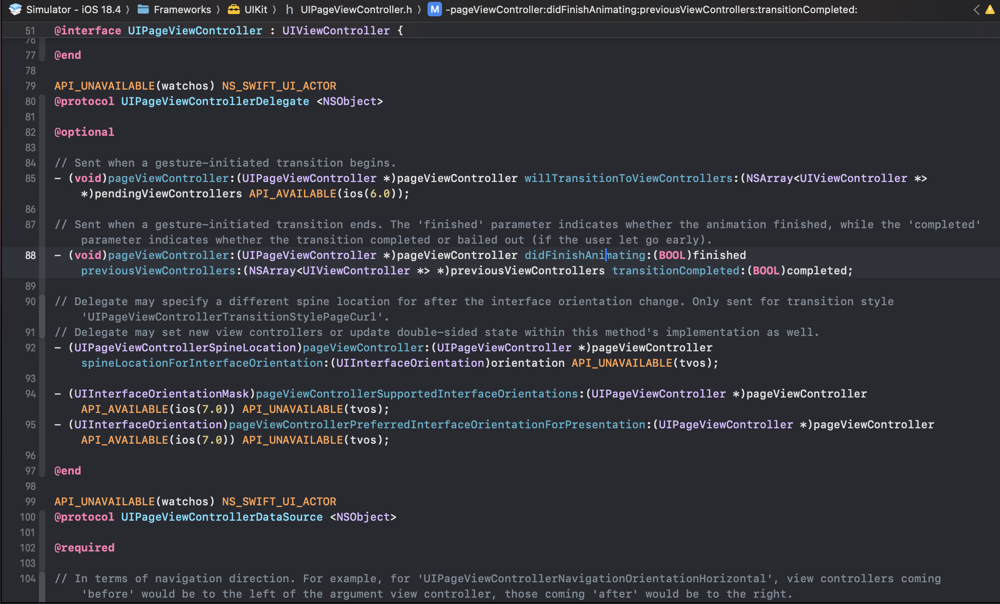

**目录**


[首页](#%E9%A6%96%E9%A1%B5)


[搜索页面](#%E6%90%9C%E7%B4%A2%E9%A1%B5%E9%9D%A2)


[城市详情页](#%E5%9F%8E%E5%B8%82%E8%AF%A6%E6%83%85%E9%A1%B5)


## 首页





```objective-c
[[NSNotificationCenter defaultCenter] addObserver:self
                                                 selector:@selector(handleAddCityNotification:)
                                                     name:@"AddNewCityNotification"
                                                   object:nil];
    [[NSNotificationCenter defaultCenter] addObserver:self
                                                    selector:@selector(handleDeleteCityNotification:)
                                                        name:@"DeleteCityNotification"
                                                      object:nil];
```


接收两个通知，一个是搜索页面的城市，另一个是详情页面的删除指令。


这个页面要执行两个操作： 点击加号添加城市，删除城市。





这个左滑删除功能需要两段代码


```objective-c
// 添加支持滑动删除
- (BOOL)tableView:(UITableView *)tableView canEditRowAtIndexPath:(NSIndexPath *)indexPath {
    return YES;
}

- (void)tableView:(UITableView *)tableView commitEditingStyle:(UITableViewCellEditingStyle)editingStyle
  forRowAtIndexPath:(NSIndexPath *)indexPath {
    if (editingStyle == UITableViewCellEditingStyleDelete) {
        /*
         要确保是可变数组，不然程序会报错
         */
        self.cityData = [self.cityData mutableCopy];
        self.dicArray = [self.dicArray mutableCopy];
        [self.cityData removeObjectAtIndex:indexPath.section];
        if (indexPath.section < self.dicArray.count) {
            [self.dicArray removeObjectAtIndex:indexPath.section];
        }
        [tableView deleteSections:[NSIndexSet indexSetWithIndex:indexPath.section]
                 withRowAnimation:UITableViewRowAnimationAutomatic];
    }
}
```


同时，我不同城市的天气对应着不同的背景图片：


我们在MainVC中向自定义cell传了一个conditionCode（NSInteger），这个数值的范围代表了该地现在的天气。然后在cell中设置背景。


```objective-c
- (UITableViewCell *)tableView:(UITableView *)tableView cellForRowAtIndexPath:(NSIndexPath *)indexPath {
    TextTableViewCell* cell = [tableView dequeueReusableCellWithIdentifier:@"main" forIndexPath:indexPath];
    if (indexPath.section < self.dicArray.count) {
        NSDictionary* weatherData = self.dicArray[indexPath.section];
        NSDictionary *current = weatherData[@"current"];
        NSDictionary *condition = current[@"condition"];
        NSString *iconURL = condition[@"icon"];
        NSString *cityName = self.cityData[indexPath.section][@"name"];
        NSString *temp = current[@"temp_c"];
        [cell configureWithCity:cityName
                          temp:[NSString stringWithFormat:@"%@℃", temp]
               weatherIconURL:iconURL
                 conditionCode:[condition[@"code"] integerValue]];
    }
    return cell;
}
```


```objective-c
//textTableViewCell.h

- (void)setBackgroundImageForWeatherCode:(NSInteger)code {
    NSString *imageName = @"photo1.jpg";
    if (code == 1000) {
        imageName = @"photo1.jpg";
    }//云
    else if (code >= 1003 && code <= 1009) {
        imageName = @"photo2.jpg";
    }//雨
    else if (code >= 1030 && code <= 1282) {
        imageName = @"photo3.jpg";
    }//雪
    else if (code >= 1066 && code <= 1237) {
        imageName = @"photo4.jpg";
    }//雷
    else if (code >= 1273 && code <= 1282) {
        imageName = @"photo5.jpg";
    }
    dispatch_async(dispatch_get_main_queue(), ^{
        self->_backgroundImageView.image = [UIImage imageNamed:imageName];
    });
}
```


网络请求部分我在另一篇博客中有介绍，在这里不多赘述：


[【iOS】网络请求与异步加载_ios imagewithdata 异步-CSDN博客](https://blog.csdn.net/2402_86720949/article/details/149614611?fromshare=blogdetail&sharetype=blogdetail&sharerId=149614611&sharerefer=PC&sharesource=2402_86720949&sharefrom=from_link)


## 搜索页面


我们首先要实现搜索结果随输入内容变化而变化：


我们在.h文件中遵守UISearchBarDelegate，下图为UISearchBarDelegate源码：




然后我们在AddVC中加入如下代码，每次检测到改变都重新刷新tableView


```objective-c
- (void)searchBar:(UISearchBar *)searchBar textDidChange:(NSString *)searchText {
    if (searchText.length == 0) {
        self.searchResults = @[];
        //self.searchResults = [[NSArray alloc] init];
        [self.tableView reloadData];
        return;
    }
    [self searchCitiesWithKeyword:searchText];
}
```


```objective-c
-(void) addCityToMain:(NSDictionary *)cityInfo {
    NSString *cityName = cityInfo[@"name"];
    NSDictionary *userInfo = @{@"cityName": cityName};
    [[NSNotificationCenter defaultCenter] postNotificationName:@"AddNewCityNotification" object:nil userInfo:userInfo];

    // 关闭添加页面
//    [self dismissViewControllerAnimated:YES completion:nil];
}
```


```objective-c
//选中哪个就传给主页
- (void)tableView:(UITableView *)tableView didSelectRowAtIndexPath:(NSIndexPath *)indexPath {
    [tableView deselectRowAtIndexPath:indexPath animated:YES];

    if (indexPath.row < self.searchResults.count) {
        NSDictionary *city = self.searchResults[indexPath.row];

        DetailViewController *detailVC = [[DetailViewController alloc] init];
        detailVC.cityName = city[@"name"];
        detailVC.canAddCity = YES;

        UINavigationController *nav = [[UINavigationController alloc] initWithRootViewController:detailVC];
        nav.modalPresentationStyle = UIModalPresentationFullScreen;
        [self presentViewController:nav animated:YES completion:nil];
    }
}
```


当我们点击其中一行时，我们会跳转到该城市。同时，我们在主页面添加了一个判重逻辑，避免城市重复添加。


```objective-c
for (NSDictionary *city in self.cityData) {
        if ([city[@"name"] isEqualToString:newCity]) {
            exists = YES;
            break;
        }
    }
    if (!exists) {
        [self.cityData addObject:@{@"name": newCity}];
        [self createUrl];
    }
```


## 城市详情页





我的城市详情页分为两种情况：


在搜索栏点击城市后显示的未被添加过的城市详情右上角是一个添加，而如果该城市是在主页点的，右上角是一个删除。





我们设置了一个BOOL属性:


```objective-c
if (self.canAddCity) {
        UIButton *addBtn = [UIButton buttonWithType:UIButtonTypeSystem];
        [addBtn setImage:[UIImage systemImageNamed:@"plus"] forState:UIControlStateNormal];
        addBtn.frame = CGRectMake(self.view.bounds.size.width - 60, 50, 40, 40);
        addBtn.autoresizingMask = UIViewAutoresizingFlexibleLeftMargin;
        [addBtn setTintColor:[UIColor whiteColor]];
        [addBtn addTarget:self action:@selector(addCity) forControlEvents:UIControlEventTouchUpInside];
        addBtn.backgroundColor = [UIColor colorWithWhite:0 alpha:0.25];
        addBtn.layer.cornerRadius = 20;
        addBtn.clipsToBounds = YES;
        [self.scrollView addSubview:addBtn];
    } else {
        UIButton *deleteBtn = [UIButton buttonWithType:UIButtonTypeSystem];
        [deleteBtn setImage:[UIImage systemImageNamed:@"trash"] forState:UIControlStateNormal];
        deleteBtn.frame = CGRectMake(self.view.bounds.size.width - 60, 50, 40, 40);
        deleteBtn.autoresizingMask = UIViewAutoresizingFlexibleLeftMargin;
        [deleteBtn setTintColor:[UIColor whiteColor]];
        [deleteBtn addTarget:self action:@selector(deleteCity) forControlEvents:UIControlEventTouchUpInside];
        deleteBtn.backgroundColor = [UIColor colorWithWhite:0 alpha:0.25];
        deleteBtn.layer.cornerRadius = 20;
        deleteBtn.clipsToBounds = YES;
        [self.scrollView addSubview:deleteBtn];
    }
```


同时，我实现了一个城市之间的横向滑动切换。





据我了解，这个有两种实现方式：用scrollView或PageViewcontroller。因为本人还未使用过后者，因此尝试一下。


首先，我们要实现UIPageViewControllerDelegate, UIPageViewControllerDataSource。


下图分别为DataSource和Delegate的definition。








其次，UIPageViewController默认的是使用 UIPageViewControllerTransitionStylePageCurl ，是一种仿真的翻书效果，在天气预报中，我们要把它改成StryleScroll


```objective-c
-(id) init  {
    self = [super initWithTransitionStyle:UIPageViewControllerTransitionStyleScroll
                        navigationOrientation:UIPageViewControllerNavigationOrientationHorizontal
                                      options:nil];
    return self;
}
```


同时，我们必须实现：UIPageViewControllerDataSource 和 UIPageViewControllerDelegate。前者用于告诉程序他的上一页和下一页是谁，后者是范爷完成的回调。


```objective-c
/*
 分别获取前一个和后一个VC
 */
- (UIViewController *)pageViewController:(UIPageViewController *)pageViewController viewControllerBeforeViewController:(UIViewController *)viewController {
    NSInteger index = [(DetailViewController *)viewController index];
    //不是第一个就去上一个
    if (index > 0) {
        return [self detailViewControllerForIndex:index - 1];
    }
    return nil;
}

- (UIViewController *)pageViewController:(UIPageViewController *)pageViewController viewControllerAfterViewController:(UIViewController *)viewController {
    NSInteger index = [(DetailViewController *)viewController index];
    if (index < self.cities.count - 1) {
        return [self detailViewControllerForIndex:index + 1];
    }
    return nil;
}
```

---

原文发布于 CSDN：[【iOS】天气预报仿写总结](https://blog.csdn.net/2402_86720949/article/details/149641988)
