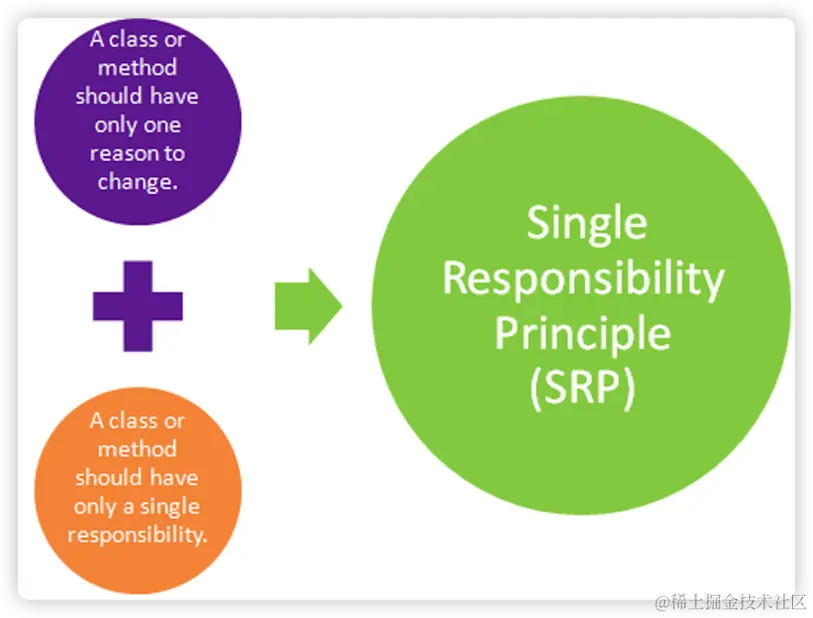
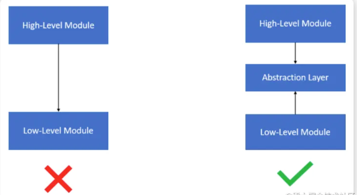
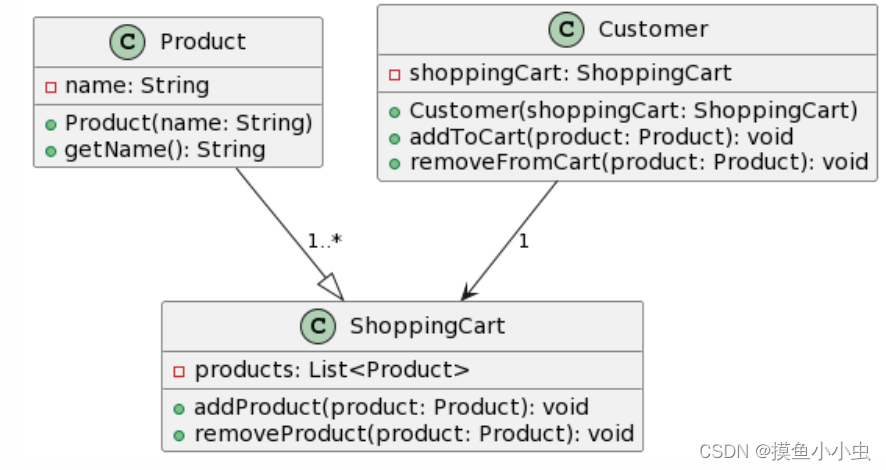

## 开闭原则


开放封闭原则的意思是： 对拓展开放，对修改关闭。


程序中的模块、类、方法应该允许在 **不修改原来代码** 的前提下进行功能拓展。


假设一个支付系统，最开始只有微信支付，如果后面还要支持银联或者支付宝支付：


```objective-c
@interface Payment : NSObject
- (void)pay;
@end
@implementation Payment
- (void)pay {}
@end


@interface WeChatPayment : Payment
@end
@implementation WeChatPayment
- (void)pay {
    NSLog(@"使用微信支付");
}
@end

@interface AlipayPayment : Payment
@end
@implementation AlipayPayment
- (void)pay {
    NSLog(@"使用支付宝支付");
}
@end
```


```objective-c
Payment *payment = [[WeChatPayment alloc] init];
[payment pay];

payment = [[AlipayPayment alloc] init];
[payment pay];
```


新增支付时候，只需写一个新类基层Payment而不需要修改原有代码。


1.    UITableView

    •    UITableView 本身是封闭的，但我们可以通过实现 UITableViewDataSource 和 UITableViewDelegate 协议来扩展它的功能。

    •    这就是 OCP：Apple 不让你改 UITableView 源码，但提供扩展点给你。


 2.    分类 (Category)

    •    OC 的 Category 就是典型的 “对扩展开放” 的手段，可以在不修改原类源码的情况下加方法。


## 单一职能原则





一个类应该仅有一个引起他变化的原因。


这样可以提高可维护性，可拓展性，降低耦合度


iOS的学习中，MVC架构其实就是单一职责的体现。（M管理数据，V管理页面， C管理交互）


## 李氏替换原则


子类对象能够拓展父类的功能但不能改变父类原有的功能。它包含两层含义：


1. 子类可以实现父类的抽象方法，饭不能覆盖父类的非抽象方法


2. 子类中可以增加自己的特有方法


> - 里氏替换原则是实现开放封闭原则的重要方式之一。 - 它克服了继承中重写父类造成的可复用性变差的缺点。 - 它是动作正确性的保证。即类的扩展不会给已有的系统引入新的错误，降低了代码出错的可能性


```objective-c
#import <Foundation/Foundation.h>

NS_ASSUME_NONNULL_BEGIN

@protocol Shape <NSObject>
- (NSInteger)calculateArea; //定义一个协议方法，也就是一个公共的接口
@end

NS_ASSUME_NONNULL_END

#import <Foundation/Foundation.h>
#import "Shape.h"
NS_ASSUME_NONNULL_BEGIN

@interface Squre : NSObject<Shape> //实现一个正方形类来实现对应的接口的内容
@property (nonatomic, assign) NSInteger length;
@end

NS_ASSUME_NONNULL_END

#import "Squre.h"

@implementation Squre
- (NSInteger)calculateArea {
    return self.length * self.length;
}
@end

#import "Shape.h"
#import <Foundation/Foundation.h>
NS_ASSUME_NONNULL_BEGIN

@interface Rectangle : NSObject<Shape> //实现长方形类来实现对应接口的内容
@property (nonatomic, assign) NSInteger width;
@property (nonatomic, assign) NSInteger height;
@end

NS_ASSUME_NONNULL_END

#import "Rectangle.h"

@implementation Rectangle
- (NSInteger)calculateArea {
    return self.width * self.height;
}
@end
```


## 依赖倒置原则





高层模块不应该依赖底层模块，两者都应该依赖抽象。在oc中，抽象通常就是协议。


> 高层模块：业务逻辑，比如 ViewController。 低层模块：具体实现，比如网络请求类、数据库类。 抽象：协议（protocol）或者基类。


通俗的来说，不要让控制器依赖一个具体的类，而是依赖一个抽象接口。这样底层可以随时替换而不影响高层代码。


模块间通过抽象发生；实现类之间没有依赖关系，所有的依赖关系通过接口/抽象类产生。


```objective-c
我们先定义一个抽象协议：

@protocol NetworkService <NSObject>
- (void)fetchData;
@end

然后让具体类去实现：

@interface NetworkManager : NSObject <NetworkService>
@end

@implementation NetworkManager
- (void)fetchData {
    NSLog(@"使用默认方式请求数据");
}
@end

控制器依赖的是协议而非具体类：

@interface MyViewController : UIViewController
@property (nonatomic, strong) id<NetworkService> networkManager;
@end

调用时可以随便替换实现：

self.networkManager = [[NetworkManager alloc] init];
[self.networkManager fetchData];

如果以后写一个MockNetworkManager来做单元测试，只要遵守NetWorkService协议，就能无缝切换
```


## 接口隔离原则


类之间的依赖关系应该建立在最小的接口上


```objective-c
假设我们有一个多功能打印机协议

@protocol MultiFunctionPrinter <NSObject>
- (void)print;
- (void)scan;
- (void)fax;
@end

但是我现在有一个低级的打印机，只能实现打印，但却被迫实现scan和fax， 这就违反了接口隔离原则。

而正确做法，应该是我们把大接口分成多个小接口，这样 多功能打印机实现所有协议，低级打印机实现prit协议，扫描仪实现scanner协议。

@protocol Printer <NSObject>
- (void)print;
@end

@protocol Scanner <NSObject>
- (void)scan;
@end

@protocol Fax <NSObject>
- (void)fax;
@end
```


> 在 iOS/OC 开发中的应用 **1. UITableView** • Apple 把 UITableView 的功能拆成了两个协议： • UITableViewDataSource → 专管数据 • UITableViewDelegate → 专管行为、UI • 而不是写成一个超级大协议。 ** 2. 可选协议方法** • 在 OC 里，有时协议方法是 @optional，这也是一种接口隔离的体现：只实现你需要的部分。


## 迪米特法则





一个对象应该尽可能少的了解其他对象的细节 （只和直接朋友交流，不和朋友的朋友交流）


假如一个用户user，它里面有account，account里又有bank。


```objective-c
[user.account.bank deposit:100];
```


user不仅知道了account，还知道了bank。 一旦bank的结构改了，外部代码全部受影响。


```objective-c
@interface User : NSObject
@property (nonatomic, strong) Account *account;
- (void)deposit:(CGFloat)amount;
@end

@implementation User
- (void)deposit:(CGFloat)amount {
    [self.account deposit:amount];
}
@end
```


而正确做法是我们在user里面封装一个方法，


外部调用只需 [user deposit : 100];


> 在 iOS/OC 开发中的应用 1. 自定义控件 • 比如你的聊天程序里 chatViewController 的输入框 _textField 和发送按钮 _sendButton。 • 如果外部需要设置占位符，不应该直接 chatVC.textField.placeholder = @"..."， • 更好的做法是：在 chatViewController 提供一个方法 - (void)setInputPlaceholder:(NSString *)text;。 • 外部只调用这个方法，不关心内部是否用 UITextField 还是 UISearchBar。 2. 控制器之间的通信 • 不要直接访问另一个控制器的子控件，而是通过 属性、方法、代理 来沟通。

---

原文发布于 CSDN：[【iOS】设计模式的六大原则](https://blog.csdn.net/2402_86720949/article/details/150927742)
