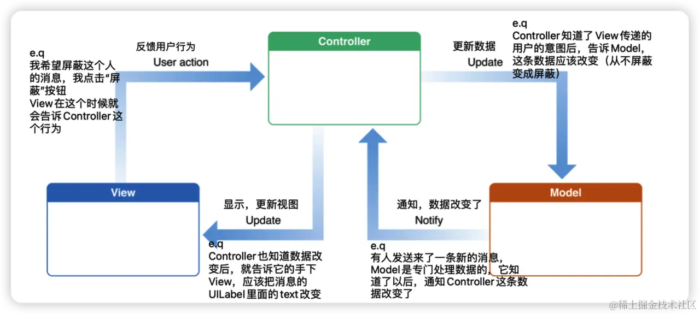
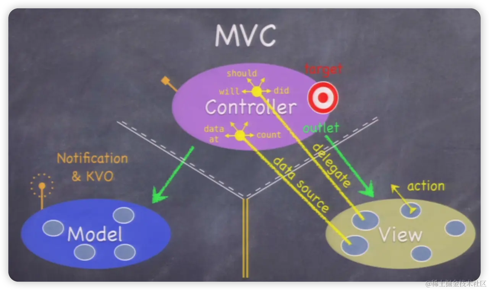

**目录**

[1 前言](#1%20%E5%89%8D%E8%A8%80)

[2 MVC简单介绍](#2%20MVC%E7%AE%80%E5%8D%95%E4%BB%8B%E7%BB%8D)

[胖Model 和瘦Model](#%E8%83%96Model%20%E5%92%8C%E7%98%A6Model)

[3 MVC的问题](#3%20MVC%E7%9A%84%E9%97%AE%E9%A2%98%C2%A0)

[1. 视图控制器过于臃肿](#1.%20%E8%A7%86%E5%9B%BE%E6%8E%A7%E5%88%B6%E5%99%A8%E8%BF%87%E4%BA%8E%E8%87%83%E8%82%BF)

[2. view和controller的边界很模糊](#2.%20view%E5%92%8Ccontroller%E7%9A%84%E8%BE%B9%E7%95%8C%E5%BE%88%E6%A8%A1%E7%B3%8A)

[为了解决这些缺点，衍生出了许多改进的架构模式：](#%E4%B8%BA%E4%BA%86%E8%A7%A3%E5%86%B3%E8%BF%99%E4%BA%9B%E7%BC%BA%E7%82%B9%EF%BC%8C%E8%A1%8D%E7%94%9F%E5%87%BA%E4%BA%86%E8%AE%B8%E5%A4%9A%E6%94%B9%E8%BF%9B%E7%9A%84%E6%9E%B6%E6%9E%84%E6%A8%A1%E5%BC%8F%EF%BC%9A)

"MVC"，即Model（模型），View（视图），Controller（控制器）。

如何设计一个程序的结构，这是一门专门的学问，叫做"**架构模式**"（architectural pattern），属于编程的方法论。**MVC 模式就是架构模式的一种**。

## 一、 前言

首先，作为一名合格的程序猿，我们在写代码的时候都应该追求**美**。比如在敲每一行代码的时候，都应该注重**代码规范**，写出一份看得舒服，让别人也看得懂的代码，这样也能提高效率；比如在设计代码的时候，应该追求的是我怎样才能写出一个好的**架构**（App 架构类似于现代建筑的脚手架或者是地基，一旦确定，剩下的工作就是在现成的App里添砖加瓦），让我的代码**模块化，分工明确，从而提高我的工作效率**。

         总结一下什么是好的架构：**高内聚，低耦合。 代码均摊，易于扩展，具有易用性。**

可以说，**代码规范，架构模式**，**设计模式**是检验一个程序猿水平的重要参考。

但是，我们创建一个控件，设置这个控件的样子，设置这个控件的交互方法，展示这个控件，都需要一定的代码量，控件少的时候还好，看得过去，但是控件一多，像下面这个App 的界面，各种控件就多起来了，这个时候如果还把他们都堆在一个ViewController 里面就不合适了，要改bug，要添加控件就会变得非常麻烦。

**而MVC架构，就是用来解决这些问题的。**

## 二、 MVC简单介绍

> MVC模式的基本思想：将应用程序分成三个部分，使它们各自负责不同的功能。MVC 是一种软件架构模式，它的目的是将应用程序的数据、用户界面和控制逻辑分离开来，以便各个部分可以独立地演变和修改。

- **M：Model（模型）负责处理数据，以及处理部分的业务逻辑**

通俗来说，**就是你的程序是什么**，就是你的程序将要实现的功能，或者是它所能干的事情。也就是微信消息列表里的人名字，信息内容，头像，是否屏蔽该人的消息等等数据，可以认为，Model 里面装满了这个程序的各种数据，它负责处理数据、以及处理部分的业务逻辑。

- **V：View（视图）负责数据的展示和事件捕捉**

通俗来说，**在屏幕上你所看到的**，这里有一个UITableView，TableView 里面有UILabel，UIImageView，你在屏幕上看到的组件，都可以归类为View。

- **C：Controller / ViewController / VC（控制器）负责协调Model 和 View，处理大部分逻辑**

它将数据从Model 层传送到View 层并展示出来，同时将View 层的交互传到Model 层以改变数据。**大部分的逻辑操作（点击Button就是一种逻辑）都应该交由VC完成。（有少部分的逻辑处理交由Model 完成，这是下文中我要提到的胖Model 和瘦Model）**

通俗来说，**就是如何使你的模型呈现给用户**，比如让View 上呈现Model 的数据，就是Controller 的工作。所以你可以把Controller 看成是连接Model 和View 的桥梁。

用户点击 View–> 视图响应事件 -->通过代理传递事件到Controller–>发起[网络请求](https://so.csdn.net/so/search?q=%E7%BD%91%E7%BB%9C%E8%AF%B7%E6%B1%82&spm=1001.2101.3001.7020)更新Model—>Model处理完数据–>代理或通知给Controller–>改变视图样式–>完成

###

### 胖Model 和瘦Model

我们刚刚说了Model有时候不但是数据源，有时候也会处理部分的业务逻辑。这种情况就是当Model 里面有很多原始数据，但View希望展示的数据是经过加工的数据，那么这个加工的过程到底应该放在VC里面还是Model里面呢，来举个栗子说明：

> View想展示今天的日期，Model拿到的原始数据是20221124，但是View希望展示的数据是2022年11月24日。

所以不难想象，`20221124`这串数字需要经过一定的加工，才会变成我们想要的`2022年11月24日`。

但是这个加工过程应该放在哪里呢？是VC还是Model里面？

开发者们也思考过这个问题，因此产生了**胖Model** **（Fat Model）** 和**瘦Model** **（Thin Model）**

- **胖Model对应的是瘦的VC（Skinny Controller），在Model 中** **对数据进行处理** **，让Controller可以直接使用经过处理后的数据。**
- **瘦Model对应的是胖的VC（Fat Controller），Model中的数据** **不进行任何处理或修改** **，原封不动的把服务器返回内容发送给Controller。**

还是用刚刚的栗子说明，**胖Model**对应的是把这个加工过程放在Model里面（所以Model胖了），相反，瘦Model就是把加工过程放在VC里面。

## 三、 MVC的问题

### 1. 视图控制器过于臃肿

在实际开发中，VC常常承担过多职责倒置代码量巨大，可读性差

### 2. view和controller的边界很模糊

这种模糊的边界使得开发者很容易弄混代码应该放置的位置，最终导致了第一条的代码臃肿问题

解决方法：

> #### 为了解决这些缺点，衍生出了许多改进的架构模式： - ​**MVVM (Model-View-ViewModel)​**​ ​**核心思想**​： 引入一个 `ViewModel` 层，专门负责从 `Model` 获取数据并进行处理，转换成 `View` 可以直接显示的数据。它通过数据绑定（Data Binding）机制（如 KVO、Notification、RAC 或 Combine）通知 `View` 更新。 - ​**优点**​： 极大地减轻了 `ViewController` 的负担，使其只负责视图绑定和简单的逻辑转发。`ViewModel` 不依赖 `UIKit`，易于测试。 - ​**MVP (Model-View-Presenter)​**​ ​**核心思想**​： `Controller`/`View` 的角色被弱化，由一个 `Presenter` 来承担绝大部分业务逻辑。`View` 通过协议（Protocol）与 `Presenter` 通信，实现了更好的解耦。 - ​**优点**​： 视图和逻辑完全分离，可测试性极强。 - ​**VIPER (View-Interactor-Presenter-Entity-Router)​**​ ​**核心思想**​： 将职责划分得更加细致，每个字母代表一个明确的职责模块。它更适用于超大型项目，追求极致的可测试性和模块化。 - ​**缺点**​： 引入的模板代码较多，学习曲线较陡峭，对于中小型项目可能显得“杀鸡用牛刀”。

在接下来的项目如计算器中，我会开始尝试使用MVC架构。

[你真的了解MVC吗？ - 简书](https://www.jianshu.com/p/edd8d8a49d06?utm_campaign=maleskine&utm_content=note&utm_medium=seo_notes)

[https://juejin.cn/post/7098623916452610078?searchId=20250831221503BC226F5D134DA78BCF89](https://juejin.cn/post/7098623916452610078?searchId=20250831221503BC226F5D134DA78BCF89)

---

原文发布于 CSDN：[【iOS】MVC架构](https://blog.csdn.net/2402_86720949/article/details/151052260)
