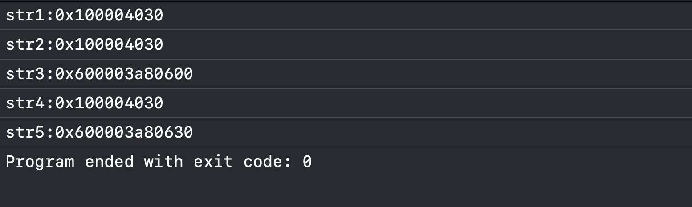
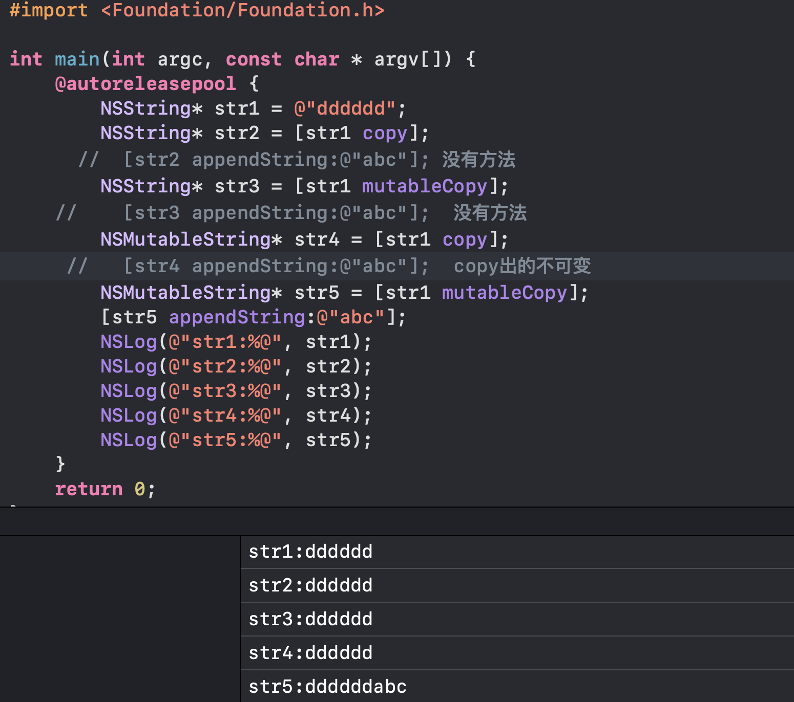

**目录**


[对象复制](#%E5%AF%B9%E8%B1%A1%E5%A4%8D%E5%88%B6)


[一、copy与mutableCopy方法](#%E4%B8%80%E3%80%81copy%E4%B8%8EmutableCopy%E6%96%B9%E6%B3%95)


[二、NSCopying和NSmutableCopying协议](#%E4%BA%8C%E3%80%81NSCopying%E5%92%8CNSmutableCopying%E5%8D%8F%E8%AE%AE)


[三、深复制与浅复制](#%E4%B8%89%E3%80%81%E6%B7%B1%E5%A4%8D%E5%88%B6%E4%B8%8E%E6%B5%85%E5%A4%8D%E5%88%B6)


[按照类型说明：](#%E6%8C%89%E7%85%A7%E7%B1%BB%E5%9E%8B%E8%AF%B4%E6%98%8E%EF%BC%9A)


[非容器类对象的深拷贝与浅拷贝](#%E9%9D%9E%E5%AE%B9%E5%99%A8%E7%B1%BB%E5%AF%B9%E8%B1%A1%E7%9A%84%E6%B7%B1%E6%8B%B7%E8%B4%9D%E4%B8%8E%E6%B5%85%E6%8B%B7%E8%B4%9D)


[不可变字符串](#%E4%B8%8D%E5%8F%AF%E5%8F%98%E5%AD%97%E7%AC%A6%E4%B8%B2)


[可变类型字符串](#%E5%8F%AF%E5%8F%98%E7%B1%BB%E5%9E%8B%E5%AD%97%E7%AC%A6%E4%B8%B2%C2%A0)


[容器类对象的深浅拷贝](#%E5%AE%B9%E5%99%A8%E7%B1%BB%E5%AF%B9%E8%B1%A1%E7%9A%84%E6%B7%B1%E6%B5%85%E6%8B%B7%E8%B4%9D)


[自定义类型的拷贝](#%C2%A0%E8%87%AA%E5%AE%9A%E4%B9%89%E7%B1%BB%E5%9E%8B%E7%9A%84%E6%8B%B7%E8%B4%9D)


[容器类对象的深拷贝](#%E5%AE%B9%E5%99%A8%E7%B1%BB%E5%AF%B9%E8%B1%A1%E7%9A%84%E6%B7%B1%E6%8B%B7%E8%B4%9D)


[归档与解档代码实现](#%E5%BD%92%E6%A1%A3%E4%B8%8E%E8%A7%A3%E6%A1%A3%E4%BB%A3%E7%A0%81%E5%AE%9E%E7%8E%B0)


[属性关键字](#%E5%B1%9E%E6%80%A7%E5%85%B3%E9%94%AE%E5%AD%97)


[1 原子性](#1%C2%A0%E5%8E%9F%E5%AD%90%E6%80%A7)


[2 读写权限](#2%20%E8%AF%BB%E5%86%99%E6%9D%83%E9%99%90)


[3. 内存管理](#3.%20%E5%86%85%E5%AD%98%E7%AE%A1%E7%90%86)


[assign](#assign)


[weak](#weak)


[unsafe_unretained](#unsafe_unretained)


[retain](#retain)


[strong](#strong)


[copy](#copy)


[4. 修饰变量关键字](#4.%20%E4%BF%AE%E9%A5%B0%E5%8F%98%E9%87%8F%E5%85%B3%E9%94%AE%E5%AD%97)


[常量（const）和宏定义（define）的区别:](#%E5%B8%B8%E9%87%8F%EF%BC%88const%EF%BC%89%E5%92%8C%E5%AE%8F%E5%AE%9A%E4%B9%89%EF%BC%88define%EF%BC%89%E7%9A%84%E5%8C%BA%E5%88%AB%3A)


[Q&A：](#Q%26A%EF%BC%9A)


[copy和strong的区别：（深拷贝 浅拷贝）](#copy%E5%92%8Cstrong%E7%9A%84%E5%8C%BA%E5%88%AB%EF%BC%9A%EF%BC%88%E6%B7%B1%E6%8B%B7%E8%B4%9D%20%E6%B5%85%E6%8B%B7%E8%B4%9D%EF%BC%89)


[Q：以下代码会出现什么问题？](#Q%EF%BC%9A%E4%BB%A5%E4%B8%8B%E4%BB%A3%E7%A0%81%E4%BC%9A%E5%87%BA%E7%8E%B0%E4%BB%80%E4%B9%88%E9%97%AE%E9%A2%98%EF%BC%9F)


[Q：assign 和 weak 关键字的区别有哪些？](#Q%EF%BC%9Aassign%20%E5%92%8C%20weak%20%E5%85%B3%E9%94%AE%E5%AD%97%E7%9A%84%E5%8C%BA%E5%88%AB%E6%9C%89%E5%93%AA%E4%BA%9B%EF%BC%9F)


[Q：atomic 修饰的属性是怎么样保存线程安全的？](#Q%EF%BC%9Aatomic%20%E4%BF%AE%E9%A5%B0%E7%9A%84%E5%B1%9E%E6%80%A7%E6%98%AF%E6%80%8E%E4%B9%88%E6%A0%B7%E4%BF%9D%E5%AD%98%E7%BA%BF%E7%A8%8B%E5%AE%89%E5%85%A8%E7%9A%84%EF%BC%9F)


[Q：weak和assign的区别？](#Q%EF%BC%9Aweak%E5%92%8Cassign%E7%9A%84%E5%8C%BA%E5%88%AB%EF%BC%9F)


## 对象复制


### 一、copy与mutableCopy方法


copy方法用于复制对象的副本，复制下来的该副本是不可修改的，哪怕是调用NSMutableString的copy方法也不可修改。


而mutableCopy方法复制下来的副本是可修改的，即使被复制的对象原本是不可修改的。例如调用mutableCopy方法复制NSString的，返回的是一个NSMutableString对象。


 以下用代码演示copy和mutableCopy方法的功能：


```objective-c
#import <Foundation/Foundation.h>

int main(int argc, const char * argv[]) {
    @autoreleasepool {
        //copy与mutableCopy
        NSMutableString *book = [NSMutableString stringWithString: @"疯狂iOS讲义"];

        NSMutableString *bookCopy = [book mutableCopy]

        [bookCopy replaceCharactersInRange: NSMakeRange(2, 3) withString: @"Android"];//复制后的bookCopy副本是可以修改的，这里做个修改，对原字符串的值也没有影响

        NSLog(@"book的值为：%@",book);//原值

        NSLog(@"bookCopy的值为：%@",bookCopy);//副本修改后的值

        NSString *str = @"fkit";//定义一个str字符串
        NSMutableString *strCopy = [str mutableCopy];//用mutableCopy给str复制一个副本

        [strCopy appendString:@".org"];//向可变字符串后面追加字符串
        NSLog(@"%@",strCopy);

        NSMutableString *bookCopy2 = [book copy];//用copy方法复制一个book的副本（这个副本不可变）
        [bookCopy2 appendString:@"aa"];//这里会报错，因为copy创建的副本不可变，修改了就崩了

    }
    return 0;
}
### 二、NSCopying和NSmutableCopying协议


当我们想将自定义类用上一节的两个方法复制副本时，我们可能会直接创建完对象后用”类名* 对象2 = [对象1 copy]；“这样的格式来复制副本，但实际上直接这样复制是不对的，会报错说找不到copyWithZone：方法，mutableCopy也是一样。因此我们可以看出，自定义类是不能直接调用这两个方法来复制自身的。


        这是为什么呢？是因为当程序调用copy/mutableCopy方法复制时，程序底层需要调用copyWithZone：/mutableCopyWithZone：方法来完成复制的工作，并返回这两个方法的值。因此为了保证可以复制，需要在自定义类的接口部分声明NSCopying/NSMutableCopying协议，然后再类的实现部分增加copyWithZone：/mutableCopyWithZone：方法，因此，对自定义对象的复制应该如下所示：


接下来，我们以一个自定义的Person类为例，支持copy和mutablecopy：


```objective-c
#import <Foundation/Foundation.h>

@interface Person : NSObject <NSCopying, NSMutableCopying>
@property (nonatomic, copy) NSString *name;
@property (nonatomic, assign) NSInteger age;
@end

@implementation Person

// 实现 copy（返回不可变副本）
- (id)copyWithZone:(NSZone *)zone {
    Person *copy = [[[self class] allocWithZone:zone] init];
    copy.name = [self.name copy];
    copy.age = self.age;
    return copy;
}

// 实现 mutableCopy（返回可变副本）
- (id)mutableCopyWithZone:(NSZone *)zone {
    Person *copy = [[[self class] allocWithZone:zone] init];
    copy.name = [self.name mutableCopy];  // 注意生成可变副本
    copy.age = self.age;
    return copy;
}

@end
```


```objective-c
int main(int argc, const char * argv[]) {
    @autoreleasepool {
        Person *p1 = [[Person alloc] init];
        p1.name = @"Tom";
        p1.age = 18;

        Person *p2 = [p1 copy];         // 调用 copyWithZone
        Person *p3 = [p1 mutableCopy];  // 调用 mutableCopyWithZone

        NSLog(@"原始：%@ %ld", p1.name, p1.age);
        NSLog(@"copy：%@ %ld", p2.name, p2.age);
        NSLog(@"mutableCopy：%@ %ld", p3.name, p3.age);
    }
    return 0;
}
### 三、深复制与浅复制


深复制和浅复制是面向对象编程中非常重要的概念。


浅复制：仅复制对象的指针地址，多个变量共享同一个对象。


深复制： 不仅复制指针，还会复制整个对象内容，使得原对象和副本完全独立。


举个例子：


```objective-c
NSMutableString *str1 = [NSMutableString stringWithString:@"Hello"];
NSMutableString *str2 = str1;            // 浅复制（赋值）
// 修改 str1，str2 也变了
[str1 appendString:@" World"];
```


因此总而言之，浅拷贝就是创建一个副本，对内存地址的复制。深拷贝就是创建一个副本，对内容完全复制。原始对象与副本对象内存地址不同。


### 按照类型说明：


#### 非容器类对象的深拷贝与浅拷贝


##### 不可变字符串


```objective-c
int main(int argc, const char * argv[]) {
    @autoreleasepool {
        NSString* str1 = @"dddddd";
        NSString* str2 = [str1 copy];
        NSString* str3 = [str1 mutableCopy];
        NSMutableString* str4 = [str1 copy];
        NSMutableString* str5 = [str1 mutableCopy];
        NSLog(@"str1:%p", str1);
        NSLog(@"str2:%p", str2);
        NSLog(@"str3:%p", str3);
        NSLog(@"str4:%p", str4);
        NSLog(@"str5:%p", str5);
    }
    return 0;
}
```





得出结论： 不可变字符串，只要是copy就是浅拷贝，mutableCopy是深拷贝。tips：我们用NSString stringWithstring 方式创建的是一个常量区字符串。




---

原文发布于 CSDN：[【iOS】对象复制与属性关键字](https://blog.csdn.net/2402_86720949/article/details/151194120)
