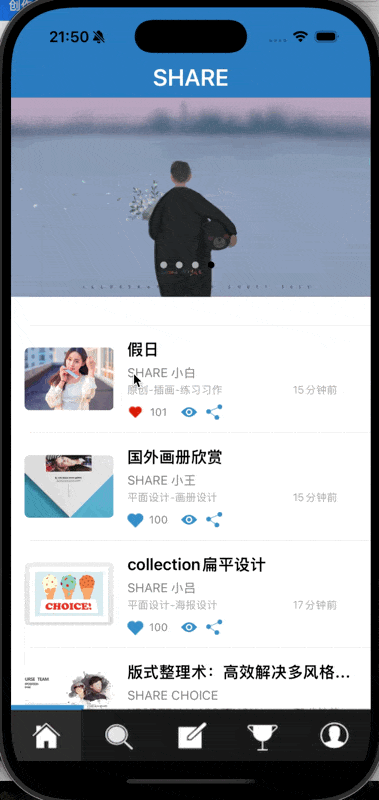
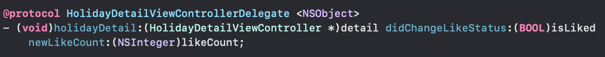
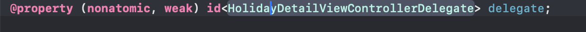
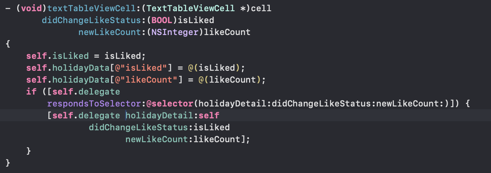
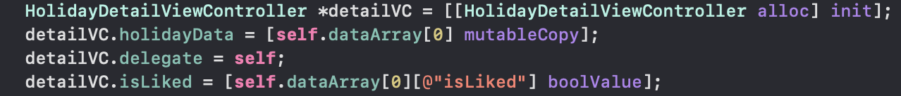
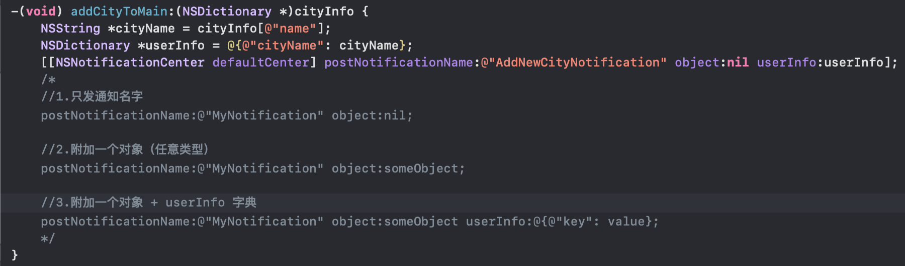
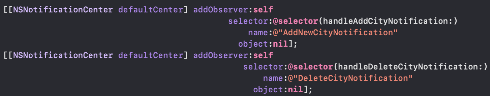
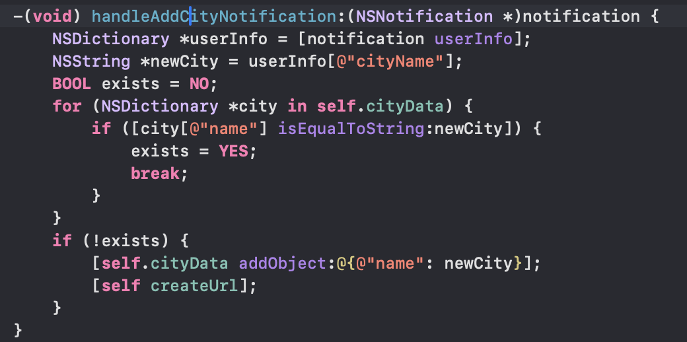
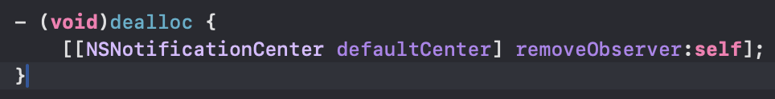

**目录**


[属性传值（正向传值）](#%E5%B1%9E%E6%80%A7%E4%BC%A0%E5%80%BC%EF%BC%88%E6%AD%A3%E5%90%91%E4%BC%A0%E5%80%BC%EF%BC%89)


[协议传值](#%E5%8D%8F%E8%AE%AE%E4%BC%A0%E5%80%BC)


[通知传值](#%E9%80%9A%E7%9F%A5%E4%BC%A0%E5%80%BC)


[block传值](#block%E4%BC%A0%E5%80%BC)


[KVO传值](#KVO%E4%BC%A0%E5%80%BC)


在iOS中的页面传值方式主要以下六种：


- 属性传值
- 单例传值
- NSUserDefault传值
- 代理传值
- block传值


## 属性传值（正向传值）


属性传值是通过定义属性并设置值来实现数据传递的方式，多用于前一个页面向后一个页面传值。


我们现在要跳转的第二个页面设置属性值


```objective-c
@property (nonatomic, strong) NSString *username;
```


在原来的页面创建B的实例，然后直接给他赋值，然后后一个页面就能拿到前一个页面的数值了


```objective-c
BViewController *bVC = [[BViewController alloc] init];
bVC.username = @"小明";
[self.navigationController pushViewController:bVC animated:YES];
```


在天气预报中，本人就使用了这种传值，效果如下




## 协议传值


协议传值是通过定义协议和代理方法，在不同页面之间传递数据。多用于后一个页面向前一个页面回传。在3gshare中，我们就假日详情页向首页传值就用到了这个。相当于上一个动图的反向。


我们先在需要传输信息的页面定义协议：其中包括需要传递的数据的代理方法








然后在发送数据的视图控制器的头文件声明代理属性，保存代理对象。


触发代理方法：


在发送数据的视图控制器中，在适当的时机，触发代理方法，并将需要传递的数据作为参数传递给代理方法





然后在接收的视图控制器中实现方法：


```objective-c
- (void)holidayDetail:(HolidayDetailViewController *)detail
  didChangeLikeStatus:(BOOL)isLiked
         newLikeCount:(NSInteger)likeCount
{
    NSMutableDictionary *item = [self.dataArray[0] mutableCopy];
    item[@"isLiked"] = @(isLiked);
    item[@"likeCount"] = @(likeCount);
    [self.dataArray replaceObjectAtIndex:0 withObject:item];
    NSIndexPath *indexPath = [NSIndexPath indexPathForRow:0 inSection:1];
    [self.tableView reloadRowsAtIndexPaths:@[indexPath] withRowAnimation:UITableViewRowAnimationFade];
}
```


最后把后面VC的代理设为前一个VC，让后一个为前一个代理。





## 通知传值


创建并发送通知：
 首先，在发送者对象中创建一个通知，并指定通知的名称（通常使用字符串来表示）。可以通过NSNotification类或NSNotificationName宏来创建通知。需要传递信息给其他对象时，可以通过NSNotificationCenter的postNotificationName:object:userInfo:方法来发送通知。在发送通知时，可以附带一些额外的信息（如字典）作为通知的userInfo参数。





然后，我们需要注册观察者：




接收通知：
 接收者对象需要实现一个方法，用于处理接收到的通知。这个方法是在观察者注册时通过selector参数指定的。当通知被发送时，通知中心会调用这个方法，并传递相关的信息给观察者。





最后，我们别忘了移除观察者，将其从通知中心移除，避免内存泄露。





## block传值


在iOS开发中，可以使用Block（闭包）进行值的传递和回调操作。Block是一种封装了一段代码的对象，可以在需要的时候执行该代码块。
 其基本步骤如下：


1. 在后一个页面定义一个Block属性


```objective-c
@property (nonatomic, copy) void(^reutnblock)(NSString* temp, NSInteger num);
```


2.  设置一个时间来触发返回上一级视图控制器的时候，使用第一步定义的block，把需要传递的放在^blcok中间


```objective-c
-(void)press{
    self.reutnblock(self.label.text, --_tag); // 重点部分
    [self.navigationController popViewControllerAnimated:YES];

}
```


3. 在前一个页面跳转到后一个页面的事件函数中，调用后一个页面的Block这个属性


```objective-c
-(void)press {
    secondViewController* second = [[secondViewController alloc] init];
    second.reutnblock = ^(NSString * _Nonnull temp, NSInteger num) {
        self.label.text = temp;
        self.num = num;
    };
    [self.navigationController pushViewController:second animated:YES];
}
```


优点


Block提供了一种灵活的方式，可以封装一段代码并在需要的时候执行。这使得值传递的逻辑可以根据具体需求进行定制和扩展。
 Block可以用于异步操作，例如在网络请求完成后执行回调操作。这样可以实现非阻塞的异步编程模式，提高代码的响应性和用户体验。
 缺点


使用Block时，需要注意对循环引用和内存泄漏的处理。Block可能会持有其所捕获的变量和对象，如果不正确地处理循环引用，可能会导致内存泄漏。
 较复杂的Block可能会导致代码变得难以理解和维护。由于Block可以封装任意代码逻辑，过度复杂或嵌套的Block可能会降低代码的可读性和可维护性。
  


block传值我目前还没在项目中实际使用过，以后在项目中的具体应用我会继续补充在博客中


## KVO传值


**概述**


KVO全称KeyValueObserve也就是观察者模式,是apple提供的一套事件通知机制.允许对象监听另一个对应特殊属性的改变,并在改变时接受到该事件.一般继承自NSObject的对象都默认是支持KVO。


KVO(Key-Value-Observing,键值观察)，即观察关键字的值的变化。首先在子页面中声明一个待观察的属性，在返回主页面之前修改该属性的值。在主页面中提前分配并初始化子页面，并且注册对子页面中对应属性的观察者。在从子页面返回主页面之前，通过修改观察者属性的值，在主页面中就能自动检测到这个改变，从而读取子页面的数据。KVO只对属性发生作用。


**传递方向**


主要也是从后往前。


**1.注册观察者**


```objective-c
@property (nonatomic, strong) secondViewController* second; //这里现在第一个页面中设置第二个页面作为自己的一个属性
- (void)press { //这里我才用了一个按钮来触发事件
    //[self willChangeValueForKey:@"ary"];
    self.second = [[secondViewController alloc] init];
    [self.second addObserver:self forKeyPath:@"userName" options:NSKeyValueObservingOptionNew | NSKeyValueObservingOptionOld context:nil];
    [self.navigationController pushViewController:self.second animated:YES];
}
```


> observer: 这是观察者对象，即要接收属性变化通知的对象。通常是当前视图控制器或其他感兴趣的对象。 keyPath: 要监听的属性的名称，以字符串表示。当该属性的值发生变化时，KVO 就会通知观察者。 options: 一个枚举值，用于指定监听的选项。这个参数可以设置为多个选项的组合，使用按位或（|）进行连接。常见的选项有： NSKeyValueObservingOptionNew: 当属性的值发生变化时，提供新的属性值作为通知的参数。 NSKeyValueObservingOptionOld: 当属性的值发生变化时，提供旧的属性值作为通知的参数。 NSKeyValueObservingOptionInitial: 在添加观察者时，立即发送一次通知，提供当前属性的值作为通知的参数。 NSKeyValueObservingOptionPrior: 在属性值发生实际变化之前，先发送一次通知，提供旧的属性值作为通知的参数。 context: 这是一个指针类型的参数，用于传递额外的上下文信息。通常情况下可以传入 NULL，表示不需要传递上下文信息。如果你需要在观察者中处理一些额外的信息，可以使用自定义的指针类型来传递数据。


**2.实现监听方法**


```objective-c
- (void)observeValueForKeyPath:(NSString *)keyPath ofObject:(id)object change:(NSDictionary<NSKeyValueChangeKey,id> *)change context:(void *)context {
    if ([keyPath isEqualToString:@"userName"]) {
        self.label.text = self.second.userName;
        NSLog(@"old text:%@   new text:%@", [change objectForKey:NSKeyValueChangeOldKey], [change objectForKey:NSKeyValueChangeNewKey]);
    }
}
```


**3.移除观察者**


```objective-c
- (void)dealloc {
    [self removeObserver:self forKeyPath:@"userName"];
}
```


**tips**：


这种方式不可以实现对于数组元素的一个监听，因为KVO是对于setter方法的监听,而数组的addObject方法并不是setter方法的内容，所以无法通过上述方法实现对于数组的一个监听。


不使用时要移除KVO

---

原文发布于 CSDN：[【iOS】多界面传值](https://blog.csdn.net/2402_86720949/article/details/151262536)
