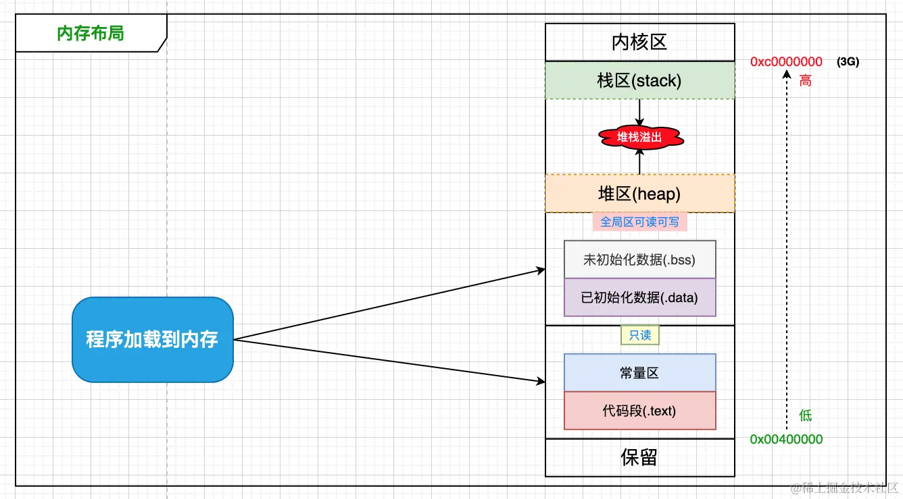
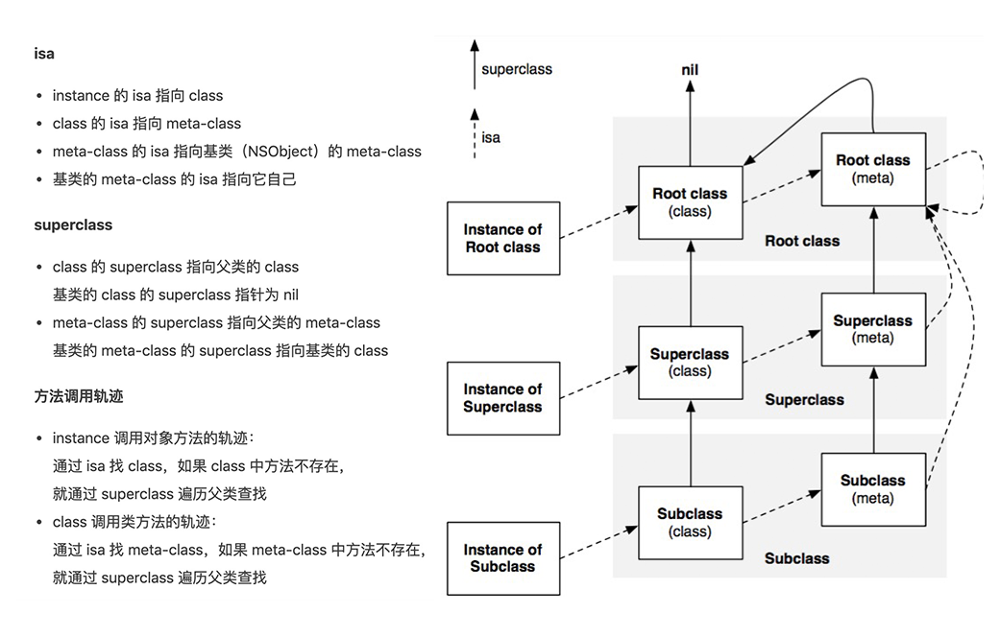
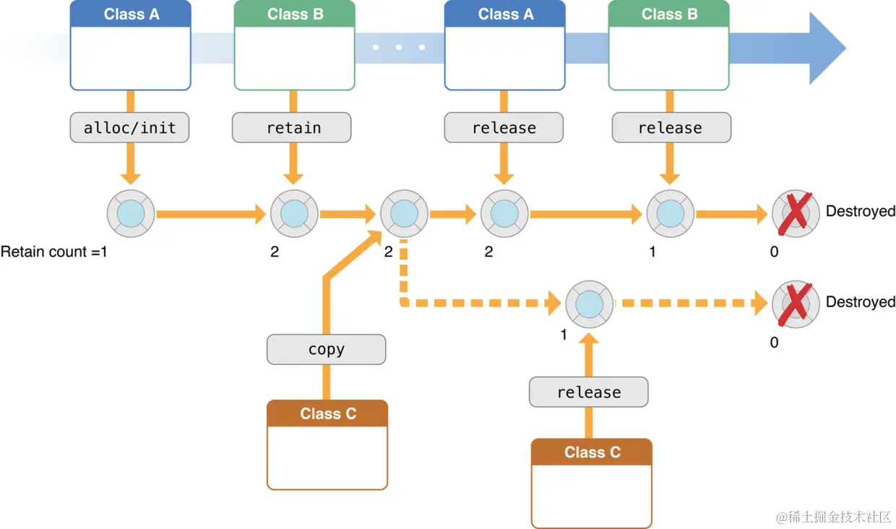

​

内存管理是程序在运行时分配内存、使用内存，并在程序完成时释放内存的过程。在Objective-C中，也被看作是在众多数据和代码之间分配有限内存资源的所有权(Ownership)的一种方式。


内存管理关心的是清理或回收不用的内存，以便内存能够再次利用。 如果一个对象不再使用，就需要释放对象占用的内存。Objective-C提供了两种内存管理的方法：手动管理内存计数(MRR)和自动引用计数(ARC)。


这两种方法都采用了一种称为“引用计数”的模型来实现，该模型由Foundation框架的NSObject类和运行时环境（Runtime Environment）共同提供。


​​




## 1. 简单聊聊GC与RC


随着各个平台的发展，现在被广泛采用的内存管理机制主要有 GC 和 RC 两种。


GC (Garbage Collection)：垃圾回收机制，定期查找不再使用的对象，释放对象占用的内存。

RC (Reference Counting)：引用计数机制。采用引用计数来管理对象的内存，当需要持有一个对象时，使它的引用计数 +1；当不需要持有一个对象的时候，使它的引用计数 -1；当一个对象的引用计数为 0，该对象就会被销毁。

Objective-C 程序现基本都已使用 ARC 内存管理机制。之前 Mac OS X 平台的 Objective-C 程序可以启用 GC，但从 Mac OS X 10.8 开始，GC 机制就苹果被废弃了，改用 ARC 机制。而 iOS 平台的 Objective-C 程序从未支持过 GC，以前使用 MRC，iOS 5、OS X Lion 之后 ARC 诞生。


引用计数（Reference Count）是一个简单而有效的管理对象生命周期的方式，


当创建一个新的对象时，初始的引用计数为1。为保证对象的存在，每当创建一个引用到该对象时，通过给对象发送retain消息，为引用计数加1；当不再需要对象时，通过给对象发送release消息，为引用计数减1；当对象的引用计数为0时，系统就知道这个对象不再使用了，通过给对象发送dealloc消息，销毁对象并回收内存。一般在retain方法之后，引用计数通常也被称为保留计数(retain count)。


## 2. 引用计数


### 2.1 什么是引用计数


当一个对象创建并在堆区申请内存时，对象的引用计数为1；当其他的对象需要持有这个对象时，就需要将这个对象的引用计数加1；当其他的对象不再需要持有这个对象时，需要将对象的引用计数减1；当对象的引用计数为0时，对象的内存就会立即释放，对象销毁。


调用alloc、new、copy、mutableCopy名称开头的方法创建的对象，该对象的引用计数加1。

调用retain方法时，该对象的引用计数加1。

调用release方法时，该对象的引用计数减1。

autorelease方法不改变该对象的引用计数器的值，只是将对象添加到自动释放池中。

retainCount方法返回该对象的引用计数值。


### 2.3 引用计数的存储


Objective - C中的“对象”通过引用计数来管理他的内存周期。那么，  对象的引用计数是如何存储的呢？存储在哪个数据结构里？


**isa**


isa指针用来维护 “对象” 和 “类” 之间的关系，并确保对象和类能够通过isa指针找到对应的方法、实例变量、属性、协议等。





​

在arm64之前，isa就是一个普通指针，直接指向objc_class，存储着class、Meta-class对象的内存地址。instance对象的isa指向class对象，class对象的isa指向meta-class对象


```objective-c
// objc.h
struct objc_object {
    Class isa;  // 在 arm64 架构之前
};
```


在 arm64 架构下，对 isa 进行了优化，用 nonpointer 表示，变成了一个共用体（union）结构，还使用 位域 来存储更多的信息。将 64 位的内存数据分开来存储着很多的东西，其中的 33 位才是拿来存储 class、meta-class 对象的内存地址信息。要通过位运算将 isa 的值 & ISA_MASK 掩码，才能得到 class、meta-class 对象的内存地址。


```objective-c
union isa_t {
    uintptr_t bits;
    struct {
        uintptr_t nonpointer        : 1;
        uintptr_t has_assoc         : 1;
        uintptr_t has_cxx_dtor      : 1;
        uintptr_t shiftcls          : 33; // 真正的 class 指针部分
        uintptr_t magic             : 6;
        uintptr_t weakly_referenced : 1;
        uintptr_t deallocating      : 1;
        uintptr_t has_sidetable_rc  : 1;
        uintptr_t extra_rc          : 19; // 引用计数
    };
};
```


如果isa非nonpointer，即 arm64 架构之前的isa指针。由于它只是一个普通的指针，存储着Class、Meta-Class对象的内存地址，所以它本身不能存储引用计数，所以以前对象的引用计数都存储在一个叫SideTable结构体的RefCountMap（引用计数表）散列表中。


如果isa是nonpointer，则它本身可以存储一些引用计数。从以上union isa_t的定义中我们可以得知，isa_t中存储了两个引用计数相关的东西：extra_rc和has_sidetable_rc。


extra_rc：19 位，用于存储对象的引用计数（除基础的 1 之外），如果这19位不够存储，has_sidetable_rc 会变为1.


has_sidetable_rc：1 位，用来表示是否这个对象的引用计数“超出 isa 能存储的范围”，这时候多余的部分要放进 _**SideTable的RefCountMap**_


```objective-c
// objc-private.h
struct objc_object {
private:
    isa_t isa;  // 在 arm64 架构开始
};

union isa_t
{
    isa_t() { }
    isa_t(uintptr_t value) : bits(value) { }

    Class cls;
    uintptr_t bits;

#if SUPPORT_PACKED_ISA

    // extra_rc must be the MSB-most field (so it matches carry/overflow flags)
    // nonpointer must be the LSB (fixme or get rid of it)
    // shiftcls must occupy the same bits that a real class pointer would
    // bits + RC_ONE is equivalent to extra_rc + 1
    // RC_HALF is the high bit of extra_rc (i.e. half of its range)

    // future expansion:
    // uintptr_t fast_rr : 1;     // no r/r overrides
    // uintptr_t lock : 2;        // lock for atomic property, @synch
    // uintptr_t extraBytes : 1;  // allocated with extra bytes

# if __arm64__  // 在 __arm64__ 架构下
#   define ISA_MASK        0x0000000ffffffff8ULL  // 用来取出 Class、Meta-Class 对象的内存地址
#   define ISA_MAGIC_MASK  0x000003f000000001ULL
#   define ISA_MAGIC_VALUE 0x000001a000000001ULL
    struct {
        uintptr_t nonpointer        : 1;  // 0：代表普通的指针，存储着 Class、Meta-Class 对象的内存地址
                                          // 1：代表优化过，使用位域存储更多的信息
        uintptr_t has_assoc         : 1;  // 是否有设置过关联对象，如果没有，释放时会更快
        uintptr_t has_cxx_dtor      : 1;  // 是否有C++的析构函数（.cxx_destruct），如果没有，释放时会更快
        uintptr_t shiftcls          : 33; // 存储着 Class、Meta-Class 对象的内存地址信息
        uintptr_t magic             : 6;  // 用于在调试时分辨对象是否未完成初始化
        uintptr_t weakly_referenced : 1;  // 是否有被弱引用指向过，如果没有，释放时会更快
        uintptr_t deallocating      : 1;  // 对象是否正在释放
        uintptr_t has_sidetable_rc  : 1;  // 如果为1，代表引用计数过大无法存储在 isa 中，那么超出的引用计数会存储在一个叫 SideTable 结构体的 RefCountMap（引用计数表）散列表中
        uintptr_t extra_rc          : 19; // 里面存储的值是对象本身之外的引用计数的数量，retainCount - 1
#       define RC_ONE   (1ULL<<45)
#       define RC_HALF  (1ULL<<18)
    };
......  // 在 __x86_64__ 架构下
};
```


## 3. 内存管理方案


应用程序内存管理是在程序运行时分配内存，使用它并在使用完后释放它的过程。编写良好的程序将使用尽可能少的内存。在 Objective-C 中，它也可以看作是在许多数据和代码之间分配有限内存资源所有权的一种方式。掌握内存管理知识，我们就可以很好地管理对象生命周期并在不再需要它们时释放它们，从而管理应用程序的内存。

虽然通常在单个对象级别上考虑内存管理，但实际上我们的目标是管理对象图，要保证在内存中只保留需要用到的对象，确保没有发生内存泄漏。

下图是苹果官方文档给出的 “内存管理对象图”，很好地展示了一个对象 “创建——持有——释放——销毁” 的过程。





### 3.1 对象持有规则


对象持有规则如下：


> **1. 自己生成的对象，自己持有 2. 非自己生成的对象，自己也能持有 3. 不再需要自己持有的对象时释放 4. 非自己持有的对象无法释放**


对象操作				Objective-C方法

生成并持有对象	alloc/new/copy/mutableCopy等方法

持有对象				retain方法

释放对象				release方法

废弃对象				dealloc方法


#### 3.1.1 自己创建的对象，自己持有


使用以下名称开头的方法名意味着自己生成的对象只有自己持有：**alloc、new、copy、mutableCopy**。 在OC中对象的创建可以通过_**alloc和new**_这两种方式来创建一个对象。其RC（引用计数，以下统一使用RC）初始值为 1，我们直接使用即可，在不需要使用的时候调用一下release方法进行释放。


```objective-c
NSObject *obj = [NSObject alloc];
NSObject *obj1 = [NSObject new];//等价于 NSObject *obj1 = [[NSObject alloc]init];
```


我们可以使用retainCount来查看对象的引用数值，但最好不要使用


```objective-c
NSLog(@"%ld", [obj retainCount]);
#### 3.1.2 你retain的对象，自己也能持有


用alloc、new、copy、mutableCopy之外的方法获得的对象，因为并非自己生产持有，所以自己不是该对象的持有者。如果要使用（持有）该对象，需要先进行retain，否则可能会导致程序Crash。原因是这些方法内部是给对象调用了autorelease方法，所以这些对象会被加入到自动释放池中。


```objective-c
//非自己生成的对象，暂时没有持有
id obj = [NSMutableArray array];

//通过retain持有对象
[obj retain];
```


上述代码中的NSMutableArray通过类方法array生成了一个对象赋值给变量obj，但obj自己并不持有该对象。使用retain方法可以持有对象


**情况1:**


```objective-c
/* 正确的用法 */

    id obj = [NSMutableArray array]; // 创建对象但并不持有，对象加入自动释放池，RC = 1

    [obj retain]; // 使用之前进行 retain，对对象进行持有，RC = 2
    /*
     * 使用该对象，RC = 2
     */
    [obj release]; // 在不需要使用的时候调用 release，RC = 1
    /*
     * RunLoop 可能在某一时刻迭代结束，给自动释放池中的对象调用 release，RC = 0，对象被销毁
     * 如果这时候 RunLoop 还未迭代结束，该对象还可以被访问，不过这是非常危险的，容易导致 Crash
     */
```


情况2:


```objective-c
/* 错误的用法 */

    id obj;
    @autoreleasepool {
        obj = [NSMutableArray array]; // 创建对象但并不持有，对象加入自动释放池，RC = 1
    } // @autoreleasepool 作用域结束，对象 release，RC = 0，对象被销毁
    NSLog(@"%@",obj); // EXC_BAD_ACCESS
```


```objective-c
/* 正确的用法 */

    id obj;
    @autoreleasepool {
        obj = [NSMutableArray array]; // 创建对象但并不持有，对象加入自动释放池，RC = 1
        [obj retain]; // RC = 2
    } // @autoreleasepool 作用域结束，对象 release，RC = 1
    NSLog(@"%@",obj); // 正常访问
    /*
     * 使用该对象，RC = 1
     */
    [obj release]; // 在不需要使用的时候调用 release，RC = 0，对象被销毁
```


如果我们通过**自定义方法** _**创建但并不持有对象**_，则方法名就不应该以 alloc/new/copy/mutableCopy 开头，且返回对象前应该要先通过autorelease方法将该对象加入自动释放池。如：


```objective-c
- (id)object
{
    id obj = [NSObject alloc] init];
    [obj autorelease];
    retain obj;
}
```


这样调用方在使用该方法创建对象的时候，通过方法名他就会知道他不持有该对象，于是他会在使用该对象前进行retain，并在不需要该对象时进行release。


> 备注：**release**和**autorelease**的区别： 调用release，对象的RC会立即 -1； 调用autorelease，对象的RC不会立即 -1，而是将对象添加进自动释放池，它会在一个恰当的时刻自动给对象调用release，所以autorelease相当于延迟了对象的释放。


#### 3.1.3 当你不再需要时，release


自己持有的对象，一旦该对象不再需要时，持有者有义务调用release方法释放该对象。当然在ARC环境下并不需要开发者主动调用方法，系统会自动调用该方法，但是在MRC环境下需要开发者手动在合适的地方做对象的retain 方法和release方法的调用。


#### 3.1.4 非自己持有的对象无法release


对于用alloc、new、copy、mutableCopy方法生成并持有的对象，或是用retain方法持有的对象，由于持有者是自己，所以在不需要该对象时需要将其释放。而由此以外所得到的对象绝对不能释放。倘若在程序中释放了非自己所持有的对象就会造成崩溃。


```objective-c
id obj = [[NSObject alloc] init]; // 创建并持有对象，RC = 1
    [obj release]; // 如果自己是持有者，在不需要使用的时候调用 release，RC = 0
    /*
     * 此时对象已被销毁，不应该再对其进行访问
     */
    [obj release]; // EXC_BAD_ACCESS，这时候自己已经不是持有者，再 release 就会 Crash
    /*
     * 再次 release 已经销毁的对象（过度释放），或是访问已经销毁的对象都会导致崩溃
     */
```


释放了非自己持有的对象，肯定会导致应用崩溃。因此绝对不要去释放非自己持有的对象。


```objective-c
id obj = [NSMutableArray array]; // 创建对象，但并不持有对象，RC = 1
    [obj release]; // EXC_BAD_ACCESS 虽然对象的 RC = 1，但是这里并不持有对象，所以导致 Crash
```


还有一种情况，这是不容易发现问题的情况。执行如下代码，可能会有问题，也可能没有问题。对象所占内存在 “解除分配(deallocated)” 之后，只是放回可用内存池。如果对象所占内存还没有分配给别人，这时候访问没有问题，如果已经分配给了别人，再次访问就会崩溃。


```objective-c
Person *person = [[Person alloc] init]; // 创建并持有对象，RC = 1
    [person release]; // 如果自己是持有者，在不需要使用的时候调用 release，RC = 0
    [person release]; // !!!向业已回收的对象发送消息是不安全的
```


Objective-C 在iOS中提供了两种内存管理方法：


MRC，也是本篇文章要讲解的内容，我们通过跟踪自己持有的对象来显式管理内存。这是使用一个称为 “引用计数” 的模型来实现的，由 Foundation 框架的 NSObject 类与运行时环境一起提供。

ARC，系统使用与MRC相同的引用计数系统，但是它会在编译时为我们插入适当的内存管理方法调用。使用ARC，我们通常就不需要了解本文章中描述的MRC的内存管理实现，尽管在某些情况下它可能会有所帮助。但是，作为一名合格的iOS开发者，掌握这些知识是很有必要的。


### 3.2 使用dealloc放弃对象的所有权


NSObject 类定义了一个**dealloc**方法，该方法会在一个对象没有所有者（RC=0）并且它的内存被回收时由系统自动调用 —— 在 Cocoa 术语中称为freed或deallocated。

**dealloc**方法的作用是 销毁对象自身的内存，并释放它持有的任何资源，包括任何实例变量的所有权。

以下举了一个在 Person 类中实现 dealloc方法的示例：


```objective-c
@interface Person : NSObject
@property (retain) NSString *firstName;
@property (retain) NSString *lastName;
@property (assign, readonly) NSString *fullName;
@end

@implementation Person
// ...
- (void)dealloc
    [_firstName release];
    [_lastName release];
    [super dealloc];
}
```


> 注意： 切勿直接调用另一个对象dealloc的方法； 你必须在实现结束时调用[super dealloc]； 当应用程序终止时，可能不会向对象发送dealloc消息。因为进程的内存在退出时会自动清除，所以让操作系统清理资源比调用所有对象的dealloc方法更有效。


**dealloc与release**的区别：


release是减少引用计数的方法，调用对象的release方法，会使该对象的**引用计数（RC）** 减1。

在MRC下，每个对象创建后的引用计数为1，当调用release后，该对象引用计数减小为0，如果此时引用计数变为 0，系统会 **自动调用对象的 dealloc 方法** 来销毁对象。


**dealloc** 是系统在对象引用计数为 0 时自动调用的。

我们不能直接调用 dealloc，因为它是 销毁对象的底层方法，会释放对象占用的内存。

---

原文发布于 CSDN：[【iOS】内存管理初级](https://blog.csdn.net/2402_86720949/article/details/152130856)
