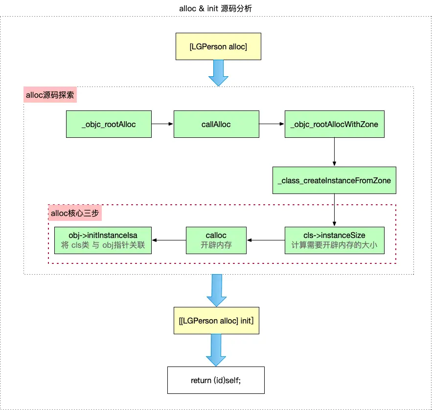
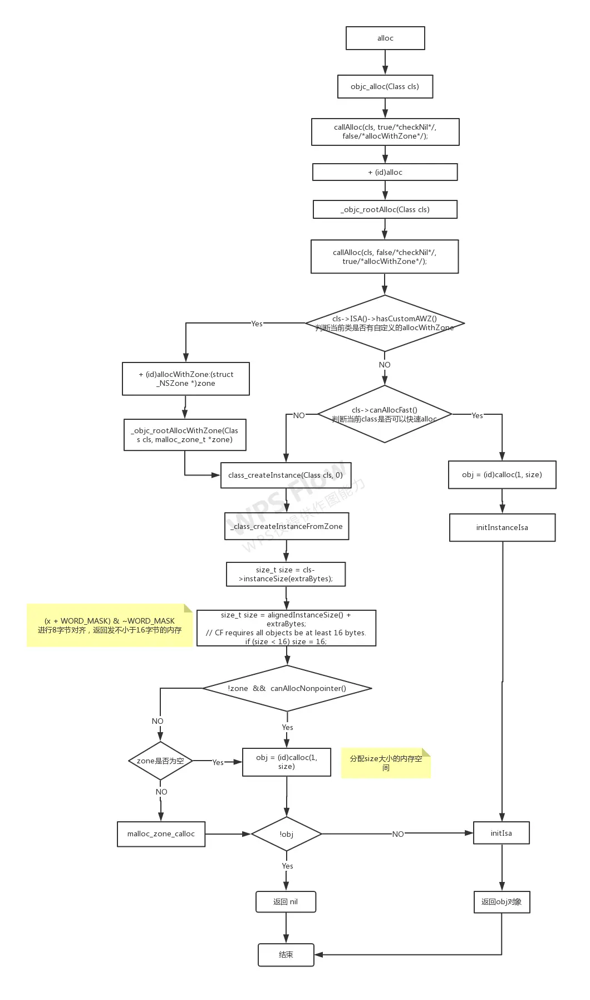

## 1. alloc





进入到alloc的源码里面，我们发现alloc调用了_objc_rootAlloc方法，而_objc_rootAlloc调用了callAlloc方法。


```objective-c
+ (id)alloc {
    return _objc_rootAlloc(self);
}

id _objc_rootAlloc(Class cls)
{
    return callAlloc(cls, false/*checkNil*/, true/*allocWithZone*/);
}

static ALWAYS_INLINE id
callAlloc(Class cls, bool checkNil, bool allocWithZone=false)
{
    if (slowpath(checkNil && !cls)) return nil;

#if __OBJC2__
    if (fastpath(!cls->ISA()->hasCustomAWZ())) {
        if (fastpath(cls->canAllocFast())) {
            // No ctors, raw isa, etc. Go straight to the metal.
            bool dtor = cls->hasCxxDtor();
            id obj = (id)calloc(1, cls->bits.fastInstanceSize());
            if (slowpath(!obj)) return callBadAllocHandler(cls);
            obj->initInstanceIsa(cls, dtor);
            return obj;
        }
        else {
            // Has ctor or raw isa or something. Use the slower path.
            id obj = class_createInstance(cls, 0);
            if (slowpath(!obj)) return callBadAllocHandler(cls);
            return obj;
        }
    }
#endif

    // No shortcuts available.
    if (allocWithZone) return [cls allocWithZone:nil];
    return [cls alloc];
}
```


具体内容本人暂时也一知半解，贴一张图





> **alloc为我们创建了1个对象并申请了一块不小于16字节的内存空间**


具体可以参考一下这篇博客
 [博客](https://juejin.cn/post/7063036829972299813)


## 2. init


我们进入init的方法源码


```objective-c
- (id)init {
    return _objc_rootInit(self);
}

id _objc_rootInit(id obj)
{
    // In practice, it will be hard to rely on this function.
    // Many classes do not properly chain -init calls.
    return obj;
}
```


额的天呐，init啥都没做，只是把当前的对象返回了。既然啥都没做那我们还需要调用init吗？答案是肯定的，其实init就是一个工厂范式，方便开发者自行重写定义。


我们在来看看new方法做了啥。


## 3. init


我们再看看init的代码


```objective-c
+ (id)new {
    return [callAlloc(self, false/*checkNil*/) init];
}
```


init调用的是callAlloc的方法和init，那么可以理解为new实际上是alloc + init的综合体。


## 4. 内存对齐


### 内存字节对齐原则


在解释为什么需要16字节对齐之前，首先需要了解内存字节对齐的原则，主要有以下三点


- 数据成员对齐规则：struct 或者 union 的数据成员，第一个数据成员放在offset为0的地方，以后每个数据成员存储的起始位置要从该成员大小或者成员的子成员大小（只要该成员有子成员，比如数据、结构体等）的整数倍开始（例如int在32位机中是4字节，则要从4的整数倍地址开始存储）
- 数据成员为结构体：如果一个结构里有某些结构体成员，则结构体成员要从其内部最大元素大小的整数倍地址开始存储（例如：struct a里面存有struct b，b里面有char、int、double等元素，则b应该从8的整数倍开始存储）
- 结构体的整体对齐规则：结构体的总大小，即sizeof的结果，必须是其内部做大成员的整数倍，不足的要补齐


### 为什么需要16字节对齐


**需要字节对齐的原因，有以下几点：**


- 通常内存是由一个个字节组成的，cpu在存取数据时，并不是以字节为单位存储，而是以块为单位存取，块的大小为内存存取力度。频繁存取字节未对齐的数据，会极大降低cpu的性能，所以**可以通过减少存取次数来降低cpu的开销**
- 16字节对齐，是由于在一个对象中，第一个属性isa占8字节，当然一个对象肯定还有其他属性，当无属性时，会预留8字节，即16字节对齐，如果不预留，相当于这个对象的isa和其他对象的isa紧挨着，容易造成访问混乱
- 16字节对齐后，可以 加快CPU读取速度，同时使访问更安全 ，不会产生访问混乱的情况


### 字节对齐-总结


- 在字节对齐算法中，对齐的主要是对象，而对象的本质则是一个 struct objc_object的结构体，
- 结构体在内存中是连续存放的，所以可以利用这点对结构体进行强转。
- 苹果早期是8字节对齐，现在是16字节对齐


## 5. 总结


- alloc创建了对象并且申请了一块不少于16字节的内存空间。
- init其实什么也没做，返回了当前的对象。其作用在于提供一个范式，方便开发者自定义。
- new其实是alloc+init的一个综合体。

---

原文发布于 CSDN：[【iOS】alloc、init、new](https://blog.csdn.net/2402_86720949/article/details/152164860)
