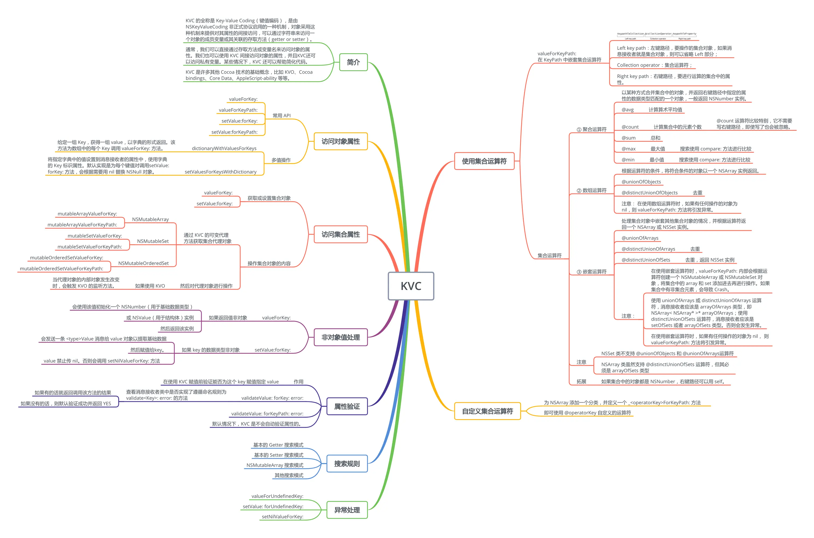
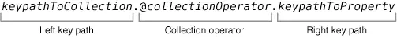
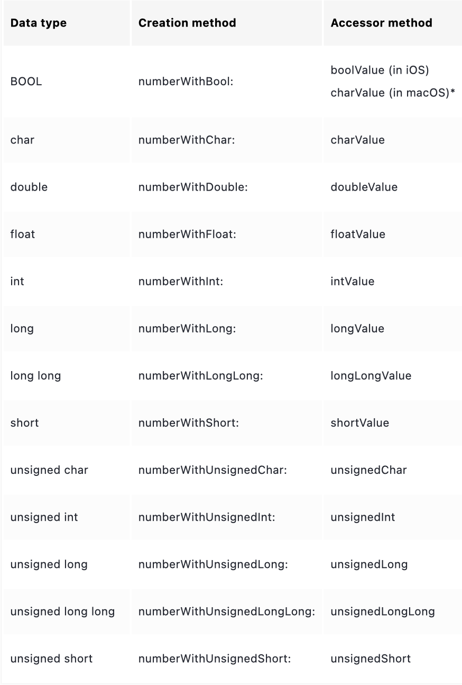
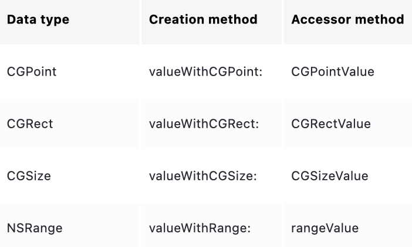
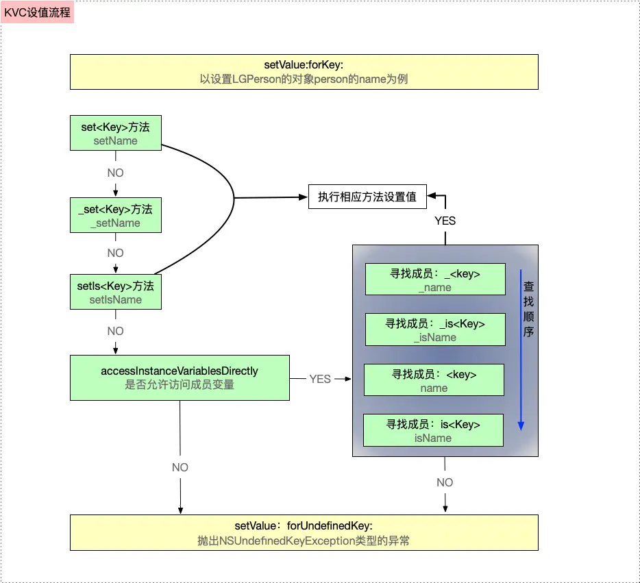
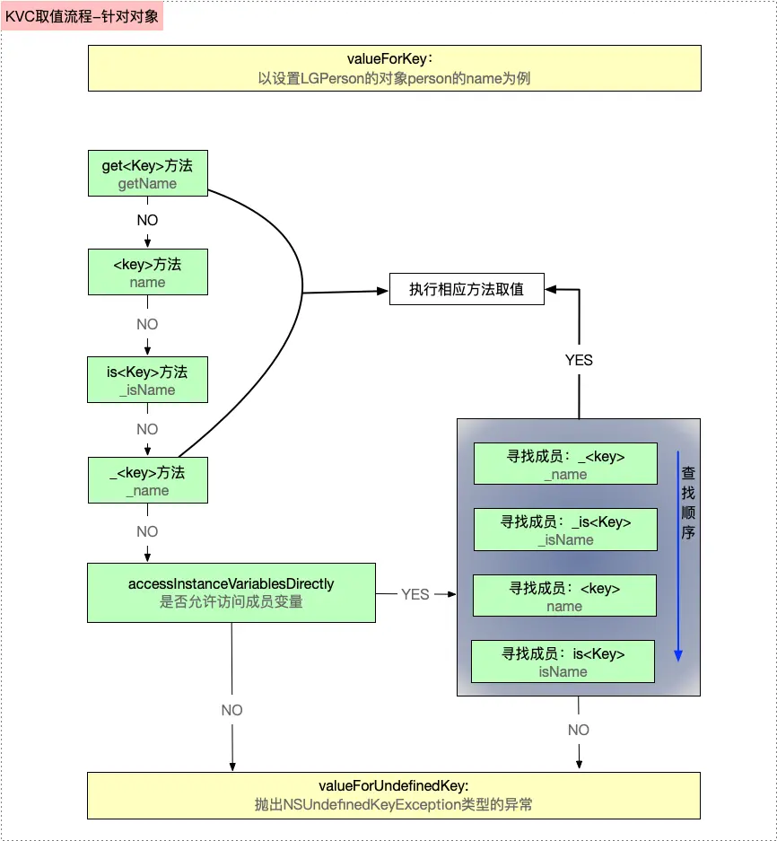

## 什么是KVC


 KVC 的全称是Key-Value Coding（键值编码），是由NSKeyValueCoding非正式协议启用的一种机制，对象采用这种机制来提供对其属性的间接访问，可以通过字符串来访问一个对象的成员变量或其关联的存取方法（getter or setter）。


通常，我们可以直接通过存取方法或变量名来访问对象的属性。我们也可以使用KVC间接访问对象的属性，并且KVC还可以访问私有变量。某些情况下，KVC还可以帮助简化代码。


KVC是许多其他 Cocoa 技术的基础概念，比如 **KVO、Cocoa bindings、Core Data、AppleScript-ability** 等等。


## KVC常见API


**常用方法：**

主要有以下四个常用的方法


**通过 key 设值/取值**


> **key和keyPath的区别**： key用于访问单一属性，一层，访问对象的直接属性 keyPath用于访问嵌套属性，多层，访问嵌套对象的属性


```objective-c
//直接通过Key来取值
- (nullable id)valueForKey:(NSString *)key;

//通过Key来设值
- (void)setValue:(nullable id)value forKey:(NSString *)key;
```


**通过 keyPath （即路由）设值/取值**


```objective-c
//通过KeyPath来取值
- (nullable id)valueForKeyPath:(NSString *)keyPath;

//通过KeyPath来设值
- (void)setValue:(nullable id)value forKeyPath:(NSString *)keyPath;
```


**其他方法**


```objective-c
//默认返回YES，表示如果没有找到Set<Key>方法的话，会按照_key，_iskey，key，iskey的顺序搜索成员，设置成NO就不这样搜索
+ (BOOL)accessInstanceVariablesDirectly;

//KVC提供属性值正确性验证的API，它可以用来检查set的值是否正确、为不正确的值做一个替换值或者拒绝设置新值并返回错误原因。
- (BOOL)validateValue:(inout id __nullable * __nonnull)ioValue forKey:(NSString *)inKey error:(out NSError **)outError;

//这是集合操作的API，里面还有一系列这样的API，如果属性是一个NSMutableArray，那么可以用这个方法来返回。
- (NSMutableArray *)mutableArrayValueForKey:(NSString *)key;

//如果Key不存在，且KVC无法搜索到任何和Key有关的字段或者属性，则会调用这个方法，默认是抛出异常。
- (nullable id)valueForUndefinedKey:(NSString *)key;

//和上一个方法一样，但这个方法是设值。
- (void)setValue:(nullable id)value forUndefinedKey:(NSString *)key;

//如果你在SetValue方法时面给Value传nil，则会调用这个方法
- (void)setNilValueForKey:(NSString *)key;

//输入一组key,返回该组key对应的Value，再转成字典返回，用于将Model转到字典。
- (NSDictionary<NSString *, id> *)dictionaryWithValuesForKeys:(NSArray<NSString *> *)keys;
```


## 常见操作


### key


如下声明了一个BankAccount类：


```objective-c
@interface BankAccount : NSObject
@property (nonatomic) NSNumber* currentBalance;              // An attribute
@property (nonatomic) Person* owner;                         // A to-one relation
@property (nonatomic) NSArray< Transaction* >* transactions; // A to-many relation
@end
```


对于BankAccount的实例对象myAccout。我们可以使用setter方法为current属性赋值，这是直接的，但是缺乏灵活性。


```objective-c
[myAccount setCurrentBalance:@(100.0)];

//听过KVC间接为currentBalance属性赋值，通过其键key设置
[myAccount setValue:@(100.0) forKey:@"currentBalance"];
### KeyPath


KVC还支持 多级访问 ，keyPath用法和点语法相同。例如：我们想对myAccount的owner属性的address属性的street赋值，其keyPath为**owner.address.street**.


```objective-c
[myAccount setValue:@"地址" forKeyPath:@"owner.address.street"];
### 多值操作


给定一组key，获得一组value，以字典形式返回。该方法为数组中每个Key调用 valueForKey：  方法


```objective-c
- (NSDictionary<NSString *,id> *)dictionaryWithValuesForKeys:(NSArray<NSString *> *)keys;
```


将指定字典中的值设置到消息接收者的属性中，使用字典的Key标识属性。默认实现是为每个键值对调用setValue:forKey:方法 ，会根据需要用nil替换NSNull对象。


```objective-c
- (void)setValuesForKeysWithDictionary:(NSDictionary<NSString *,id> *)keyedValues;
```


可能还是有同学不明白。我再来解释一下：

**dictionaryWithValuesforKeys** 是将对象转化为字典。


```objective-c
Person *p = [[Person alloc] init];
p.name = @"吴桐";
p.age = 19;
p.city = @"西安";

NSDictionary *info = [p dictionaryWithValuesForKeys:@[@"name", @"age"]];
NSLog(@"%@", info);
```


你传入了一个键名数组，方法会按照顺序读取对象对应的属性值。

返回的字典中：key是字符串（属性名），value是属性的值


**setValuesForKeysWithDictionary** 是将字典转化为对象


```objective-c
NSDictionary *dict = @{
    @"name": @"吴桐",
    @"age": @19,
    @"city": @"西安"
};

Person *p = [[Person alloc] init];
[p setValuesForKeysWithDictionary:dict];

NSLog(@"%@ - %ld - %@", p.name, (long)p.age, p.city);
```


系统会遍历dict的所有键，调用setValue：forKey：给对象属性赋值，只要字典的键名与属性名匹配，就能成功设置。


> **dictionaryWithValuesForKeys:** 是“导出”对象属性到字典。 **setValuesForKeysWithDictionary:** 是“导入”字典数据到对象。


> 二者方向相反，但底层都是通过 **KVC 的 forKey: / forKeyPath:** 实现的. 在开发中： 从网络获取 JSON 并转模型 [p setValuesForKeysWithDictionary:jsonDict]; 将模型转为字典方便保存/上传 [p dictionaryWithValuesForKeys:@[@“name”, @“age”, @“city”]];


### 访问集合属性


我们可以像访问其它对象一样使用 valueForKey:  或 setValue:forKey:  方法来**获取或设置**集合对象（主要指NSArray和NSSet）。但是，当我们要操作集合对象的内容，比如**添加或者删除**元素时，通过KVC的可变代理方法获取集合代理对象是最有效的。


根据KVO的实现原理，是在运行时动态生成子类并 重写setter  方法来达到可以通知所有观察者对象的目的，因此我们**对集合对象进行操作是不会触发KVO的。**

当我们要使用KVO监听集合对象变化时，需要**通过KVC的可变代理方法获取集合代理对象，然后对代理对象进行操作。**

当代理对象的**内部对象发生改变时，会触发KVO的监听方法。**


KVC提供了三种不同的代理对象访问的代理方法，每种都有Key和KeyPath两种方法。


> _**mutableArrayValueForKey:**_ 和 _**mutableArrayValueForKeyPath:**_ 返回NSMutableArray对象的代理对象。


> _**mutableSetValueForKey:**_ 和 _**mutableSetValueForKeyPath:**_ 返回NSMutableSet对象的代理对象。


> _**mutableOrderedSetValueForKey:**_ 和 _**mutableOrderedSetValueForKeyPath:**_ 返回NSMutableOrderedSet对象的代理对象。


这些返回的不是实际集合本身，而是一个特殊的“代理对象”：

•	当你在这个代理对象上调用 addObject:、removeObject: 等操作时，

它内部会自动帮你调用

willChangeValueForKey: 和 didChangeValueForKey:，

让 KVO 能检测到变化。


#### 举个例子：


```objective-c
@interface Person : NSObject
@property (nonatomic, strong) NSMutableArray *friends;
@end

@implementation Person
- (instancetype)init {
    if (self = [super init]) {
        _friends = [NSMutableArray array];
    }
    return self;
}
@end
```


**我们设置观察者：**


```objective-c
Person *p = [[Person alloc] init];
[p addObserver:self
    forKeyPath:@"friends"
       options:NSKeyValueObservingOptionNew | NSKeyValueObservingOptionOld
       context:nil];
```


**如果你直接修改属性如下，则不会触发KVO回调。**


```objective-c
[p.friends addObject : @"Tommy"];
```


**如果通过如下的代理修改，就会触发观察者回调：**


```objective-c
NSMutableArray *proxyArray = [p mutableArrayValueForKey:@"friends"];
[proxyArray addObject:@"Tommy"];
```


**输出：**


```objective-c
friends changed:
old = ()
new = (Tommy)
```


因为这个proxyArray是一个特殊的“代理集合”，在修改前后自动调用


> **[p willChangeValueForKey:@“friends”]; [p didChangeValueForKey:@“friends”];**


从而通知所有观察者。


```objective-c
+--------------------------+
|  Person (被观察者)       |
|  friends = NSMutableArray|
+--------------------------+
            ▲
            | 调用 mutableArrayValueForKey:
            |
   返回一个代理对象 (NSKeyValueMutableArray)
            |
     当你调用 add/remove 等操作时
            ↓
 willChangeValueForKey:@"friends"
 [friends addObject:...]
 didChangeValueForKey:@"friends"
            ↓
       通知 KVO 观察者
```


## 使用集合运算符


KVC 支持对集合类型（NSArray、NSSet）进行**统计和聚合计算**。


比如，我们有一个学生数组，每个学生都有 age 属性。

如果想算平均年龄、最大年龄、最小年龄等，用传统方式要写循环，但用 KVC 可以一句话搞定。


```objective-c
NSNumber *avg = [students valueForKeyPath:@"@avg.age"];
```


以下是 KeyPath 集合运算符的格式，主要分为三个部分。


- Left key Path：左键路径，要操作的集合对象，如果消息接受者就是集合对象，则可以省略left部分
- Collection operator：集合运算符；
- Right key Path：右键路径，要进行运算的集合中的属性 


> **[left key path].@运算符.right key path** **[students valueForKeyPath:@“@avg.score”];**


集合运算符主要分为三类：


- ① 聚合运算符：以某种方式合并集合中的对象，并返回右键路径中指定的属性的数据类型匹配的一个对象，一般返回 NSNumber 实例。
- ② 数组运算符：根据运算符的条件，将符合条件的对象以一个 NSArray 实例返回。
- ③ 嵌套运算符：处理集合对象中嵌套其他集合对象的情况，并根据运算符返回一个 NSArray或NSSet 实例。


### 聚合运算符


#### @avg


读取集合中每个元素的右键路径指定的属性，将其转换为double类型 (nil用 0 替代)，并计算这些值的算术平均值。然后将结果以NSNumber实例返回。


```objective-c
// 计算上表中 amount 的平均值。
NSNumber *transactionAverage = [self.transactions valueForKeyPath:@"@avg.amount"];
// transactionAverage 格式化的结果为 $ 456.54。
#### @count


计算集合中的元素个数，以NSNumber实例返回。


```objective-c
// 计算 transactions 集合中的元素个数。
NSNumber *numberOfTransactions = [self.transactions valueForKeyPath:@"@count"];
// numberOfTransactions 的值为 13。
```


> **备注** ：@count运算符比较特别，它不需要写右键路径，即使写了也会被忽略


#### @sum


读取集合中每个元素的右键路径制定的属性，将其转化为 double 类型（nil用0代替），并计算这些值的总和。然后将结果以NSNumber实例返回


```objective-c
// 计算上表中 amount 的总和。
NSNumber *amountSum = [self.transactions valueForKeyPath:@"@sum.amount"];
// amountSum 的结果为 $ 5935.00。
#### @max / @min


**返回集合中右键路径制定的属性的最小值或最大值**


```objective-c
// 获取日期的最大值。
NSDate *latestDate = [self.transactions valueForKeyPath:@"@max.date"];
// latestDate 的值为 Jul 15, 2016.


// 获取日期的最小值。
NSDate *earliestDate = [self.transactions valueForKeyPath:@"@min.date"];
// earliestDate 的值为 Dec 1, 2015.
```


> **备注：**@max和@min根据右键路径指定的属性在集合中搜索，搜索使用compare:方法进行比较，许多基础类 (如NSNumber类) 中都有定义。因此，右键路径指定的属性必须能响应compare:消息。搜索忽略值为nil的集合项。可以通过重写compare:方法对搜索过程进行控制。


### 数组运算符


根据符合运算符的条件，将符合条件的对象以一个 NSArray 实例返回。


#### @unionOfObjects


读取数组中每个元素的右键路径指定的属性，反在一个 NSArray 实例中并返回。


```objective-c
// 获取集合中的所有 payee 对象。
NSArray *payees = [self.transactions valueForKeyPath:@"@unionOfObjects.payee"];
// payees 数组包含以下字符串：Green Power, Green Power, Green Power, Car Loan, Car Loan, Car Loan, General Cable, General Cable, General Cable, Mortgage, Mortgage, Mortgage, Animal Hospital。
#### @distinctUnionOfObjects


读取数组中每个元素的右键路径指定的属性，放在一个NSArray实例中，将数组进行去重后返回。


```objective-c
// 获取集合中的所有不同的 payee 对象。
NSArray *distinctPayees = [self.transactions valueForKeyPath:@"@distinctUnionOfObjects.payee"];
// distinctPayees 数组包含以下字符串：Car Loan, General Cable, Animal Hospital, Green Power, Mortgage。
```


> **注意：** 在使用数组运算符时，如果有任何操作的对象为nil，则valueForKeyPath:方法将引发异常。


### 嵌套运算符


处理集合对象中嵌套其他集合对象的情况，并根据运算符返回一个 NSArray 或 NSSet 实例。


如下 moreTransactions 是装着 transaction 对象的数组，arrayOfArrays 数组中嵌套了 self.transactions 和 moreTransactions 两个数组。


```objective-c
NSArray* moreTransactions = @[<# transaction data #>];
NSArray* arrayOfArrays = @[self.transactions, moreTransactions];
#### @unionOfArrays


读取集合中的每个集合中的每个元素的右键路径的制定的属性，放在一个NSArray实例中返回。


```objective-c
// 获取 arrayOfArrays 集合中的每个集合中的所有 payee 对象。
NSArray *collectedPayees = [arrayOfArrays valueForKeyPath:@"@unionOfArrays.payee"];
// collectedPayees 数组包含以下字符串：Green Power, Green Power, Green Power, Car Loan, Car Loan, Car Loan, General Cable, General Cable, General Cable, Mortgage, Mortgage, Mortgage, Animal Hospital, General Cable - Cottage, General Cable - Cottage, General Cable - Cottage, Second Mortgage, Second Mortgage, Second Mortgage, Hobby Shop.
#### distinctUnionOfArrays


读取集合中的每个集合中的每个元素的右键路径制定的属性，放在一个 NSArray 实例中，将数组去重后返回，用法与上相似。


#### @distinctUnionOfSets


读取集合中的每个集合中的每个元素的右键路径指定的属性，放在一个NSSet实例中，去重后返回。


```objective-c
NSSet *collectedDistinctPayees = [setOfSets valueForKeyPath:@"@distinctUnionOfSets.payee"];
```


> **注意：** - 在使用嵌套运算符时，valueForKeyPath:内部会根据运算符创建一个NSMutableArray或NSMutableSet对象，将集合中的array和set添加进去再进行操作。如果集合中有非集合元素，会导致Crash。 - 使用unionOfArrays或distinctUnionOfArrays运算符，消息接收者应该是arrayOfArrays类型，即NSArray * arrayOfArrays;；使用distinctUnionOfSets运算符，消息接收者应该是setOfSets或者arrayOfSets类型。否则会发生异常。 - 在使用嵌套运算符时，如果有任何操作的对象为nil， 则valueForKeyPath:方法将引发异常。


#### 拓展：


如果集合中元素的对象都是NSNumber，右键路径可以用self。


```objective-c
NSArray *array = @[@1, @2, @3, @4, @5];
    NSNumber *sum = [array valueForKeyPath:@"@sum.self"];
    NSLog(@"%d",[sum intValue]);
```


## 非对象值处理


在 Objective-C 中，KVC（Key-Value Coding） 不仅能处理对象属性，还能处理**基本数据类型（primitive types）和结构体（struct）类型。

KVC 在底层通过自动装箱（boxing）与自动拆箱（unboxing）**机制完成两者之间的桥接。


- 当进行取值如 valueForKey: 时，如果返回值非对象，会使用该值初始化一个NSNumber（用于基础数据类型）或NSValue（用于结构体）实例，然后返回该实例。


> 如果属性是对象类型 → 直接返回对象； 如果属性是 基本类型**（int、float、BOOL 等）** → KVC 会自动用该值创建一个 NSNumber 实例； 如果属性是 结构体**（CGRect、CGPoint、CGSize 等）** → KVC 会自动创建一个 NSValue 实例。


```objective-c
NSNumber *num = [person valueForKey:@"age"];     // age 是 int
NSValue  *val = [view valueForKey:@"frame"];     // frame 是 CGRect
```


- 当进行赋值如 setValue:forKey: 时，如果key的数据类型非对象，则会发送一条Value消息给value对象以提取基础数据，然后赋值给key。


> 当属性是非对象类型时： KVC 会对 value 发送对应的 Value 消息， 提取出原始基础类型数值； 然后再赋值给该属性。


```objective-c
例如：
[person setValue:@25 forKey:@"age"];

在底层相当于执行：
person.age = [@25 intValue];
```


**注意：**


- 因为Swift中的所有属性都是对象，所以这里仅适用于Objective-C属性。
- 当进行赋值如setValue:forKey:时，**如果key的数据类型是非对象类型，则value就禁止传nil。** 否则会调用setNilValueForKey:方法，该方法的默认实现抛出异常NSInvalidArgumentException，并导致程序Crash。


> 你可以通过**重写该方法**来处理：


```objective-c
- (void)setNilValueForKey:(NSString *)key {
    if ([key isEqualToString:@"age"]) {
        [self setValue:@0 forKey:@"age"]; // 给默认值
    } else {
        [super setNilValueForKey:key];
    }
}
```


下表是KVC对于基础数据类型和NSNumber对象之间的转换。








## 属性验证


```objective-c
- (BOOL)validateValue:(id  _Nullable *)value
               forKey:(NSString *)key
                error:(NSError * _Nullable *)error;

- (BOOL)validateValue:(inout id  _Nullable *)ioValue
           forKeyPath:(NSString *)inKeyPath
                error:(out NSError * _Nullable *)outError;

验证 key 对应属性的值是否有效。
value：要被验证的值（是一个指针的指针 id *，所以可以修改它的内容）
key：属性名
error：如果验证失败，可返回一个 NSError 对象说明原因
```


在Oc的 KVC 系统中，当我们调用：


```objective-c
[person setValue:@(-5) forKey:@"age"];
```


> validateValue 方法的默认实现是查看消息接收者类中是否实现了遵循命名规则为 validate :error: 的方法，如果有的话就返回调用该方法的结果；如果没有的话，则默认验证成功并返回YES。我们可以在消息接收者类中实现validate:error:的方法来自定义逻辑返回YES或NO。


**举个例子，** 下面类中，实现了validateName:error:方法，来验证给name赋的是不是jack


```objective-c
// ViewController.m
    Person *person = [[Person alloc] init];
    NSString *value = @"rose";
    NSString *key = @"name";
    NSError  *error;
    BOOL result = [person validateValue:&value forKey:key error:&error];

    if (error) {
        NSLog(@"error = %@", error);
        return;
    }
    NSLog(@"%d",result);

// Person.m
- (BOOL)validateName:(id *)value error:(out NSError * _Nullable __autoreleasing *)outError
{
    NSString *name = *value;
    BOOL result = NO;
    if ([name isEqualToString:@"jack"]) {
        result = YES;
    }
    return result;
}
// 打印：0
```


每次调用 setValue:forKey:  或手动验证时 都会调用

**validateValue:forKey:error:** ，由NSObject默认实现，validate< Key>:error: 由上者间接调用需要你自己实现。


## 搜索规则


### set（设值）


**当调用setValue:forKey:设置属性value时，**其底层的执行流程为


【第一步】首先查找是否有这三种setter方法，按照查找顺序为**set< Key>：-> _set< Key> -> setIs< Key>**


- 如果有其中任意一个setter方法，则直接设置属性的value（主注意：key是指成员变量名，首字符大小写需要符合KVC的命名规范）


- 如果都没有，则进入【第二步】


【第二步】：如果没有第一步中的三个简单的setter方法，则查找**accessInstanceVariablesDirectly**是否返回YES，


- 如果返回YES，则查找间接访问的实例变量进行赋值，查找顺序为：_  -> _is  ->   -> is


- 如果找到其中任意一个实例变量，则赋值


- 如果都没有，则进入【第三步】


- 如果返回NO，则进入【第三步】


【第三步】如果setter方法 或者 实例变量都没有找到，系统会执行该对象的setValue：forUndefinedKey:方法，默认抛出NSUndefinedKeyException类型的异常





### get（取值）


当调用**valueForKey：**时，其底层的执行流程如下


- 【第一步】首先查找getter方法，按照 get  ->   -> is  -> _  的方法顺序查找，
- 如果找到，则进入【第五步】


- 如果没有找到，则进入【第二步】


- 【第二步】如果第一步中的getter方法没有找到，KVC会查找 countOf  和objectIn   AtIndex :和  AtIndexes :
- 如果找到countOf  和其他两个中的一个，则会创建一个响应所有NSArray方法的集合代理对象，并返回该对象，即**NSKeyValueArray**，是NSArray的子类。代理对象随后将接收到的所有NSArray消息转换为**countOf ，objectIn  AtIndex：和 AtIndexes：**消息的某种组合，用来创建键值编码对象。如果原始对象还实现了一个名为get ：range：之类的可选方法，则代理对象也将在适当时使用该方法（注意：方法名的命名规则要符合KVC的标准命名方法，包括方法签名。）


- 如果没有找到这三个访问数组的，请继续进入【第三步】


- 【第三步】如果没有找到上面的几种方法，则会同时查找**countOf  ，enumeratorOf 和memberOf 这三个方法**
- 如果这三个方法都找到，则会创建一个响应所有NSSet方法的集合代理对象，并返回该对象，此代理对象随后将其收到的所有NSSet消息转换为**countOf ，enumeratorOf 和memberOf ：**消息的某种组合，用于创建它的对象


- 如果还是没有找到，则进入【第四步】


- 【第四步】如果还没有找到，检查类方法**InstanceVariablesDirectly**是否YES，依次搜索_ ，_is ， 或is 的实例变量
- 如果搜到，直接获取实例变量的值，进入【第五步】


- 【第五步】根据搜索到的属性值的类型，返回不同的结果
- 如果是对象指针，则直接返回结果


- 如果是NSNumber支持的标量类型，则将其存储在NSNumber实例中并返回它


- 如果是是NSNumber不支持的标量类型，请转换为NSValue对象并返回该对象


- 【第六步】如果上面5步的方法均失败，系统会执行该对象的valueForUndefinedKey:方法，默认抛出NSUndefinedKeyException类型的异常





## 异常处理


- ① 根据KVC搜索规则，当没有搜索到对应的key或者keyPath相关方法或者变量时，会调用对应的异常方法valueForUndefinedKey:或setValue:forUndefinedKey:，这两个方法的默认实现是抛出异常NSUnknownKeyException，并导致程序Crash。我们可以重写这两个方法来处理异常。


```objective-c
- (nullable id)valueForUndefinedKey:(NSString *)key;
- (void)setValue:(nullable id)value forUndefinedKey:(NSString *)key;
```


- ② 当进行赋值如setValue:forKey:时，如果key的数据类型是非对象类型，则value就禁止传nil。否则会调用setNilValueForKey:方法，该方法的默认实现是抛出异常NSInvalidArgumentException，并导致程序Crash。我们可以重写这个方法来处理异常。


```objective-c
- (void)setNilValueForKey:(NSString *)key
{
    if ([key isEqualToString:@"hidden"]) {
        [self setValue:@(NO) forKey:@”hidden”];
    } else {
        [super setNilValueForKey:key];
    }
}
```


## 常见问题：


### Q：通过 KVC 修改属性会触发 KVO 吗？


会，通过KVC修改成员变量值也会触发KVO。


### Q：通过 KVC 键值编码技术是否会破坏面向对象的编程方法，或者说违背面向对象的编程思想呢？


valueForKey:和setValue:forKey:这里面的key是没有任何限制的，当我们知道一个类或实例它内部的私有变量名称的情况下，我们在外界可以通过已知的key来对它的私有变量进行访问或者赋值的操作，从这个角度来讲KVC键值编码技术会违背面向对象的编程思想。

---

原文发布于 CSDN：[【iOS】KVC总结](https://blog.csdn.net/2402_86720949/article/details/152734765)
