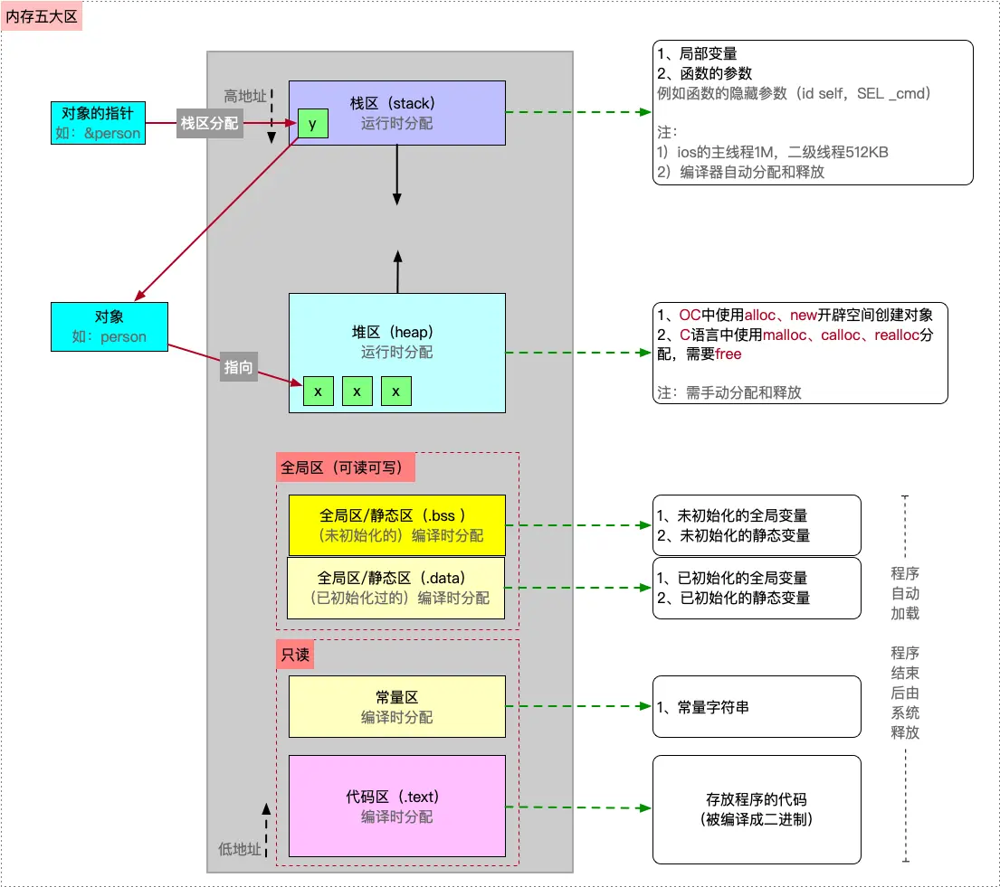
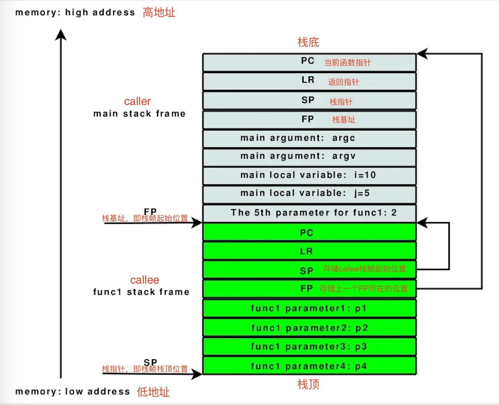

## 栈区

**定义**

- 栈是一种数据结构，其对应的`进程或线程是唯一的`
- 栈是一种`向低地址拓展`的数据结构
- 栈是一块`连续的内存`， 遵循先进后出原则
- 栈道地址空间在iOS中`以0X7`开头
- 栈区一般在运行时分配

**存储**

栈区是由`编译器自动分配并释放`的，主要用来存储

- 局部变量
- 函数的参数，例如函数的隐藏参数（id self，SEL _cmd）

**优缺点**

- 优点：因为栈是由编译器自动分配并释放的，不会产生内存碎片，所以快速高效
- 缺点：栈的内存大小有限制，数据不灵活
- iOS主线程栈大小是1MB

- 其他线程是512KB

- MAC只有8M

## 堆区（Heap）

**定义**

- 堆是`向高地址扩展`的数据结构
- 堆是`不连续的内存区域`，类似于链表结构（便于增删，不便于查询），遵循先进先出（FIFO）原则
- 堆的地址空间在iOS中是以`0x6开头`，其空间的分配总是动态的
- 堆区的分配一般是在`运行时`分配

**存储**

- 堆区是由程序员动态分配和释放的，如果程序员不释放，程序结束后，可能由操作系统回收，主要用于存放
- OC中`使用alloc或者 使用new开辟空间创建对象`
- C语言中`使用malloc、calloc、realloc分配的空间，需要free释放`

**优缺点**

- 优点：灵活方便，数据适应面广泛
- 缺点：需`手动管理，速度慢、容易产生内存碎片`

当需要访问堆中内存时，一般需要先通过对象`读取到栈区的指针地址`，然后通过指针地址访问堆区

## 全局区（静态区，即.bss & .data）

全局区是`编译时分配的内存空间`，在iOS中一般以`0x1`开头，在程序运行过程中，此内存中的数据一直存在，程序结束后由系统释放，主要存放

- 未初始化的全局变量和静态变量，即BSS区（.bss）
- 已初始化的全局变量和静态变量，即数据区（.data）

其中，全局变量是指变量值可以在`运行时被动态修改`，而静态变量是static修饰的变量，包含静态局部变量和静态全局变量

## 常量区（即.rodata）

常量区是	`编译时分配的内存空间`，在程序结束后由系统释放，主要存放

- 已经使用了的，且没有指向的`字符串常量`

字符串常量因为可能在程序中被多次使用，所以`在程序运行之前就会提前分配内存

## 代码区（即.text）

代码区是	`编译时分配`主要用于`存放程序运行时的代码`,代码会被`编译成二进制`存进内存的

## 函数栈

- 函数栈又称为栈区，在内存中从高地址往低地址分配，与堆区相对，具体图示请查看文章最开始的图示
- `栈帧是指函数（运行中且未完成）占用的一块独立的连续内存区域` 
- 应用中新创建的`每个线程都有专用的栈空间`，栈可以在线程期间自由使用。而线程中有千千万万的函数调用，这些函数共享进程的这个`栈空间`。`每个函数所使用的栈空间是一个栈帧，所有的栈帧就组成了这个线程完整的栈`
- 函数调用是发生在`栈上`的，每个`函数的相关信息`（例如局部变量、调用记录等）都`存储在一个栈帧`中，每执行一次函数调用，就会生成一个与其相关的栈帧，然后将其`栈帧压入函数栈`，而当函数`执行结束`，则将此`函数对应的栈帧出栈并释放掉`

如下图所示，是经典图 - ARM的栈帧布局方式

- 其中`main stack frame`为调用函数的栈帧
- `func1 stack frame`为`当前函数(被调用者)的栈帧`
- `栈底在高地址，栈向下增长。`
- FP就是`栈基址`，它指向函数的`栈帧起始地址`
- `SP`则是函数的`栈指针`，它指向栈顶的位置。

-`ARM压栈`的顺序很是规矩(也比较容易被黑客攻破么)，依次为`当前函数指针PC、返回指针LR、栈指针SP、栈基址FP、传入参数个数及指针、本地变量和临时变量。`如果函数准备调用另一个函数，跳转之前临时变量区先要保存另一个函数的参数。

- ARM也可以`用栈基址和栈指针明确标示栈帧的位置，`栈指针SP一直移动，ARM的特点是，`两个栈空间内的地址（SP+FP）前面，必然有两个代码地址（PC+LR）明确标示着调用函数位置内的某个地址。`

### 堆栈溢出

一般情况下应用程序是不需要考虑堆和栈的大小的，但是事实上堆和栈`都不是无上限的`，`过多的递归会导致栈溢出，过多的alloc变量会导致堆溢出。`

所以预防堆栈溢出的方法：

（1）避免层次过深的递归调用；

（2）`不要使用过多的局部变量，`控制局部变量的大小；

（3）避免分配占用空间太大的对象，并`及时释放`;

（4）实在不行，适当的情景下`调用系统API修改线程的堆栈大小；`

---

原文发布于 CSDN：[【iOS】内存五大分区](https://blog.csdn.net/2402_86720949/article/details/154609757)
