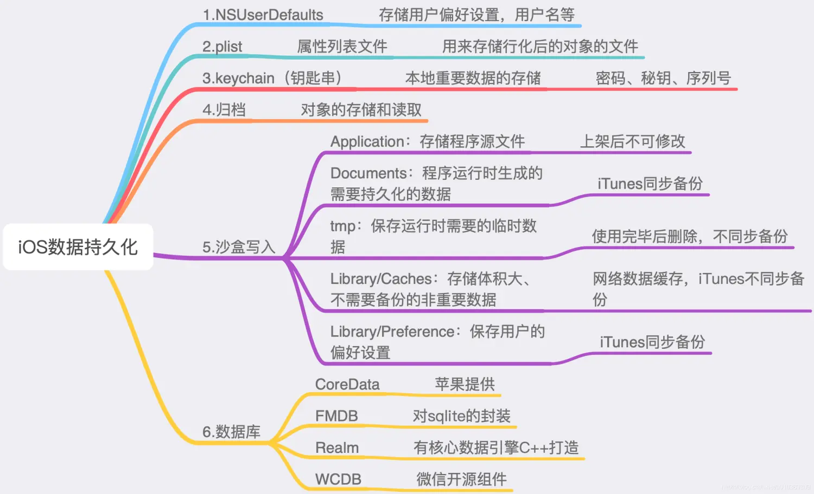
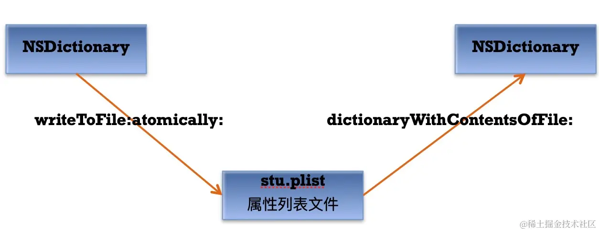
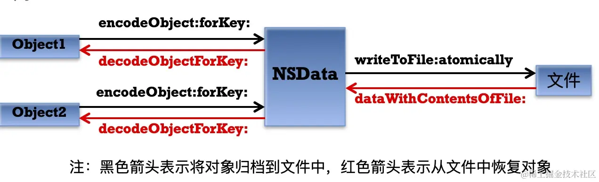
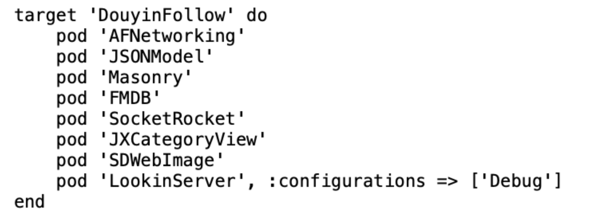
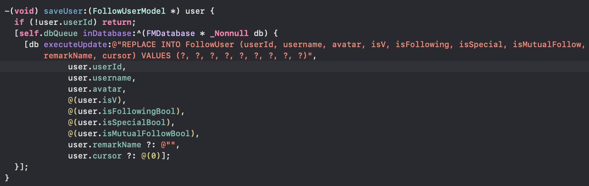
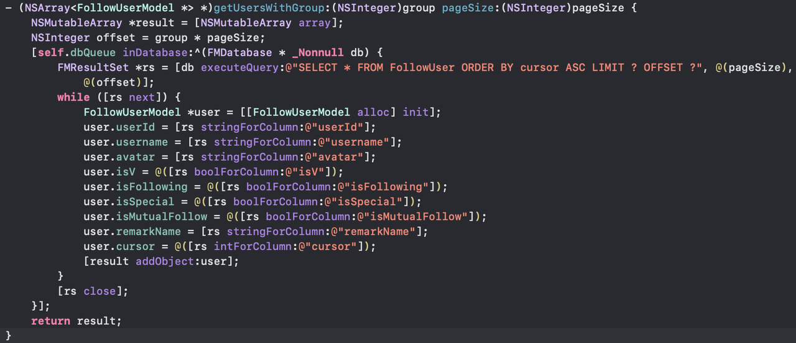

根据要存储的数据大小、存储数据以及存储类型，存储方式主要分为一下几种：


Plist（属性列表），不能存放自定义对象
 Preference（偏好设置/NSUserDefaults）
 NSCoding（NSKeyedArchiver/NSKeyedUnarchiver，归档/解档）
 SQLite3
 Core Data（面向对象）
 FMDB





## 沙盒机制


沙盒机制是iOS APP特有的一种机制：[https://developer.apple.com/library/archive/documentation/FileManagement/Conceptual/FileSystemProgrammingGuide/FileSystemOverview/FileSystemOverview.html](https://developer.apple.com/library/archive/documentation/FileManagement/Conceptual/FileSystemProgrammingGuide/FileSystemOverview/FileSystemOverview.html)


iOS程序默认情况下只能访问自己的目录，这个目录被称为 “沙盒”


沙盒其实就是每一个iOS App特有的一个文件夹，每个iOS App都有自己的应用沙盒（文件系统目录），其结构和目录特性都是一样的


沙盒目录与其他文件系统隔离，应用必须呆在自己的沙盒里，其他应用不能访问该沙盒


简言之，应用只能访问**自己应用**下的文件。


```objective-c
NSString* path = NSHomeDirectory();
NSLog(@"%@", path);
```


**NSHomeDictionary **可以直接得到该沙盒路径。


### 沙盒目录特性


沙盒中每个文件夹都有各自的特性，所以在选择存放目录时，一定要选择合适的目录


应用程序包： 除沙盒目录之外，每一个App还有一个**Bundle目录，**即 “应用程序包（Application）”，该目录下存放的是应用程序的源文件，包括资源文件和可执行文件，上架前经过数字签名，上架后不可修改。获取Bundle路径的方法是：


```objective-c
NSString* path = [[NSBundle mainBundle] bundlePath];
NSLog(@"%@", path);
```


 如果需要借用某个App的图标或贴图，可以在**该App中的程序应用包**中找到.app结尾的源文件，然后右键点击显示包内容即可直接获取到其所有的图标和贴图


**Documents：** 保存应用运行时生成的需要持久化的数据，iTunes同步该应用时会同步该文件夹中的内容，适合存储重要数据。获取该文件路径的方法是：


```objective-c
NSString* path = NSSearchPathForDirectoriesInDomains(NSDocumentDirectory, NSUserDomainMask, YES).firstObject;
NSLog(@"%@", path);
```


 **Library/Caches：** iTunes同步该应用时不会同步该文件夹中的内容，适合存储体积大、无需备份的非重要文件。比如网络数据缓存就会存储到cache文件中：


```objective-c
//获取Library：NSSearchPathForDirectoriesInDomains(NSCachesDirectory, NSUserDomainMask, YES).lastObject
NSString* path = NSSearchPathForDirectoriesInDomains(NSCachesDirectory, NSUserDomainMask, YES).firstObject;
NSLog(@"%@", path);
```


 **Library/Preferences:  **iTunes同步该应用时会同步此文件夹的内容，通常保存应用的偏好设置，使用
NSUserDefaults
类来获取和设置应用的偏好
 **tmp： i**Tunes不会同步此文件夹，此目录用于存放临时数据，使⽤完毕后相应的文件会从该目录删除，保存应用程序再次启动过程中不需要的信息


```objective-c
NSString* path = NSTemporaryDirectory();
NSLog(@"%@", path);
```


 **NSSearchPathForDirectoriesInDomains**


directory 表明我们要搜索的目录名称，比如NSDocumentDirectory搜索Documents目录、NSCachesDirectory搜索Library/Caches目录


 domainMask 指定搜索范围，NSUserDomainMask表示搜索范围限制在当前应用的沙盒目录，还有NSLocalDomainMask（表示/Library）、NSNetworkDomainMask（表示/Network）


 expandTilde BOOL值，表示是否展开波浪线。
 比如该值为YES表示路径写成全写形式：/Users/Username/Library/Developer/CoreSimulator/Devices/8D71115A-D081-4440-9C94-13BD102412DB/data/Containers/Data/Application/D53B8C34-A16B-4A3D-9931-001D06F0C51F/Library/Caches
 该值为NO表示路径写成：~/Library/Caches
  


## NSUserDefaults


用于存储用户的偏好设置和用户信息,如用户名,是否自动登录,字体大小等.
 数据自动保存在沙盒的Libarary/Preferences目录下.
 NSUserDefaults将输入的数据储存在.plist格式的文件下,这种存储方式就决定了它的安全性几乎为0,所以不建议存储一些敏感信息如:用户密码,token,加密私钥等!
 它能存储的数据类型为:NSNumber（NSInteger、float、double），NSString，NSDate，NSArray，NSDictionary，BOOL.
 不支持自定义对象的存储.


```objective-c
NSUserDefaults *userDefault = [NSUserDefaults standardUserDefaults];
    [userDefault setInteger:1 forKey:@"integer"];
    [userDefault setBool:YES forKey:@"BOOl"];
    [userDefault setFloat:6.5 forKey:@"float"];
    [userDefault setObject:@"123" forKey:@"numberString"];
    NSString *numberString = [userDefault objectForKey:@"numberString"];
    BOOL myBool = [userDefault boolForKey:@"BOOl"];
    [userDefault removeObjectForKey:@"float"];
    [userDefault synchronize];
```


同时我们需要注意：


NSUserDefaults存储的数据都是不可变的,想将可变数据存入需要先转为不可变才可以存储.
 NSUserDefaults是定时把缓存中的数据写入磁盘的，而不是即时写入，为了防止在写完NSUserDefaults后程序退出导致的数据丢失，可以在写入数据后使用synchronize强制立即将数据写入磁盘.


## plist


属性列表是一种XML格式的文件，拓展名为plist如果对是NSString、NSDictionary、NSArray、NSData、NSNumber等类型，就可以使用writeToFile:atomically:方法直接将对象写到属性列表文件中。它是一种用来储存串行化后的对象的文件，用来储存程序中经常用到且数据量较小不轻易改动的数据。


属性列表-归档NSDictionary将一个NSDictionary对象归档到一个plist属性列表中


下图为属性列表-NSDictionary的存储和读取过程。





```objective-c
// 将数据封装成字典
NSMutableDictionary *dict = [NSMutableDictionary dictionary];
[dict setObject:@"张三" forKey:@"name"];
[dict setObject:@"155xxxxxxx" forKey:@"phone"];
[dict setObject:@"27" forKey:@"age"];
// 将字典持久化到Documents/stu.plist文件中
[dict writeToFile:path atomically:YES];
```


```objective-c
// 读取Documents/stu.plist的内容，实例化
NSDictionaryNSDictionary *dict = [NSDictionary dictionaryWithContentsOfFile:path];
NSLog(@"name:%@", [dict objectForKey:@"name"]);
NSLog(@"phone:%@", [dict objectForKey:@"phone"]);
NSLog(@"age:%@", [dict objectForKey:@"age"]);
```


## 偏好设置


很多iOS应用都支持偏好设置，比如保存用户名、密码、字体大小等设置，iOS提供了一套标准的解决方案来为应用加入偏好设置功能。
 每个应用都有个NSUserDefaults实例，通过它来存取偏好设置。


比如，保存用户名、字体、是否自动登录：


```objective-c
NSUserDefaults *defaults = [NSUserDefaults standardUserDefaults];
[defaults setObject:@"张三" forKey:@"username"];
[defaults setFloat:18.0f forKey:@"text_size"];
[defaults setBool:YES forKey:@"auto_login"];
```


读取上次设置


```objective-c
NSUserDefaults *defaults = [NSUserDefaults standardUserDefaults];
[defaults setObject:@"张三" forKey:@"username"];
[defaults setFloat:18.0f forKey:@"text_size"];
[defaults setBool:YES forKey:@"auto_login"];
```


**注意：** UserDefaults设置数据时，不是立即写入，而是根据时间戳定时地把缓存中的数据写入本地磁盘。所以调用了set方法之后数据有可能还没有写入磁盘应用程序就终止了。出现以上问题，可以通过调用synchornize方法`[defaults synchornize];`强制写入。


## Keychain


很多时候，我们都需要将敏感数据(password, accessToken, secretKey等)存储到本地。为了能安全的在本地存储敏感信息，我们应当使用苹果提供的`KeyChain`服务。他的数据储存在硬盘上，删除了应用，保存的数据还在。


这里引用一篇写的很好的博客：[https://www.cnblogs.com/m4abcd/p/5242254.html](https://www.cnblogs.com/m4abcd/p/5242254.html)


## 归档与解档


在iOS中，对象的序列化和反序列化分别使用**NSKeyedArchiver和NSKeyedUnarchiver**两个类，我们可以把一个类对象进行序列化然后保存到文件中，使用时再读取文件，把内容反序列化出来。这个过程通常也被称为 **
对象的编码（归档）和解码（解档）
**


**归档 **— 将对象以文件（二进制数据）的形式保存到磁盘上中（也称序列化，持久化）
 **解档 **— 使用时从磁盘上读取该文件的保存路径，从而读取文件的内容（也称反序列化）


 **归档一般保存自定义对象、自定义对象数组，由于自定义对象不具有归档的性质，所以只有遵循了
NSCoding协议
的类才可以归档（NSCodong：即苹果规定的序列化接口）**


 由于决大多数支持存储数据的Foundation和Cocoa Touch类都遵循了NSCoding协议，因此，对于大多数OC提供的类来说，归档相对而言还是比较容易实现的。


对象归档的文件是**保密**的，在磁盘上无法查看文件中的内容，而属性列表是明文的，可以查看。通过文件归档产生的文件是不可见的，如果打开归档文件的话，内容是乱码的；ta不同于属性列表和plist文件是可见的，正因为不可见的缘故，使得**这种持久性的数据保存更有可靠性**


NSCoding 协议有2个方法：


- `encodeWithCoder`: 每次归档对象时，都会调用这个方法。一般在这个方法里面指定如何归档对象中的每个实例变量，可以使用encodeObject:forKey:方法归档实例变量。
- `initWithCoder`: 每次从文件中恢复(解码)对象时，都会调用这个方法。一般在这个方法里面指定如何解码文件中的数据为对象的实例变量，可以使用decodeObject:forKey方法解码实例变量。


### 自定义对象的单个对象的解档与归档


iOS13中只有支持**NSSecureCoding协议（父协议为NSCoding）**才能支持归档


1、自定义一个Person类病实现 NSCoding协议的方法


```objective-c
@interface Person : NSObject <NSSecureCoding>

@property (nonatomic, copy)NSString* name;
@property (nonatomic, assign)int age;
@property (nonatomic, assign)double weight;

@end

@implementation Person

//NSCoder是一个抽象类
//归档的协议方法
//将归档对象序列化
- (void)encodeWithCoder:(NSCoder *)coder {
    [coder encodeObject: self.name forKey: @"name"];
    [coder encodeInt: self.age forKey: @"age"];
    [coder encodeDouble: self.weight forKey: @"weight"];
}

//解档的协议方法
//将解档对象反序列化
- (instancetype)initWithCoder:(NSCoder *)coder {
    self = [super init];
    if (self) {
        self.name = [coder decodeObjectForKey: @"name"];
        self.age = [coder decodeIntForKey: @"age"];
        self.weight = [coder decodeDoubleForKey: @"weight"];
    }

    return self;
}

@end

//NSSecureCoding的协议方法
+ (BOOL)supportsSecureCoding {
    return YES;
}
```


2、初始化待归档对象病进行归档


+ (nullable NSData *)archivedDataWithRootObject:(id)object requiringSecureCoding:(BOOL)requiresSecureCoding error:(NSError **)error;


```objective-c
Person* person = [[Person alloc] init];
        person.name = @"XY";
        person.age = 20;
        person.weight = 125.0;

        //归档成二进制数据流
        NSError* error;
        NSData* data1 = [NSKeyedArchiver archivedDataWithRootObject: person requiringSecureCoding: YES error: &error];
        if (error) {
            NSLog(@"归档错误：%@", error);
            return 0;
        }
        //写入指定路径（一般写入到沙盒，这里方便演示存到一个新的文件夹）
        [data1 writeToFile: @"/Users/jakey/Desktop/CS/Xcode/NSKeyedArchiverTest/test.archiver" atomically: YES];
```


保存后的文件一般无法打开，我们通过终端打开后，发现内容是经过加密的，正好对应前文。


3、开始解档


+ (nullable id)unarchivedObjectOfClass:(Class)cls fromData:(NSData *)data error:(NSError **)error;


```objective-c
//解档此二进制数据
        error = nil;
        NSData* data2 = [NSData dataWithContentsOfFile: @"/Users/jakey/Desktop/CS/Xcode/NSKeyedArchiverTest/test.archiver"];
        Person* unarchiverPerson = (Person *)[NSKeyedUnarchiver unarchivedObjectOfClass: [Person class] fromData: data2 error: &error];
        if (error) {
            NSLog(@"解档错误：%@", error);
        }
        NSLog(@"unarchiverPerson：%@", unarchiverPerson);
### 多个对象解档归档


1、初始化待归档对象并归档


```objective-c
Person* person1 = [[Person alloc] init];
person1.name = @"XY";
person1.age = 20;
person1.weight = 125.0;
Dog* dog1 = [[Dog alloc] init];
dog1.name = @"Bruce";
person1.dog = dog1;

Person* person2 = [[Person alloc] init];
person2.name = @"Jacky";
person2.age = 21;
person2.weight = 130.0;
Dog* dog2 = [[Dog alloc] init];
dog2.name = @"Oudy";
person2.dog = dog2;

//创建归档对象
NSKeyedArchiver* archiver = [[NSKeyedArchiver alloc] initRequiringSecureCoding: NO];

//进行归档（编码）操作
[archiver encodeObject: person1 forKey: @"personOne"];
[archiver encodeObject: person2 forKey: @"personTwo"];

//将归档（序列化）后的数据写入指定文件中
[archiver.encodedData writeToFile: @"/Users/jakey/Desktop/CS/Xcode/NSKeyedArchiverTest/test.archiver" atomically: YES];

//结束归档
[archiver finishEncoding];
```


2、依次解档


```objective-c
//解档
NSData* data = [NSData dataWithContentsOfFile: @"/Users/jakey/Desktop/CS/Xcode/NSKeyedArchiverTest/test.archiver"];
NSKeyedUnarchiver* unarchiver = [[NSKeyedUnarchiver alloc] initForReadingFromData: data error: nil];
unarchiver.requiresSecureCoding = NO;

Person* unchiverPerson1 = [unarchiver decodeObjectForKey: @"personOne"];
NSLog(@"%@ %d %lf %@", unchiverPerson1.name, unchiverPerson1.age, unchiverPerson1.weight, unchiverPerson1.dog.name);
Person* unchiverPerson2 = [unarchiver decodeObjectForKey: @"personTwo"];
NSLog(@"%@ %d %lf %@", unchiverPerson2.name, unchiverPerson2.age, unchiverPerson2.weight, unchiverPerson2.dog.name);
```





## FMDB


这是一个轻量化数据库，也是对iOS相关SQLite的API进行封装的第三方库，使用者只需要调取该框架的API就能很方便对本地数据库进行操作。


**优点：**


- 使用起来更为面向对象
- 提高多线程安全，有效防止数据混乱（原来的SQLite线程不是安全的）

**缺点：**


- 失去的SQLite原有的跨平台性

使用cocoapods导入FMDB库





FMDB一般涉及以下三个核心类：


- **FMDataBase**：代表一个单一的SQLite数据库，也有许多执行SQLite语句的语法。
- **FMResult**：结果集，使用FMDataBase执行SQLite查询语句后的结果集
- **FMDatabaseQueue（数据库队列）**：在多个线程来执行查询和更新时会使用这个类。

接下来，我们讲讲FMDB的几个操作：


### 创建数据库


- ```objective-c
/*
 1. 如果该路径下已经存在该数据库，直接获取该数据库;
 2. 如果不存在就创建一个新的数据库;
 3. 如果传@""，会在临时目录创建一个空的数据库，当数据库关闭时，数据库文件也被删除;
 4. 如果传nil，会在内存中临时创建一个空的数据库，当数据库关闭时，数据库文件也被删除;
*/
+ (FMDatabase *)databaseWithPath:(NSString *)filePath;
### 打开（关闭）数据库


- ```objective-c
/* 打开数据库，成功返回YES，失败返回NO */
- (BOOL)open;
/* 关闭数据库，成功返回YES，失败返回NO */
- (BOOL)close;
### 执行更新的SQL语句
- 在FMDB中，除了查询以外的所有操作都称为更新。如 `create` `drop` `insert` `update` `delete` 等命令都是更新操作
- ```objective-c
/* 执行更新的SQL语句，字符串里面的"?"，依次用后面的参数替代，必须是对象，不能是int等基本类型 */
- (BOOL)executeUpdate:(NSString *)sql,... ;
/* 执行更新的SQL语句，可以使用字符串的格式化进行构建SQL语句 */
- (BOOL)executeUpdateWithFormat:(NSString*)format,... ;
/* 执行更新的SQL语句，字符串中有"?"，依次用arguments的元素替代 */
- (BOOL)executeUpdate:(NSString*)sql withArgumentsInArray:(NSArray *)arguments;
```

下面的几种方式等价：


```objective-c
/* 1. 直接使用完整的SQL更新语句 */
[database executeUpdate:@"insert into mytable(num,name,sex) values(0,'liuting','m');"];

NSString *sql = @"insert into mytable(num,name,sex) values(?,?,?);";
/* 2. 使用不完整的SQL更新语句，里面含有待定字符串"?"，需要后面的参数进行替代 */
[database executeUpdate:sql,@0,@"liuting",@"m"];
/* 3. 使用不完整的SQL更新语句，里面含有待定字符串"?"，需要数组参数里面的参数进行替代 */
[database executeUpdate:sql
   withArgumentsInArray:@[@0,@"liuting",@"m"]];

/* 4. SQL语句字符串可以使用字符串格式化，这种我们应该比较熟悉 */
[database executeUpdateWithFormat:@"insert into mytable(num,name,sex) values(%d,%@,%@);",0,@"liuting","m"];
```





### 执行查询的SQL语句


```objective-c
/* 执行查询SQL语句，返回FMResultSet查询结果 */
- (FMResultSet *)executeQuery:(NSString*)sql, ... ;
- (FMResultSet *)executeQueryWithFormat:(NSString*)format, ... ;
- (FMResultSet *)executeQuery:(NSString *)sql withArgumentsInArray:(NSArray *)arguments;
```


```objective-c
/* 获取下一个记录 */
- (BOOL)next;
/* 获取记录有多少列 */
- (int)columnCount;
/* 通过列名得到列序号，通过列序号得到列名 */
- (int)columnIndexForName:(NSString *)columnName;
- (NSString *)columnNameForIndex:(int)columnIdx;
/* 获取存储的整形值 */
- (int)intForColumn:(NSString *)columnName;
- (int)intForColumnIndex:(int)columnIdx;
/* 获取存储的长整形值 */
- (long)longForColumn:(NSString *)columnName;
- (long)longForColumnIndex:(int)columnIdx;
/* 获取存储的布尔值 */
- (BOOL)boolForColumn:(NSString *)columnName;
- (BOOL)boolForColumnIndex:(int)columnIdx;
/* 获取存储的浮点值 */
- (double)doubleForColumn:(NSString *)columnName;
- (double)doubleForColumnIndex:(int)columnIdx;
/* 获取存储的字符串 */
- (NSString *)stringForColumn:(NSString *)columnName;
- (NSString *)stringForColumnIndex:(int)columnIdx;
/* 获取存储的日期数据 */
- (NSDate *)dateForColumn:(NSString *)columnName;
- (NSDate *)dateForColumnIndex:(int)columnIdx;
/* 获取存储的二进制数据 */
- (NSData *)dataForColumn:(NSString *)columnName;
- (NSData *)dataForColumnIndex:(int)columnIdx;
/* 获取存储的UTF8格式的C语言字符串 */
- (const unsigned cahr *)UTF8StringForColumnName:(NSString *)columnName;
- (const unsigned cahr *)UTF8StringForColumnIndex:(int)columnIdx;
/* 获取存储的对象，只能是NSNumber、NSString、NSData、NSNull */
- (id)objectForColumnName:(NSString *)columnName;
- (id)objectForColumnIndex:(int)columnIdx;
```





## FMDatabaseQueue


`FMDatabase`这个类是线程不安全的，如果在多个线程同时使用一个`FMDatabase`实例，会造成数据混乱问题。 为了保证线程安全，FMDB提供方便快捷的`FMDatabaseQueue`类，要使用这个类，需要`#import`导入头文件`"FMDatabaseQueue.h"`，`FMDatabaseQueue`类的操作很多都和`FMDatabase`很相似


```objective-c
NSString *path = NSSearchPathForDirectoriesInDomains(NSDocumentDirectory,NSUserDomainMask,YES).firstObject;
NSString *filePath = [path stringByAppendingPathComponent:@"FMDB.db"];
FMDatabaseQueue *queue = [FMDatabaseQueue databaseQueueWithPath:path];
```


```objective-c
[queue inDatabase:^(FMDatabase*db) {
        //FMDatabase数据库操作
}];
```


## 事物


事物是指作为单个逻辑工作但愿执行的一系列操作，要么完整执行，要么完全的不自信。


想象一个场景，比如你要更新数据库的大量数据，我们需要确保所有的数据更新成功，才采取这种更新方案，如果在更新期间出现错误，就不能采取这种更新方案了，如果我们不使用事务，我们的更新操作直接对每个记录生效，万一遇到更新错误，已经更新的数据怎么办？难道我们要一个一个去找出来修改回来吗？怎么知道原来的数据是怎么样的呢？这个时候就需要使用**事务**实现。


```objective-c
只要在执行SQL语句前加上以下的SQL语句，就可以使用事务功能了：
开启事务的SQL语句，"begin transaction;"
进行提交的SQL语句，"commit transaction;"
进行回滚的SQL语句，"rollback transaction;"
```


只有事物提交了，开启事物的操作才会生效


> **总结**


> FMDB对SQLite进行了良好的封装，使用起来非常方便，对于那些使用纯SQLite来进行[数据库操作](https://so.csdn.net/so/search?q=%E6%95%B0%E6%8D%AE%E5%BA%93%E6%93%8D%E4%BD%9C&spm=1001.2101.3001.7020)的项目，可以将其迁移到FMDB上，提高数据库相关功能维护的效率 具体的一些其他方法将继续参考这个链接进行学习：https://ccgus.github.io/fmdb/html/index.html


## Core Data


因为笔者最近比较繁忙，这部分留到后面再进行学习

---

原文发布于 CSDN：[【iOS】数据持久化](https://blog.csdn.net/2402_86720949/article/details/155421618)
