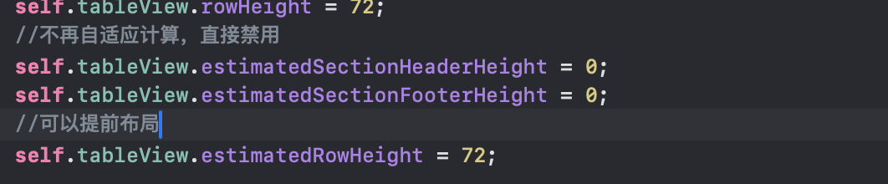
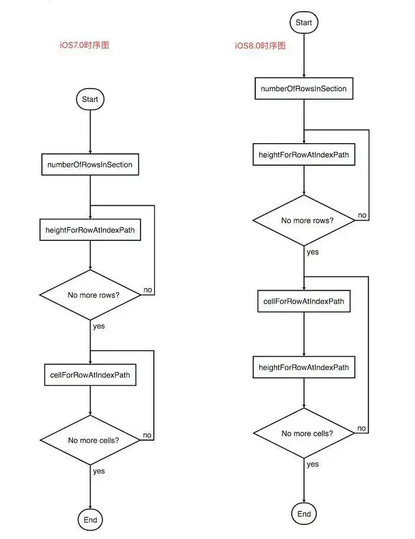

## 一、优化的本质


`UITableView` 的优化本质在于提高滚动性能和减少内存使用，以保证流畅的用户体验，从计算机层面来讲，其核心本质为降低 CPU和GPU 的工作来提升性能


CPU：对象的创建和销毁、对象属性的调整、布局计算、文本的计算和排版、图片的格式转换和解码、图像的绘制
 GPU：接收提交的纹理和顶点描述、应用变换、混合并渲染、输出到屏幕


## 二、卡顿产生原因


App主线程在`CPU`中显示计算内容，比如视图的创建，布局的计算，图片解码，文本绘制，然后我们的CPU会将计算好的内容提交到`GPU`中进行变换，合成，渲染，这其中也包括我们常说的离屏渲染


在开发中，`CPU与GPU`任何一个压力过大都会导致掉帧


## 三、CPU层面的优化


### cellForRowAtIntexPath 方法不要进行耗时操作


**1、不读取/写入文件**


**2、尽量少用addView给Cell动态添加View，可以在初始化就添加，然后通过设置气hidden来控制是否显示**


因为我们在滑动`UITableView`的过程中会不断调用这个方法。


### cell的复用


简单来讲就是我们的`UITableView`只会创建比一个屏幕所有显示的cell+1个单元格，当当前的cell划出屏幕时，我们的cell并不会销毁，而是会将其存入我们的复用池


当要显示某一个位置的cell时首先会去复用池中查找，如果找不到才会重新创建，而不是每一次都进行重新创建，这样就极大地减少了内存开销


可以参考我之前的博客：


[自定义cell与cell的复用](https://blog.csdn.net/2402_86720949/article/details/148500158?fromshare=blogdetail&sharetype=blogdetail&sharerId=148500158&sharerefer=PC&sharesource=2402_86720949&sharefrom=from_link)


### 提前计算布局


解了这件事情与tableView的复用机制之后，我们再回头看我们的cellForRow与heightForRow方法，我们知道当我们滑动tableview时就不断地调用这两个方法，因此这两个方法是性能优化的关键


UITableViewCell高度计算主要分为两种，一种**固定高度**，另外一种**动态高度**。


**rowHeight**
 这个属性是我们的固定高度，对于定高需求的表格，强烈建议使用这种方法来避免不必要的高度计算以及调用。或者我们可以使用`UITableViewDelegate`的`heightForRowAtIndexPath`，然而，实现这个方法后我们的rowHeight将无效，所以这个方法适合具有多种cell的UITableView。


**estimatedRowHeight**


这是一个估算行高的属性，对于动态计算行高，这里有多种方法，但核心还是通过`设置预算高度和estimatedRowHeight = UITableViewAutomaticDimension`，然后`用AutoLayout对控件进行约束达到撑开cell`的目的。


但是这也不可避免地加大了内存开销，因为AutoLayout最终需要转成frame


我们通过estimatedRowHeight与AutoLayout大大简化了我们动态计算行高的过程，同时我们需要尽可能精确估计estimatedRowHeight的范围，即使面对种类不同的 cell，我们依然可以使用简单的 estimatedRowHeight 属性赋值，只要整体估算值接近就可以，比如大概有一半 cell 高度是 44， 一半 cell 高度是 88， 那就可以估算一个 66，基本符合预期。尽可能精确的估算可以使初次加载和滚动表格时更加流畅


#### 1、设置预估行高


我们知道`UITableView`是通过UITableView代理方法`heightForRowAtIndexPath:`方法来设置行高。自从iOS8.0之后，苹果新增了self-sizing cell的概念，也是cell可以自己计算行高，使用需要满足是三个条件：


> (1) 使用`Autolayout`进行UI布局约束 (2) 指定`TableView的estimatedRowHeight`属性的默认值 (3) 指定TableView的rowHeight的属性为`UITableViewAutomaticDimension`。


TableView在加载数据时会先通过`estimatedRowHeight:AtIndexPath`处理全部数据，此时我们只需要提供一个粗略的高度，待到cell对象创建之后再去设置cell的真实高度。而且只会处理当前屏幕范围内的cell，这样子会显著的提升加载的性能。





#### 2、预先计算并缓存行高





从上图可以很容易的分析出，iOS8.0之后在获取cell对象之后会再次调用`heightForRowAtIndexPath:`方法获取行高，这也就意味着我们其实可以先创建cell对象，之后再提供行高。具体方法我们可以在cell类中添加layoutAttribute属性，记录相应的`UIEdgeInsets`，然后在设置cell真实高度的时候返回。iOS7.0之前则必须在cell对象处啊给你讲爱你之前先获得所有cell的高度。


### 异步加载图片：SDWebImage 的使用


（1）使用异步子线程处理，然后再返回主线程操作；
 （2）图片缓存处理，避免多次处理操作；
 （3）图片圆角处理时，设置 layer 的 shouldRasterize 属性为 YES，可以将负载转移给 CPU；


这部分内容笔者现在也不是很清楚，会在学习网SDWebImage源码后再进行补充。


## 四、GPU层面优化


### 离屏渲染


什么是离屏渲染？我们知道iOS底层的渲染框架使用的是`OpenGL ES`。OpenGL中，GPU渲染屏幕方式有两种：当前屏幕渲染`（On-Screen Rendering）`和离屏渲染`（Off-Screen Rendering）`。它们的区别是当前屏幕渲染操作是在当前屏幕缓冲区完成，而离屏渲染会在另外一个**新开辟的缓冲区完成渲染操作**，开启离屏渲染的代价就是需要新开辟一块新的缓冲区，在渲染的过程中还会多次切换上下文，这些都是很消耗性能的。


官方对离屏渲染产生性能问题也进行了优化：


- iOS 9.0 之前`UIimageView跟UIButton`设置圆角都会触发离屏渲染。
- iOS 9.0 之后`UIButton设置圆角`会触发离屏渲染，而`UIImageView里png图片`设置圆角不会触发离屏渲染了，如果设置其他阴影效果之类的还是会触发离屏渲染的。

一下情况均会造成 离屏渲染 ：


- 为图层设置遮罩（layer.mask）
- 设置图层的layer.masksToBounds/view.clipsToBounds属性为True
- 设置图层的layer.allowsGroupOpacity的属性为True和layer.opacity小于1.0
- 设置图层阴影（layer.shadow）
- 设置图层的layer.shouldRasterize的属性为True -具有layer.cornerRadius，layer.edgeAntialiasingMask， – layer.allowsAntialiasing的图层
- 文本（任何种类，包括UILabel、CATextLayer、Core Text等）
- 使用CGContext在drawRect:方法中绘制


#### 离屏渲染的优化


** 使用贝塞尔曲线 + `Core Graphics` 框架设置圆角**


```objective-c
- (void)setImageCircularEdge:(UIImageView *)imageView {

    //开始对imageView进行画图
    UIGraphicsBeginImageContextWithOptions(imageView.bounds.size, NO, 1.0);
    //使用贝塞尔曲线画出一个圆形图
    [[UIBezierPath bezierPathWithRoundedRect:imageView.bounds cornerRadius:imageView.frame.size.width] addClip];
    [imageView drawRect:imageView.bounds];
    imageView.image = UIGraphicsGetImageFromCurrentImageContext();
    //结束画图
    UIGraphicsEndImageContext();
}
```


** 使用贝塞尔曲线 + `CAShapeLayer` 设置圆角 **


```objective-c
- (void)setImageCircularEdge2:(UIImageView *)imageView {

    UIBezierPath *maskPath = [UIBezierPath bezierPathWithRoundedRect:imageView.bounds byRoundingCorners:UIRectCornerAllCorners cornerRadii:imageView.bounds.size];
    CAShapeLayer *maskLayer=[[CAShapeLayer alloc] init];
    //设置大小
    maskLayer.frame = imageView.bounds;
    //设置图形样子
    maskLayer.path = maskPath.CGPath;
    imageView.layer.mask = maskLayer;
}
```


对于方案2需要解释的是：


`CAShapeLayer`继承于`CALayer`,可以使用CALayer的所有属性值；
 `CAShapeLayer需要贝塞尔曲线配合使用才有意义`（也就是说才有效果）
 使用CAShapeLayer(属于CoreAnimation)与贝塞尔曲线可以实现不在view的drawRect（继承于CoreGraphics走的是CPU,消耗的性能较大）方法中画出一些想要的图形
 CAShapeLayer动画渲染直接提交到手机的GPU当中，相较于view的drawRect方法使用CPU渲染而言，其效率极高，能大大优化内存使用情况。


> 总的来说就是用`CAShapeLayer`的内存消耗少，渲染速度快，建议使用优化方案2。


对于离屏渲染的检测，据说苹果为我们提供了一个测试工具，这里先埋一个坑，以后再来填。


## 总结


UITableView的性能优化涉及到了许多层面，下到底层的Layer属性，上到第三方库SDWebImage与RunLoop，这些东西的实现都十分巧妙，还有很长一段路需要学习


这里笔者写一下Tableview 性能优化方法总览


- 实现Tableview的懒加载以及cell的复用（这是优化Tableview最基础的部分，老生常谈了，特别是复用池这一块的内容：将加载过的cell加入到复用池中，需要时取出）
- 高度缓存（本篇文章着重介绍了cell的高度缓存机制，因为heightForRowAtIndexPath: 是调用最频繁的方法，我们围绕这个方法展开，通过避免重复计算来减少我们的内存开销。当行高固定时使用固定行高，不固定时缓存一次后返回固定行高）
- 预缓存（在高度缓存的实现上进行优化，涉及到RunLoop层面的知识，后面加以补充，似乎与SDWebImage有异曲同工之处，十分巧妙）
- 异步加载图片（SDWebImage的使用，后面看源码看完再回来总结）
- 按需加载内容（涉及到许多协议，当快速滑动时不加载资源，即将停止滑动时加载资源，同时释放那些超出屏幕的资源，只显示目前呈现在屏幕上的内容）
- 视图层面（避免离屏渲染，使用贝塞尔曲线或是直接呈现采裁剪后的圆角图片来避免离屏渲染的发生）

---

原文发布于 CSDN：[【iOS】TableView的优化](https://blog.csdn.net/2402_86720949/article/details/155425916)
