## MVC模式


**MVC的前世：**


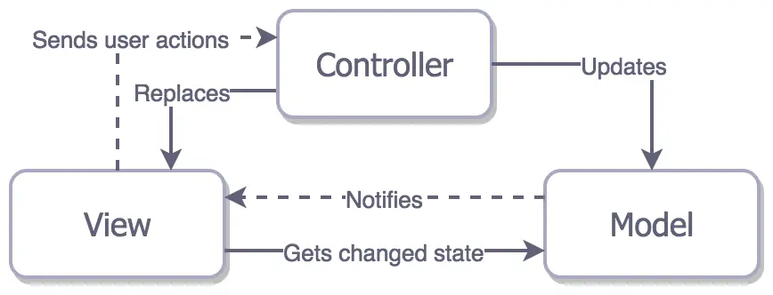


这个架构中，三个实体联系太过紧密，每个实体都知道另外的两个实体。这就导致了复用性能急剧下降。


**apple MVC** :


苹果官方推荐使用的MVC，结构大致如下：https://developer.apple.com/library/archive/documentation/General/Conceptual/DevPedia-CocoaCore/MVC.html


友链：https://www.jianshu.com/p/9e8fd85b61e0


可以看出`View`跟`Model`事实上是没有交互的，由`Controller`负责`Model`与`View`之间的交互，交互越多，`Controller`就越臃肿，更别提实际运用中有些还去掉了`View`层或者`Model`层。目前对MVC架构划分是`Model`作为`数据管理者`，`View`作为`数据展示者`，`Controller`作为`数据加工者`。


然而在iOS中`Controller`中由于有苹果内定的一些视图的生命周期在里面，比如`viewDidLoad`等等，于是就出现了一些关于iOS的MVC架构方面的争论，有些认为在iOS开发中并没有什么`View`和`Controller`，只有`Model+ViewController`。


这里，给出一个某大咖关于MVC框架的理解：


> Model应该做的： - 给ViewController提供数据 - 给ViewController储存数据提供接口 - 提供经过抽象的业务逐渐，供Controller调度 Controller应该做： - 管理生命周期 - 生成所有的View的实例，并放入ViewController - 监听来自View与业务有关的时间，通过和Model合作，来完成对应事件的业务。 View应该做： - 响应与业务无关的时间，并因此引发动画效果，点击反馈（如果合适还是放在View去做） - 界面元素表达


但是，几十年过去了，我们对于 MVC 这种设计模式真的用得好吗？其实不是的，MVC 这种分层方式虽然清楚，但是如果使用不当，很可能让大量代码都集中在 Controller 之中，让 MVC 模式变成了 `Massive View Controller` 模式。（巨屎控制器）


**MVC现实情况**


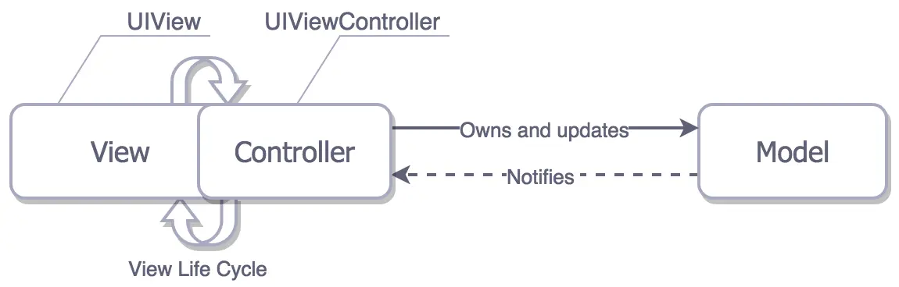


`Cocoa MVC`鼓励你使用大型的视图控制器（**Massive** View Controllers），由于他们都参与到了视图（`View`）的生命周期中了以至于很难说他们是分离的。尽管你仍有能力分流一些业务逻辑和数据转换功能到模型（`Model`）中，但是当涉及到把工作分流到视图（`View`）中去时你就诶有更多的选择了，因为在大多数时候视图（`View`）的所有职责是把动作传递到控制器（`Controller`）中。视图控制器（`View Controller`）最终最为所有控件的委托和数据源，通常负责调度和取消网络请求…应有尽有


因此，**M——VC** 可能是对iOS开发中`iOS`模式更为准确的解读，也更为准确地描述了我们日常开发编写的MVC代码。


就像在日常开发中的制定也cell，正是直接由View来调Model，所以事实上典型的MVC以及违背了，但是人们一直不觉得这有哪些不对。如果严格遵守`MVC`的话，你会把对`cell`的设置放在`Controller`中，不向`View`传递一个`Model`对象，这样就会大大增加`Controller的体积`。


综上所述，`Cocoa MVC`是一个相当糟糕的事情。但是如果你没有打算在项目架构上耗费太多时间，那么他就是你的最好选择。。


> Cocoa MVC is the best architectural pattern in term of the speed of the development. 在开发速度上面`Cocoa MVC`是最好的架构模式。


### 如何解决Controller臃肿的问题？


这里我摘录一段博客：


> 对于 View 来说，你如果抽象得好，那么一个 App 的动画效果可以很方便地移植到别的 App 上，而 Github 上也有很多 UI 控件，这些控件都是在 View 层做了很好的封装设计，使得它能够方便地开源给大家复用。 对于 Model 来说，它其实是用来存储业务的数据的，如果做得好，它也可以方便地复用。 说完 View 和 Model 了，那我们想想 Controller，Controller 有多少可以复用的？我们写完了一个 Controller 之后，可以很方便地复用它吗？结论是：非常难复用。在某些场景下，我们可能可以用 `addSubViewController` 之类的方式复用 Controller，但它的复用场景还是非常非常少的。 如果我们能够意识到 Controller 里面的代码不便于复用，我们就能知道什么代码应该写在 Controller 里面了，那就是那些不能复用的代码。在我看来，Controller 里面就只应该存放这些不能复用的代码，这些代码包括： - 在初始化时，构造相应的 View 和 Model。 - 监听 Model 层的事件，将 Model 层的数据传递到 View 层。 - 监听 View 层的事件，并且将 View 层的事件转发到 Model 层。 如果 Controller 只有以上的这些代码，那么它的逻辑将非常简单，而且也会非常短。


#### 把每一个网络请求封装为单例类


这其实是设计模式中的Command模式，优点如下：


- **解耦网络库：**C/M不直接依赖AFN
- **公共逻辑统一处理：**鉴权、token、版本号、统一错误处理、统一header等都可以在基类处理
- **缓存/数据持久化：**可以自行实现（如离线队列等）
- **更好的拓展性能：**支持插件、日志、JSON校验、请求组合（并行/串联）、短点续传等

这部分代码从Controller剥离后，不但简化了Controller逻辑，也达到了网络层的代码复用


> Controller / ViewModel ↓ 使用 Request 对象（构造 + 配置） Request (BaseRequest) ↓ 调用 RequestManager（封装 AFNetworking） RequestManager -> AFHTTPSessionManager ↓ 插件/拦截器（可选） Response / Error / Cache


#### 把界面拼装到专门类中


新手喜欢在controller中把UILabel UIButton UITextfield 往`self.view`上用`addsubView`方法放。可以两种方法把代码从Controller剥离。


- 构建专门的UIView子类，来负责这些控件的拼装。不过稍微麻烦的是，你需要把这些控件的事件回调先接管，再一一暴露回controller
- 用一个静态Util类，帮你做UIView的拼接工作。

方法一比较适合大型的项目，需要统一样式与行为。而方案二适合于少量封装和小工程量代码


#### 构造ViewModel


MVC不是不能用ViewModel？ MVVM的优点一样可以借鉴。具体来说就是吧ViewController给View传递数据这个过程，抽象为构建ViewModel的过程。


ViewMode包含：


- 从service获取ViewModel
- 把ViewModel交给View

同时在具体的实践中，我们可以创建构造专门的ViewModel工厂类。


那么又要有人问了，这不是和MVVM一样了吗？其实不然。`MVC + ViewModel`只是多了一个数据的格式化层，而真正的MVVM使用`ViewModel`和双向绑定让View和VM自动同步。 核心区别有两点：


- 有没有绑定
- ViewModel的职责是否拓展到事件处理和状态管理

真正的MVVM中，`ViewModel` 输出UI所需要的状态并处理用户输入，而`Controller`只是负责把View的事件绑定到ViewModel的input，吧View的UI绑定到ViewModel的output。而MVC中的VM只是把Controller的逻辑挪出去而已，


#### 专门构建储存类


storage专门做：


- 本地缓存
- 数据迁移

把所有本地数据读写、缓存策略、迁移逻辑集中在一个 Storage（或 Repository）层，Controller 和 ViewModel 只通过接口访问，不了解底层实现（NSUserDefaults / sqlite / Realm / 文件等）。符合单一职责原则


**All in all：**


通过这些操作，Controller中最终只有两类代码： 生命周期和事件响应。


**Controller 本身不写：网络、数据处理、UI 布局、业务逻辑、存储逻辑、字符串拼接、格式化。**


## MVVM模式


**MVVM**，则是由MVC演化来的：


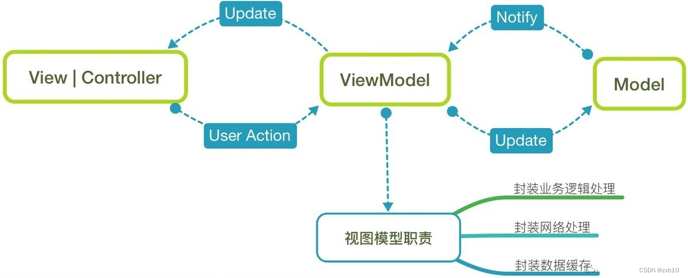


抽出`ViewMode`层负责数据与视图的交互部分，它主要作用是拿到原始的数据，根据具体业务逻辑需要进行处理，之后将处理好的东西塞到View中去，其职责之一是静态模型，表示View显示自身所需的数据，这使View具有更清晰定义的任务，即呈现视图模型提供的数据，总结为一句话就是**与View直接对应的Model，逻辑上是属于Model层**。


`Controller`仅协调各部分的绑定关系以及逻辑处理，唯一关注的是使用来自ViewModel的数据配置和管理各种View，不需要了解web调用，model对象等，这些都交给ViewModel操作。


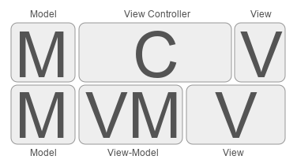


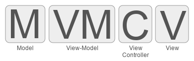


ViewModel并不一定只服务一个View，同理，一个Controller也可以持有很多ViewModel，来实现不同的逻辑控制多重的View。


Controller唯一关注的是使用来自ViewModel的数据配置和管理各种View，并让ViewModel知道何时发生需要更改上游数据的相关用户输入。 Controller不需要知道网络请求、数据库操作以及Model等，这样就让Controller更集中的去处理具体的业务逻辑。


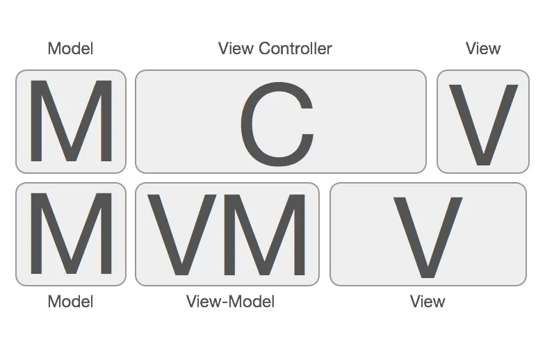


模块层级图：


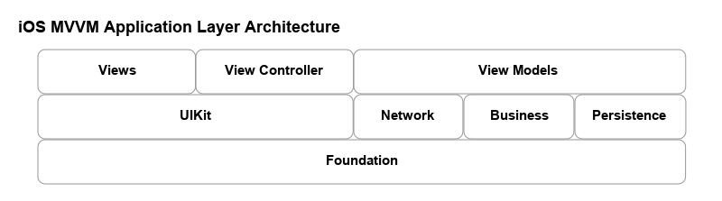


在`MVVM`中，View和ViewCotroller正式联系在一起，我们把他视为一个组件，他们都不能直接引用Model，而是应用视图模型ViewModel，虽然会轻微增加代码量，但是总体上减少了代码的复杂度。


MVVM 的注意事项


- `view` 引用`viewModel` ，但反过来不行（即不要在`viewModel`中引入`#import UIKit.h`，任何视图本身的引用都不应该放在`viewModel`中）（PS：**必须满足**）
- `viewModel` 引用`model`，但反过来不行
- ViewController尽量不涉及业务逻辑，让`ViewModel`去做这些事情

大致实现以下效果：


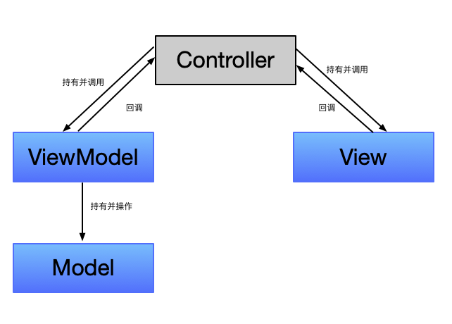


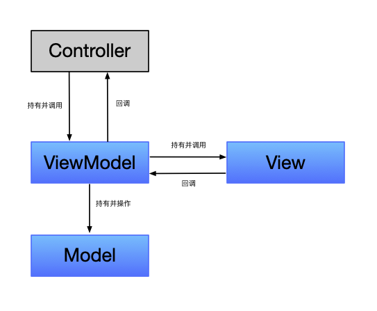


**MVC**


> _**优点：**_ 通用架构； 处理耦合度高的逻辑方便； _**缺点：**_ 耦合度高； 复用性差； 测试性差；


**MVVM**


> _**优点：**_ 耦合度低； 复用性高； 测试性高； 层次更清晰； 重构成本低； _**缺点：**_ 处理耦合度高的逻辑比较复杂； 若加入RAC，增加学习成本； 一些Bug比较难调试


MVVM 在使用当中，通常还会利用双向绑定技术，使得 Model 变化时，ViewModel 会自动更新，而 ViewModel 变化时，View 也会自动变化。所以，MVVM 模式有些时候又被称作：[model-view-binder](https://en.wikipedia.org/wiki/Model_View_ViewModel) 模式。


### MVVM的问题


在实际使用中，确实能够使得Model层和View层解耦，但是如果实现MVVM中的双向绑定的话，就需要引入更多复杂的框架实现了。


某种意义来说，就是数据绑定使MVVM变得复杂难用了。由于Obj - C 没有像Swift那样的原生数据绑定支持，我们需要手动实现数据绑定机制。


- KVO View可以监听ViewModel中属性的变化，并自动更新。但是比较难用容易出问题，最好还是用RAC封装
- 通知中心（NSNotifiction）提供了一种松耦合的通信方式，ViewModel可以通过通知来告知View状态的变化。适用于有全局事件
- 代理模式（Delegate）ViewModel可以定义协议，让View遵循协议并实现相应的方法来响应状态变化。
- block 最简单最小巧（黎果菲方案，组长评价 “很可以”）
- RAC第三方库


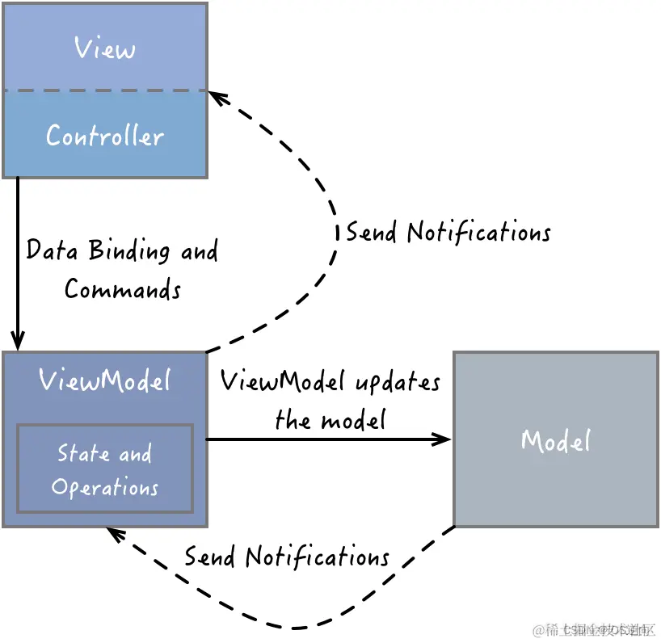


#### block


block 的作用：保存一段代码，到恰当的时候调用,很多时候block是代理的一种优化方案


- block比protocol更灵活，更高聚合，低耦合。 例如AFN的网络框架中，就可以将“准备请求参数”的代码和“处理后台返回数据”的代码放在一起。
- block的灵活还体现在他可以当作方法参数以及返回值。 Block可以作为函数参数或者函数的返回值，而其本身又可以带输入参数或返回值。


#### KVO


实现的方式中KVO不需要通知中心将可以实现属性的监听；与block以及代理相比，可以减少大量的代理方法以及block中的处理逻辑代码


```objective-c
- (void)addObserver:(NSObject *)anObserver
         forKeyPath:(NSString *)keyPath
            options:(NSKeyValueObservingOptions)options
            context:(void *)context
```


anObserver：观察者对象，这个对象必须实现`observeValueForKeyPath:ofObject:change:context:`方法，以响应属性的修改通知,否则将报错`An -observeValueForKeyPath:ofObject:change:context: message was received but not handled.`


keyPath：被监听的属性。这个值不能为nil。


options：监听选项，这个值可以是NSKeyValueObservingOptions选项的组合。关于监听选项，我们会在下面介绍。


context：任意的额外数据，我们可以将这些数据作为上下文数据，它会传递给观察者对象的observeValueForKeyPath:ofObject:change:context:方法。这个参数的意义在于用于区分同一对象监听同一属性的多个不同的监听。


```objective-c
- (void)dealloc {
    // 移除监听
    [self.webVIew removeObserver:self forKeyPath:@"xxxx"];
}
```


[KVO](https://blog.csdn.net/2402_86720949/article/details/154543600?fromshare=blogdetail&sharetype=blogdetail&sharerId=154543600&sharerefer=PC&sharesource=2402_86720949&sharefrom=from_link)


#### ReactiveCocoa


他可以监听UI事件、文本变化、属性变化（不需要写KVO），代替代理/回调。


`ReactiveCocoa`（简称为`RAC`）,是由`Github`开源的一个应用于iOS和OS开发的新框架。`RAC`结合了`函数式编程（Functional Programming）`和`响应式编程（React Programming）`的框架，也可称其为`函数响应式编程（FRP）`框架 。
 `函数响应式编程`利用下图


来解释最好不过了：`c = a + b` 定义好后，当`a`的值变化后，`c`的值就会自动变化。不过`a`的值变化时会产生一个信号，这个信号会通知`c`根据`a`变化的值来变化自己的值。`b`的值变化同样也影响`c`的值，这就是函数响应式编程。


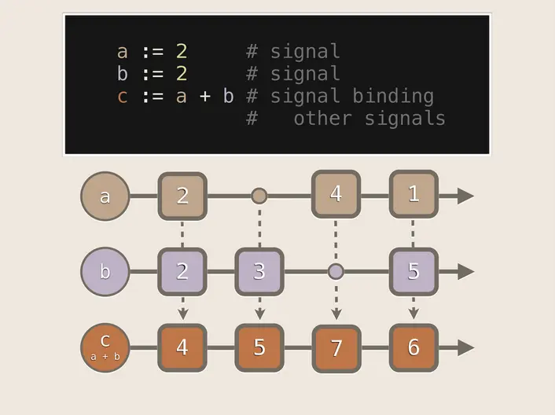


RAC是函数响应式编程（FRP）框架。ReactiveCocoa结合了几种编程风格：函数式编程（Functional Programming）响应式编程（Reactive Programming）


> 使用RAC解决问题，就不需要考虑调用顺序。每一次操作都写成一系列嵌套的方法中，使代码高聚合，方便管理


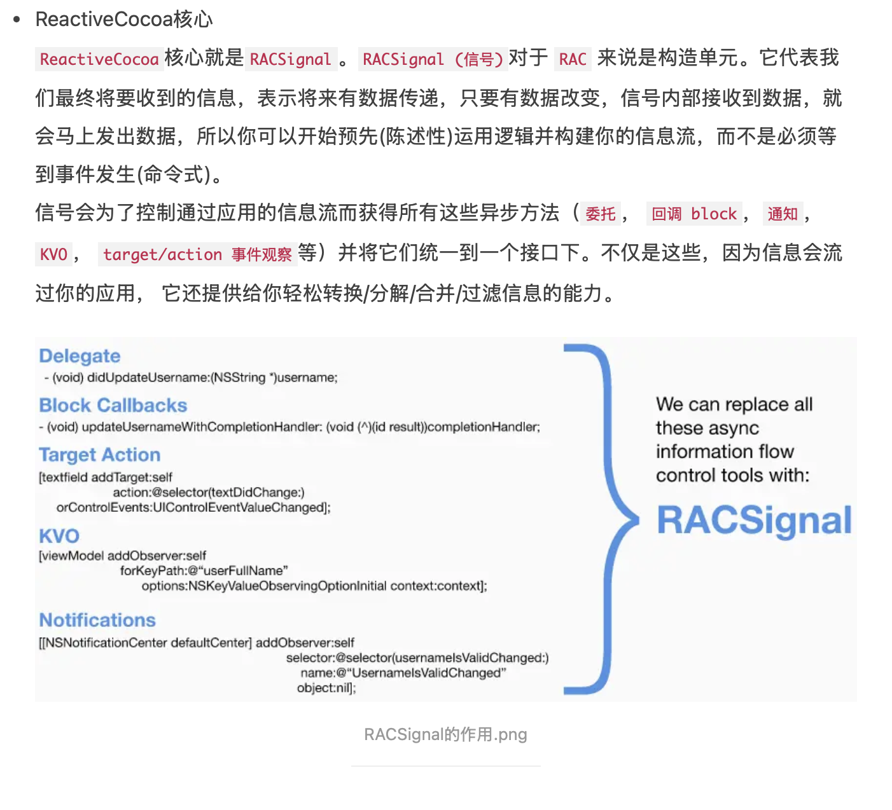


> 函数式编程（Functional Programming）和响应式编程（React Programming）也是当前很火的两个概念，它们的结合可以很方便地实现数据的绑定。于是，在 iOS 编程中，ReactiveCocoa 横空出世了，它的概念都非常 新，包括：


- 函数式编程（Functional Programming），函数也变成一等公民了，可以拥有和对象同样的功能，例如当成参数传递，当作返回值等。看看 Swift 语言带来的众多函数式编程的特性，就你知道这多 Cool 了。
- 响应式编程（React Programming），原来我们基于事件（Event）的处理方式都弱了，现在是基于输入（在 ReactiveCocoa 里叫 Signal）的处理方式。输入还可以通过函数式编程进行各种 Combine 或 Filter，尽显各种灵活的处理。
- 无状态（Stateless），状态是函数的魔鬼，无状态使得函数能更好地测试。
- 不可修改（Immutable），数据都是不可修改的，使得软件逻辑简单，也可以更好地测试。

关于这个第三方库的具体内容笔者现在还没有具体了解，具体的使用以及源码的相关内容会在后续更新。


---

原文发布于 CSDN：[【iOS】MVVM](https://blog.csdn.net/2402_86720949/article/details/155750158)
