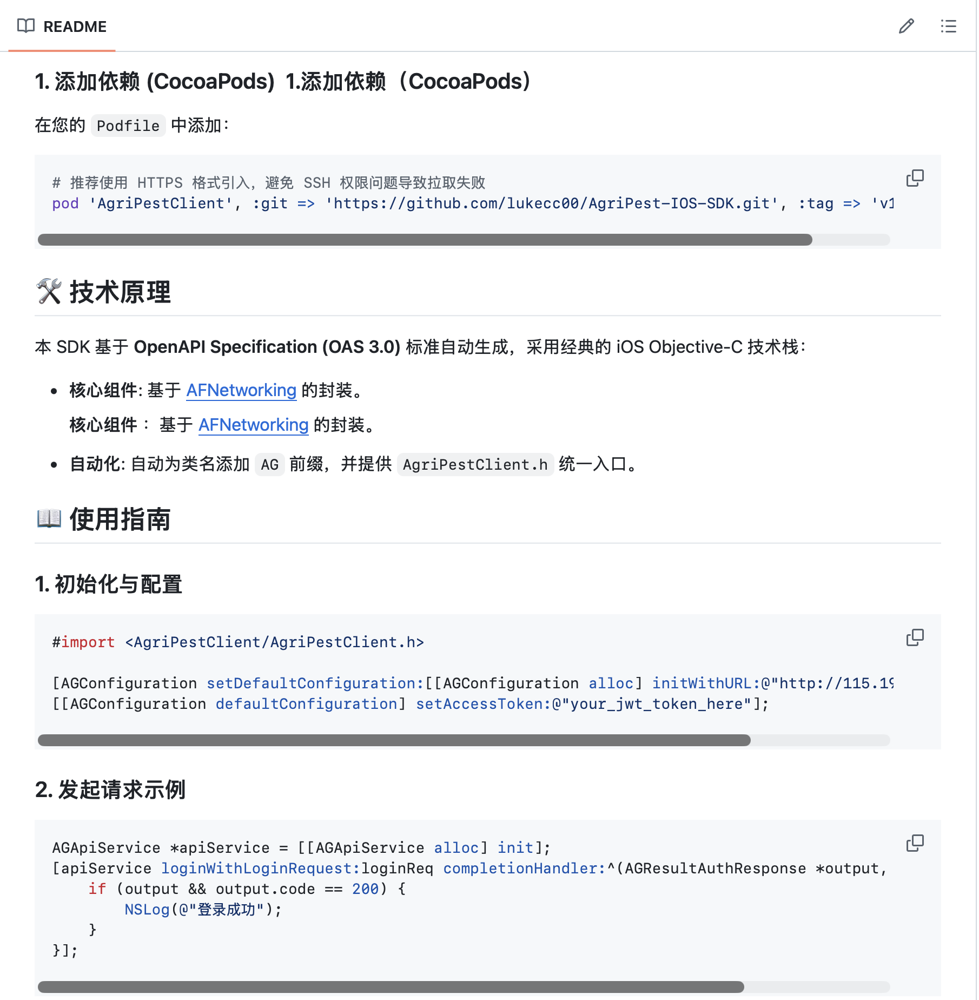
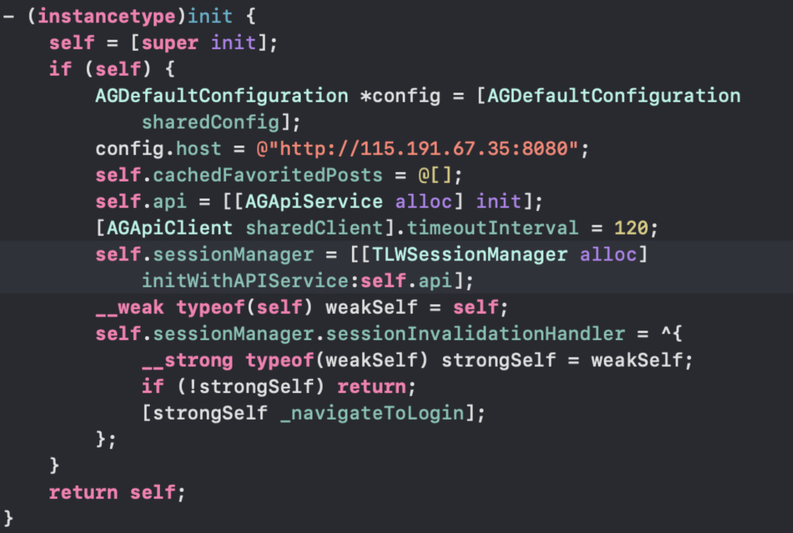
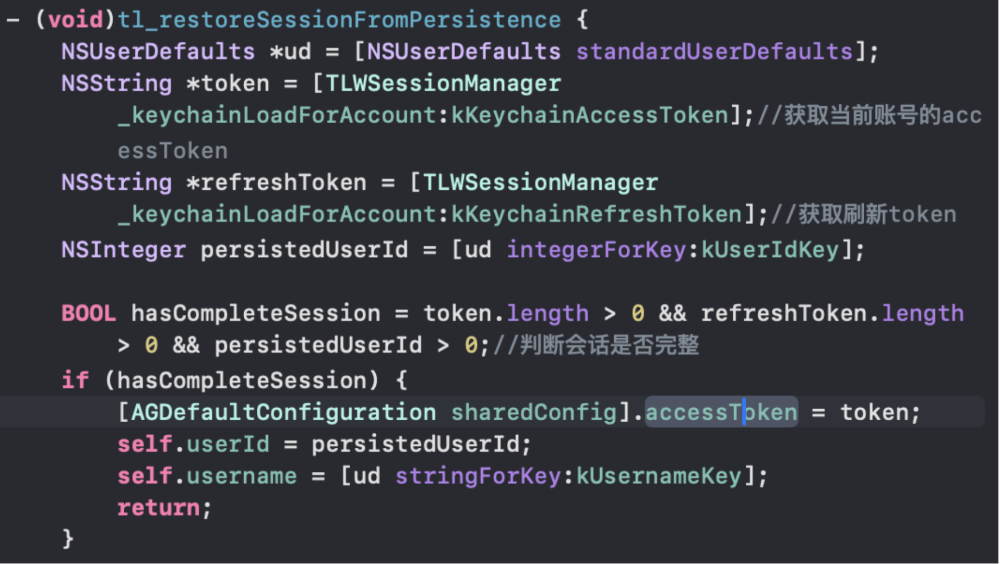

## SDK


`SDK`是Software Development Kit的缩写,译为”`软件开发工具包`”,通常是为辅助开发某类软件而编写的特定软件包,框架集合等,`SDK`一般包含相关`文档`,`范例`和`工具`。客户端 SDK，顾名思义，是集成在应用客户端的 SDK。SDK 作为产品与app 开发者的交互，从下载集成开始，历经功能开发、测试、打包等流程后作为应用的一部分上线，最终交付给 app 用户。


SDK分为系统SDK和应用SDK


- 系统SDK：是为特定的软件包、软件框架、硬件平台、操作系统等简历应用时说使用的开发工具集合
- `应用SDK`: 则是基于`系统SDK`开发的独立于具体业务而具有特定功能的集合

https://blog.bihe0832.com/sdk_summary.html


https://juejin.cn/post/6844904131002368008?searchId=20260419124733C977621A28DE027C97B2


### 1. SDK的作用


SDK（Software Development Kit）的作用主要体现在以下几个方面：


- **提供API接口**：SDK通常包含一套API接口，这些接口是预先定义好的，开发者可以通过调用这些接口，实现与底层系统的交互，从而简化开发过程。
- **提供库文件**：SDK中通常包含一些库文件，这些库文件包含了大量的函数和类，开发者可以直接使用这些函数和类，而无需从头开始编写。
- **提供文档和示例代码**：SDK还会提供详细的开发文档和示例代码，帮助开发者理解和使用API接口和库文件。

总的来说，SDK的作用就是帮助开发者更快、更方便地开发应用程序。通过提供开发工具、API接口、库文件以及文档和示例代码，SDK降低了开发的难度，提高了开发的效率。


在代码层面，SDK 就是一段预先编译好的、封装了特定功能的代码块。


- **iOS：** 通常以 `.framework` 或 `.xcframework` 的形式存在。
- **Android：** 通常以 `.aar`（包含 UI 和资源）或 `.jar`（纯代码）的形式存在。
- **Web：** 通常是一个 `.js` 文件，通过 ` ` 标签或 npm 包引入。

苹果官方本身就提供了很多SDK，平时在开发中就一直在用他们


最常见的就是这些：


- iOS SDK：开发 iPhone/iPad App 用的整套官方开发包
- macOS SDK：开发 Mac 应用
- watchOS SDK：开发 Apple Watch 应用
- tvOS SDK：开发 Apple TV 应用

在这些 SDK 里面，又包含很多具体框架，比如：


- UIKit / SwiftUI：做界面
- AVFoundation：相机、音视频
- CoreLocation：定位
- Speech：语音识别
- Vision / CoreML：图像分析、机器学习
- UserNotifications：通知
- StoreKit：内购


### 2. API && SDK && Framework && Library


#### API


API 全称是 **Application Programming Interface**，中文一般叫 **应用程序编程接口**。他不是具体实现，而是“别人暴露给你用的功能入口”。他的作用就是将低复杂度，你调用简单的接口，底层逻辑由系统或第三方完成。


API在iOS中的常见形式


- 类


```objective-c
UIViewController
  UITableView
  AVPlayer
  NSURLSession
```


- 方法 ```objective-c
- (void)viewDidLoad;
- (void)reloadData;
- (void)play;
```
- 属性 ```objective-c
@property (nonatomic, strong) UIColor *backgroundColor;
@property (nonatomic, copy) NSString *text;
```
- 协议 ```objective-c
UITableViewDataSource
UITableViewDelegate
AVCapturePhotoCaptureDelegate

@interface TLWIdentifyPageController () <AVCapturePhotoCaptureDelegate>
@end
```
- 常量和枚举 ```objective-c
PHAuthorizationStatusAuthorized
UIViewAnimationOptionCurveEaseInOut
AVPlayerStatusReadyToPlay
#### Library：库


Libarary的中文叫 库，他是一组写好的代码 可以被项目复用


```objective-c
#import <Masonry/Masonry.h>
#import <AFNetworking/AFNetworking.h>
#import <SDWebImage/SDWebImage.h>
```


这些都可以理解为常见的第三方库。Libarary有两种常见形式


- 静态库，编译时会被拷贝进你的App可执行文件，运行时不需要额外加载，但会增大最终app的体积，通常以.a后缀
- 动态库，App 运行时才加载，但是 iOS 对动态库限制比较严格。普通 App 不能随便下载并加载新的动态库，因为这会影响安全审核。实际iOS开发中，更常见的是动态Framework，而不是直接使用.dylib


#### Framework ：框架


他可以理解为Library的升级版，不仅有代码，还可以把头文件、资源文件、模块信息等打包在一起。常见后缀就是.framework


比如：


```objective-c
#import <UIKit/UIKit.h>
#import <Foundation/Foundation.h>
#import <AVFoundation/AVFoundation.h>
#import <Photos/Photos.h>
```


简单来说，library更倾向于一个代码的集合，但是Framework则是一个完整的模块。比如一个.a静态库通常只有编译后的代码，它不自带头文件目录结构、不自带资源管理方式。而Framework可以同时放：编译好的代码、公开头文件、图片资源等，所有实际开发中他更像一个标准化封装包


**系统Framework**


```objective-c
UIKit.framework
Foundation.framework
AVFoundation.framework
Photos.framework
CoreLocation.framework
CoreData.framework
```


包括使用相机时候的AVFoundation，用相册的<Photos/Photos.h>，都是系统Framework


#### SDK：开发软件包


> SDK 是为了开发某个平台或某个服务而提供的一整套东西。


SDK 是这几个概念里最大的。一个SDK可以包含以上的所有东西，比如一个iOS的SDK里有：


```objective-c
iOS SDK
├── UIKit.framework
├── Foundation.framework
├── AVFoundation.framework
├── Photos.framework
├── CoreLocation.framework
├── CoreData.framework
├── Metal.framework
├── Swift 标准库支持
├── 模拟器支持
├── 编译链接配置
└── 文档
```


你能importUIKit框架，就是因为你的Xcode装了iOS的SDK


```
SDK
│
├── Framework
│   ├── API
│   ├── 二进制实现代码
│   ├── 头文件
│   └── 资源文件
│
├── Library
│   ├── API
│   └── 二进制实现代码
│
├── 文档
├── Demo
└── 工具
### 3. SDK的使用


#### 1. 获取SDK


一般来说，SDK 会提供：


- 接入方式，比如 CocoaPods、SPM、npm、Gradle
- README 文档
- Demo 或示例代码
- API 文档和错误码说明 

一般来讲，SDK都会有一个Readme文档，教你快速上手。


#### 2. 配置全局环境


SDK 通常需要一些全局配置，比如：


- 服务端地址 host
- 鉴权信息 accessToken
- 超时时间
- 默认请求头
- 日志和调试开关

在项目里，对应的就是官方 SDK 里的 AGDefaultConfiguration。

其中 host 属于静态环境配置，启动时就可以设置； accessToken 属于动态登录态数据，通常在登录成功、冷启动恢复、token 刷新时再写入。


我们依次设置好URL和accessToken








#### 3. 发起具体调用


配置完成后，真正承接业务接口调用的是 AGApiService。

它会把后端的 REST 接口映射成一个个 Objective-C 方法。


比如后端有一个接口：


POST /api/my-crops/{id}/tags

在 SDK 里就会被映射成这样一个方法：


```objective-c
///
/// 添加种植标签 (浇水、施肥、用药、笔记)
///
///  @param _id
///
///  @param tagOperationRequest
///
///  @returns AGResultVoid*
///
-(NSURLSessionTask*) addTagWithId: (NSNumber*) _id
    tagOperationRequest: (AGTagOperationRequest*) tagOperationRequest
    completionHandler: (void (^)(AGResultVoid* output, NSError* error)) handler {
    // verify the required parameter '_id' is set
    if (_id == nil) {
        NSParameterAssert(_id);
        if(handler) {
            NSDictionary * userInfo = @{NSLocalizedDescriptionKey : [NSString stringWithFormat:NSLocalizedString(@"Missing required parameter '%@'", nil),@"_id"] };
            NSError* error = [NSError errorWithDomain:kAGApiServiceErrorDomain code:kAGApiServiceMissingParamErrorCode userInfo:userInfo];
            handler(nil, error);
        }
        return nil;
    }

    // verify the required parameter 'tagOperationRequest' is set
    if (tagOperationRequest == nil) {
        NSParameterAssert(tagOperationRequest);
        if(handler) {
            NSDictionary * userInfo = @{NSLocalizedDescriptionKey : [NSString stringWithFormat:NSLocalizedString(@"Missing required parameter '%@'", nil),@"tagOperationRequest"] };
            NSError* error = [NSError errorWithDomain:kAGApiServiceErrorDomain code:kAGApiServiceMissingParamErrorCode userInfo:userInfo];
            handler(nil, error);
        }
        return nil;
    }

    NSMutableString* resourcePath = [NSMutableString stringWithFormat:@"/api/my-crops/{id}/tags"];

    NSMutableDictionary *pathParams = [[NSMutableDictionary alloc] init];
    if (_id != nil) {
        pathParams[@"id"] = _id;
    }

    NSMutableDictionary* queryParams = [[NSMutableDictionary alloc] init];
    NSMutableDictionary* headerParams = [NSMutableDictionary dictionaryWithDictionary:self.apiClient.configuration.defaultHeaders];
    [headerParams addEntriesFromDictionary:self.defaultHeaders];
    // HTTP header `Accept`
    NSString *acceptHeader = [self.apiClient.sanitizer selectHeaderAccept:@[@"*/*"]];
    if(acceptHeader.length > 0) {
        headerParams[@"Accept"] = acceptHeader;
    }

    // response content type
    NSString *responseContentType = [[acceptHeader componentsSeparatedByString:@", "] firstObject] ?: @"";

    // request content type
    NSString *requestContentType = [self.apiClient.sanitizer selectHeaderContentType:@[@"application/json"]];

    // Authentication setting
    NSArray *authSettings = @[@"BearerAuth"];

    id bodyParam = nil;
    NSMutableDictionary *formParams = [[NSMutableDictionary alloc] init];
    NSMutableDictionary *localVarFiles = [[NSMutableDictionary alloc] init];
    bodyParam = tagOperationRequest;

    return [self.apiClient requestWithPath: resourcePath
                                    method: @"POST"
                                pathParams: pathParams
                               queryParams: queryParams
                                formParams: formParams
                                     files: localVarFiles
                                      body: bodyParam
                              headerParams: headerParams
                              authSettings: authSettings
                        requestContentType: requestContentType
                       responseContentType: responseContentType
                              responseType: @"AGResultVoid*"
                           completionBlock: ^(id data, NSError *error) {
                                if(handler) {
                                    handler((AGResultVoid*)data, error);
                                }
                            }];
}
```


```objective-c
- (NSURLSessionTask*) requestWithPath: (NSString*) path
                               method: (NSString*) method
                           pathParams: (NSDictionary *) pathParams
                          queryParams: (NSDictionary*) queryParams
                           formParams: (NSDictionary *) formParams
                                files: (NSDictionary *) files
                                 body: (id) body
                         headerParams: (NSDictionary*) headerParams
                         authSettings: (NSArray *) authSettings
                   requestContentType: (NSString*) requestContentType
                  responseContentType: (NSString*) responseContentType
                         responseType: (NSString *) responseType
                      completionBlock: (void (^)(id, NSError *))completionBlock {

    AFHTTPRequestSerializer <AFURLRequestSerialization> * requestSerializer = [self requestSerializerForRequestContentType:requestContentType];

    __weak id<AGSanitizer> sanitizer = self.sanitizer;

    // sanitize parameters
    pathParams = [sanitizer sanitizeForSerialization:pathParams];
    queryParams = [sanitizer sanitizeForSerialization:queryParams];
    headerParams = [sanitizer sanitizeForSerialization:headerParams];
    formParams = [sanitizer sanitizeForSerialization:formParams];
    if(![body isKindOfClass:[NSData class]]) {
        body = [sanitizer sanitizeForSerialization:body];
    }

    // auth setting
    [self updateHeaderParams:&headerParams queryParams:&queryParams WithAuthSettings:authSettings];

    NSMutableString *resourcePath = [NSMutableString stringWithString:path];
    [pathParams enumerateKeysAndObjectsUsingBlock:^(id key, id obj, BOOL *stop) {
        NSString * safeString = ([obj isKindOfClass:[NSString class]]) ? obj : [NSString stringWithFormat:@"%@", obj];
        safeString = AGPercentEscapedStringFromString(safeString);
        [resourcePath replaceCharactersInRange:[resourcePath rangeOfString:[NSString stringWithFormat:@"{%@}", key]] withString:safeString];
    }];

    NSString* pathWithQueryParams = [self pathWithQueryParamsToString:resourcePath queryParams:queryParams];
    if ([pathWithQueryParams hasPrefix:@"/"]) {
        pathWithQueryParams = [pathWithQueryParams substringFromIndex:1];
    }

    NSString* urlString = [[NSURL URLWithString:pathWithQueryParams relativeToURL:self.baseURL] absoluteString];

    NSError *requestCreateError = nil;
    NSMutableURLRequest * request = nil;
    if (files.count > 0) {
        request = [requestSerializer multipartFormRequestWithMethod:@"POST" URLString:urlString parameters:nil constructingBodyWithBlock:^(id<AFMultipartFormData> formData) {
                                                   [formParams enumerateKeysAndObjectsUsingBlock:^(id key, id obj, BOOL *stop) {
                                                       NSString *objString = [sanitizer parameterToString:obj];
                                                       NSData *data = [objString dataUsingEncoding:NSUTF8StringEncoding];
                                                       [formData appendPartWithFormData:data name:key];
                                                   }];
                                                   [files enumerateKeysAndObjectsUsingBlock:^(id key, id obj, BOOL *stop) {
                                                       if ([obj isKindOfClass:[NSArray class]]) {
                                                           for (NSURL *fileURL in (NSArray *)obj) {
                                                               [formData appendPartWithFileURL:fileURL name:key error:nil];
                                                           }
                                                       } else {
                                                           [formData appendPartWithFileURL:(NSURL *)obj name:key error:nil];
                                                       }
                                                   }];
                        } error:&requestCreateError];
    }
    else {
        if (formParams) {
            request = [requestSerializer requestWithMethod:method URLString:urlString parameters:formParams error:&requestCreateError];
        }
        if (body) {
            request = [requestSerializer requestWithMethod:method URLString:urlString parameters:body error:&requestCreateError];
        }
    }
    if(!request) {
        completionBlock(nil, requestCreateError);
        return nil;
    }

    if ([headerParams count] > 0){
        for(NSString * key in [headerParams keyEnumerator]){
            [request setValue:[headerParams valueForKey:key] forHTTPHeaderField:key];
        }
    }
    [requestSerializer setValue:responseContentType forHTTPHeaderField:@"Accept"];

    [self postProcessRequest:request];


    NSURLSessionTask *task = nil;

    if ([self.downloadTaskResponseTypes containsObject:responseType]) {
        task = [self downloadTaskWithCompletionBlock:request completionBlock:^(id data, NSError *error) {
            completionBlock(data, error);
        }];
    } else {
        __weak typeof(self) weakSelf = self;
        task = [self taskWithCompletionBlock:request completionBlock:^(id data, NSError *error) {
            NSError * serializationError;
            id response = [weakSelf.responseDeserializer deserialize:data class:responseType error:&serializationError];

            if(!response && !error){
                error = serializationError;
            }
            completionBlock(response, error);
        }];
    }

    [task resume];

    return task;
}
#### 4. 在项目中再封装一层


我们统一封装了一个SDKManager，用来把第三方的都收进一个统一入口，避免业务层面到处直接依赖底层SDK。正如图上所展示，他负责配置SDK，同时把官方的SDK包装成项目自己的统一接口，同时把登录鉴权等进行统一化，而不是每个页面自己处理。


```objective-c
Controller
  ↓
TLWSDKManager
  ↓
AGApiService
  ↓
AGApiClient
  ↓
AGDefaultConfiguration
  ↓
Server API
### 4. SDK 的优点、局限


#### SDK 的优点


##### 1. 降低开发成本


SDK 最大的价值，就是把复杂能力封装好，开发者不需要从零实现底层逻辑。主流 SDK（如微信、高德、腾讯云）通常由大厂的专业团队维护。他们会针对 iOS 系统进行持续优化，解决各种机型适配和系统兼容性问题。


在 iOS 开发中，如果没有现成 SDK，很多功能都要自己处理：


- 网络请求封装
- 鉴权头拼接
- 请求参数序列化
- 响应模型解析
- 错误码处理
- 上传下载逻辑

而有了 SDK 之后，开发者只需要调用现成方法即可，由SDK发行者为你处理背后的复杂工程逻辑。


##### 2. 统一接口风格


一个成熟的 SDK 往往会把后端接口统一成固定风格的方法和数据模型。


例如：


```objective-c
[apiService loginBySmsWithSmsLoginRequest:req completionHandler:...];
[apiService chatWithChatRequest:req completionHandler:...];
[apiService uploadFileWithFile:fileURL prefix:@"identify/" completionHandler:...];
```


这种统一的方法命名、统一的 `Request / Result / DTO` 模型，会让整个项目的调用方式更加规范。


##### 3. 提高联调效率


如果客户端直接自己手写请求，前后端在联调时很容易出现：


- 字段名不一致
- 参数类型不一致
- 路径写错
- Header 缺失
- 响应结构理解偏差

而通过 OpenAPI 自动生成的 SDK，可以在很大程度上减少这类问题。

因为接口定义已经提前固化成代码，前后端对接会更顺畅。


同时，  通过 CocoaPods 集成，你可以轻松管理版本。


- `pod update` 一键升级。
- `pod install` 自动配置 Search Paths 和 Linker Flags，省去了手动配置 Xcode 工程的痛苦。


#### 2. SDK 的局限


##### 1. 自动生成代码通常比较冗长


像基于 OpenAPI 自动生成的 SDK，优点是统一，但缺点也很明显：


- 方法名偏长
- 代码模板味道重
- 可读性一般
- 结构比较“机械”

例如：


```objective-c
-(NSURLSessionTask*) addTagWithId: (NSNumber*) _id
    tagOperationRequest: (AGTagOperationRequest*) tagOperationRequest
    completionHandler: (void (^)(AGResultVoid* output, NSError* error)) handler;
```


这种代码虽然规范，但不一定足够优雅，也不一定最符合业务开发者的阅读习惯。


##### 2. SDK 不一定完全贴合业务场景


SDK 更多是面向“通用接口调用”设计的，但实际项目里经常会出现更复杂的业务诉求。


比如：


- token 失效后自动刷新
- 流式响应的逐帧处理
- 断点续传等

这些往往不是 SDK 本身能完全覆盖的，仍然需要业务侧补充一层自己的封装。

但在 AI 流式对话这一块，我没有直接使用 SDK 自带的 `chatStreamWithChatRequest:`，而是自己实现了一层 `TLWAIStreamClient`。


原因是 SDK 的默认实现更适合普通请求场景，而我们项目需要的是：


- SSE 逐帧消费
- 更及时的 UI 刷新
- 更细粒度的流式事件解析
- token 失效后的重建 stream

这就说明，在工程实践里，SDK 并不是“全盘照搬”，而是要根据实际业务体验做取舍。


##### 3. 增加APP包体积


有些SDK内部会带有非常庞大的模型或图片数据等，会导致ipa明显变大。


另外，哪怕你只需要SDK中的一个方法或者函数，那么你也必须引入整个静态库，造成大量冗余


##### 4. 调试非常困难


SDK通常是闭源的文件，如果内部出现问题 你只能等待厂商发版修复，自己无能为力沈。


（ 如果是GitHub仓库，你可以考虑fork一下然后自己修复。

---

原文发布于 CSDN：[【iOS】SDK](https://blog.csdn.net/2402_86720949/article/details/160308084)
