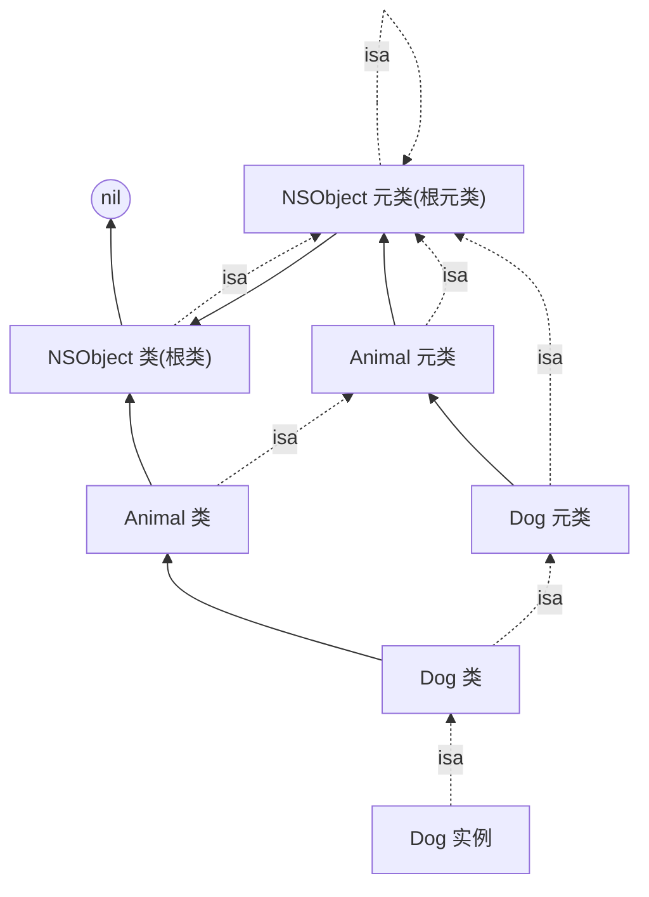

# Runtime 简介

写 Objective-C 的人,每天都在敲这样的代码:

```objc
[person sayHello];
```

我们几乎是条件反射地把它读成「调用 person 的 sayHello 方法」。但这其实是一个被其他语言的思维带偏的误读。在 Objective-C 里,方括号语法真正的含义是:**向 person 这个对象,发送一条名为 `sayHello` 的消息。** 编译器最终会把这一行翻译成一次再普通不过的 C 函数调用:

```objc
objc_msgSend(person, @selector(sayHello));
```

到这里,一个平时被我们彻底忽略的问题就浮现了 : **到底是在哪个时刻、由谁来决定 person 真正去执行哪一段代码?**

如果是 C++,这个问题的答案大多在编译期就尘埃落定了——一次普通的成员函数调用,编译完地址就基本刻死在了二进制里。但 Objective-C 偏偏选了另一条路:它把「这个对象到底是什么类」「这条消息对应哪一份方法实现」这些决定,统统推迟到程序跑起来的那一刻,交给 `objc_msgSend` 现场查找、现场拍板。这种「推迟到运行时再决定」的能力,正是我们口中「动态」二字的真正含义。

而支撑起这套动态机制的,是一个始终活在你程序里的库——运行时(Runtime)。可以用一个粗糙但好记的等式来概括它:

> **Objective-C ≈ C 语言 + 一个运行时库。**

那些在别的语言里编译期就拍板的事,在 OC 里都被交给了这个运行时。这个系列要讲的,正是它究竟是如何工作的。

更具体一点：runtime 是一套用 C（和少量汇编）编写的 API 库，它是 OC「动态性」与「消息发送」机制得以成立的底座。程序启动时，正是它负责把 OC 的类结构注册起来、把分类(Category)的方法整合进宿主类——这些「编译期没做完、留到运行期才落定」的活儿，都由它接手。

我们平时用到的很多能力，底层其实都是 runtime 在支撑：

1. 消息发送与转发机制
2. 动态获取类的属性列表、方法列表等
3. 关联对象（给分类「加」属性）
4. 方法交换 Method Swizzling（俗称 iOS 黑魔法）
5. 分类(Category)的实现
6. KVO 的底层原理

这系列博客也会在后期对每个部分进行深入讲解

# 对象的本质：objc_object

## objc_object：对象的骨架

我们首先打开源码工程
这里是入口：他说明OC对象底层至少有一个isa，isa用来找到对象对应的类
```objc
/// Represents an instance of a class.
struct objc_object {
    Class _Nonnull isa  OBJC_ISA_AVAILABILITY;
};
```

```objc
struct objc_object {

private:

    char isa_storage[sizeof(isa_t)];


    isa_t &isa() { return *reinterpret_cast<isa_t *>(isa_storage); }

    const isa_t &isa() const { return *reinterpret_cast<const isa_t *>(isa_storage); }


public:


    // ISA() assumes this is NOT a tagged pointer object

    Class ISA(bool authenticated = false) const;


    // rawISA() assumes this is NOT a tagged pointer object or a non pointer ISA

    Class rawISA() const;


    // getIsa() allows this to be a tagged pointer object

    Class getIsa() const;

    uintptr_t isaBits() const;


    // initIsa() should be used to init the isa of new objects only.

    // If this object already has an isa, use changeIsa() for correctness.

    // initInstanceIsa(): objects with no custom RR/AWZ

    // initClassIsa(): class objects

    // initProtocolIsa(): protocol objects

    // initIsa(): other objects

    void initIsa(Class cls /*nonpointer=false*/);

    void initClassIsa(Class cls /*nonpointer=maybe*/);

    void initProtocolIsa(Class cls /*nonpointer=maybe*/);

    void initInstanceIsa(Class cls, bool hasCxxDtor);


    // changeIsa() should be used to change the isa of existing objects.

    // If this is a new object, use initIsa() for performance.

    Class changeIsa(Class newCls);


    bool hasNonpointerIsa() const;

    bool isTaggedPointer() const;

    bool isBasicTaggedPointer() const;

    bool isExtTaggedPointer() const;

    bool isClass() const;

    bool hasCxxDtor() const;        // 类/父类有无 C++ 析构（dealloc 时要不要走 .cxx_destruct）

    // —— 以下省略一大簇方法 ——
    // hasAssociatedObjects / isWeaklyReferenced / retain / release /
    // rootRetain / rootRelease / sidetable_* …… 全是引用计数、关联对象、
    // 弱引用、SideTable 的内容，与「对象 = isa」主线无关，
    // 留到 Part 8（关联对象）、Part 9（weak 与 SideTable）再展开。
};
```


在看新版之前，先把旧版长什么样摆出来对比。这个结构其实经历了三个时代：

```cpp
// ① 古早版（objc4-750 及更早，sunnyxx / draveness 那批老博客里的样子）
struct objc_object {
    isa_t isa;        // public：外部能直接 obj->isa 摸到
};
```

```cpp
// ② objc4-818
struct objc_object {
private:
    isa_t isa;        // 已经 private，但仍是一个「有类型的 isa_t 成员」
public:
    Class ISA(bool authenticated = false);   // 强制走方法
    ...
};
```

```cpp
// ③ objc4-951.1（本文这版）
struct objc_object {
private:
    char  isa_storage[sizeof(isa_t)];        // 退化成「一坨裸字节」
    isa_t &isa() { return *reinterpret_cast<isa_t *>(isa_storage); }  // 只能借方法戴上 isa_t 这副眼镜
public:
    Class ISA(bool authenticated = false) const;
};
```

我们可以看到， isa_storage是真正存isa的地方。旧版本的写法是直接暴露 `isa_t isa` 作为 public 成员，任何人都能直接读写。新版本改成：`char isa_storage[sizeof(isa_t)];` 使用一个 char 数组来占位。arm64e上，isa里面那根指针是被签名过的，如果有一个公开有类型的 isa_t  isa，外部代码就能直接obj->isa.cls直接摸到那根带签名的指针
——读出来是“看着像乱码”的值，甚至可能绕过验证。修改后，想要接触这8个字节都要经过isa()访问器，isa_t里面的 cls又被设置为private，因此你必须`getClass()/setClass()`

- `char` 在 C++ 标准里是"字节类型"，用它做原始存储是合法的 type-punning，不触发 UB（Undefined Behavior）。直接在 union 成员之间互相访问在 C++ 里有严格限制，但通过 `char[]` 中转是标准允许的。

- `char[]` 不会触发任何构造函数或析构函数。`isa_t` 是一个 union，如果直接作为成员，某些编译器版本可能对 union 成员的初始化有额外的限制，而 `char[]` 完全透明、惰性，什么都不做。

- 给对象内部开一块内存，大小刚好等于isa_t，所以实际的内存布局也没有变化

总的来说，这是一次**封装重构**，内存布局和 isa_t 的位域语义完全没变，只是把裸字段换成了私有字节数组 + 私有访问器，防止外部绕过 Runtime 直接操作 isa，同时避免 C++ union 直接访问的潜在 UB 问题。

再回头看这两行，其实它们都指向同一个地方：

```cpp
isa_t &isa() { return *reinterpret_cast<isa_t *>(isa_storage); }  // 内部访问
Class ISA(bool authenticated = false) const;                     // 对外取类
```

不管是内部用的 `isa()`，还是对外的 `ISA()`，它们去读那 8 个裸字节时，都是指的同一个——`isa_t`。换句话说，`objc_object` 这个壳本身没几两肉，它把「对象到底属于哪个类、引用计数是多少、有没有关联对象、是否被弱引用」这些信息，**全都打包压进了 `isa_t` 这 8 个字节里**。

<iframe src="/posts/ios-runtime-part-1-object-class/isa-storage-to-isa-t-steps.html" title="isa_storage 到 isa_t 的解读过程" loading="lazy" style="width:100%;min-height:520px;border:1px solid var(--line-divider);border-radius:18px;background:#07110f;overflow:hidden;"></iframe>

所以「对象的本质是什么」这个问题，到这里就收敛成了：`isa_t` 里到底装了什么？


## isa_t

```objc
union isa_t {

    isa_t() { } //默认构造函数

    isa_t(uintptr_t value) : bits(value) { }  // 带参数的构造函数

    uintptr_t bits;   //isa_t 里面真正存的是一个和指针一样大的无符号整数(64)。


private:

    // Accessing the class requires custom ptrauth operations, so

    // force clients to go through setClass/getClass by making this

    // private.
   

    Class cls;
    // 这段放在 private 中，让你不能从外部通过isa.cls直接访问，注释的意思是说：访问 `Class` 指针时，可能需要做 **ptrauth 指针认证**。在 Apple 的 arm64e 架构上，指针可能带有签名，不能像普通地址一样随便读出来用。Runtime 需要通过专门逻辑去认证、解码、还原。


public:

#if defined(ISA_BITFIELD)
// 如果当前平台定义了 ISA_BITFIELD，就启用 isa 位域结构。
    struct {
        ISA_BITFIELD;  // defined in isa.h
    };


// 当前平台的 isa 是否支持把一部分引用计数直接存在 isa 里面。
#if ISA_HAS_INLINE_RC

    bool isDeallocating() const {

        return extra_rc == 0 && has_sidetable_rc == 0;

	//extra_rc：存在 isa 里的额外引用计数
	//has_sidetable_rc：是否还有引用计数存在 SideTable 里
    }

    void setDeallocating() {

        extra_rc = 0;

        has_sidetable_rc = 0;

    }

#endif // ISA_HAS_INLINE_RC


#endif // defined(ISA_BITFIELD)


    void setClass(Class cls, objc_object *obj);

    Class getClass(bool authenticated) const;

    Class getDecodedClass(bool authenticated) const;

};
```

如上代码为 isa_t 联合体本体，**union 里所有成员，起始地址相同，共享同一块内存。bits、cls、ISA_BITFIELD struct 都是这块内存的**成员

<iframe src="/posts/ios-runtime-part-1-object-class/isa-t-three-views.html" title="isa_t 的三种视角" loading="lazy" style="width:100%;min-height:620px;border:1px solid var(--line-divider);border-radius:18px;background:#07110f;overflow:hidden;"></iframe>


### ISA_BITFIELD：isa 的位布局

我们接下来看看`ISA_BITFIELD`：
```objc
/*
 * isa 的位布局随架构而不同，共 4 套。下面把每个架构的 ISA_BITFIELD
 * 直接展开成位域列表（省去 #define 和续行符 \，方便阅读），并标注每段
 * 的 bit 范围。挑你的目标架构看即可：真机 A12+ 与模拟器看 ①。
 */

// ===== ① arm64e（真机 A12+ / 模拟器，__has_feature(ptrauth_calls)）=====
//   ISA_MASK = 0x007ffffffffffff8ULL    ·    无独立 has_cxx_dtor 位（移到 cache flags）
uintptr_t nonpointer        : 1;    // bit0     nonpointer isa 开关（0=纯类指针）
uintptr_t has_assoc         : 1;    // bit1     有无关联对象
uintptr_t weakly_referenced : 1;    // bit2     有无被 __weak 弱引用
uintptr_t shiftcls_and_sig  : 52;   // bit3-54  类指针 + PAC 签名（合并）
uintptr_t has_sidetable_rc  : 1;    // bit55    RC 是否溢出到 SideTable
uintptr_t extra_rc          : 8;    // bit56-63 内联引用计数（retainCount-1）

// ===== ② arm64（非 e，不开 PAC）=====
//   ISA_MASK = 0x0000000ffffffff8ULL    ·    保留 has_cxx_dtor / magic 位
uintptr_t nonpointer        : 1;    // bit0
uintptr_t has_assoc         : 1;    // bit1     有无关联对象
uintptr_t has_cxx_dtor      : 1;    // bit2     类/父类有无 C++ 析构（arm64e 已移除）
uintptr_t shiftcls          : 33;   // bit3-35  类指针（无签名，故名 shiftcls）
uintptr_t magic             : 6;    // bit36-41 调试期识别 isa 的魔数（arm64e 已移除）
uintptr_t weakly_referenced : 1;    // bit42    有无被 __weak 弱引用
uintptr_t unused            : 1;    // bit43    保留位
uintptr_t has_sidetable_rc  : 1;    // bit44    RC 是否溢出到 SideTable
uintptr_t extra_rc          : 19;   // bit45-63 内联引用计数（位数比 arm64e 多）

// ===== ③ x86_64（Intel Mac / 旧模拟器）=====
//   ISA_MASK = 0x00007ffffffffff8ULL
uintptr_t nonpointer        : 1;    // bit0
uintptr_t has_assoc         : 1;    // bit1
uintptr_t has_cxx_dtor      : 1;    // bit2
uintptr_t shiftcls          : 44;   // bit3-46  类指针
uintptr_t magic             : 6;    // bit47-52 魔数
uintptr_t weakly_referenced : 1;    // bit53
uintptr_t unused            : 1;    // bit54
uintptr_t has_sidetable_rc  : 1;    // bit55
uintptr_t extra_rc          : 8;    // bit56-63 内联引用计数

// ===== ④ armv7k / arm64_32（Apple Watch 等 32 位，索引式 isa）=====
//   存「类表索引 indexcls」而非类指针；32 位地址空间小，用索引更省位
uintptr_t nonpointer        : 1;    // bit0
uintptr_t has_assoc         : 1;    // bit1
uintptr_t indexcls          : 15;   // bit2-16  类表索引（不是指针！）
uintptr_t magic             : 4;    // bit17-20
uintptr_t has_cxx_dtor      : 1;    // bit21
uintptr_t weakly_referenced : 1;    // bit22
uintptr_t unused            : 1;    // bit23
uintptr_t has_sidetable_rc  : 1;    // bit24
uintptr_t extra_rc          : 7;    // bit25-31 内联引用计数
```


### getClass：从 isa 里取出 Class

刚才我们了解了，isa_t 长什么样、位怎么分布，接下来我们看看 Runtime是怎么从isa_t 里拿到 Class 的？

```objc
// 从 isa 里把 Class 指针抠出来。authenticated 决定要不要做 PAC 指针认证：
// 多数调用方对安全不敏感，默认 false 跳过认证换性能；只有 msgSend / 填缓存
// 这类安全攸关的路径才会传 true。
inline Class
isa_t::getClass(MAYBE_UNUSED_AUTHENTICATED_PARAM bool authenticated) const {
#if SUPPORT_INDEXED_ISA
    // 索引式 isa（armv7k / arm64_32）：cls 本身就是裸类指针，原样返回
    return cls;
#else
    uintptr_t clsbits = bits;          // 先拿到完整的 64 位 isa

#   if __has_feature(ptrauth_calls)    // ===== arm64e：类指针被 PAC 签过名 =====
#       if ISA_SIGNING_AUTH_MODE == ISA_SIGNING_AUTH
    if (authenticated) {
        // 要认证：先用 ISA_MASK 保留「类指针 + 签名」那 52 位（shiftcls_and_sig）
        clsbits &= ISA_MASK;
        if (clsbits == 0)
            return Nil;
        // 再用 ptrauth_auth_data 验签 + 还原出真正能用的指针；鉴别子由
        // this(本 isa 的地址) 和固定常量混合而成，地址不对就还原失败
        clsbits = (uintptr_t)ptrauth_auth_data((void *)clsbits, ISA_SIGNING_KEY,
                      ptrauth_blend_discriminator(this, ISA_SIGNING_DISCRIMINATOR));
    } else {
        // 不认证：直接用运行期算好的 objc_debug_isa_class_mask 把签名/标志/RC 抹掉
        clsbits &= objc_debug_isa_class_mask;
    }
#       else
    clsbits &= objc_debug_isa_class_mask;   // 编译配置不要求认证，同样走快路
#       endif

#   else                               // ===== arm64(非e) / x86_64：指针无签名 =====
    clsbits &= ISA_MASK;               // 一把 ISA_MASK 抹掉低位标志 + 高位 RC 即可
#   endif

    return (Class)clsbits;             // 剩下的就是一根干净的 Class 指针
#endif
}
```

## Tagged Pointer 优化

到这里我们讲的「对象」，都是堆上一块内存、开头一根 `isa` 的普通对象。但其实还有一类「对象」根本没有 `isa`——它就是 **Tagged Pointer（标记指针）**。

对一个 `NSNumber *n = @5` 这种**又小又高频**的值类型来说，为了一个 `5` 去 `malloc` 一块堆内存、维护 `isa`、再管引用计数，实在太奢侈。Tagged Pointer 的思路很直接：**干脆不分配内存，把「类型标记 + 数据本身」直接塞进那 8 字节的指针里。** 这个「指针」根本不指向任何地址，**它本身就是数据**——`@5` 里的 `5`，就藏在这根「指针」的二进制位里。

### 怎么判定一个指针是不是 Tagged Pointer

判定逻辑只有一行（`objc-internal.h`）：

```objc
static inline bool
_objc_isTaggedPointer(const void * _Nullable ptr)
{
    // 标记位被置 1 的，就不是真指针，而是 Tagged Pointer
    return ((uintptr_t)ptr & _OBJC_TAG_MASK) == _OBJC_TAG_MASK;
}
```

关键就在 `_OBJC_TAG_MASK` 这个「标记位」放在哪，随平台不同：

```objc
#if OBJC_SPLIT_TAGGED_POINTERS        // arm64（iOS 真机 / Apple Silicon）
#   define _OBJC_TAG_MASK (1UL<<63)   // 看最高位 bit63
#elif OBJC_MSB_TAGGED_POINTERS        // 非 arm64、非 x86 Mac 的其它配置
#   define _OBJC_TAG_MASK (1UL<<63)
#else                                 // x86_64 Mac
#   define _OBJC_TAG_MASK 1UL         // 看最低位 bit0
#endif
```

这就解释了一个常见现象：真机上打印一个 Tagged 的 `NSNumber`，地址常是 `0xb000...` / `0x8000...` 这种「最高位为 1 的怪地址」——因为那根本不是地址，是被置了标记位的数据。

### 它标记的是哪些类

指针里除了标记位，还存了一个 `tag`，用来标识「这是哪个类的对象」。`tag` 的取值来自一张枚举表（`objc-internal.h`，这里节选）：

```objc
enum objc_tag_index_t : uint16_t
{
    // tag 0..6：60 位载荷
    OBJC_TAG_NSAtom            = 0,
    OBJC_TAG_NSString          = 2,
    OBJC_TAG_NSNumber          = 3,
    OBJC_TAG_NSIndexPath       = 4,
    OBJC_TAG_NSManagedObjectID = 5,
    OBJC_TAG_NSDate            = 6,
    OBJC_TAG_RESERVED_7        = 7,   // 保留

    // tag 8..263：52 位扩展载荷（NSColor / UIColor / NSIndexSet ...）
    OBJC_TAG_Photos_1          = 8,
    OBJC_TAG_NSColor           = 16,
    OBJC_TAG_UIColor           = 17,
    // ...
};
```

所以 arm64 上那 8 个字节大致是这样分的：

```
bit63        标记位（=1 表示这是 Tagged Pointer）
低位若干 bit   tag —— 它是哪个类（NSNumber? NSString? NSDate?）
中间 bit      payload —— 真正的数据
```

tag 0–6 有 60 位载荷，扩展 tag 有 52 位载荷。**装不下就退回普通堆对象**——比如一个很大的整数、一个很长的字符串，就不会做成 Tagged Pointer。

### 没有 isa，它怎么找到类

这一点正好和前面 `getClass` 那节对照着看。普通对象靠 `isa.bits & mask` 拿到 `Class`；而 Tagged Pointer 根本没有 `isa`，于是 `getIsa()` 走了另一条路（`objc-object.h`）：

```objc
inline Class
objc_object::getIsa() const
{
    // 普通对象：还是走 isa
    if (fastpath(!isTaggedPointer())) return ISA(/*authenticated*/true);

    // Tagged Pointer：从指针里抠出 tag 当下标，去全局表里查类
    uintptr_t slot = ((uintptr_t)this >> _OBJC_TAG_SLOT_SHIFT) & _OBJC_TAG_SLOT_MASK;
    Class cls = objc_tag_classes[slot];   // 即 objc_debug_taggedpointer_classes[]
    // ...（扩展 tag 再查 ext 表）
    return cls;
}
```

它把指针里的 `tag` 当作下标，去 `objc_debug_taggedpointer_classes[]` 这张「tag → Class」的全局表里查出类。

这也顺带解释了前面 `objc_object` 源码里那一堆 `ASSERT(!isTaggedPointer())`——像 `ISA()` 开头就断言「我不是 tagged」，因为 `ISA()` 只处理真有 `isa` 的对象，**Tagged Pointer 必须改走 `getIsa()`**。

### 为什么内存里看到的值像「乱码」

iOS 8.3 之后，Tagged Pointer 的真实布局在存进指针前，会先和一个全局混淆值 `objc_debug_taggedpointer_obfuscator` 做一次**异或加扰**：

```objc
uintptr_t value = (obfuscator ^ ptr);   // 编码/解码都要异或这个值
```

目的是**防止开发者去硬编码、依赖它的内部位布局**（Apple 保留随时改布局的权利）。所以你直接在内存里看到的 Tagged 指针位是被混淆过的，要 decode 才能还原出真正的 tag 和 payload。

### 它带来的好处

- **零分配**：不 `malloc`、不进堆，创建和销毁几乎零成本；
- **引用计数免费**：Tagged 对象的 `retain / release` 直接是 no-op——源码里 `rootRetain` 开头就是 `if (isTaggedPointer()) return (id)this;` 原样返回；
- **访问快**：数据就在指针里，无需解引用去堆上读。

> **几点边界**
> 1. 不是所有 `NSNumber / NSString` 都是 Tagged——超出载荷容量（大数、长字符串）会退回普通堆对象。
> 2. Tagged 对象 `object_getClass` 能拿到类（如 `__NSCFNumber` / `NSTaggedPointerString`），但它**没有 isa 字段**，行为和普通对象不完全一样（retain 免费、布局被混淆）。
> 3. 布局随架构 / 系统版本会变（arm64 看 bit63、x86 Mac 看 bit0），别把某个具体 bit 位当成「永远如此」写死。


<iframe src="/posts/ios-runtime-part-1-object-class/isa-t-layout.html" title="isa_t 位布局" loading="lazy" style="width:100%;min-height:760px;border:1px solid var(--line-divider);border-radius:18px;background:#0b0b0f;overflow:hidden;"></iframe>


# 对象的内存布局

除了 isa，一个实例在内存里到底还装了什么、整个占多大？这一章就把这块内存量清楚。

## 实例里装了什么：isa + 成员变量

一个普通实例对象在堆上的内存，结构非常朴素：

```
偏移 +0     isa（8 字节）
偏移 +8     第 1 个成员变量(ivar)
偏移 ...     第 2 个成员变量
            ...（按声明顺序、各自对齐规则排布）
```

`isa` 永远在 `+0`，紧接着是这个类（含父类）的所有成员变量，按声明顺序、各自的对齐要求依次排下去。换句话说——

> **实例对象 = 一根 isa + 一串成员变量。** 它身上没有方法，方法都存在「类」里（下一章讲）。

这也正是为什么 `NSObject` 的实例「最小」：它一个自定义成员都没有，身上就只有那 8 字节的 isa。

## 对象多大：从「需求」到「实分」的三个数

「一个对象多大」这个问题，其实有**三个互不相同**的答案。一个对象从「源码声明」走到「躺在堆上」，大小要过三道关：

```
① 编译期需求    class_ro_t.instanceSize  = isa(8) + 各 ivar 字节数
       │
       ▼ word_align —— 向上取整到 8 的倍数（64 位下字长 = 8）
② 理论大小      class_getInstanceSize()  = alignedInstanceSize()   ← 注意：不含 16 下限
       │
       ▼ alloc 时 instanceSize()：if (size < 16) size = 16   （CF 要求最小 16 字节）
③ 实际申请      malloc_instance(size) → malloc 还有自己的 16 字节分桶粒度
       ▼
     malloc_size()  = 堆真正给出的块大小（16 的倍数）
```

第①步的 `instanceSize` 是编译器在编译期就算好、存进类的只读数据 `class_ro_t` 里的（`isa` 加上所有成员变量的字节数）。第②步把它按字长（64 位下是 8 字节）向上对齐，这就是 `class_getInstanceSize` 返回的值：

```objc
// objc-class.mm:817 —— class_getInstanceSize 只到「对齐后的 ivar 需求」，没有 16 下限
size_t class_getInstanceSize(Class cls) {
    if (!cls) return 0;
    cls->realizeIfNeeded();
    return cls->alignedInstanceSize();   // = word_align(ro->instanceSize)，按 8 字节对齐
}
```

但**真正 alloc 时用的不是它**，而是 `instanceSize()`——这里才加上了「最小 16 字节」的下限：

```objc
// objc-runtime-new.h:3144 —— runtime 真正分配时用的大小
inline size_t instanceSize(size_t extraBytes) const {
    if (fastpath(cache.hasFastInstanceSize(extraBytes)))   // 缓存里有算好的就走快路
        return cache.fastInstanceSize(extraBytes);

    size_t size = alignedInstanceSize() + extraBytes;
    if (size < 16) size = 16;   // CF requires all objects be at least 16 bytes.
    return size;
}
```

最后在创建实例的核心函数里，把这个 `size` 交给 `malloc` 去要内存：

```objc
// objc-runtime-new.mm:9309 —— _class_createInstance_realized 节选
size = cls->instanceSize(extraBytes);     // 拿到「抬到 ≥16」之后的大小
id obj = objc::malloc_instance(size, cls); // 向堆申请
// ...
obj->initInstanceIsa(cls, hasCxxDtor);     // 把 isa 写进对象开头那 8 字节
```

而 `malloc` 自己还有**分桶粒度**（在 64 位上以 16 字节为单位），所以最终 `malloc_size()` 拿到的实际块，往往会再被向上取整到 16 的倍数。

## 实战：NSObject 为什么是「8 需求 / 16 实分」

把上面三个数套到具体的类上，就一目了然了：

| 类 | ① isa + ivar | ② `class_getInstanceSize`（对齐后） | ③ `malloc_size`（堆实分） |
|---|---|---|---|
| `NSObject`（只有 isa） | 8 | **8** | **16** |
| `Person { int age }` | 8 + 4 = 12 | 16（对齐到 8 的倍数） | 16 |
| `Person { NSString *name; int age }` | 8 + 8 + 4 = 20 | **24** | **32** |

- **`NSObject` 的「8 需求 / 16 实分」**：`class_getInstanceSize` 只返回 8（刚够装一根 isa），但真分配时 `instanceSize()` 把它抬到 16，`malloc` 也按 16 给——所以 `malloc_size` 是 16。这就是那句经典面试题「NSObject 对象占多少内存」的完整答案：**理论需求 8，实际占用 16。**
- **第三个例子最能说明「三个数互不相等」**：成员变量需求 20，对齐成 24，`malloc` 按 16 分桶再抬到 32。

到这里，「对象的本质」就讲完整了：**一根 isa + 一串成员变量，在堆上占着一块向上对齐到 16 倍数的内存。** 那 isa 指向的、成员变量大小所记录在的那个「类」，本身又是什么？下一章揭晓——**类，其实也是一个对象。**


# 类的本质：objc_class

上一章结尾我们埋了个钩子：`isa` 指向的、实例大小所记录的那个「类」，它本身又是什么？这一章就来拆开看。答案会有点反直觉——**类，其实也是一个对象。**

## 类本身也是对象

打开 `objc_class` 的定义，第一行就说明了一切：

```objc
// objc-runtime-new.h:2635
struct objc_class : objc_object {
    // Class ISA;               // 继承自 objc_object，指向元类
    Class superclass;
    cache_t cache;              // formerly cache pointer and vtable
    class_data_bits_t bits;     // class_rw_t * plus custom rr/alloc flags

    Class getSuperclass() const;               // 读父类（arm64e 下验签，见下文 superclass 小节）
    void  setSuperclass(Class newSuperclass);  // 写父类（arm64e 下签名）
    class_rw_t *data() const { return bits.data(); }
    void setData(class_rw_t *newData) { bits.setData(newData); }
    const class_ro_t *safe_ro() const { return bits.safe_ro(); }
    // ... isMetaClass()/getMeta()/instanceSize() 等大量方法（元类相关留 §4）
};
```

`objc_class` 继承自 `objc_object`，这意味着**类也是一个对象**，它同样从 `objc_object` 那里继承了一根 `isa`。所以前面讲对象时的那套（`isa`、`isa_t`、`getClass`）对类一样成立——只不过类的 `isa` 指向的不是普通类，而是**元类（metaclass）**，这个留到下一章。

## 类的四大件：isa / superclass / cache / bits

从上面的定义可以看出，一个类身上就四样东西：

1. **`isa`**（继承自 `objc_object`）→ 指向它的**元类**
2. **`superclass`** → 它的父类（`NSObject` 的 superclass 为 `nil`，这条链是「继承」的物理体现）
3. **`cache`** → 方法缓存。一条消息查到对应的实现后，会缓存在这里，下次同样的消息直接命中、跳过慢速查找。
4. **`bits`** → 类的「数据仓库」。方法列表、属性、协议、成员变量、实例大小……全藏在它身后。

### superclass：父类指针（arm64e 上同样被签名）

`superclass` 就是一根指向父类的 `Class` 指针。但在 arm64e 上，它和 `isa` 一样会被 PAC 签名，所以读写都得走专门的访问器，不能直接当地址用：

```objc
// objc-runtime-new.h:2641 / 2645 / 2671
Class superclass;

Class getSuperclass() const {
#if __has_feature(ptrauth_calls)
#   if ISA_SIGNING_AUTH_MODE == ISA_SIGNING_AUTH
    if (superclass == Nil) return Nil;
#if SUPERCLASS_SIGNING_TREAT_UNSIGNED_AS_NIL
    void *stripped = ptrauth_strip((void *)superclass, ISA_SIGNING_KEY);
    if ((void *)superclass == stripped) {
        void *resigned = ptrauth_sign_unauthenticated(stripped, ISA_SIGNING_KEY,
            ptrauth_blend_discriminator(&superclass, ISA_SIGNING_DISCRIMINATOR_CLASS_SUPERCLASS));
        if ((void *)superclass != resigned) return Nil;
    }
#endif
    void *result = ptrauth_auth_data((void *)superclass, ISA_SIGNING_KEY,
        ptrauth_blend_discriminator(&superclass, ISA_SIGNING_DISCRIMINATOR_CLASS_SUPERCLASS));
    return (Class)result;
#   else
    return (Class)ptrauth_strip((void *)superclass, ISA_SIGNING_KEY);
#   endif
#else
    return superclass;
#endif
}

void setSuperclass(Class newSuperclass) {
#if ISA_SIGNING_SIGN_MODE == ISA_SIGNING_SIGN_ALL
    superclass = (Class)ptrauth_sign_unauthenticated((void *)newSuperclass, ISA_SIGNING_KEY,
        ptrauth_blend_discriminator(&superclass, ISA_SIGNING_DISCRIMINATOR_CLASS_SUPERCLASS));
#else
    superclass = newSuperclass;
#endif
}
```

可以看到，这和前面 `isa` 的 `getClass` 是同一套路数：arm64e 上凡是存在结构体里的关键指针（isa、superclass）都被签了名，读写必须经访问器验签 / 签名。`NSObject` 的 `superclass` 为 `nil`，整条 `superclass` 链就是「继承关系」的物理体现。

### cache：方法缓存

```objc
// objc-runtime-new.h:337
struct cache_t {
private:
	// 缓存的真实存储，可以理解为：_bucketsAndMaybeMask -> bucket_t数组 —> 每个 bucket 存一组 SEL -> IMP
    explicit_atomic<uintptr_t> _bucketsAndMaybeMask;   // 桶数组指针（可能拼着 mask）
    union {
    //  普通情况下，当成struct看
        struct {
#if CACHE_MASK_STORAGE == CACHE_MASK_STORAGE_OUTLINED && !__LP64__
            explicit_atomic<mask_t>    _mask; // 缓存容量掩码，用来算 bucket 下标
            uint16_t                   _occupied;  //  当前用了多少个 bucket

#elif CACHE_MASK_STORAGE == CACHE_MASK_STORAGE_OUTLINED && __LP64__
            explicit_atomic<mask_t>    _mask;
            uint16_t                   _occupied;
            uint16_t                   _flags;
#elif __LP64__   // 内联 mask，64 位，这里没有_mask，因为mask 被内联编码进 _bucketsAndMaybeMask 里面了。也就是说前面的_bucketsAndMaybeMask，不只是保存 buckets 指针，还顺便藏了 mask。所以第二个 word 就空出来一部分，可以放：
            uint32_t                   _disguisedPreoptCacheSignature;// 主要是区分是普通cache 还是伪装过的 preopt cache，这里放了一个用于 preopt cache 识别的 signature
            uint16_t                   _occupied;
            uint16_t                   _flags;
#else            // 内联 mask，32 位
            uint16_t                   _occupied;
            uint16_t                   _flags;
#endif
        };
        // 这是union的另一个成员
        explicit_atomic<preopt_cache_t *> _originalPreoptCache;   // dyld shared cache 里的预优化方法缓存，这个主要给系统类用，一些方法缓存可以在系统共享缓存里提前计算好，App运行不一定从空缓存开始
    };

    cache_t() : _bucketsAndMaybeMask(0) {}

    // —— 各 CACHE_MASK_STORAGE 方案下的 bucketsMask/maskShift 等 constexpr（337–453，存储方案内部常量，从略）——
	//是有工具函数
    bool isConstantEmptyCache() const;
    bool canBeFreed() const;
    mask_t mask() const;
    void incrementOccupied();
    void setBucketsAndMask(struct bucket_t *newBuckets, mask_t newMask);
    void reallocate(mask_t oldCapacity, mask_t newCapacity, bool freeOld);
    void collect_free(bucket_t *oldBuckets, mask_t oldCapacity);

    // 创建各种buckets
    static bucket_t *emptyBuckets();
    static bucket_t *mallocBuckets(mask_t newCapacity);
    static bucket_t *allocateBuckets(mask_t newCapacity);
    static bucket_t *emptyBucketsForCapacity(mask_t capacity, bool allocate = true);
    static struct bucket_t *endMarker(struct bucket_t *b, uint32_t cap);
    void bad_cache(id receiver, SEL sel) __attribute__((noreturn, cold));

public:
    unsigned capacity() const;
    struct bucket_t *buckets() const;
    Class cls() const;
    mask_t occupied() const;
    void initializeToEmpty();
	// 预优化缓存相关函数
    bool isConstantOptimizedCache(bool strict = false, uintptr_t empty_addr = 0) const;
    bool shouldFlush(SEL sel, IMP imp) const;
    bool isConstantOptimizedCacheWithInlinedSels() const;
    void initializeToEmptyOrPreoptimizedInDisguise();

    void insert(SEL sel, IMP imp, id receiver);     // 写缓存（Part2 主角）
    void copyCacheNolock(objc_imp_cache_entry *buffer, int len);
    void destroy();
    void eraseNolock(const char *func);
    static void init();
    static void collectNolock(bool collectALot);
    static size_t bytesForCapacity(uint32_t cap);

    // ===== FAST_CACHE_* 标志（存在 _flags 里）=====
#if CACHE_T_HAS_FLAGS  // 当前平台 cache_t 支持 _flags 字段时才启用这些快速标志
#   if __arm64__
#       define FAST_CACHE_HAS_CXX_DTOR       (1<<0)   // 第 0 位，便于 bfi 进 isa_t::has_cxx_dtor
#       define FAST_CACHE_HAS_CXX_CTOR       (1<<1)
#       define FAST_CACHE_META               (1<<2)
#   else
#       define FAST_CACHE_META               (1<<0)
#       define FAST_CACHE_HAS_CXX_CTOR       (1<<1)
#       define FAST_CACHE_HAS_CXX_DTOR       (1<<2)
#   endif
#   if __LP64__
#       define FAST_CACHE_ALLOC_MASK         0x0ff8
#       define FAST_CACHE_ALLOC_MASK16       0x0ff0
#       define FAST_CACHE_ALLOC_DELTA16      0x0008
#       define FAST_CACHE_FLAGS_MASK         0xf000
#   endif
#   define FAST_CACHE_HAS_CUSTOM_DEALLOC_INITIATION (1<<12)
#   define FAST_CACHE_REQUIRES_RAW_ISA   (1<<13)   // 实例必须用 raw isa
#   define FAST_CACHE_HAS_DEFAULT_AWZ    (1<<14)   // 有默认 alloc/allocWithZone（存元类里）
#   define FAST_CACHE_HAS_DEFAULT_CORE   (1<<15)   // 有默认 new/self/class/...

    bool getBit(uint16_t flags) const { return _flags & flags; }
    void setBit(uint16_t set)   { __c11_atomic_fetch_or ((_Atomic(uint16_t)*)&_flags,  set, __ATOMIC_RELAXED); }
    void clearBit(uint16_t clr) { __c11_atomic_fetch_and((_Atomic(uint16_t)*)&_flags, ~clr, __ATOMIC_RELAXED); }
#endif

    // ===== 快速实例大小（§2 instanceSize 走的快路）=====
#if FAST_CACHE_ALLOC_MASK
    bool hasFastInstanceSize(size_t extra) const {
        if (__builtin_constant_p(extra) && extra == 0) return _flags & FAST_CACHE_ALLOC_MASK16;
        return _flags & FAST_CACHE_ALLOC_MASK;
    }
    size_t fastInstanceSize(size_t extra) const {
        ASSERT(hasFastInstanceSize(extra));
        if (__builtin_constant_p(extra) && extra == 0) return _flags & FAST_CACHE_ALLOC_MASK16;
        size_t size = _flags & FAST_CACHE_ALLOC_MASK;
        return align16(size + extra - FAST_CACHE_ALLOC_DELTA16);   // 去掉 setFastInstanceSize 加的 DELTA16
    }
    void setFastInstanceSize(size_t newSize) {
        uint16_t newBits = _flags & ~FAST_CACHE_ALLOC_MASK;
        uint16_t sizeBits = word_align(newSize) + FAST_CACHE_ALLOC_DELTA16;
        sizeBits &= FAST_CACHE_ALLOC_MASK;
        if (newSize <= sizeBits) newBits |= sizeBits;
        _flags = newBits;
    }
#endif
};
static_assert(sizeof(cache_t) == 2 * sizeof(void *), "cache_t must be two words");
```

缓存的桶 `bucket_t`（一个 `SEL → IMP` 槽）：

```objc
// objc-runtime-new.h:214
struct bucket_t {
private:
#if __arm64__                          // arm64：IMP 在前（利于 ptrauth）
    explicit_atomic<uintptr_t> _imp;
    explicit_atomic<SEL> _sel;
#else                                  // 其它：SEL 在前
    explicit_atomic<SEL> _sel;
    explicit_atomic<uintptr_t> _imp;
#endif
    uintptr_t modifierForSEL(bucket_t *base, SEL newSel, Class cls) const {
        return (uintptr_t)base ^ (uintptr_t)newSel ^ (uintptr_t)cls;   // ptrauth 签名修饰子
    }
    uintptr_t encodeImp(bucket_t *base, IMP newImp, SEL newSel, Class cls) const;  // IMP 按方案编码/签名
public:
    inline SEL sel() const { return _sel.load(memory_order_relaxed); }
    inline IMP rawImp(objc_class *cls) const;   // 解码取出 IMP
    // ... set()/imp() 等
};
```

一句话：`cache` 把「最近用过的 `SEL` → `IMP`」缓存起来，让重复的消息发送走极快的命中路径。还记得 §2 讲 `instanceSize` 时提到的 `FAST_CACHE_*` 吗？它存的就是这里的 `_flags`——苹果把一批高频标志和实例大小塞进了 `cache`，正是为了在发消息的热路径上少绕一层。

```objc
// 旧版（objc4-750 及之前）
struct cache_t {
    struct bucket_t *_buckets;   // 桶数组指针
    mask_t           _mask;      // 桶数 - 1
    mask_t           _occupied;  // 已占用桶数
};
```

<iframe src="/posts/ios-runtime-part-1-object-class/cache-t-layout.html" title="cache_t 位布局" loading="lazy" style="width:100%;min-height:640px;border:1px solid var(--line-divider);border-radius:18px;background:#0b0b0f;overflow:hidden;"></iframe>

## bits ：class_rw_t → class_ro_t

`bits` 本身只是个包装（`class_data_bits_t`），通过 `data()` 取出真正的数据结构 `class_rw_t`；`class_rw_t` 再通过 `ro()` 拿到 `class_ro_t`。也就是说，类的数据是**两层**结构：

```
objc_class.bits
     │ data()
     ▼
 class_rw_t   （运行期可写，read-write）
     │ ro()
     ▼
 class_ro_t   （编译期只读，read-only）
```

先看旧版（objc4-750~781 那代）这三件套长什么样，再逐个看新版：

```objc
// 旧版 class_data_bits_t：bits 是裸 uintptr_t，无 atomic / 无 ptrauth
struct class_data_bits_t {
    // Values are the FAST_ flags above.
    uintptr_t bits;
};

// 旧版 class_rw_t：ro / methods / properties / protocols 四个「直接内嵌」，还带 version
struct class_rw_t {
    uint32_t flags;
    uint32_t version;

    const class_ro_t *ro;

    method_array_t   methods;
    property_array_t properties;
    protocol_array_t protocols;

    Class firstSubclass;
    Class nextSiblingClass;

    char *demangledName;
};

// 旧版 class_ro_t：name 是裸 const char*；方法表叫 baseMethodList（+baseMethods() 访问器）；
//                 baseProtocols/baseProperties 是普通指针；ivarLayout 是独立字段
struct class_ro_t {
    uint32_t flags;
    uint32_t instanceStart;
    uint32_t instanceSize;
#ifdef __LP64__
    uint32_t reserved;
#endif

    const uint8_t *ivarLayout;

    const char      *name;
    method_list_t   *baseMethodList;
    protocol_list_t *baseProtocols;
    const ivar_list_t *ivars;

    const uint8_t   *weakIvarLayout;
    property_list_t *baseProperties;

    method_list_t *baseMethods() const {
        return baseMethodList;
    }
};
```


### 新老对照

| | 老版（objc4-750 那代） | 新版 951.1（本文这版） |
|---|---|---|
| `class_rw_t` 怎么存方法/属性/协议 | **直接内嵌** `method_array_t methods; property_array_t properties; protocol_array_t protocols; const class_ro_t *ro;`——不管改不改，每个类都背着 | 抽到**懒分配**的 `class_rw_ext_t`，用 `ro_or_rw_ext` 一个联合指针「ro 或 rw_ext 二选一」 |
| 取只读数据 | `data()->ro`（`ro` 是字段，直接 `.`） | `data()->ro()`（`ro()` 是方法，从联合指针里取；realize 后才有 `data()`，未 realize 走 `safe_ro()`） |
| 内存代价 | 每个 realize 的类都摊一份完整 rw | 多数类只指向 ro，不分配 rw_ext，**省 dirty memory** |


下面来看看新版，这段代码讲的是 **Objective-C 类对象里** **`bits`** **这个字段怎么存 class 数据**。它不是单纯存一个指针，而是把：class_ro_t * 或 class_rw_t *和一些快速标志位 `FAST_XXX` **塞在同一个 uintptr_t 里**。
即：指针地址 + 低位/高位标志位混合存储。
`bits` 的真身 `class_data_bits_t`（它用到的 `FAST_*` 掩码先列出）：

```objc
// objc-runtime-new.h:125（__LP64__） 下面三行是低三位标志
#define FAST_IS_SWIFT_LEGACY    (1UL<<0)
#define FAST_IS_SWIFT_STABLE    (1UL<<1)
#define FAST_HAS_DEFAULT_RR     (1UL<<2)

#if TARGET_OS_IPHONE && !TARGET_OS_SIMULATOR  // 下面这条掩码用来扣出真正的指针地址
#define FAST_DATA_MASK          0x0f00007ffffffff8UL
#else
#define FAST_DATA_MASK          0x0f007ffffffffff8UL
#endif
#define FAST_FLAGS_MASK         0x0000000000000007UL   // 取低三位：把最低三位标志抠出来
#define FAST_IS_RW_POINTER      0x8000000000000000UL   // 快速判断这是 rw 指针而非 ro，未realiz时候，bits指向ro，realize后，Runtime生产rw 里面包装ro
```
```objc
// objc-runtime-new.h:2364
struct class_data_bits_t {
    friend objc_class;
    explicit_atomic<uintptr_t> bits;   // 存的是 class_ro_t* 或 class_rw_t*（低位塞 FAST_ 标志）
private:
    bool getBit(uintptr_t bit) const { return bits.load(std::memory_order_relaxed) & bit; }
    void setAndClearBits(uintptr_t set, uintptr_t clear);   // 改标志位时带 ptrauth 验签+重签
    void setBits(uintptr_t set)   { setAndClearBits(set, 0); }
    void clearBits(uintptr_t clr) { setAndClearBits(0, clr); }
public:
    void copyRWFrom(const class_data_bits_t &other);
    void copyROFrom(const class_data_bits_t &other, bool authenticate);

	// 判断当前bits里是不是 class_rw_t
    bool has_rw_pointer() const { return has_rw_pointer(bits.load(std::memory_order_relaxed)); }
    static bool has_rw_pointer(uintptr_t bits) {
#if FAST_IS_RW_POINTER
        return (bool)(bits & FAST_IS_RW_POINTER);
#else
        return bits != 0 && (flags(bits) & RW_REALIZED);
#endif
    }    // 最高位是 1，说明是rw，如果是 0，存的是ro

    class_rw_t *data() const {       // 取 rw：arm64e 下验签 + FAST_DATA_MASK 抠地址
        ASSERT(has_rw_pointer());
        uintptr_t localBits = bits.load(std::memory_order_relaxed);
        return (class_rw_t *)((uintptr_t)ptrauth_auth_data((class_rw_t *)localBits,
            CLASS_DATA_BITS_RW_SIGNING_KEY,
            ptrauth_blend_discriminator(&bits, CLASS_DATA_BITS_RW_DISCRIMINATOR)) & FAST_DATA_MASK);
    }
    void setData(class_rw_t *newData);   // 存 rw：FAST_FLAGS_MASK | 新指针 | FAST_IS_RW_POINTER，再签名

    const class_ro_t *safe_ro() const {  // 并发 realize 期间也能安全取 ro
        uintptr_t bitsValue = bits.load(std::memory_order_relaxed);
        if (has_rw_pointer(bitsValue)) return data()->ro();
        return (const class_ro_t *)(/* 验签后 */ bitsValue & FAST_DATA_MASK);
    }

    static uint32_t flags(uintptr_t bits) {   // flags 在 ro/rw 起始处，直接 strip+mask 读
        return *(const uint32_t *)((uintptr_t)ptrauth_strip((const uint32_t *)bits,
                 CLASS_DATA_BITS_RO_SIGNING_KEY) & FAST_DATA_MASK);
    }
    uint32_t flags() const { return flags(bits.load(std::memory_order_relaxed)); }
};
```

先看底下那层 `class_ro_t`——它就是编译期写死、运行期不可变的部分：


```objc
// objc-runtime-new.h:1598 —— class_ro_t（编译期只读）
struct class_ro_t {
    uint32_t flags;
    uint32_t instanceStart;
    uint32_t instanceSize;       // §2 实例大小源头
#ifdef __LP64__
    uint32_t reserved;
#endif
    union {
        const uint8_t *ivarLayout;
        Class nonMetaclass;
        // 对实例类而言,这里存 `ivarLayout`——描述哪些 ivar 是 strong 引用的位图,供 ARC 在拷贝/释放对象时遍历强引用。对**元类**而言,ivar 布局无意义,于是这块空间被复用为 `nonMetaclass`,反向指回它所对应的实例类。
    };
    explicit_atomic<const char *> name;
    // baseMethods/baseProtocols 用 PointerUnion 包了相对/绝对 + ptrauth 多种表示
    objc::PointerUnion<method_list_t,   relative_list_list_t<method_list_t>,   ...> baseMethods;
    objc::PointerUnion<protocol_list_t, relative_list_list_t<protocol_list_t>, ...> baseProtocols;
    const ivar_list_t *ivars;
    const uint8_t *weakIvarLayout;
    objc::PointerUnion<property_list_t, relative_list_list_t<property_list_t>, ...> baseProperties;

    // RO_HAS_SWIFT_INITIALIZER 时才存在
    _objc_swiftMetadataInitializer _swiftMetadataInitializer_NEVER_USE[0];
    _objc_swiftMetadataInitializer swiftMetadataInitializer() const;
    const char *getName() const { return name.load(std::memory_order_acquire); }
    class_ro_t *duplicate() const;
};
```

`§2` 里反复提到的 `instanceSize`、`instanceStart`，源头就在这里。
`class_rw_t` 由 `objc_class::bits.data()` 取得,它内部再指向 `class_ro_t`。但这里有个关键时间点问题:类在编译产物里**最初只有 `ro`​**,`bits` 里一开始存的其实是 `ro` 指针而非 `rw`（注意：此时还**不能**调用 `data()`——它内部 `ASSERT(has_rw_pointer())` 会失败；要取只读数据得走 `safe_ro()`）。只有当这个类第一次被使用(消息发送、`+alloc` 等)触发 `realizeClassWithoutSwift` 时,runtime 才会分配一个 `class_rw_t`,把 `ro` 塞进去,并回写 `bits`。所以 `class_rw_t` 是"类被实现(realize)"的产物,而 `class_ro_t` 是"类被编译"的产物。

```objc
// objc-runtime-new.h:2212 —— class_rw_t（运行期可写）
struct class_rw_t {
    uint32_t flags;
    uint16_t witness;
#if SUPPORT_INDEXED_ISA
    uint16_t index;
#endif
    explicit_atomic<uintptr_t> ro_or_rw_ext;   // 二选一：const class_ro_t* 或 class_rw_ext_t*
    Class firstSubclass;
    Class nextSiblingClass;

private:
    using ro_or_rw_ext_t = objc::PointerUnion<const class_ro_t, class_rw_ext_t,
                            PTRAUTH_STR("class_ro_t"), PTRAUTH_STR("class_rw_ext_t")>;
    const ro_or_rw_ext_t get_ro_or_rwe() const { return ro_or_rw_ext_t{ro_or_rw_ext}; }
    void set_ro_or_rwe(const class_ro_t *ro);
    void set_ro_or_rwe(class_rw_ext_t *rwe, const class_ro_t *ro);
    class_rw_ext_t *extAlloc(const class_ro_t *ro, bool deep = false);   // 真要改时才分配 rwe

public:
    void setFlags(uint32_t set);
    void clearFlags(uint32_t clear);
    void changeFlags(uint32_t set, uint32_t clear);

    class_rw_ext_t *ext() const;
    class_rw_ext_t *extAllocIfNeeded();
    class_rw_ext_t *deepCopy(const class_ro_t *ro);

    const class_ro_t *ro() const {        // rwe 在就从 rwe 取 ro，否则 ro_or_rw_ext 本身就是 ro
        auto v = get_ro_or_rwe();
        if (slowpath(v.is<class_rw_ext_t *>()))  //如果已经升级，那么从rwe里取ro
            return v.get<class_rw_ext_t *>(&ro_or_rw_ext)->ro;
        return v.get<const class_ro_t *>(&ro_or_rw_ext);// 不然自己就是ro
    }
    void set_ro(const class_ro_t *ro);

    const method_array_t   methods() const;     // rwe 在取 rwe->methods；否则取 ro->baseMethods
    const property_array_t properties() const;
    const protocol_array_t protocols() const;
};
```

## ro 与 rw 的分离：clean memory vs dirty memory

为什么要分成 `ro` / `rw` 两层？这是新版 runtime 相对老博客**最大的变化**，也是 WWDC2020《Advancements in the Objective-C runtime》的重点。核心是一对内存概念：

- **`class_ro_t` = clean memory（干净内存）**：编译期就定死、运行期只读。它可以在进程间**共享**、能被系统按需换出/换入（page in/out），**不占用宝贵的 dirty memory**。`instanceSize`、`name`、原始方法列表都在这。
- **`class_rw_t` = dirty memory（脏内存）**：类一旦被 realize（运行期初始化），就需要一块可写的数据来合并 Category 方法、支持 `class_addMethod` 动态加方法、维护子类链。dirty memory 不能共享、不能换出，是实打实的内存开销。

苹果统计发现：**绝大多数类，运行期根本不会去改方法 / 属性 / 协议列表。** 给它们都分配一份内嵌了三个数组的完整 `rw`，太浪费。WWDC2020 给过实测数据：运行期真正会改方法 / 属性 / 协议的类**只占约 10%**，只给这部分类分配 `class_rw_ext_t`、其余直接指向 `ro`，**全系统省下约 14MB 脏内存**。于是新版（818 起）把那三个可变数组抽到一个**懒分配**的 `class_rw_ext_t` 里：

```objc
// objc-runtime-new.h:2202 —— 真要动态改时才分配的扩展
struct class_rw_ext_t {
    class_ro_t_authed_ptr<const class_ro_t> ro;   // 指回只读 ro（带 ptrauth）
    method_array_t   methods;      // 可写方法数组（base + category + 动态添加）
    property_array_t properties;
    protocol_array_t protocols;
    const char *demangledName;
    uint32_t version;
};
```

![[rw_ro_ext_layout.html]]

## 还有两块「不弄脏内存」的优化（同属 WWDC2020）

clean / dirty 这条思路在 951.1 里不止用在 `ro`，还有两处也值得一提：

### 相对方法列表（Relative Method Lists）

回头看上面 `class_ro_t` 里的 `objc::PointerUnion<method_list_t, relative_list_list_t<…>, …>`——这正是 WWDC2020 的另一项重头戏。老版方法项 `method_t` 把 `name / types / imp` 存成三根 **64 位绝对指针**（共 24 字节）；新版引入 `method_t::small`（`objc-runtime-new.h:975`），换成三个 **32 位相对偏移**（共 12 字节），体积直接减半。

更关键的是：相对偏移按「自身地址 + 偏移」现算，**镜像加载时不需要 rebase（重写指针）**，所以方法列表能继续待在 **clean memory**、随 dyld 共享缓存被多进程共享，不会因为 ASLR 重定位而被「弄脏」——和 `ro` 是同一招。承载这种表示的列表类型是 `relative_list_list_t`（`objc-runtime-new.h:1380`）。

> 代价：`int32` 偏移要求方法和它引用的目标落在 ±2GB 内；越界（极少数情况）才回退到绝对指针。

### 预优化缓存（preopt cache）

前面 `cache_t` 那个 union 里的 `_originalPreoptCache`，指向的就是 **dyld 共享缓存里预先算好的方法缓存**：`NSObject`、`UIView` 这类系统类的高频 `SEL → IMP` 在构建共享缓存时就填好了，App 启动时它们的缓存**不必从空冷启动**，同样以 clean memory 形式被各进程共享。`cache_t::initializeToEmptyOrPreoptimizedInDisguise()` 就是在「空缓存」与「预优化缓存」之间做选择。


# 元类 metaclass

## 元类没有独立结构体，它也是 `objc_class`

一个反直觉的事实：元类**没有**自己的结构体定义，它和普通类共用 `objc_class`，仅靠**标志位**区分自己是不是元类：

```objc
// objc-runtime-new.h:3043 —— realize 之后判定
bool isMetaClass() const {
    ASSERT(isRealized());
#if FAST_CACHE_META
    return cache.getBit(FAST_CACHE_META);    // 真机：直接读 cache 的 META 标志位（快）
#else
    return data()->flags & RW_META;
#endif
}

// objc-runtime-new.h:3054 —— 未 realize 也能判定
bool isMetaClassMaybeUnrealized() const {
    // flags 在 class_ro_t 和 class_rw_t 的同一偏移（§bits 讲过），且 RO_META==RW_META，
    // 所以不管 bits 里现在是 ro 还是 rw，直接读 flags 都能拿到 META 位
    static_assert(offsetof(class_rw_t, flags) == offsetof(class_ro_t, flags), "flags alias");
    static_assert(RO_META == RW_META, "flags alias");
    if (isStubClass()) return false;
    return bits.flags() & RW_META;
}
```

这正好回收了 bits 里那个 `flags()` 的伏笔：**`flags` 之所以放在 `ro`/`rw` 的起始处、能直接 strip+mask 读出，就是为了在类还没 realize 时也能判断它是不是元类。**

## 类方法，其实就是元类的「实例方法」

这是元类存在的根本原因，源码给得非常直白：

```objc
// objc-class.mm:598 —— 取类方法 = 去「元类」里取同名实例方法
Method class_getClassMethod(Class cls, SEL sel)
{
    if (!cls || !sel) return nil;
    return class_getInstanceMethod(cls->getMeta(), sel);   // getMeta() 就是 cls->ISA()
}

// objc-runtime-new.h:3063 —— 类 ↔ 元类互导
Class getMeta() const {
    if (isMetaClassMaybeUnrealized()) return (Class)this;  // 自己是元类 → 返回自己
    else return this->ISA();                               // 普通类 → isa 指向的元类
}
```

也就是说：**「类对象」之于「元类」，等同于「实例对象」之于「类」**。实例的方法存在类里、类的方法（类方法）存在元类里——同一套机制套了两层。

### 实测：类方法落在元类里

> demo：`isa_walk.m`（`Animal` 声明了类方法 `+breathe`），`clang -fno-objc-arc -framework Foundation` 编译直接运行：

```
==== 类方法存在元类里 (class_getClassMethod) ====
class_getClassMethod(Animal, breathe)         = 0x100d30c91
class_getInstanceMethod(Animal 元类, breathe) = 0x100d30c91   ← 同一个 Method ✓
Animal 自己有没有 breathe 实例方法：没有（它在元类里）
```

`class_getClassMethod(Animal, breathe)` 和「在 **Animal 的元类** 上取实例方法 `breathe`」拿到的是**同一个 `Method` 指针**；而直接在 `Animal` 类上找 `breathe` 的实例方法是找不到的——它根本不在类里，在元类里。

# isa 走位与继承链


类的 `isa` 指向元类，元类的 `isa` 又指向谁？元类有没有父类？把这两条链走完，就是经典的「isa 走位图」。

![[isa_chain_diagram 1.html]]

## 接环就发生在 realize

类加载时，`isa`（指向元类）和 `superclass`（指向父类）这两根指针，是在 `realizeClassWithoutSwift` 里回写的：

```objc
// objc-runtime-new.mm:3019-3084 —— 节选
// 先把父类、元类也 realize（cls->ISA() 此刻就是编译期写好的元类）
supercls = realizeClassWithoutSwift(remapClass(cls->getSuperclass()), nil);
metacls  = realizeClassWithoutSwift(remapClass(cls->ISA()), nil);
...
cls->setSuperclass(supercls);   // superclass → 父类
cls->initClassIsa(metacls);     // isa        → 元类
```

而「根」的两条判定，把整张图的两个特殊点钉死了：

```objc
// objc-runtime-new.h:3077 / 3080
bool isRootClass()     const { return getSuperclass() == nil; }   // 根类：superclass 为 nil（NSObject）
bool isRootMetaclass() const { return ISA() == (Class)this; }     // 根元类：isa 指向自己（闭环）
```

## 走位规律

| 起点 | `isa` 指向 | `superclass` 指向 |
|---|---|---|
| 实例 | 它的类 | —— |
| 类 | 它的元类 | 父类 |
| 元类 | **根元类** | 父类的元类 |
| 根元类（NSObject 元类） | **自己**（闭环） | **根类 NSObject** |
| 根类 NSObject | 根元类 | nil |

最反直觉、也是面试最爱问的两条都在最后两行：**根元类的 `isa` 指回自己**、**根元类的 `superclass` 指向 `NSObject` 类**（不是 nil！）。


> 实线 = `superclass`，虚线 = `isa`。注意右下角 `RootM` 那根指回自己的虚线（闭环），以及 `RootM` 的实线 `superclass` 拐回左边的 `NSObject 类`。

### 实测：真实地址把这张图跑通

> 同一个 `isa_walk.m`，`Dog : Animal : NSObject` 三层继承，用 `object_getClass` / `class_getSuperclass` 逐层打印（地址为某次运行实测值）：

```
==== isa 链（object_getClass 逐层）====
instance d                  0x100d6f430
d.isa   = Dog 类            0x100d381a0
Dog.isa = Dog 元类          0x100d38178
Dog 元类.isa                0x1f6e35bb0   ← 跳到根元类
Animal 元类                 0x100d38128
NSObject 类                 0x1f6e35bd8
NSObject 元类(根元类)        0x1f6e35bb0
根元类.isa  →               0x1f6e35bb0   ← 等于自己，闭环 ✓

==== superclass 链 ====
Dog.superclass              0x100d38150   → Animal 类
Animal.superclass           0x1f6e35bd8   → NSObject 类
NSObject.superclass         0x0           → nil
Dog 元类.superclass         0x100d38128   → Animal 元类
Animal 元类.superclass      0x1f6e35bb0   → 根元类
根元类.superclass  →        0x1f6e35bd8   ← 等于 NSObject 类 ✓
```

对着地址核对两个闭环点：
1. **`根元类.isa (0x1f6e35bb0) == 根元类自身 (0x1f6e35bb0)`** —— isa 链到根元类就咬住自己，不再往上。
2. **`根元类.superclass (0x1f6e35bd8) == NSObject 类 (0x1f6e35bd8)`** —— 元类的 superclass 链不是断在根元类，而是拐回 `NSObject` 类，再由它 `superclass=nil` 收尾。

至此，「对象 → 类 → 元类 → 根元类」一条 isa 链、「子类 → 父类 → 根类 → nil」与「子元类 → 父元类 → 根元类 → 根类 → nil」两条 superclass 链，就全部闭合了。

# At Last

## 参考与感谢

本文在学习和整理 Objective-C Runtime 相关内容时，参考了以下优秀资料，在此表示感谢：

1. [Apple Developer Documentation - Objective-C Runtime](https://developer.apple.com/documentation/objectivec/objective-c-runtime)

2. [Apple Open Source - objc4 Runtime Source Code](https://opensource.apple.com/source/objc4/)

3. [WWDC 2020 - Advancements in the Objective-C runtime](https://developer.apple.com/videos/play/wwdc2020/10163/)

4. [Mike Ash - Friday Q&A 2009-03-20: Objective-C Messaging](https://www.mikeash.com/pyblog/friday-qa-2009-03-20-objective-c-messaging.html)

5. [Mike Ash - Friday Q&A 2017-06-30: Dissecting objc_msgSend on ARM64](https://www.mikeash.com/pyblog/friday-qa-2017-06-30-dissecting-objc_msgsend-on-arm64.html)

6. [Cocoa Samurai - Understanding the Objective-C Runtime](https://cocoasamurai.blogspot.com/2010/01/understanding-objective-c-runtime.html)

7. [Always Processing - Objective-C Internals](https://alwaysprocessing.blog/series/objc-internals)

8. [sunnyxx - 重识 Objective-C Runtime](https://blog.sunnyxx.com/2016/08/13/reunderstanding-runtime-0/)

9. [sunnyxx - 神经病院 Objective-C Runtime 入院第一天](https://blog.sunnyxx.com/2014/11/06/runtime-nuts/)

10. [sunnyxx - objc category 的秘密](https://blog.sunnyxx.com/2014/03/05/objc_category_secret/)

11. [Draveness - 深入解析 ObjC 中方法的结构](https://draveness.me/method-struct/)

12. [Draveness - 你真的了解 load 方法么？](https://draveness.me/load/)

13. [Draveness - 关联对象 AssociatedObject 完全解析](https://draveness.me/ao/)

14. [BOB's Blog - Objective-C Runtime 相关优化与底层分析](https://blog.devtang.com/)

15. [bestswifter - 深入理解 Objective-C Runtime](https://github.com/bestswifter/blog/blob/master/articles/objc-runtime.md)

16. [Garan no dou - Objective-C 中的类和对象](https://blog.ibireme.com/)

17. [Tenloy's Blog - ObjC Runtime 总结](https://tenloy.github.io/)

---

感谢以上作者和资料对 Objective-C Runtime、消息发送、isa、类与元类、方法缓存、Category、关联对象、`+load` 等内容的深入分析。

感谢 `Opus 4.7  GPT 5.5  Mimo 2.5 pro`模型在搭建环境、调试、解析方面不可忽视的贡献。

本文仅作为个人学习整理，若有理解不当之处，仍以 Apple 官方文档和 objc4 源码为准。

始于 2026.5.27
