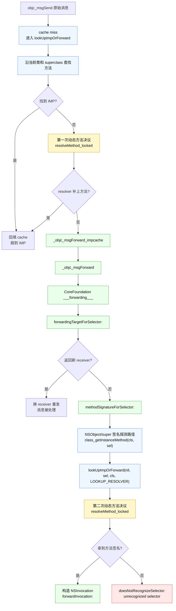

# 【iOS】Runtime - Part 2 && 消息发送：缓存、查找与转发

> 基于 objc4-951.7。延续 Part 1（对象/类/元类/isa 走位），打通一条完整消息链：快速路径（cache 命中）→ 慢速查找（`lookUpImpOrForward`）→ 动态解析 → 消息转发三部曲 → 崩溃。

## 目录

### 第一部分 · 快速路径（缓存命中）
- **1. 方法调用的本质**：`[obj foo]` → `objc_msgSend(obj, sel)`
- **2. 为什么 objc_msgSend 用汇编写**：性能 / 未知参数 / 尾调用
- **3. cache_t 数据结构**（`objc-runtime-new.h:337`）：先摊开汇编要操作的两张表
  - 3.1 `_bucketsAndMaybeMask`：指针与 mask 的融合
  - 3.2 `bucket_t`：`{SEL, IMP}` 与 ptrauth
  - 3.3 哈希与开放寻址探测（`cache_hash` / `cache_next`）
- **4. 快速路径汇编逐段**（`objc-msg-arm64.s`）：拿着 §3 的结构逐条印证
  - 4.1 取 isa → class（`GetClassFromIsa`，呼应 ISA_MASK）
  - 4.2 CacheLookup：按 SEL 哈希定位 bucket
  - 4.3 命中 `br IMP` / 未命中转入慢速查找
- **5. 缓存的写入与扩容**（`objc-cache.mm`）
  - 5.1 `insert`：哈希落位（:873）
  - 5.2 `reallocate`：翻倍扩容、丢弃旧表不迁移（:808）
  - 5.3 装填因子与留空策略

### 第二部分 · 慢速查找（lookUpImpOrForward）
- **6. 入口**：加锁 + realize / +initialize（:7672）
- **7. 在当前类找方法**
  - 7.1 `getMethodNoSuper_nolock` 遍历方法列表（:7338）
  - 7.2 已排序表二分查找 `findMethodInSortedMethodList`（:7110 → :7054）
- **8. 沿 superclass 链逐层上溯**（每层先查父类 cache）
- **9. 找到了**：`log_and_fill_cache` 回填缓存，闭环回快速路径（:7560）
- **10. 没找到**：动态方法解析（`resolveMethod_locked` :7528 → `resolveInstanceMethod` :7483）

### 第三部分 · 消息转发
- **11. 转发入口**：`_objc_msgForward_impcache`（:7674 / 汇编 :788）
- **12. 转发三部曲**
  - 12.1 快速转发 `forwardingTargetForSelector:`（换 receiver 重发）
  - 12.2 完整转发 `methodSignatureForSelector:` + `forwardInvocation:`
  - 12.3 兜底崩溃 `doesNotRecognizeSelector:`（`NSObject.mm:2578`）
- **13. 边界澄清**：objc4 只到 `_objc_msgForward`，三部曲调度在 CoreFoundation `___forwarding___`（闭源）
- **14. 其实发生了两次动态方法决议**：正常消息查找一次，完整转发签名路径里还可能再来一次

### 第四部分 · 实战与收尾
- **15. LLDB 实战**：cache 从空到有 / 命中对比 / 慢速断点 / 转发链逐站拦截
- **16. 收尾**：一条消息的命运 + 与 Part 1 的呼应 + 转向 Runtime 应用篇


![[objc_msgSend_full_pipeline.html]]

> 源码定位说明：`objc_msgSend` 汇编在 951.7 里已移到 `runtime/Messengers.subproj/objc-msg-arm64.s`（不在 `runtime/` 根下）。本文以本地 objc4-951.7 源码行号为准；源码块多数是围绕本文主线裁剪后的关键片段，标注“全文”的函数/宏才表示对应范围逐字完整。中文注释为本文新增、英文原注释保留。LLDB 在 **系统 libobjc**（`/usr/lib/libobjc.A.dylib`）上下符号断点，`settings set target.disable-aslr true` 关 ASLR，环境 macOS 26 / arm64。
>
> 新旧对照说明：文中带 🔄 的「旧→新对照」框，旧版取自本地 **objc4-818.2**（可调试版）真实源码、新版为 **951.7**，均标注精确 `file:line`。注意：缓存早期那次著名的大改造（`_buckets`/`_mask`/`_occupied` 三个分离字段 → 融合成 `_bucketsAndMaybeMask`）发生在 **781 之前**，已用本地 **objc4-756.2**（融合前末代，真实源码 `objc-runtime-new.h:82`）补做对照（见 3.1 末）；其余对照的旧版多取自 818.2，818.2 与 951.7 同属「融合字段后」时代，是这之后的增量演进。所有旧版代码均据真实源码、绝不凭记忆杜撰。

---
## objc_msgSend 简介

`objc_msgSend` 是 OC **所有方法调用的统一入口**——编译器把每一句 `[obj msg]` 都翻译成对它的调用，再由它在运行期找到方法实现（IMP）并跳过去。在正式拆「快速路径 → 慢速查找 → 转发」这三条路之前，这一节先把两件「会影响后文怎么读」的事讲清楚：一是它的**声明**为什么长得那么怪（`void objc_msgSend(void)`）、为什么调用前必须 cast；二是它其实**不是一个函数，而是一整个家族**。

### 0.1 声明：`void objc_msgSend(void)`

`objc_msgSend` 在公开头文件里有**两种声明**，由 `OBJC_OLD_DISPATCH_PROTOTYPES` 切换：

```objc
// message.h:46  —— 头部说明
/* Basic Messaging Primitives
 *
 * On some architectures, use objc_msgSend_stret for some struct return types.
 * On some architectures, use objc_msgSend_fpret for some float return types.
 * On some architectures, use objc_msgSend_fp2ret for some float return types.
 *
 * These functions must be cast to an appropriate function pointer type
 * before being called.
 */
#if !OBJC_OLD_DISPATCH_PROTOTYPES
// 新（默认）：无原型，参数注释化 —— 逼你按真实方法签名 cast 后再调
OBJC_EXPORT void
objc_msgSend(void /* id self, SEL op, ... */ ) // 虽然表面是 void，但是实际形式是（id self, SEL op, ...)，其中 self 是消息接收者，SEL op 是方法编号，后面 ... 是可变参数
    OBJC_AVAILABLE(10.0, 2.0, 9.0, 1.0, 2.0);
#else
// 旧：带具体原型 id(id, SEL, ...)
OBJC_EXPORT id _Nullable
objc_msgSend(id _Nullable self, SEL _Nonnull op, ...)
    OBJC_AVAILABLE(10.0, 2.0, 9.0, 1.0, 2.0);
#endif
```

默认（新）声明成 `void objc_msgSend(void)`，是苹果刻意为之——它要透传任意 OC 方法的参数，硬给一个固定原型反而会让编译器按错误的调用约定生成代码。理解这件事的钥匙，是先搞清楚 cast 是什么。

**Cast 是什么**
Cast 写法是在值前加括号里的目标类型：

```c
double x = 3.14;
int y = (int)x;   // 把 double 转成 int，y = 3
```

这种「值 cast」会真正转换数值。但**函数指针的 cast 不一样**——它不改变任何值，只改变编译器对这个指针的理解方式：

```c
void foo(void);   // 声明：无参数，无返回值
// foo 本质上就是一个内存地址，比如 0x1000
int (*fp)(int, int) = (int (*)(int, int))foo;
// fp 里存的还是 0x1000，一个字节都没变
// 变的是：编译器现在用 fp 的类型来决定怎么生成调用指令
```

**为什么「类型」那么重要**
arm64 调用约定规定参数按类型走不同的寄存器：
```
第1个整型参数 → x0
第2个整型参数 → x1
第1个浮点参数 → d0
第2个浮点参数 → d1
```
编译器生成调用代码时，**完全按声明的参数类型**决定往哪个寄存器放东西，跟函数体在哪里、实际长什么样无关。所以如果声明写错了：
```c
// 真实实现接收两个 double（浮点走 d0/d1）
double add(double a, double b) { return a + b; }

// 但声明说接收两个 int（整型走 x0/x1）
double add(int a, int b);

// 编译器按声明生成调用代码，把参数放进 x0/x1
// 函数体去 d0/d1 取浮点参数，取到的是空的或随机值 → 计算出错
```

这就是为什么 `objc_msgSend` 必须用 cast 调用——它声明成 `void(void)`，如果不 cast，编译器就不知道参数类型，寄存器就会放错，和上面那个 `add` 出错的原因一模一样。

**回到 objc_msgSend**
`objc_msgSend` 要能处理世界上所有 OC 方法，每个方法参数类型都不同，根本没法给一个固定原型。苹果把它声明成 `void objc_msgSend(void)`——逼迫每个调用点都显式 cast，从根源上防止「按错误签名生成调用代码」。

不cast：

```c
// 新声明是 void objc_msgSend(void)，编译器认为它「不接收任何参数」
// 于是这一行直接编译报错：too many arguments to function call, expected 0, have 4
objc_msgSend(obj, sel, 1.0, 2.0);   //「编译不通过」——逼你显式 cast
```

cast 之后，该这么写：
```objc
// 假设 obj 有方法： - (double)addA:(CGFloat)a b:(CGFloat)b;
// CGFloat 在 64 位即 double，和上面一样走浮点寄存器（d0/d1）
double result =
    ((double (*)(id, SEL, CGFloat, CGFloat))objc_msgSend)(obj, sel, 1.0, 2.0);
```

以 `objc_msgSend)` 为界拆成两部分：

- **前半**：`(double (*)(id, SEL, CGFloat, CGFloat))objc_msgSend`——把 `objc_msgSend` 临时标记成「接收4个参数、返回 double」的函数指针。不产生任何指令，只改变「编译器这一次怎么看待它」；
- **后半**：`(obj, sel, 1.0, 2.0)` 才是真正调用。编译器按上面那张类型表生成汇编：

```armasm
;; cast 后，编译器生成正确的参数赋值指令
mov  x0, obj      ;receiver → x0
mov  x1, sel      ;selector → x1
fmov d0, 1.0      ;第一个浮点参数 → d0
fmov d1, 2.0      ;第二个浮点参数 → d1
bl   objc_msgSend ;跳过去（地址没变，仍是同一个函数）
```

cast 改的是「跳进去之前」那几条 mov 怎么生成，不改 `objc_msgSend` 本身一个字节。

### 0.2 它不是一个函数，而是家族

上面一直盯着 `objc_msgSend` 一个讲，其实它只是这族 dispatch 函数里最常用的那个。Apple 头文件里有一段**较早、较通用**的描述（`message.h:77`）——读的时候注意：它把家族说成 `objc_msgSend / _stret / Super / Super_stret` 四个，但带 `_stret` 的那两个是 **x86 时代的产物，arm64 上已经没有**（本节末尾会用源码证明）。所以这段只当「历史背景 + 家族概念」看，**真正以 arm64 当下入口表为准**：

```objc
// message.h:77  —— 编译器如何选 messenger
// @note When it encounters a method call, the compiler generates a call to one of the
//  functions objc_msgSend, objc_msgSend_stret, objc_msgSendSuper, or objc_msgSendSuper_stret.
//  Messages sent to an object's superclass (using the super keyword) are sent using
//  objc_msgSendSuper; other messages are sent using objc_msgSend. Methods that have data
//  structures as return values are sent using objc_msgSendSuper_stret and objc_msgSend_stret.


// 这段意思就是说，编译器看到 Objective-C 方法调用时，不是直接调用方法实现，而是先选择一个“消息发送函数 messenger”。

/* messenger指的就是Runtime提供的消息发送函数，例如：
objc_msgSend
objc_msgSendSuper
objc_msgSend_stret
objc_msgSendSuper_stret */
```

`super` 调用走 `objc_msgSendSuper`，它吃的不是裸 receiver，而是一个 `objc_super`（`message.h:34`）——「从哪个类开始查」由 `super_class` 指定：

```objc
// message.h:34
struct objc_super {
    __unsafe_unretained _Nonnull id receiver;       // 真正的接收者（仍是 self）
    __unsafe_unretained _Nonnull Class super_class;  // 查找起点：从这个类开始（注释：first class to search）
};
```

arm64 汇编里这一整个家族的真实入口（`objc-msg-arm64.s`）：

```armasm
;; objc-msg-arm64.s —— messenger 家族入口一览
MSG_ENTRY    _objc_msgSend              // :587  普通消息（本篇主线）
ENTRY        _objc_msgLookup            // :622  只查 IMP 不调用（返回 IMP）
ENTRY        _objc_msgSendSuper         // :673  super 调用（旧）
ENTRY        _objc_msgSendSuper2        // :683  super 调用（实际在用，查找起点=super）
ENTRY        _objc_msgLookupSuper2      // :702  super 版的只查不调
STATIC_ENTRY __objc_msgSend_uncached    // :737  缓存未命中 → 进慢速查找（第二部分）
STATIC_ENTRY __objc_msgForward_impcache // :788  转发占位 IMP（第三部分）
ENTRY        __objc_msgForward          // :796  转发入口
ENTRY        _objc_msgSend_noarg        // :806  无参快路径
```

回头印证开头那句「`_stret` 是历史包袱」——不用我空口断言，**头文件自己就把这些版本在 arm64 标成不可用**：

```objc
// message.h:118 —— stret 版（结构体返回）
OBJC_EXPORT void
objc_msgSend_stret(void /* id self, SEL op, ... */ )
    OBJC_AVAILABLE(10.0, 2.0, 9.0, 1.0, 2.0)
    OBJC_ARM64_UNAVAILABLE;        // ←arm64 上根本没有这个符号

// message.h:158 —— fpret/fp2ret（浮点返回）的注释
// arm:    objc_msgSend_fpret not used
// arm:    objc_msgSend_fp2ret not used
```

所以 `objc_msgSend_stret`/`_fpret`/`fp2ret` 是 **x86/旧架构**专用：arm64 改用 `x8` 间接返回结构体、浮点直接走 `d0`，全部并回 `objc_msgSend`——这正是上面 arm64 入口清单里压根看不到 `_stret`/`_fpret` 的原因。

#### 为什么这样设计？

普通返回值的返回位置由 ABI 决定：整型、指针通常放在 x0，浮点通常放在 d0；较大的结构体不会直接塞进普通返回寄存器，而是通过调用约定使用一块由调用方准备的返回内存。

这些差异不是 Runtime 在 objc_msgSend 内部临时判断出来的，而是编译器根据方法签名和目标架构的 ABI，提前生成正确的调用形式。历史上在一些架构中，结构体返回和浮点返回需要走专门入口，所以出现了 objc_msgSend_stret、objc_msgSend_fpret 这类变体。

在 arm64 上，结构体返回已经按 AArch64 ABI 统一到普通调用约定中，因此没有 objc_msgSend_stret 这个专门入口。普通对象消息一般走 objc_msgSend。

super 调用仍然需要单独入口，例如 objc_msgSendSuper2。原因不是接收者变成了父类对象，而是方法查找起点变了：[super foo] 的 receiver 仍然是 self，只是 Runtime 要从父类开始查找 IMP。因此传入的第一个参数不是普通 id，而是保存 receiver 和查找起点信息的 objc_super 结构体指针。

#### 一个问题

输出什么？

```objc
@implementation Son : Father
- (id)init
{
    self = [super init];
    if (self)
    {
        NSLog(@"%@", NSStringFromClass([self class]));   // 输出什么？
        NSLog(@"%@", NSStringFromClass([super class])); // 输出什么？
    }
    return self;
}
@end
```

两行都输出 `Son`。

很多人第一反应是 `[super class]` 应该打印 `Father`——错误的根源就是把「查找起点」和「receiver」混为一谈。

拆开来看：

**`[self class]`** 没有悬念：receiver 是 Son 实例，查 `class` 方法，找到 `NSObject -class`，返回 `object_getClass(self)` = `Son`。

**`[super class]`** 编译器把它翻译成：

```objc
// 编译器生成
struct objc_super superInfo = {
    .receiver    = self,        // receiver 仍然是 Son 实例，没有变
    .super_class = Son.class,   // 传【当前类】Son，不是 Father（Super2 的关键）
};
// objc_msgSendSuper2 内部再做 Son->superclass = Father，从 Father 开始查找
objc_msgSendSuper2(&superInfo, @selector(class));
```

`objc_msgSendSuper2` 拿到这个结构体，先从里面的当前类 `Son` 解出其父类 `Father`，再从 `Father` 开始往上查 `class` 方法——`Father` 没实现，`NSObject` 有。进入 `NSObject -class`：

```objc
// NSObject -class 的实现本质上是：
- (Class)class {
    return object_getClass(self); // self 是谁？
}
```

这里的 `self` 是 `objc_super.receiver`——始终是那个 Son 实例。所以 `object_getClass(self)` 返回 `Son`。

结论：**`[super foo]` 改变的只是方法查找的起点，receiver 从始至终都是 `self`**。`[super class]` 和 `[self class]` 最终执行的是同一份 `NSObject -class` 实现，拿到的是同一个 receiver，自然输出同一个结果。


## 第一部分 · 快速路径（缓存命中）

### 1. 方法调用的本质：`[obj foo]` → `objc_msgSend(obj, sel)`

这和简介 0.1 讲的是同一套东西：`id receiver` 是指针（整型），按 arm64 调用约定放 `x0`；`SEL` 也是指针，放 `x1`；后续参数按类型依次填入 `x2…` 或 `d0…`。简介里说「声明写错了编译器就往错误的寄存器放参数」，这里就是那套规则的直接体现——`objc_msgSend` 之所以能从 `x0` 拿到 receiver、从 `x1` 拿到 selector，正是因为编译器在调用点按这套约定摆好了寄存器。下面这条 LLDB 实测的调用栈，直接显示了 `main` 里的一句 OC 调用最终是怎么落到 `objc_msgSend` → uncached → `lookUpImpOrForward` 的：

```text
(lldb) thread backtrace
* frame #0: libobjc.A.dylib`lookUpImpOrForward
  frame #1: libobjc.A.dylib`_objc_msgSend_uncached + 68
  frame #2: msgsend-demo`main at main.m:30:9     // [d bark]
  frame #3: dyld`start + 6992
(lldb) p (char *)sel_getName($x1)
(char *) "bark"
(lldb) po (Class)$x2
Dog
```

### 2. 为什么 objc_msgSend 用汇编写

三个原因：
- 调用频率极高，手写汇编榨干每一周期；
- 它要在**不知道目标方法参数个数/类型**的情况下原样透传所有寄存器；
- 命中后用**尾调用**（`br`）直接跳进 IMP，自己不留栈帧。下面第 4 节的命中分支 `br x17`（实测解析成带 PAC 的 `brab`）正是「不返回、直接跳走」。

源码佐证「透传所有参数寄存器」：快速路径命中时直接尾跳、不存任何东西；而一旦 miss 要调 C 函数做慢速查找，`SAVE_REGS` 会先把**全部参数寄存器**存下来，查完恢复再尾跳 IMP——保证 IMP 拿到的参数和最初一模一样：

```armasm
;; objc-msg-arm64.s:206 —— SAVE_REGS（关键部分）
.macro SAVE_REGS kind
    SignLR
    stp    fp, lr, [sp, #-16]!
    mov    fp, sp
    // save parameter registers: x0..x8, q0..q7
    sub    sp, sp,  #(10*8 + 8*16)
    stp    q0, q1,  [sp, #(0*16)]        //q0..q7：浮点/向量参数全保存
    stp    q2, q3,  [sp, #(2*16)]
    stp    q4, q5,  [sp, #(4*16)]
    stp    q6, q7,  [sp, #(6*16)]
    stp    x0, x1,  [sp, #(8*16+0*8)]    //x0..x7：整型参数（含 self/_cmd）
    stp    x2, x3,  [sp, #(8*16+2*8)]
    stp    x4, x5,  [sp, #(8*16+4*8)]
    stp    x6, x7,  [sp, #(8*16+6*8)]
.if \kind == MSGSEND
    stp    x8, x15, [sp, #(8*16+8*8)]    //x8：结构体返回的间接结果地址；x15：CacheLookup 暂存的 isa
    mov    x16, x15 // stashed by CacheLookup, restore to x16
.elseif \kind == METHOD_INVOKE
    str    x8,      [sp, #(8*16+8*8)]
.endif
.endmacro
```

`x0..x8 + q0..q7` 正是 arm64 调用约定里**全部整型/浮点参数 + 结构体返回辅助寄存器**——objc_msgSend 不知道目标方法签名，索性整体保下来透传，这就是「未知参数也能转发」的底气。

---

既然 `objc_msgSend` 用汇编写，那它到底在**操作什么**？快速路径全程就干一件事：拿 `sel` 在「类的方法缓存」这张哈希表里查 `imp`，查到就跳。所以在逐条读汇编之前，先把汇编要读写的两张表摊开——**§3 先讲静态结构**（`cache_t` 怎么把 buckets 指针和 mask 塞进一个字、`bucket_t` 怎么存 `{SEL, IMP}`、哈希怎么算下标、撞了怎么探测），**§4 再拿着这张地图逐条读汇编**。这样到了 §4，每条指令都能对应回 §3 的某个字段或常量，全是「印证」而不是「悬念」。

### 3. cache_t 数据结构（`objc-runtime-new.h:337`）

#### 3.1 `_bucketsAndMaybeMask`：指针与 mask 的融合

`cache_t` 的**数据布局部分**，正文只展开 **arm64 真机（`HIGH_16`）** 这一支；`OUTLINED 32/64 位 / HIGH_16_BIG_ADDRS / LOW_4` 等其它平台分支不删、原文收进本节末尾的折叠块（iOS 真机用不到）。其后的访问器方法声明与 `FAST_CACHE_*` 快速分配标志属另一主题，本块到 mask 存储常量为止：


```objc
// objc-runtime-new.h:337  —— cache_t 字段（仅展开 arm64 真机 HIGH_16 分支，其余平台见文末折叠块）
struct cache_t {
private:
    explicit_atomic<uintptr_t> _bucketsAndMaybeMask;  // buckets 指针，也可能顺便包含 mask
    
    //核心字段：arm64 上高 16 位 = mask，低 48 位 = buckets 指针（一字双用）
    union {
        // Note: _flags on ARM64 needs to line up with the unused bits of
        // _originalPreoptCache because we access some flags (specifically
        // FAST_CACHE_HAS_DEFAULT_CORE and FAST_CACHE_HAS_DEFAULT_AWZ) on
        // unrealized classes with the assumption that they will start out
        // as 0.
        
        struct {
            //arm64 真机（HIGH_16）：注意没有独立 _mask！mask 在 _bucketsAndMaybeMask 高位
            // Inline cache mask storage, 64-bit, we have occupied, flags, and
            // empty space to line up flags with originalPreoptCache.
            //
            // Note: the assembly code for objc_release_xN knows about the
            // location of _flags and the
            // FAST_CACHE_HAS_CUSTOM_DEALLOC_INITIATION flag within. Any changes
            // must be applied there as well.
            uint32_t                   _disguisedPreoptCacheSignature;//4
            uint16_t                   _occupied;// 2 bytes
            uint16_t                   _flags;// 2 bytes
            
#   define CACHE_T_HAS_FLAGS 1
        };
        
        //  这一段有关之前涉及的PAC机制，暂且可以不管
        explicit_atomic<preopt_cache_t *, PTRAUTH_STR(originalPreoptCache, ptrauth_key_process_independent_data)> _originalPreoptCache;
    };

    // Simple constructor for testing purposes only.
    cache_t() : _bucketsAndMaybeMask(0) {}

    // —— 只展开 arm64 真机 HIGH_16 的 mask 存储常量；OUTLINED / BIG_ADDRS / LOW_4 见折叠块 ——
#if CACHE_MASK_STORAGE == CACHE_MASK_STORAGE_HIGH_16
    //arm64 真机的 mask 存储常量定义
    // _bucketsAndMaybeMask is a buckets_t pointer in the low 48 bits

    // How much the mask is shifted by.
    static constexpr uintptr_t maskShift = 48;		//mask 放在第 48 位起的高 16 位

    // Additional bits after the mask which must be zero. msgSend
    // takes advantage of these additional bits to construct the value
    // `mask << 4` from `_maskAndBuckets` in a single instruction.
    static constexpr uintptr_t maskZeroBits = 4;	//紧邻 mask 的 4 位必须为 0，
							// 让 msgSend 一条指令算出 mask<<4（见 4.2 的 LSR #(48-(1+PTRSHIFT))）

    // The largest mask value we can store.
    static constexpr uintptr_t maxMask = ((uintptr_t)1 << (64 - maskShift)) - 1;

    // The mask applied to `_maskAndBuckets` to retrieve the buckets pointer.
    static constexpr uintptr_t bucketsMask = ((uintptr_t)1 << (maskShift - maskZeroBits)) - 1;

    // Ensure we have enough bits for the buckets pointer.
    static_assert(bucketsMask >= OBJC_VM_MAX_ADDRESS,
            "Bucket field doesn't have enough bits for arbitrary pointers.");

#if CONFIG_USE_PREOPT_CACHES
    static constexpr uintptr_t preoptBucketsMarker = 1ul;
#if __has_feature(ptrauth_calls)
    // 63..60: hash_mask_shift
    // 59..55: hash_shift
    // 54.. 1: buckets ptr + auth
    //      0: always 1
    static constexpr uintptr_t preoptBucketsMask = 0x007ffffffffffffe;
    static inline uintptr_t preoptBucketsHashParams(const preopt_cache_t *cache) {
        uintptr_t value = (uintptr_t)cache->shift << 55;
        // masks have 11 bits but can be 0, so we compute
        // the right shift for 0x7fff rather than 0xffff
        return value | ((objc::mask16ShiftBits(cache->mask) - 1) << 60);
    }
#endif
#endif // CONFIG_USE_PREOPT_CACHES
#endif

    // ……（以下为 mask()/buckets()/insert()/reallocate() 等方法声明，
    //     以及 FAST_CACHE_* 快速分配标志位定义，属另一主题，本块略去）
};
```


- explicit_atomic 是 objc runtime 自己封装的原子类型，保证多线程下的读写安全，但不加任何额外内存屏障开销，具体关于bucketsAndMaybeMask的内容我们下面再讲

- **union 的对齐约束**：runtime 在类 realized 之前就需要读 `_flags`（含 `FAST_CACHE_HAS_DEFAULT_CORE`/AWZ），此时 `_originalPreoptCache` 还是 null（全零）。因此 union 的内存布局必须保证：`_originalPreoptCache == 0` 时，`_flags` 读出来也是 0——而这两个标志位的语义正好是"0 = 使用默认实现"，零初始化即正确初始值，无需额外处理。`_disguisedPreoptCacheSignature` 的唯一作用就是填充偏移，让 `_flags` 落在这个位置上。

**为什么没有 `_mask`、却多了 `_disguisedPreoptCacheSignature`**

​`_disguisedPreoptCacheSignature` 这个字段的名字非常刻意——"disguised"（伪装的）暗示它并不是一个普通的数据字段，而是一个结构性占位符，目的是把 `_occupied`（offset 4）和 `_flags`（offset 6）推到正确的内存位置，满足前面注释里说的对齐约束。

具体来说，`_originalPreoptCache` 是一个经过 ptrauth 签名的指针，在 arm64 上指针的低几位有特定含义，高位用于存放签名。当这个指针不为 null 时，它的 bit 布局里某些位置是"未使用位"（unused bits），而 runtime 要求 `_flags` 在 `union` 内的偏移恰好落在这些未使用位上，这样两套身份才能安全共存而不互相干扰。`_disguisedPreoptCacheSignature` 占据前 4 字节，使得 `_flags` 落在 offset 6，正好满足这个约束。


**`_originalPreoptCache`**：与上面 struct 共用内存：预优化缓存时这里是 preopt_cache_t*，`preopt_cache_t` 是 dyld 在构建 shared cache 时预先生成的方法哈希表，存放在只读内存里。一个类在被 realized 之前，如果 dyld 已经为它准备好了 preopt cache，那么 `_originalPreoptCache` 就指向那张预生成的表，runtime 可以直接用，省去了首次 realize 时重建缓存的开销。一旦类被 realized、开始正常运行，这块内存就切换到 `struct` 身份，用 `_occupied` 记录已填充的 bucket 数量，用 `_flags` 存放类的快速标志位。两种状态互斥，共用内存没有语义冲突

> [!note]- 其它平台的 cache_t 布局（OUTLINED 32/64 位、HIGH_16_BIG_ADDRS、LOW_4）
>
> **union 结构体的其余三个分支**
>
> ```objc
> #if CACHE_MASK_STORAGE == CACHE_MASK_STORAGE_OUTLINED && !__LP64__
>             // Outlined cache mask storage, 32-bit, we have mask and occupied.
>             explicit_atomic<mask_t>    _mask;// 4 bytes (mask_t = uint32_t)
>             uint16_t                   _occupied;// 2 bytes
> #elif CACHE_MASK_STORAGE == CACHE_MASK_STORAGE_OUTLINED && __LP64__
>             // Outlined cache mask storage, 64-bit, we have mask, occupied, flags.
>             explicit_atomic<mask_t>    _mask;// 4 bytes
>             uint16_t                   _occupied;//  2 bytes
>             uint16_t                   _flags;// 2 bytes
> #   define CACHE_T_HAS_FLAGS 1
> #else
>             // Inline cache mask storage, 32-bit, we have occupied, flags.
>             uint16_t                   _occupied;
>             uint16_t                   _flags;
> #   define CACHE_T_HAS_FLAGS 1
> #endif
> ```
>
> - **OUTLINED 32 位**：这是最朴素的布局。`mask` 有自己独立的字段，不需要从 `_bucketsAndMaybeMask` 里提取。`_mask` 用 `explicit_atomic` 包装是因为缓存扩容时需要原子地替换它。这个分支没有 `_flags`，说明旧的 32 位路径不支持 `FAST_CACHE_*` 快速标志位机制，类的属性查询需要走更慢的路径。
> - **OUTLINED 64 位（Mac 模拟器）**：在分支一的基础上加了 `_flags`，同时定义了 `CACHE_T_HAS_FLAGS`，启用快速标志位路径。`mask` 仍然是独立字段。这是你在 Mac 模拟器上调试时看到的布局，相对容易理解，也是很多 ObjC 源码分析文章的参考对象，但它和真机行为有本质差异。
> - **32 位 inline**：最精简的布局。mask 存在 `_bucketsAndMaybeMask` 的低 4 位，所以这里也不需要独立的 `_mask` 字段。`union` 整体是 4 字节，比其他路径小一半。
>
> **mask 存储常量的其余三个分支**
>
> ```objc
> #if CACHE_MASK_STORAGE == CACHE_MASK_STORAGE_OUTLINED
>     // _bucketsAndMaybeMask is a buckets_t pointer
>     static constexpr uintptr_t bucketsMask = ~0ul;
>     static_assert(!CONFIG_USE_PREOPT_CACHES, "preoptimized caches not supported");
> #elif CACHE_MASK_STORAGE == CACHE_MASK_STORAGE_HIGH_16_BIG_ADDRS
>     static constexpr uintptr_t maskShift = 48;
>     static constexpr uintptr_t maxMask = ((uintptr_t)1 << (64 - maskShift)) - 1;
>     static constexpr uintptr_t bucketsMask = ((uintptr_t)1 << maskShift) - 1;
>     static_assert(bucketsMask >= OBJC_VM_MAX_ADDRESS, "Bucket field doesn't have enough bits for arbitrary pointers.");
> #if CONFIG_USE_PREOPT_CACHES
>     static constexpr uintptr_t preoptBucketsMarker = 1ul;
>     static constexpr uintptr_t preoptBucketsMask = bucketsMask & ~preoptBucketsMarker;
> #endif
> #elif CACHE_MASK_STORAGE == CACHE_MASK_STORAGE_LOW_4
>     // _bucketsAndMaybeMask is a buckets_t pointer in the top 28 bits
>     static constexpr uintptr_t maskBits = 4;
>     static constexpr uintptr_t maskMask = (1 << maskBits) - 1;
>     static constexpr uintptr_t bucketsMask = ~maskMask;
>     static_assert(!CONFIG_USE_PREOPT_CACHES, "preoptimized caches not supported");
> #endif
> ```
>
> - **OUTLINED**：`_bucketsAndMaybeMask` 整个字段就是 buckets 指针，没有任何位域打包。mask 独立存放在 `union` 里的 `_mask` 字段。`static_assert(!CONFIG_USE_PREOPT_CACHES, ...)` 是一个编译期断言，直接禁止这个平台开启 preopt cache 支持。因为 OUTLINED 策略下 `_bucketsAndMaybeMask` 没有空闲位来放 `preoptBucketsMarker`，实现上无法区分普通指针和 preopt 指针，所以干脆在编译期就封死这条路。
> - **HIGH_16_BIG_ADDRS**：和 `HIGH_16` 分支相比，这里**没有 `maskZeroBits`**，buckets 指针可以用到 bit 47，完整占据低 48 位。这个分支针对地址空间更大的 arm64 变体（比如某些 Apple Silicon Mac 配置），`OBJC_VM_MAX_ADDRESS` 更高，需要更多位来表示指针，所以不能像真机那样牺牲 4 位做优化。代价是 `msgSend` 里无法用单指令得到 `mask << 4`，需要额外一条 shift 指令。
>
> **HIGH_16 内的非 PAC（A11 及更早）子分支**
>
> ```objc
> #else
>     // 63..53: hash_mask
>     // 52..48: hash_shift
>     // 47.. 1: buckets ptr
>     //      0: always 1
>     static constexpr uintptr_t preoptBucketsMask = 0x0000fffffffffffe;
>     static inline uintptr_t preoptBucketsHashParams(const preopt_cache_t *cache) {
>         return (uintptr_t)cache->hash_params << 48;
>     }
> #endif
> ```
>
> - A11 及更早（无指针认证）走这支：hash 参数 `<< 48`，bit 63..53 放 hash_mask、52..48 放 hash_shift——和 PAC 版（63..60 mask 位数、59..55 hash_shift、`0x7fff >> mask_bits`）的打包方式不同。这与 §4.2 汇编 ② 里"只留 ARM64e 真机分支"的口径一致。


而这套「融合字」的拆/装，C++ 侧有对应实现——和 4.2 的汇编一一镜像：

```objc
// objc-cache.mm（arm64 HIGH_16 分支）
void cache_t::setBucketsAndMask(struct bucket_t *newBuckets, mask_t newMask) {   // :625 编码（装）
    // mask 放高位、buckets 放低位，或成一个字
    _bucketsAndMaybeMask.store(((uintptr_t)newMask << maskShift) | (uintptr_t)newBuckets,
                               memory_order_release);
    _occupied = 0;
}

mask_t cache_t::mask() const {                                                   // :637 取 mask（拆高位）
    uintptr_t maskAndBuckets = _bucketsAndMaybeMask.load(memory_order_relaxed);
    return maskAndBuckets >> maskShift;             //>>48，对应汇编 lsr p11,#48
}

struct bucket_t *cache_t::buckets() const {                                      // :671 取 buckets（拆低位）
    uintptr_t addr = _bucketsAndMaybeMask.load(memory_order_relaxed);
    return (bucket_t *)(addr & bucketsMask);        //& 低位掩码，对应汇编 and p10,…
}
```

`setBucketsAndMask`（`(mask<<48)|buckets`）= 汇编看到的那个融合字是怎么写进去的；`mask()`（`>>48`）/`buckets()`（`& bucketsMask`）= 汇编 `lsr`/`and` 在 C++ 里的等价拆解。换言之第 4.2 节那几条指令，就是把这三个 C++ 函数手写进了汇编快速路径。

**`buckets()` 为什么能从一个整数里「掏出」`bucket_t *`**——把上面那行 `addr & bucketsMask` 摊开看，arm64 HIGH_16 下 `_bucketsAndMaybeMask` 这一个字的位布局是：

```
位 63 ........ 48 | 47 .. 44 | 43 ............... 0
   mask（16 位）   | 必为 0   |  buckets 指针（低 44 位）
   └ maskShift=48           └ maskZeroBits=4
```

- **`bucketsMask` 是怎么来的**：`bucketsMask = (1 << (maskShift - maskZeroBits)) - 1 = (1 << 44) - 1`，即低 44 位全 1（`0x00000FFF_FFFFFFFF`）。`addr & bucketsMask` 把高 16 位的 mask 连同中间那 4 个保留位一起抹掉，剩下的就是纯指针，强转 `(bucket_t *)` 即得桶数组首地址——这是 `bucket_t` 在整套缓存读取里**唯一现身**的一刻。
- **为什么在 3.1 的字段里看不到 `bucket_t`**：`_bucketsAndMaybeMask` 声明成 `uintptr_t`（整数）而非 `bucket_t *`；3.1 只给了 `bucketsMask`/`maskShift` 等「解码常量」（钥匙），真正执行 `& 掩码 + 强转` 的动作在这里的 `buckets()` 里。所以在 3.1 那段按 `bucket_t` 去搜，搜不到是必然的——钥匙在抽屉里，开门的手在这一节。
- **`maskZeroBits = 4` 不是被浪费的 4 个位**：它垫在 mask（高 16 位）和指针区之间，专为 `objc_msgSend` 服务。msgSend 取 mask 时用的是 `LSR #44`（= `maskShift - maskZeroBits = 48 - 4`）而非 `LSR #48`，少右移 4 位，出来的值直接就是 `mask << 4`——而散列下标计算恰好需要 `mask << 4`（每个 bucket 16 = `1 << 4` 字节，即 §4.2 的 `BUCKET_SIZE`）。一条移位指令顺手把「取 mask」和「乘 bucket 大小」两件事一起做完，这正是把指针与 mask 打包进同一个字换来的性能红利。


**🔄 旧→新对照（objc4-756.2 → 951.7）：cache_t 三字段 → 融合字段**

这是缓存结构最有名的一次重构。旧版三个独立字段，新版融合成一个 `_bucketsAndMaybeMask`。

旧（756.2，`objc-runtime-new.h:82`）：
```objc
struct cache_t {
    struct bucket_t *_buckets;   // 桶数组指针（独立字段）
    mask_t _mask;                // 容量掩码（独立字段）
    mask_t _occupied;            // 已用槽数（独立字段）
    ...
    void expand();
    struct bucket_t * find(SEL sel, id receiver);
};
```
新（951.7，`:337`，arm64 走 HIGH_16）：
```objc
struct cache_t {
    explicit_atomic<uintptr_t> _bucketsAndMaybeMask;  // 高16位=mask，低48位=buckets，一字双用
    union {
        struct { uint32_t _disguisedPreoptCacheSignature; uint16_t _occupied; uint16_t _flags; };
        explicit_atomic<preopt_cache_t *> _originalPreoptCache;
    };
    ...
};
```
三字段 变更为 一字段：`_mask` 不再单独存，挤进 `_bucketsAndMaybeMask` 的高 16 位（省一次内存读取，且第 4.2 节那条「一条 `ldr` 同时取出 mask 和 buckets」正因此成立）；新增的 union 是给 dyld 共享缓存「预优化缓存」让位。`_occupied` 保留。

#### 3.2 `bucket_t`：`{IMP, SEL}` 与 ptrauth（:214）

逐字全文（含编码/解码/签名全部成员）：

```objc
// objc-runtime-new.h:214  —— bucket_t（全文）
struct bucket_t {
private:
    // IMP-first is better for arm64e ptrauth and no worse for arm64.
    // SEL-first is better for armv7* and i386 and x86_64.
    //arm64e 的 ptrauth 更适合 IMP 在前；armv7*/i386/x86_64 则 SEL 在前更优
#if __arm64__
    explicit_atomic<uintptr_t> _imp;	//arm64：IMP 在前（利于 ptrauth），存「编码后」的实现地址
    explicit_atomic<SEL> _sel;		//SEL：方法选择子，桶的查找键（命中判定就比它）
#else
    explicit_atomic<SEL> _sel;		//非 arm64：SEL 在前
    explicit_atomic<uintptr_t> _imp;	//IMP：编码后的函数实现地址
#endif

    // Compute the ptrauth signing modifier from &_imp, newSel, and cls.
    //modifierForSEL 把"这个 IMP 应该出现在哪里"这件事——哪个缓存数组、哪个方法、哪个类——压缩成一个整数，作为 ptrauth 签名的上下文标签，让每个 bucket 的签名都是唯一的，无法跨 bucket、跨 SEL、跨类复制。
    uintptr_t modifierForSEL(bucket_t *base, SEL newSel, Class cls) const {	//算 IMP 的 ptrauth 签名修饰子
        return (uintptr_t)base ^ (uintptr_t)newSel ^ (uintptr_t)cls;
        //IMP 的签名修饰子 = buckets_base ^ sel ^ cls（命中时汇编里两条 eor 就是在重算它）
    }

    // Sign newImp, with &_imp, newSel, and cls as modifiers.
    // 如果直接存裸指针，攻击者只要能写入 cache_t 所在的内存（比如通过堆溢出漏洞），就能把 _imp 改成任意地址，下次 objc_msgSend 命中这个 bucket 时就会跳到攻击者控制的地址，实现任意代码执行。
    
  // encodeImp 的存在就是为了防止这件事——存入 _imp 的不是裸指针，而是经过某种变换的值，让攻击者即使能写内存，也无法构造出一个"看起来合法"的 _imp 值。​
    //把一个 IMP 转成一个可以安全存入 _imp 字段的整数值，三条路径只是"怎么转"的区别，输入输出的本质完全相同。
    uintptr_t encodeImp(UNUSED_WITHOUT_PTRAUTH bucket_t *base, IMP newImp, UNUSED_WITHOUT_PTRAUTH SEL newSel, Class cls) const {	//写入缓存前：给 IMP 编码/签名
        if (!newImp) return 0;		//空 IMP 存 0，不参与编码
#if CACHE_IMP_ENCODING == CACHE_IMP_ENCODING_PTRAUTH
        //arm64e：用 ptrauth 把 IMP 重新签名，修饰子带入 base^sel^cls
        return (uintptr_t)
        bitcast_auth_and_resign(void *, newImp,
                                ptrauth_key_function_pointer,			//源密钥：通用函数指针
                                ptrauth_function_pointer_type_discriminator(IMP),	//源判别子：IMP 类型
                                ptrauth_key_process_dependent_code,		//目标密钥：进程相关代码
                                modifierForSEL(base, newSel, cls));		//目标修饰子：base^sel^cls
                                
#elif CACHE_IMP_ENCODING == CACHE_IMP_ENCODING_ISA_XOR
        return (uintptr_t)newImp ^ (uintptr_t)cls;	//非 ptrauth 设备：用类指针 cls 对 IMP 做异或，结果存入 _imp。这不是密码学安全，但它能防止最简单的攻击：直接从内存里读出 _imp 的值，得到的是混淆后的整数，不是可以直接调用的函数地址。还原时再 XOR 一次 cls 即可，因为 a ^ b ^ b = a
        
#elif CACHE_IMP_ENCODING == CACHE_IMP_ENCODING_NONE
        return (uintptr_t)newImp;		//不编码：裸存 IMP（模拟器/部分调试配置）
#else
#error Unknown method cache IMP encoding.
#endif
    }

public:
    static inline size_t offsetOfSel() { return offsetof(bucket_t, _sel); }	//_sel 在结构体内的偏移（汇编/插入定位用）
    
    
    inline SEL sel() const { return _sel.load(memory_order_relaxed); }		//原子读出 SEL（relaxed，无屏障）

#if CACHE_IMP_ENCODING == CACHE_IMP_ENCODING_ISA_XOR
#define MAYBE_UNUSED_ISA				//ISA_XOR 编码：解码要用到 cls，参数不能标 unused
#else
#define MAYBE_UNUSED_ISA __attribute__((unused))	//其它编码用不到 cls，标 unused 避免「未使用参数」告警
#endif

    inline IMP rawImp(MAYBE_UNUSED_ISA objc_class *cls) const {	//取 IMP「裸值」：解 XOR 混淆，但不验证 ptrauth 签名
        uintptr_t imp = _imp.load(memory_order_relaxed);
        if (!imp) return nil;			//空槽返回 nil
#if CACHE_IMP_ENCODING == CACHE_IMP_ENCODING_PTRAUTH
        //ptrauth：rawImp 不解签名，原样返回带签名位的指针
#elif CACHE_IMP_ENCODING == CACHE_IMP_ENCODING_ISA_XOR
        imp ^= (uintptr_t)cls;			//还原 ISA_XOR：再异或一次 cls
#elif CACHE_IMP_ENCODING == CACHE_IMP_ENCODING_NONE
#else
#error Unknown method cache IMP encoding.
#endif
        return (IMP)imp;
    }

    inline IMP imp(UNUSED_WITHOUT_PTRAUTH bucket_t *base, Class cls) const {	//取可直接调用的 IMP：完整解码 + 验签
        uintptr_t imp = _imp.load(memory_order_relaxed);
        if (!imp) return nil;			//空槽返回 nil
#if CACHE_IMP_ENCODING == CACHE_IMP_ENCODING_PTRAUTH
        SEL sel = _sel.load(memory_order_relaxed);	//ptrauth：先读出 sel 以重算修饰子
        return bitcast_auth_and_resign(IMP, imp,
                                       ptrauth_key_process_dependent_code,		//源密钥：进程相关代码
                                       modifierForSEL(base, sel, cls),			//源修饰子：base^sel^cls（用它验签）
                                       ptrauth_key_function_pointer,			//目标密钥：通用函数指针
                                       ptrauth_function_pointer_type_discriminator(IMP));	//目标判别子：IMP 类型
#elif CACHE_IMP_ENCODING == CACHE_IMP_ENCODING_ISA_XOR
        return (IMP)(imp ^ (uintptr_t)cls);	//还原 IMP ^ cls
#elif CACHE_IMP_ENCODING == CACHE_IMP_ENCODING_NONE
        return (IMP)imp;			//裸值直接返回
#else
#error Unknown method cache IMP encoding.
#endif
    }

    inline void scribbleIMP(uintptr_t value) {	//用指定值覆写 _imp（缓存清空/标记无效用）
        _imp.store(value, memory_order_relaxed);
    }

    template <Atomicity, IMPEncoding>		//模板参数决定：原子性（是否加锁/屏障）与 IMP 编码方式
    void set(bucket_t *base, SEL newSel, IMP newImp, Class cls);	//把 {sel,imp} 落位到本桶（声明，实现在 .mm）
};
```


arm64 上 IMP 在前、SEL 在后，所以 4.2 的 `ldp p17, p9`（先 imp 后 sel）顺序与此一致；命中时用 `modifierForSEL`（`buckets_base ^ sel ^ cls`）重算修饰子解签，正是 4.3 实测的两条 `eor`。

> [!summary] 本段小结：bucket_t 就是「一个被加密保护的 {SEL, IMP} 槽」
>
> **1. 它是什么** —— `bucket_t` 是方法缓存哈希表的最小单元：`_sel` 是查找键（命中判定比它），`_imp` 是该方法的实现地址。整张缓存就是一个 `bucket_t[]`。
>
> **2. 核心设计：`_imp` 从不裸存** —— 缓存位于可写内存，一旦被堆溢出等漏洞改写，裸 `_imp` 就等于把「下次 `objc_msgSend` 跳哪」的控制权交给攻击者。所以写入前一律经 `encodeImp` 变换，读出时再还原。三条编码路径按强度递减：
>
> | 编码 | 平台 | 手段 | 安全级别 |
> |---|---|---|---|
> | `PTRAUTH` | arm64e 真机 | ptrauth 重签名，修饰子 = `base^sel^cls` | 密码学级，跨桶/跨类无法复制 |
> | `ISA_XOR` | 一般 arm64 | `_imp ^ cls` | 仅混淆，挡「读内存直接拿地址」 |
> | `NONE` | 模拟器/调试 | 裸存 | 无 |
>
> **3. 编/解码是一对镜像** —— `encodeImp`（写）↔ `imp`（读：解码 + **验签**）。其中 `modifierForSEL`（`base^sel^cls`）是把「这个 IMP 该出现在哪个桶、哪个方法、哪个类」压成一个上下文标签，让每个签名都唯一。`rawImp` 是**不验签的旁路**，只解 XOR、不碰 ptrauth，用于不需要调用、只想看值的场景。
>
> **4. 与汇编呼应** —— 正因为修饰子是 `base^sel^cls` 三项，§4.3 命中时才需要 `^sel`、`^cls` **两条 `eor`** 重算修饰子解签；756.2 时代修饰子只有 `&_imp^sel` 两项，故只需一条（见下文旧→新对照）。

**🔄 旧→新对照（756.2 → 951.7）：IMP 签名修饰子从 2 项到 3 项**

旧（756.2，`objc-runtime-new.h:51`）—— 裸字段，修饰子只有 `&_imp ^ sel` 两项：
```objc
#if __arm64__
    uintptr_t _imp;          // 非 atomic 裸字段
    SEL _sel;
#endif
    uintptr_t modifierForSEL(SEL newSel) const {
        return (uintptr_t)&_imp ^ (uintptr_t)newSel;       // 仅 2 项
    }
```
新（951.7，`:219` / `:227`）—— 原子字段，修饰子加入 `cls` 成 3 项：
```objc
#if __arm64__
    explicit_atomic<uintptr_t> _imp;     // 改为原子字段
    explicit_atomic<SEL> _sel;
#endif
    uintptr_t modifierForSEL(bucket_t *base, SEL newSel, Class cls) const {
        return (uintptr_t)base ^ (uintptr_t)newSel ^ (uintptr_t)cls;   // 加入 cls，3 项
    }
```
把 `cls` 加进 ptrauth 修饰子，让同一个 IMP 在不同类的缓存里签名不同，跨类伪造更难——这也是第 4.3 节命中时汇编要算**两条** `eor`（`^sel`、`^cls`）的原因；756.2 时只需异或 `sel` 一项。字段也从裸 `uintptr_t` 升级为 `explicit_atomic` 配合无锁读。下面这条（818.2 → 951.7）则是同一行更晚的一次细化：

**🔄 旧→新对照（818.2 → 951.7）：IMP 签名加入「类型判别子」**

旧（818.2，`objc-runtime-new.h:234`）—— 判别子恒为 `0`：
```objc
ptrauth_auth_and_resign(newImp,
                        ptrauth_key_function_pointer, 0,        // 判别子 = 0
                        ptrauth_key_process_dependent_code,
                        modifierForSEL(base, newSel, cls));
```
新（951.7，`:236`）—— 换成 IMP 类型判别子：
```objc
bitcast_auth_and_resign(void *, newImp,
                        ptrauth_key_function_pointer,
                        ptrauth_function_pointer_type_discriminator(IMP),  // 绑定到 IMP 类型
                        ptrauth_key_process_dependent_code,
                        modifierForSEL(base, newSel, cls));
```
把固定判别子 `0` 换成 `ptrauth_function_pointer_type_discriminator(IMP)`，签名绑定到「函数指针类型」，arm64e 上更难被跨类型伪造；951 还新增了配套的 `rawImp()` 取值方法（见上方 `bucket_t` 全文）。

#### 3.3 哈希与开放寻址探测（`cache_hash` :307 / `cache_next` :241）

逐字全文：

```objc
// objc-cache.mm:240  —— cache_next（全文，含两种配置）
#if CACHE_END_MARKER
static inline mask_t cache_next(mask_t i, mask_t mask) {
    return (i+1) & mask;			//带哨兵：向高地址探测，回绕到 0
}
#elif __arm64__
static inline mask_t cache_next(mask_t i, mask_t mask) {
    return i ? i-1 : mask;			//arm64：向低地址探测，到 0 则回绕到 mask（表尾）
}
#else
#error unexpected configuration
#endif

// objc-cache.mm:304
// Class points to cache. SEL is key. Cache buckets store SEL+IMP.
// Caches are never built in the dyld shared cache.

// objc-cache.mm:307  —— cache_hash  SEL到下标到，它的输入是 SEL，输出是一个下标整数（mask_t），仅此而已。它不知道 buckets_t * 在哪里，也不接触任何 bucket_t
static inline mask_t cache_hash(SEL sel, mask_t mask)
{
    uintptr_t value = (uintptr_t)sel;
#if SEL_HASH_SHIFT_XOR
    value ^= value >> 7;			//与汇编 eor p12,p1,p1,LSR #7 一一对应
#endif
    return (mask_t)(value & mask);
}
```

`cache_hash` 决定"从哪里开始找"，`cache_next` 决定"找不到时往哪里走"。两者共同构成了方法缓存哈希表的完整寻址逻辑，在 `insert` 和 `objc_msgSend` 的汇编里都按照同样的顺序执行，保证写入和查找的探测路径完全一致，写入时存在 slot `i` 的条目，查找时一定能在同样的探测路径上找到。


探测方向的两种策略：

1. 下标加一，用 `& mask` 实现环形回绕（因为 capacity 是 2 的幂，`mask = capacity - 1`，位与自动把越界的下标映射回 0）。这是最经典的开放寻址线性探测写法。
   `CACHE_END_MARKER` 的存在意味着哈希表末尾保留了一个特殊的哨兵 bucket，它的 `_sel` 是一个非零的特殊值，用于让 `objc_msgSend` 的汇编在探测时能快速识别"已经到达表尾，需要回绕"，而不需要做边界比较。这个哨兵在 `reallocate` 时被显式写入。


2. 下标减一，到达 0 时跳回 `mask`（即数组最后一个槽位）。这是**反向探测**，从哈希起点向低地址方向扫描。
   方向本身不影响正确性，只影响探测顺序。arm64 选择反向探测有一个具体的汇编优化原因：`objc_msgSend` 的汇编热路径里，探测循环的终止条件是"回到起点 `begin`"。反向探测时，`begin` 是探测的起始下标，也是循环的终止边界，汇编里可以复用同一个寄存器做比较，减少寄存器压力。同时，递减操作在 arm64 的 `SUBS` 指令里天然设置 condition flags，可以直接用条件跳转，不需要额外的比较指令。

   你在上面 `insert` 代码里看到的 `cache_next` 调用，走的就是这条 arm64 路径，所以探测方向是递减的
![[ObjC-cache_t-bucket_t-完整梳理.html]]

### 4. 快速路径汇编逐段（`objc-msg-arm64.s`）

§3 把两张表（`cache_t` / `bucket_t`）和哈希探测讲清楚了，下面逐条读汇编时，每条指令都能对应回去：`ldr [x0]` 取的是 §3.1 的 isa、`[x16, #CACHE]` 取的是 §3.1 的融合字、`ldp` 拆的是 §3.2 的 `bucket_t`、命中时两条 `eor` 重算的是 §3.2 的 `modifierForSEL`。

入口 `_objc_msgSend`（:587），逐字全文：

```arm-asm
;; objc-msg-arm64.s:587  —— _objc_msgSend 入口（全文）
	MSG_ENTRY _objc_msgSend
	UNWIND _objc_msgSend, NoFrame

	cmp	p0, #0			// nil check and tagged pointer check
					//receiver 是否为 0 / 是否 tagged pointer
#if SUPPORT_TAGGED_POINTERS
	b.le	LNilOrTagged		//  (MSB tagged pointer looks negative)
					//tagged 指针最高位为 1，看起来像负数 → 走特殊分支
#else
	b.eq	LReturnZero
#endif
	ldr	p14, [x0]		// p14 = raw isa
					//取对象首 8 字节 = 原始 isa（含标志位）
	GetClassFromIsa_p16 p14, 1, x0	// p16 = class
					//抹标志位 + ptrauth 解签 → 真正的 Class（见 4.1）
LGetIsaDone:
	// calls imp or objc_msgSend_uncached
	CacheLookup NORMAL, _objc_msgSend, __objc_msgSend_uncached
					//查缓存：命中尾跳 IMP，未命中跳 uncached（见 4.2/4.3）

#if SUPPORT_TAGGED_POINTERS
LNilOrTagged:
	b.eq	LReturnZero		// nil check
					//上面 cmp 若 ==0 即 nil，返回零值
	GetTaggedClass
	b	LGetIsaDone		//tagged pointer 从专表取 class，再回主流程
// SUPPORT_TAGGED_POINTERS
#endif

LReturnZero:
	// x0 is already zero
	mov	x1, #0			//给 nil 发消息：返回值寄存器全部清零
	movi	d0, #0
	movi	d1, #0
	movi	d2, #0
	movi	d3, #0
	ret

	END_ENTRY _objc_msgSend
```

> **旁注：判空两架构都做，但 x86_64 抽成宏、arm64 直接内联。** 你若翻 x86_64 资料，会看到判空被抽成一个 `NilTest` 宏（`objc-msg-x86_64.s:641`，`testq %a1,%a1; jz LNilTestSlow`），而且要按返回类型 `NORMAL / FPRET / FP2RET / STRET` **分流**——因为 x86 上结构体返回、浮点返回各有专门的 messenger（`objc_msgSend_stret / _fpret / _fp2ret`）。**arm64 没有这些变体**（见 §0.2 的 `OBJC_ARM64_UNAVAILABLE`），所以既不需要分流、也不抽宏，判空就是上面入口那两条内联指令：`:590 cmp p0,#0` 把「nil（==0）」和「tagged pointer（最高位=1，补码看像负数）」一次比掉，`:592 b.le` 同时兜住两种情况，nil 最终走 `LReturnZero`（:610）清零返回。一句话：**x86_64 因为背着 stret/fpret 家族才搞出带分流的 `NilTest` 宏；arm64 精简到入口一条 `cmp`。**

#### 4.0 先看类对象布局：`#CACHE` / `#SUPERCLASS` 偏移哪来的

上面入口里 `[x0]` 取 isa、后面 4.2 的 `[x16, #CACHE]`、第 8 节的 `[x16, #SUPERCLASS]`，这些偏移都来自 `objc_class` 的内存布局：

```objc
// objc-runtime-new.h:2635 —— 类对象本身就是一个 objc_class
struct objc_class : objc_object {
    // Class ISA;          //偏移 0：继承自 objc_object（4.1 节 ldr [x0] 取的就是它）
    Class superclass;      //偏移 8
    cache_t cache;         //偏移 16
    class_data_bits_t bits;//偏移 16+sizeof(cache_t)：class_rw_t* + rr/alloc 标志
};
```

汇编侧把这些字段偏移写死成宏（指针 8 字节）：

```armasm
;; objc-msg-arm64.s:79 —— 类结构里被选用的字段偏移
#define SUPERCLASS       __SIZEOF_POINTER__        // = 8   → [x16, #SUPERCLASS]
#define CACHE            (2 * __SIZEOF_POINTER__)  // = 16  → [x16, #CACHE]
#define BUCKET_SIZE      (2 * __SIZEOF_POINTER__)  // = 16  → 4.2 的 ldp …, #-BUCKET_SIZE
```

对照 4.2 的 LLDB 反汇编 `ldr x10, [x16, #0x10]`：`0x10` = 16 = `#CACHE`，取的正是 `cache` 字段（即融合字 `_bucketsAndMaybeMask`）；`ldp …, #-0x10` 里的 `0x10` 就是 `BUCKET_SIZE`（每个 bucket 16 字节）。

#### 4.1 取 isa → class（`GetClassFromIsa_p16`，:115，呼应 Part 1 的 ISA_MASK）

```objc
;; objc-msg-arm64.s:115  —— GetClassFromIsa_p16 宏（全文）
.macro GetClassFromIsa_p16 src, needs_auth, auth_address /* note: auth_address is not required if !needs_auth */

#if SUPPORT_INDEXED_ISA
	// Indexed isa
	//watchOS 等：isa 存的是类表下标，不是指针
	mov	p16, \src			// optimistically set dst = src
	tbz	p16, #ISA_INDEX_IS_NPI_BIT, 1f	// done if not non-pointer isa
	// isa in p16 is indexed
	adrp	x10, _objc_indexed_classes@PAGE
	add	x10, x10, _objc_indexed_classes@PAGEOFF
	ubfx	p16, p16, #ISA_INDEX_SHIFT, #ISA_INDEX_BITS  // extract index
	ldr	p16, [x10, p16, UXTP #PTRSHIFT]	// load class from array
1:

#elif __LP64__
	//arm64 真机走这里
.if \needs_auth == 0 // _cache_getImp takes an authed class already
	mov	p16, \src
.else
	// 64-bit packed isa
	ExtractISA p16, \src, \auth_address
	//ExtractISA = 用 ISA_MASK(0x7ffffffffffff8) 抹低位 + autda 解 ptrauth 签名
.endif
#else
	// 32-bit raw isa
	mov	p16, \src			//32 位：isa 就是裸指针，直接用

#endif

.endmacro
```

LLDB 实测：`__LP64__` 分支里 `ExtractISA` 落地为 `and x16, x14, #0x7ffffffffffff8`（**ISA_MASK**，与 Part 1 一致）+ `autda`：

```text
(lldb) disassemble --name objc_msgSend
objc_msgSend:
  <+0>:  cmp    x0, #0x0
  <+4>:  b.le   <+128>                       ; nil/tagged
  <+8>:  ldr    x14, [x0]                     ; raw isa
  <+12>: and    x16, x14, #0x7ffffffffffff8   ; ISA_MASK → class
  <+16>: mov    x10, x0
  <+20>: movk   x10, #0x6ae1, lsl #48
  <+24>: autda  x16, x10                      ; ptrauth 解签
```

#### 4.2 CacheLookup：按 SEL 哈希定位 bucket（:336）

整段宏逐字全文（保留 `HIGH_16 / HIGH_16_BIG_ADDRS / LOW_4` 全部分支与 preopt 路径）：

```armasm
;; objc-msg-arm64.s:336  —— CacheLookup 宏（全文）
.macro CacheLookup Mode, Function, MissLabelDynamic, MissLabelConstant
	//
	// Restart protocol:
	//
	//   As soon as we're past the LLookupStart\Function label we may have
	//   loaded an invalid cache pointer or mask.
	//
	//   When task_restartable_ranges_synchronize() is called,
	//   (or when a signal hits us) before we're past LLookupEnd\Function,
	//   then our PC will be reset to LLookupRecover\Function which forcefully
	//   jumps to the cache-miss codepath which have the following
	//   requirements:
	//
	//   GETIMP:
	//     The cache-miss is just returning NULL (setting x0 to 0)
	//
	//   NORMAL and LOOKUP:
	//   - x0 contains the receiver
	//   - x1 contains the selector
	//   - x16 contains the isa
	//   - other registers are set as per calling conventions
	//

	mov	x15, x16			// stash the original isa
					//备份 isa，转发指令里要用它判断是否回退到父类
LLookupStart\Function:
	// p1 = SEL, p16 = isa

	// ════════ ① ：取 mask + buckets  ════════
#if CACHE_MASK_STORAGE == CACHE_MASK_STORAGE_HIGH_16_BIG_ADDRS

	//macOS 原生 + Mac Catalyst 走这里（地址空间大，objc-config.h:218）
	
	ldr	p10, [x16, #CACHE]				// p10 = mask|buckets
	lsr	p11, p10, #48			// p11 = mask
	and	p10, p10, #0xffffffffffff	// p10 = buckets
	
	//分两步取出 mask(高16)、buckets(低48)。因为现代 64 位系统实际只用低 48 位寻址,高 16 位是空闲的,正好拿来塞 mask,省一次内存访问。
	
	
#  if SEL_HASH_SHIFT_XOR
	eor	p12, p1, p1, LSR #7
	and	w12, w12, w11			// x12 = (_cmd ^ (_cmd >> 7)) & mask
#  else
	and	w12, w1, w11			// x12 = _cmd & mask
#  endif
#elif CACHE_MASK_STORAGE == CACHE_MASK_STORAGE_HIGH_16


	// 算哈希桶索引：普通版 _cmd & mask；XOR 版先 sel^(sel>>7) 混淆再 &mask（即 cache_hash，减冲突）。桶数恒为 2 的幂，&mask 等价取模

	//iOS 真机走这里（objc-config.h:218）：一条 ldr 取出 mask|buckets，后面边算哈希边移位，比 BIG_ADDRS 省一步
	
	ldr	p11, [x16, #CACHE]			// p11 = mask|buckets
#  if CONFIG_USE_PREOPT_CACHES
#    if __has_feature(ptrauth_calls)
	tbnz	p11, #0, LLookupPreopt\Function	//最低位=1 → 这是共享缓存预优化表，跳专门路径
	and	p10, p11, #0x0000ffffffffffff	// p10 = buckets
#    else
	and	p10, p11, #0x0000fffffffffffe	// p10 = buckets
	tbnz	p11, #0, LLookupPreopt\Function
#    endif
#  endif

#  if SEL_HASH_SHIFT_XOR
	eor	p12, p1, p1, LSR #7		//sel ^ (sel>>7)，对应 cache_hash
	and	p12, p12, p11, LSR #48		// x12 = (_cmd ^ (_cmd >> 7)) & mask
#  else
	and	p10, p11, #0x0000ffffffffffff	// p10 = buckets
	and	p12, p1, p11, LSR #48		// x12 = _cmd & mask
#  endif // CONFIG_USE_PREOPT_CACHES
#elif CACHE_MASK_STORAGE == CACHE_MASK_STORAGE_LOW_4
#  if SEL_HASH_SHIFT_XOR
#    error SEL_HASH_SHIFT_XOR not supported for LOW_4
#  endif
	ldr	p11, [x16, #CACHE]				// p11 = mask|buckets
	and	p10, p11, #~0xf			// p10 = buckets
	and	p11, p11, #0xf			// p11 = maskShift
	mov	p12, #0xffff
	lsr	p11, p12, p11			// p11 = mask = 0xffff >> p11
	and	p12, p1, p11			// x12 = _cmd & mask
#else
#error Unsupported cache mask storage for ARM64.
#endif

	// ════════ ② 定位起始 bucket，进入 do-while 探测循环 ════════
	
	add	p13, p10, p12, LSL #(1+PTRSHIFT)
						// p13 = buckets + ((_cmd & mask) << (1+PTRSHIFT))
					//p13 指向哈希命中的那个 bucket（每个 bucket 16 字节）

						// do {
1:	ldp	p17, p9, [x13], #-BUCKET_SIZE	//     {imp, sel} = *bucket--
					//取出 {imp,sel}，并让指针向低地址移一格（探测方向）
	cmp	p9, p1				//     if (sel != _cmd) {
	b.ne	3f				//         scan more
						//     } else {
2:	CacheHit \Mode				// hit:    call or return imp
						//     }
3:	cbz	p9, \MissLabelDynamic		//     if (sel == 0) goto Miss;
					//撞到空槽(sel==0) → 缓存未命中，跳慢速查找
	cmp	p13, p10			// } while (bucket >= buckets)
	b.hs	1b

	// ════════ ③ 扑空回绕：wrap-around 绕到表尾再扫一圈 ════════
	// wrap-around:
	//   p10 = first bucket
	//   p11 = mask (and maybe other bits on LP64)
	//   p12 = _cmd & mask
	//
	// A full cache can happen with CACHE_ALLOW_FULL_UTILIZATION.
	// So stop when we circle back to the first probed bucket
	// rather than when hitting the first bucket again.
	//
	// Note that we might probe the initial bucket twice
	// when the first probed slot is the last entry.


#if CACHE_MASK_STORAGE == CACHE_MASK_STORAGE_HIGH_16_BIG_ADDRS
	add	p13, p10, w11, UXTW #(1+PTRSHIFT)
						// p13 = buckets + (mask << 1+PTRSHIFT)
#elif CACHE_MASK_STORAGE == CACHE_MASK_STORAGE_HIGH_16
	add	p13, p10, p11, LSR #(48 - (1+PTRSHIFT))
						// p13 = buckets + (mask << 1+PTRSHIFT)
						// see comment about maskZeroBits
					//回绕：跳到表尾（最后一个 bucket）从尾部继续探测
#elif CACHE_MASK_STORAGE == CACHE_MASK_STORAGE_LOW_4
	add	p13, p10, p11, LSL #(1+PTRSHIFT)
						// p13 = buckets + (mask << 1+PTRSHIFT)
#else
#error Unsupported cache mask storage for ARM64.
#endif
	add	p12, p10, p12, LSL #(1+PTRSHIFT)
						// p12 = first probed bucket
					//记下最初探测的位置，绕一圈回到这里就停

						// do {
4:	ldp	p17, p9, [x13], #-BUCKET_SIZE	//     {imp, sel} = *bucket--
	cmp	p9, p1				//     if (sel == _cmd)
	b.eq	2b				//         goto hit
	cmp	p9, #0				// } while (sel != 0 &&
	ccmp	p13, p12, #0, ne		//     bucket > first_probed)
	b.hi	4b

LLookupEnd\Function:
LLookupRecover\Function:
	b	\MissLabelDynamic		//绕完整圈仍没有 → 未命中

	// ════════ ④ 预优化缓存路径（仅 iOS / dyld 共享缓存里的系统类才进，你这条用不到）════════
	
#if CONFIG_USE_PREOPT_CACHES
#if CACHE_MASK_STORAGE != CACHE_MASK_STORAGE_HIGH_16
#error config unsupported
#endif
LLookupPreopt\Function:
	//以下是 dyld 共享缓存「预优化缓存」专用查找，普通动态类不会进
	// 怎么进来的：①里 cache 字段最低位被置 1（tbnz p11,#0）就说明这是 dyld 进来的「常量缓存」，跳到这里
	// —— 步骤 A：取 buckets 基址并尽早认证 ——
#if __has_feature(ptrauth_calls)
	and	p10, p11, #0x007ffffffffffffe	// p10 = buckets　← 抹掉低位 tag，得到 buckets 指针
	autdb	x10, x16			// auth as early as possible　← 用 isa 当 modifier 解签该指针（ptrauth），越早越好
#endif

	// —— 步骤 B：把 _cmd 换算成「相对共享缓存首个 SEL 的偏移」，再哈希定位条目 ——
	// x12 = (_cmd - first_shared_cache_sel)
	adrp	x9, _MagicSelRef@PAGE		// 取 first_shared_cache_sel 的地址（共享缓存里 SEL 连续排布）
	ldr	p9, [x9, _MagicSelRef@PAGEOFF]	// p9 = first_shared_cache_sel
	sub	p12, p1, p9			// x12 = _cmd 相对首个 SEL 的偏移（用偏移代替整指针，省位宽）

	// w9  = ((_cmd - first_shared_cache_sel) >> hash_shift & hash_mask)
#if __has_feature(ptrauth_calls)
	// bits 63..60 of x11 are the number of bits in hash_mask　← hash 参数被打包进 cache 值(x11)的高位
	// bits 59..55 of x11 is hash_shift

	lsr	x17, x11, #55			// w17 = (hash_shift, ...)　← 取出 hash_shift
	lsr	w9, w12, w17			// >>= shift　← 偏移先右移 hash_shift

	lsr	x17, x11, #60			// w17 = mask_bits　← 取出「mask 占几位」
	mov	x11, #0x7fff
	lsr	x11, x11, x17			// p11 = mask (0x7fff >> mask_bits)　← 据此算出 hash_mask
	and	x9, x9, x11			// &= mask　← x9 = 条目下标
#else
	// bits 63..53 of x11 is hash_mask　← 非 ptrauth：打包位置不同
	// bits 52..48 of x11 is hash_shift
	lsr	x17, x11, #48			// w17 = (hash_shift, hash_mask)
	lsr	w9, w12, w17			// >>= shift　← 偏移右移 hash_shift
	and	x9, x9, x11, LSR #53		// &=  mask　← x9 = 条目下标
#endif

	// —— 步骤 C：读出打包条目，比对 SEL，命中就算出 IMP；否则按 fallback 重查 ——
	// sel_offs is 26 bits because it needs to address a 64 MB buffer (~ 20 MB as of writing)
	// keep the remaining 38 bits for the IMP offset, which may need to reach
	// across the shared cache. This offset needs to be shifted << 2. We did this
	// to give it even more reach, given the alignment of source (the class data)
	// and destination (the IMP)
	// 一条条目 8 字节，把 SEL 偏移和 IMP 偏移压在一起：高 26 位 sel_offs、低 38 位 imp_offs
	ldr	x17, [x10, x9, LSL #3]		// x17 == (sel_offs << 38) | imp_offs　← 取出该条目
	cmp	x12, x17, LSR #38		// 用我们算的 sel 偏移 比对 条目里存的 sel_offs（高 26 位）

.if \Mode == GETIMP
	b.ne	\MissLabelConstant		// cache miss　← 对不上：常量缓存未命中
	sbfiz x17, x17, #2, #38         // imp_offs = combined_imp_and_sel[0..37] << 2　← 取低 38 位再 <<2 还原 IMP 偏移
	sub	x0, x16, x17        		// imp = isa - imp_offs　← IMP = isa 基址 - 偏移
	SignAsImp x0, x17			// 给 IMP 重新签名
	ret					// GETIMP 模式：把 IMP 放 x0 返回
.else
	b.ne	5f				        // cache miss　← 对不上：跳 fallback 重查
	sbfiz x17, x17, #2, #38         // imp_offs = combined_imp_and_sel[0..37] << 2　← 还原 IMP 偏移
	sub x17, x16, x17               // imp = isa - imp_offs　← 算出 IMP
.if \Mode == NORMAL
	br	x17				// NORMAL：直接尾跳进方法实现
.elseif \Mode == LOOKUP
	orr x16, x16, #3 // for instrumentation, note that we hit a constant cache　← 在 isa 低位打标记：本次命中的是常量缓存
	SignAsImp x17, x10			// 给 IMP 签名
	ret					// LOOKUP：返回 IMP，不跳转
.else
.abort  unhandled mode \Mode
.endif

	// —— fallback：本类常量缓存没有 → 顺着 fallback 指向的另一个 isa 再查一遍 ——
5:	ldur	x9, [x10, #-16]			// offset -16 is the fallback offset　← buckets 前 16B 存的是 fallback 偏移
	add	x16, x16, x9			// compute the fallback isa　← isa += 偏移，得到 fallback 类
	b	LLookupStart\Function		// lookup again with a new isa　← 带新 isa 回到 ① 重新走整套查找
.endif
#endif // CONFIG_USE_PREOPT_CACHES
```

总的来说，这个过程就是：**用哈希定位 bucket，命中就直接跳转 IMP，扑空则回绕扫一圈、再不命中就走慢速查找**。

CacheLookup 是 `objc_msgSend` 快速路径的核心：每次 `[obj msg]`，runtime 都要在类的方法缓存里找 selector 对应的 IMP，这段宏就是该查找的汇编实现。设计目标只有一个——**让缓存命中这条「热路径」快到极致**，因为绝大多数消息发送都会命中。

上面那段宏含 `HIGH_16 / HIGH_16_BIG_ADDRS / LOW_4` 三套分支，下面只跟 **iOS 真机走的 `HIGH_16`** 这条主线，把它拆成「**三步定位 + 回绕兜底**」逐条讲（每步把宏里对应的几行摘出来，省得回滚看全文）。预优化缓存是系统类专属支线，放在末尾「四」单讲。

##### 一、取 mask + buckets，并用 `cache_hash` 算出起始下标

```armasm
ldr  p11, [x16, #CACHE]        // p11 = mask|buckets（一条 ldr 取出融合字，#CACHE=0x10）
eor  p12, p1, p1, LSR #7       // sel ^ (sel>>7)
and  p12, p12, p11, LSR #48    // p12 = (sel^(sel>>7)) & mask = 起始槽下标
```

1. **一条 `ldr` 取出融合字**：`[x16, #CACHE]` 一次性读出 §3.1 的 `_bucketsAndMaybeMask`——高 16 位是 mask、低 48 位是 buckets 指针。HIGH_16 的精明之处是**不急着拆**：下一条算哈希时直接用 `p11, LSR #48` 顺手把 mask 移出来用，省掉一条独立的拆字指令（正是 §3.1 `maskZeroBits` 那条注释说的「一条指令顺手算出 `mask`」）。
2. **算下标 = §3.3 的 `cache_hash`**：`SEL_HASH_SHIFT_XOR` 版先 `sel ^ (sel>>7)` 把高位搅进低位、**减少哈希冲突**，再 `& mask`。`& mask` 之所以等价于「对桶数取模」，是因为桶数恒为 2 的幂，结果必落在 `[0, mask]`。（非 XOR 版直接 `_cmd & mask`，因为 SEL 本质是字符串地址、低位已够随机。）

##### 二、定位起始 bucket，进入 do-while 探测

```armasm
add p13, p10, p12, LSL #(1+PTRSHIFT)   // p13 = &buckets[idx]（下标 ×16，每个 bucket 16B）
1: ldp p17, p9, [x13], #-BUCKET_SIZE    // {imp,sel} = *bucket；指针随即向低地址挪一格
   cmp p9, p1                           //   sel == _cmd ?
   b.ne 3f                              //     不等 → 去判空/继续探测
2: CacheHit \Mode                       //   命中 → 见 §4.3
3: cbz p9, \MissLabelDynamic            //   撞空槽(sel==0) → 慢速查找
   cmp p13, p10                         // } while (bucket >= buckets)
   b.hs 1b
```

下标 `<< (1+PTRSHIFT)` 即 `×16`（每个 bucket 16 字节），算出起始桶地址 `p13`，然后进探测循环。每一轮三种结局：
- **命中**（`sel == _cmd`）：跳 `CacheHit`，按 `\Mode` 分流——NORMAL 直接 `br` 跳进 IMP、GETIMP 把 IMP 放 x0 返回、LOOKUP 返回 IMP 不跳（三模式详见 **§4.3**）。
- **撞空槽**（`sel == 0`）：说明这个 selector 从没缓存过，`cbz` 直接跳 `_objc_msgSend_uncached` 走**慢速查找**（第二部分），找到后再回填缓存。
- **都不是**：`ldp ..., #-BUCKET_SIZE` 已让指针**向低地址挪一格**——这正是 §3.3 `cache_next`（arm64 `i ? i-1 : mask`）的汇编落地。只要还没退到表头（`bucket >= buckets`）就回 `1:` 继续。注意 ObjC 缓存的探测方向是==**从高地址往低地址**==。

##### 三、扑空回绕（wrap-around）：绕到表尾再扫一圈

```armasm
add p13, p10, p11, LSR #(48-(1+PTRSHIFT))  // p13 = 表尾最后一个 bucket
add p12, p10, p12, LSL #(1+PTRSHIFT)       // p12 = 最初探测位置（绕回这里就停）
4: ldp p17, p9, [x13], #-BUCKET_SIZE
   cmp p9, p1
   b.eq 2b                                 //   命中 → 回 CacheHit
   cmp p9, #0
   ccmp p13, p12, #0, ne                   // while (sel != 0 && bucket > first_probed)
   b.hi 4b
   b \MissLabelDynamic                      // 绕完整圈仍无 → 未命中
```

1. **为什么要回绕**：从哈希起点一路探到**表头**还没命中、也没撞空槽，不能就此放弃——目标可能因哈希冲突被放到了表**尾**（环形缓冲语义）。`mask` 正好是「桶数 − 1」，所以 `buckets + mask×16` 就是最后一个 bucket。
2. **停止边界是「绕回最初探测的桶」而非「数组第一个桶」**：开启 `CACHE_ALLOW_FULL_UTILIZATION` 后缓存可被填满（没有空槽），此时唯一可靠的终止条件就是「绕回出发点」。`ccmp` 一条指令把 `sel != 0 && bucket > first_probed` 两个条件串起来，省掉一个分支。（边界：起点恰好是最后一个槽时，初始桶可能被探测两次，可接受。）
3. **安全兜底**：`LLookupEnd` / `LLookupRecover` 标签就落在这里——前面讲的 restart 协议一旦触发，PC 被弹到 `LLookupRecover`，紧接着就是 `b \MissLabelDynamic`，等于「出任何岔子统统走慢速查找重来」。

##### 四、预优化缓存路径（系统类专属支线，动态类不走）
**只在 iOS 的 dyld 共享缓存里的系统类才会进**(入口是第①段 `HIGH_16` 分支里那个 `tbnz p11, #0` 判断最低位)

普通动态类的方法缓存是**运行时**才建立的——第一次调用某个方法走慢速查找,找到后填回 `cache_t`,第二次才命中。但系统类(`NSObject`、`NSString`、`UIViewController`……)有个特殊性:

- 它们被打包进 **dyld 共享缓存**(dyld shared cache),所有 App 共享同一份只读副本;
- 它们的方法在编译期/缓存构建期就**完全确定**,不会变。

既然不变,苹果就在**构建共享缓存时(离线)​**,把这些类的方法缓存**预先计算好、烤进只读内存**。这样你的 App 一启动,系统类的缓存就已经是"热"的了,**第一次调用就直接命中**,省掉了冷启动时大量的慢速查找。

**① 进门：`tbnz` 探最低位，确认这是预优化表**

一次 `[obj 系统方法]` 进来后，在真机走的 `HIGH_16` 分支里先读出打包值，再用一条 `tbnz` 决定走哪条路：

```armasm
ldr  p11, [x16, #CACHE]                 // p11 = mask|buckets
tbnz p11, #0, LLookupPreopt\Function     // 最低位=1 → 这是预优化缓存表
```

苹果借 buckets 指针天然为 0 的最低位当标志位：置 1 就代表"我挂的是 dyld 共享缓存烤好的只读预优化表"。命中这一跳，就正式进了 `LLookupPreopt`。进门第一件事（ARM64e 真机）是 `autdb x10, x16` 用 isa 做上下文认证 buckets 指针，尽早挡住被篡改的表。

**② 定位：算 sel 相对偏移 + 专属哈希，查出那一个表项**

预优化表不存绝对地址，一切都是相对偏移。所以先把 `_cmd` 转成"相对共享缓存第一个 selector 的偏移"：
```armasm
adrp x9, _MagicSelRef@PAGE
ldr  p9, [x9, _MagicSelRef@PAGEOFF]
sub  p12, p1, p9                  // x12 = _cmd - first_shared_cache_sel（sel 偏移）
```

然后用预优化表专属的哈希（shift 和 mask 打包在 `p11` 高位，和动态缓存的 `_cmd & mask` 完全不同）算索引，并取出表项：

```armasm
// ARM64e 真机：hash 参数打包在 x11(cache 值) 高位——bits 63..60=mask 位数、bits 59..55=hash_shift
lsr x17, x11, #55                 // 取出 hash_shift
lsr w9, w12, w17                  // sel_offs >> shift
lsr x17, x11, #60                 // 取出 mask 位数(mask_bits)
mov x11, #0x7fff
lsr x11, x11, x17                 // mask = 0x7fff >> mask_bits
and x9, x9, x11                   // & mask → 桶索引 w9
ldr x17, [x10, x9, LSL #3]        // 取表项：x17 = (sel_offs<<38) | imp_offs
```

每个表项是 8 字节，**高 26 位装 sel_offs、低 38 位装 imp_offs**（sel_offs 26 位够寻址 64MB 的 selector 缓冲区，剩 38 位给 IMP 留足跨缓存的触及范围）。

**③ 命中：比对 sel 偏移，用 `isa - imp_offs` 还原 IMP 并跳转**

拿到表项后比对 sel 偏移是否相等，相等即命中：

```armasm
cmp   x12, x17, LSR #38           // 表里的 sel_offs == 我算的 sel 偏移?
b.ne  5f                          // 不等 → 跳 ④ 的 fallback
sbfiz x17, x17, #2, #38           // 取 imp_offs 并 <<2（对齐换更大范围）
sub   x17, x16, x17               // imp = isa - imp_offs（减法还原绝对地址!）
br    x17                         // NORMAL 模式：直接跳进方法体执行
```

这一步有两个必须记住的点：一是 **IMP 用减法算**——预优化里 IMP 总在比 isa 更低的地址，存差值既紧凑又位置无关（整个共享缓存随便映射到哪，相对关系不变）；二是 **三种 Mode 分流**——NORMAL 直接 `br x17` 跳转（日常每次系统消息的终点）、GETIMP 把 IMP 放 x0 返回、LOOKUP 用 `orr x16, x16, #3` 打个"命中常量缓存"的标记。ARM64e 上还会 `SignAsImp` 给算出的 IMP 重新签名。

**④ 扑空：取 -16 处 fallback，换父类 isa 回开头重查**

如果 sel 偏移对不上（`b.ne 5f`），不代表彻底失败——方法可能在父类里：

```armasm
5:  ldur x9, [x10, #-16]              // 槽 -16 处存着 fallback 偏移
    add  x16, x16, x9                 // 算出 fallback isa（通常是父类）
    b    LLookupStart\Function        // 带新 isa 跳回宏开头，重走一遍完整查找
```

它在固定的 -16 偏移读出 fallback，加到当前 isa 上得到父类 isa，然后 `b LLookupStart` 从整个宏的最开头重来。这正好呼应宏入口那句 `mov x15, x16`——查找途中 `x16` 被反复改写，但 `x15` 始终留着最初的 isa，供消息转发等环节判断"从哪个类起步的"。绕完继承链仍找不到，最终才落到 `MissLabelConstant` / `MissLabelDynamic` 走慢速查找。


![[CacheLookup-宏逻辑梳理.html]]


下面这段是在 **macOS 上 LLDB 实测**，所以内联展开的正是 **BIG_ADDRS** 分支，且把命中（CacheHit）和回绕（wrap-around）也一并抓全：

```text
;; LLDB disassemble --frame：objc_msgSend 内联展开的 CacheLookup（macOS arm64 = HIGH_16_BIG_ADDRS）
;; 寄存器约定：x16=isa/cls  x1=_cmd(SEL)  x10=buckets基址  x11=mask  x13=当前bucket  x9=槽内SEL  x17=槽内IMP
  <+28>: mov  x15, x16                  ; 备份初始 isa；preopt fallback 改写 x16 后，x15 仍保留起始类，CacheHit LOOKUP 的 cmp x16, x15 / cinc 凭此判断是否命中父类
  <+32>: ldr  x10, [x16, #0x10]         ; x10 = cache 字段 = mask|buckets（#CACHE=0x10）
  <+36>: lsr  x11, x10, #48             ; x11 = mask（高 16 位）
  <+40>: and  x10, x10, #0xffffffffffff ; x10 = buckets（低 48 位）
  <+44>: eor  x12, x1, x1, lsr #7       ; sel ^ (sel>>7)  —— 对应 §3.3 cache_hash 的 SEL_HASH_SHIFT_XOR
  <+48>: and  w12, w12, w11             ; x12 = hash & mask = 起始槽下标
  <+52>: add  x13, x10, x12, lsl #4     ; x13 = &buckets[idx]（每格 16B = BUCKET_SIZE）
;; ---------- do { 开放寻址探测 ----------
  <+56>: ldp  x17, x9, [x13], #-0x10    ; {imp,sel} = *bucket；指针 -16（向低地址挪一格）
  <+60>: cmp  x9, x1                    ; 槽里的 sel == _cmd ?
  <+64>: b.ne <+80>                     ;   不等 → 去判空 / 继续探测
;; ---------- CacheHit：命中 ----------
  <+68>: eor  x10, x10, x1              ; x10 = buckets ^ sel
  <+72>: eor  x10, x10, x16             ; x10 = buckets ^ sel ^ cls  ← modifierForSEL（3 项！呼应 3.2）
  <+76>: brab x17, x10                  ; 用该 modifier 认证解签 IMP 并尾跳 → 直接进入方法实现（不返回）
;; ---------- 未命中 / 是否继续 ----------
  <+80>: cbz  x9, ...b40                ; 撞到空槽(sel==0) → _objc_msgSend_uncached（慢速查找，第二部分）
  <+84>: cmp  x13, x10                  ; bucket 还没越过表头 buckets ?
  <+88>: b.hs <+56>                     ;   是 → 回 <+56> 继续  } while (bucket >= buckets)
;; ---------- wrap-around：绕到表尾再扫一圈 ----------
  <+92>:  add x13, x10, w11, uxtw #4    ; x13 = 表尾最后一个 bucket（mask 即末尾下标）
  <+96>:  add x12, x10, x12, lsl #4     ; x12 = 最初探测位置（绕回到这里就停）
  <+100>: ldp x17, x9, [x13], #-0x10    ; {imp,sel} = *bucket；指针 -16
  <+104>: cmp x9, x1                    ; sel == _cmd ?
  <+108>: b.eq <+68>                    ;   命中 → 回 <+68> 走 CacheHit
  <+112>: cmp x9, #0x0                  ; sel == 0 ?（空槽）
  <+116>: ccmp x13, x12, #0x0, ne       ; 且 bucket > 最初位置 ?（两条件与）
  <+120>: b.hi <+100>                   ;   都成立 → 继续绕
  <+124>: b   ...b40                    ; 绕完整圈仍没有 → _objc_msgSend_uncached（未命中）
```

> 把上面那串指令抽成「人话」流程（开放寻址 + 向低地址探测 + 末尾回绕）：

```text
idx    = (sel ^ (sel >> 7)) & mask        // cache_hash：算起始槽
bucket = &buckets[idx]
do {
    {imp, s} = *bucket                    // 读当前槽的 {IMP, SEL}
    if (s == sel) goto 命中               //   SEL 对上 → 命中
    if (s == 0)   goto 未命中             //   撞到空槽 → 缓存里压根没有
    bucket--                              // 向低地址挪一格（开放寻址线性探测）
} while (bucket >= buckets)               // 没越过表头就继续
// 越过表头 → wrap 到表尾，再扫到「最初起始槽」为止；仍没有 → 未命中

命中:  imp = auth(imp, buckets ^ sel ^ cls);  br imp   // 解签后尾跳，不留栈帧（§4.3 / §3.2）
未命中: b _objc_msgSend_uncached                        // 转入 lookUpImpOrForward（第二部分）
```


#### 4.3 命中 `br IMP` / 未命中转入慢速查找（`CacheHit` :316）

逐字全文（含 NORMAL / GETIMP / LOOKUP 三种模式）：

```armasm
;; objc-msg-arm64.s:315  —— CacheHit 宏（全文）
// CacheHit: x17 = cached IMP, x10 = address of buckets, x1 = SEL, x16 = isa
.macro CacheHit
.if $0 == NORMAL
	TailCallCachedImp x17, x10, x1, x16	// authenticate and call imp
					//objc_msgSend 走这条：解签 IMP 后 br 尾跳 即不是自己处理结果而是直接跳到另一个函数，另一个函数执行完直接返回调用者
					
.elseif $0 == GETIMP
	mov	p0, p17    // 把命中的IMP挪到返回值寄存器x0
	cbz	p0, 9f					// don't ptrauth a nil imp，- 如果 IMP 是 0(空),直接跳到 9: 返回,绝不对 nil 做指针认证(对 nil 做 PAC 会得到一个垃圾值,反而坏事);
	AuthAndResignAsIMP x0, x10, x1, x16, x17	// authenticate imp and re-sign as IMP
9:	ret						// return IMP
					// cache_getImp 走这条：把 IMP 当返回值给出、不调用；与 NORMAL 的区别是最后用 ret 返回而非 br 跳转
					
					
.elseif $0 == LOOKUP
	// No nil check for ptrauth: the caller would crash anyway when they
	// jump to a nil IMP. We don't care if that jump also fails ptrauth.
	AuthAndResignAsIMP x17, x10, x1, x16, x10	// authenticate imp and re-sign as IMP ← 解签重签 IMP；不做 nil 检查（拿 nil 去跳本就会崩，省一步）
	cmp	x16, x15    // 比较当前 isa(x16) 与开头备份的原始 isa(x15)：preopt fallback 上溯父类时两者不等
	
	cinc	x16, x16, ne			// x16 += 1 when x15 != x16 (for instrumentation ; fallback to the parent class) ← 回退父类时 x16+1 作标志；普通快速路径 x16 不变、不触发
	
	ret				// return imp via x17 ← 返回 IMP，不是跳转
					//objc_msgLookup 走这条：返回 IMP 但不跳（super 调用用）
					
					
					
.else
.abort oops
.endif
.endmacro
```

我们先来讲讲这三种模式：

- NORMAL 是"找到就立刻跳进去执行"(objc_msgSend),GETIMP 是"只把函数指针交给我、不执行"(cache_getImp),LOOKUP 是"把指针交给我、由我自己决定何时跳"(objc_msgLookup,super 调用专用)​

- GETIMP 服务的是 `cache_getImp`、`class_getMethodImplementation` 这类 API——它们的诉求是"**我只想拿到这个方法的函数指针,我现在不打算调用它**"。

- LOOKUP 服务的是 `objc_msgLookup`,最典型的使用者是 **​`super` 调用**(`[super foo]` 会先经 `objc_msgLookupSuper2` 拿到 IMP),以及一些需要插桩/统计的场景。它的诉求介于前两者之间:"**给我指针(像 GETIMP),但我会自己跳(不像 GETIMP 那样只是拿去看),你别替我跳(不像 NORMAL)​**"。


**🔄 旧→新对照（objc4-818.2 → 951.7）：预优化缓存条目的位布局**

共享缓存「预优化缓存」里每个条目把 sel 偏移与 imp 偏移打包进一个 64 位字，**两版位划分不同**。

旧（818.2，`objc-msg-arm64.s:474`）—— sel / imp 各 32 位：
```asm
ldr  x17, [x10, x9, LSL #3]   // x17 == sel_offs | (imp_offs << 32)
cmp  x12, w17, uxtw
...
sub  x0, x16, x17, LSR #32    // imp = isa - imp_offs
...
5: ldursw x9, [x10, #-8]      // fallback offset 在 -8
```
新（951.7，`:500`）—— 改成 sel 26 位 / imp 38 位（imp 偏移再 `<<2`）：
```asm
ldr   x17, [x10, x9, LSL #3]   // x17 == (sel_offs << 38) | imp_offs
cmp   x12, x17, LSR #38
...
sbfiz x17, x17, #2, #38        // imp_offs = bits[0..37] << 2
sub   x0, x16, x17             // imp = isa - imp_offs
...
5: ldur  x9, [x10, #-16]       // fallback offset 移到 -16
```
动机（951 新增注释自陈）：共享缓存越来越大，32 位 imp 偏移不够「够到」远处的 IMP，于是把 imp 偏移扩到 38 位（再 `<<2` 进一步增大寻址范围），sel 偏移压到 26 位（足够寻址 ~64MB 选择子表）。

![[Objective-C-快速路径查找要点总结.html]]

### 5. 缓存的写入与扩容（`objc-cache.mm`）

> **注**：写入路径（`cache_t::insert`）并不在快速路径执行过程中触发——快速路径只读 cache。`insert` 的实际触发点是第二部分第 9 节：慢速查找成功后，`log_and_fill_cache` 回填缓存时才调用它。本节放在第一部分，是因为 cache 的读/写/结构三者放在一起对照阅读更方便，并非表示写入属于快速路径的执行流。

#### 5.1 `insert`：哈希落位（:873）

逐字全文：

```objc
// objc-cache.mm:873  —— cache_t::insert（全文）
void cache_t::insert(SEL sel, IMP imp, id receiver)
{
    lockdebug::assert_locked(&runtimeLock.get());

    // Never cache before +initialize is done
    if (slowpath(!cls()->isInitialized())) {
        return;					//+initialize 没跑完不缓存
    }
    
    // +initialize 还没执行完的类不允许缓存方法。原因是 +initialize 可能通过 method_setImplementation 或 class_addMethod 动态修改方法列表，如果在这期间缓存了某个 IMP，+initialize 完成后 IMP 可能已经变了，缓存里存的就是过期数据。slowpath 告诉编译器这个分支极少走到，让分支预测器把资源集中在后面的热路径上。

    if (isConstantOptimizedCache()) {
        _objc_fatal("cache_t::insert() called with a preoptimized cache for %s",
                    cls()->nameForLogging());
    }

#if DEBUG_TASK_THREADS
    return _collecting_in_critical();
#else
#if CONFIG_USE_CACHE_LOCK
    mutex_locker_t lock(cacheUpdateLock);
#endif

    ASSERT(sel != 0 && cls()->isInitialized());


    // Use the cache as-is if until we exceed our expected fill ratio.
    mask_t newOccupied = occupied() + 1;
    unsigned oldCapacity = capacity(), capacity = oldCapacity;
    //空表首次分配，初始容量4
    if (slowpath(isConstantEmptyCache())) {
        // Cache is read-only. Replace it.
        if (!capacity) capacity = INIT_CACHE_SIZE;	//空表首次分配，INIT_CACHE_SIZE = 4
        reallocate(oldCapacity, capacity, /* freeOld */false);
    }
    
    else if (fastpath(newOccupied + CACHE_END_MARKER <= cache_fill_ratio(capacity))) {
        // Cache is less than 3/4 or 7/8 full. Use it as-is.
        //装填率没到上限：原表直接用
    }
    
#if CACHE_ALLOW_FULL_UTILIZATION，对于容量极小的表（`FULL_UTILIZATION_CACHE_SIZE` 通常是 8），扩容的内存分配开销相对于节省的内存来说不划算，所以允许填得更满一些，推迟扩容时机。
    else if (capacity <= FULL_UTILIZATION_CACHE_SIZE && newOccupied + CACHE_END_MARKER <= capacity) {
        // Allow 100% cache utilization for small buckets. Use it as-is.
    }
    
#endif
    else {
        capacity = capacity ? capacity * 2 : INIT_CACHE_SIZE;	//超阈值 → 容量翻倍
        if (capacity > MAX_CACHE_SIZE) {
            capacity = MAX_CACHE_SIZE;
        }
        reallocate(oldCapacity, capacity, true);		//扩容并释放旧表
    }
// 容量翻倍是动态哈希表的标准策略，保证容量始终是 2 的幂次（这对 cache_hash 的 & mask 取模操作至关重要）。MAX_CACHE_SIZE 防止无限增长。freeOld = true 表示扩容完成后释放旧表。

//reallocate 内部只分配一张新的空 bucket_t[] 数组，旧表整张丢弃、不迁移——源码注释写得很直白：// Cache's old contents are not propagated.（详见 §5.2）。旧条目不会被重新哈希搬过去，而是靠之后的 miss 慢速查找重新 insert 懒填回来。扩容后 buckets() 返回的 base 地址变了，旧条目里 IMP 的 ptrauth 签名都含旧 base，本就随旧表一起被丢弃；重填时由 insert 用新 base 重新签名落位。这正是 modifierForSEL 把 base 纳入 discriminator 的好处：换表即让旧签名自然失效，无需任何额外的失效机制。

---

//哈希定位起点

    bucket_t *b = buckets();
    mask_t m = capacity - 1;
    mask_t begin = cache_hash(sel, m);
    mask_t i = begin;

    // Scan for the first unused slot and insert there.
    // There is guaranteed to be an empty slot.
    do {
        if (fastpath(b[i].sel() == 0)) {
            incrementOccupied();
            b[i].set<Atomic, Encoded>(b, sel, imp, cls());	
            //命中空槽（sel() == 0）​：找到了可以插入的位置。incrementOccupied() 把 _occupied 加一，然后 b[i].set<Atomic, Encoded>(b, sel, imp, cls()) 把这条记录写入 bucket。
            return;
        }
        if (b[i].sel() == sel) {
            // The entry was added to the cache by some other thread
            // before we grabbed the cacheUpdateLock.
            return;						// 命中同一 SEL（sel() == sel）​：说明另一个线程在我们拿到锁之前已经插入了同一个方法。直接返回，不重复插入。这是一个经典的"加锁后再检查"（check-after-lock）模式——加锁前的状态可能已经被其他线程改变，加锁后必须重新验证。
        }
    } while (fastpath((i = cache_next(i, m)) != begin));	//开放寻址，绕一圈回起点才停

    bad_cache(receiver, (SEL)sel);
#endif // !DEBUG_TASK_THREADS
}
```


![[cache_t-insert-交互式流程演示.html]]

#### 5.2 `reallocate`：翻倍扩容、丢弃旧表不迁移（:808）

逐字全文：

```objc
// objc-cache.mm:808  —— cache_t::reallocate（全文）
ALWAYS_INLINE
void cache_t::reallocate(mask_t oldCapacity, mask_t newCapacity, bool freeOld)
{
	// 取旧表，分配新表
    bucket_t *oldBuckets = buckets();
    bucket_t *newBuckets = allocateBuckets(newCapacity);

    // Cache's old contents are not propagated.
    // This is thought to save cache memory at the cost of extra cache fills.
    // fixme re-measure this
    //关键：扩容时旧缓存内容整张丢弃、不迁移，靠后续 miss 重新填
    //         —— 用「几次额外慢速查找」换「省内存 + 实现简单」

    ASSERT(newCapacity > 0);
    ASSERT((uintptr_t)(mask_t)(newCapacity-1) == newCapacity-1);
	// 第一个断言防止分配零容量的表，这是一个基本的合法性检查。
	// 第二个断言：它验证 newCapacity - 1 这个值能被 mask_t（uint32_t 或 uint16_t，取决于平台）无损地表示。因为 mask = newCapacity - 1 会被存入 _bucketsAndMaybeMask 的高 16 位（arm64 HIGH_16 路径），如果 newCapacity - 1 超过了 mask_t 的表示范围，高位会被截断，存入的 mask 就是错误的值，哈希表的所有操作都会出错。这个断言在编译期就把这个约束固化下来，防止 MAX_CACHE_SIZE 被设置成超出 mask_t 范围的值。
	
    setBucketsAndMask(newBuckets, newCapacity - 1);
    //它把新的 buckets 指针和新的 mask 按照位域协议打包，原子地写入 _bucketsAndMaybeMask。
    
    if (freeOld) {
        collect_free(oldBuckets, oldCapacity);		//延迟回收旧表（可能有线程在读）
    }
}
```


**🔄 旧→新对照（756.2 → 951.7）：缓存写入从「三个自由函数」到「一个 insert 方法」**

旧（756.2）把写入拆成多块：`cache_fill_nolock()`（自由函数，`objc-cache.mm:556`）判 3/4 装填 → 满了调 `cache_t::expand()`（`:539`，`oldCapacity*2` 翻倍）→ 再 `cache_t::find()`（`:519`，开放寻址找空槽 / 同 sel）落位。
```objc
// 756.2：expand() —— 翻倍扩容
uint32_t newCapacity = oldCapacity ? oldCapacity*2 : INIT_CACHE_SIZE;
// 756.2：find() —— 独立的开放寻址探测
do {
    if (b[i].sel() == 0 || b[i].sel() == s) return &b[i];
} while ((i = cache_next(i, m)) != begin);
```
新（951.7）把「判装填 + 扩容 + 探测落位」**合并进一个 `cache_t::insert()`**（见 5.1 全文），`reallocate` 还多了 `freeOld` 参数管旧表回收。

一处**没变**的设计（756.2 `:476` 与 951.7 `:814` 注释一字不差）：`// Cache's old contents are not propagated.`——扩容即丢弃旧表、不迁移，从那时起就是如此，并非新近退化。

#### 5.3 装填因子与留空策略

`insert` 里 `cache_fill_ratio(capacity)`（默认 3/4）就是装填因子上限；4.2 探测循环靠 `cbz p9` 撞空槽判定 miss——3/4 装填上限通常保证有空槽；但启用 `CACHE_ALLOW_FULL_UTILIZATION` 时小容量表（`capacity <= FULL_UTILIZATION_CACHE_SIZE`）可达 100%，此时 wrap-around 靠「绕回出发点」而非「撞空槽」终止（正是 §4.2 引用的那条注释所解释的）。

---

## 第二部分 · 慢速查找（lookUpImpOrForward）


快速路径 miss 后，`__objc_msgSend_uncached`（:737）通过 `MethodTableLookup`（:720）调进 C++ 的 `lookUpImpOrForward`。

这段代码是 Objective-C 运行时（Runtime）处理方法查找的核心“慢速路径”逻辑。它描述了当程序在快速缓存中找不到某个方法时，如何从高效的汇编环境平滑切换到复杂的 C 语言环境，去进行一次深度的“全量搜索”。​

```armasm
;; objc-msg-arm64.s:720  —— MethodTableLookup / uncached / msgForward（全文）
// objc-msg-arm64.s:720 —— 慢速查找宏定义与未缓存消息发送入口

// 宏定义：MethodTableLookup，离开汇编环境，进入 C 语言环境（Runtime）遍历方法列表查找 IMP
.macro MethodTableLookup

	// 因为即将调用的 _lookUpImpOrForward 是 C 函数，需遵循 ARM64 过程调用标准（PCS）。
	// C 函数内部会破坏通用寄存器。这里将 x0(receiver)、x1(sel) 等关键状态压入栈中。
	SAVE_REGS MSGSEND

	// 准备参数（ABI 约定）：
	// _lookUpImpOrForward(id inst, SEL sel, Class cls, int behavior)
	// x0 和 x1 已经在进入 __objc_msgSend 时就存好了 receiver 和 selector。
	
	mov	x2, x16				// 参数 3 (x2) = cls。x16 在快速路径失败时已存好当前类。
	mov	x3, #3				// 参数 4 (x3) = 3。
							// 对应 (LOOKUP_INITIALIZE | LOOKUP_RESOLVER)
							// 含义：查找前确保类已初始化，找不到时尝试动态解析（resolveInstanceMethod:）。

	// 跨界调用：
	// 跳转到 C 语言实现的慢速查找函数。这是整个查找逻辑中最耗时的部分。
	bl	_lookUpImpOrForward

	// 处理返回值：
	// C 函数返回值统一存放在 x0。此时 x0 里的值就是查找到的 IMP（函数地址）。
	mov	x17, x0				// 将 IMP 转移到临时寄存器 x17，腾出 x0。
	
	// 从栈中弹出之前保存的寄存器。x0 重新变回最初的 receiver（self），
	// 这样稍后执行 IMP 时，方法内部的 self 参数才是正确的。
	RESTORE_REGS MSGSEND

.endmacro

// 静态入口：__objc_msgSend_uncached
// 触发场景：CacheLookup（快速路径）未命中，或需要强制走慢速查找时跳转至此。
	STATIC_ENTRY __objc_msgSend_uncached
	UNWIND __objc_msgSend_uncached, FrameWithNoSaves

	// 特别说明：此函数不可由 C 直接调用。
	// 此时 x15 寄存器（带外参数）应存放着需要搜索的类。

	// 调用上方定义的宏，完成 IMP 的深度搜索（并同步写入 cache_t）
	MethodTableLookup
	
	// 最终跳转：
	// 使用尾调用（Tail Call）跳转到 x17 存着的 IMP。
	// 这不会增加调用栈深度，IMP 执行完后直接返回给最初调用消息发送的地方。
	TailCallFunctionPointer x17

	END_ENTRY __objc_msgSend_uncached

```

### 6. lookUpImpOrForward：加锁 + realize / +initialize（:7672）

`lookUpImpOrForward` 是整条慢速链的中枢，逐字全文：

```objc
// objc-runtime-new.mm:7672  —— lookUpImpOrForward（全文）
IMP lookUpImpOrForward(id inst, SEL sel, Class cls, int behavior)
{
    const IMP forward_imp = (IMP)_objc_msgForward_impcache;	//转发占位 IMP
    IMP imp = nil;   // 最终要返回的函数实现地址
    Class curClass;

    lockdebug::assert_unlocked(&runtimeLock.get());

    if (slowpath(!cls->isInitialized())) {
        // The first message sent to a class is often +new or +alloc, or +self
        // which goes through objc_opt_* or various optimized entry points.
        //
        // However, the class isn't realized/initialized yet at this point,
        // and the optimized entry points fall down through objc_msgSend,
        // which ends up here.
        //
        // We really want to avoid caching these, as it can cause IMP caches
        // to be made with a single entry forever.
        //
        // Note that this check is racy as several threads might try to
        // message a given class for the first time at the same time,
        // in which case we might cache anyway.
        behavior |= LOOKUP_NOCACHE;		//类还没初始化完，先别缓存
    }

    // runtimeLock is held during isRealized and isInitialized checking
    // to prevent races against concurrent realization.

    // runtimeLock is held during method search to make
    // method-lookup + cache-fill atomic with respect to method addition.
    // Otherwise, a category could be added but ignored indefinitely because
    // the cache was re-filled with the old value after the cache flush on
    // behalf of the category.

    runtimeLock.lock();				//全程持锁：查找+回填 对 方法增删 保持原子

    // We don't want people to be able to craft a binary blob that looks like
    // a class but really isn't one and do a CFI attack.
    //
    // To make these harder we want to make sure this is a class that was
    // either built into the binary or legitimately registered through
    // objc_duplicateClass, objc_initializeClassPair or objc_allocateClassPair.
    checkIsKnownClass(cls);			//防伪造 class 的 CFI 攻击

    cls = realizeAndInitializeIfNeeded_locked(inst, cls, behavior & LOOKUP_INITIALIZE);
    //必要时 realize（铺开 ro/rw、方法表排序）并触发 +initialize
    // runtimeLock may have been dropped but is now locked again
    lockdebug::assert_locked(&runtimeLock.get());
    curClass = cls;   // 把 curClass 设为最开始接收消息的类 cls

    // The code used to lookup the class's cache again right after
    // we take the lock but for the vast majority of the cases
    // evidence shows this is a miss most of the time, hence a time loss.
    //
    // The only codepath calling into this without having performed some
    // kind of cache lookup is class_getInstanceMethod().

    // Has this class been disabled? Act like a message to nil.
    if (!cls || !cls->ISA()) {   // 边界保护，如果类不存在或者已被禁用，就把 `imp` 设为 `_objc_returnNil`， 然后 goto done直接跳到收尾，相当于把消息当作发给 `nil` 来处理，不崩溃，安静返回空。
#if __arm64__
        imp = _objc_returnNil;
        goto done;
#elif __x86_64
        if (behavior & LOOKUP_FPRET)
            imp = _objc_msgNil_fpret;
        else if (behavior & LOOKUP_FP2RET)
            imp = _objc_msgNil_fp2ret;
        else
            imp = _objc_msgNil;

        // We can't cache these on x86, in case some other caller tries sending
        // this selector with a different return type. If we con't cache then we
        // always come back here, and always choose the correct IMP for the
        // caller's expected return type.
        behavior |= LOOKUP_NOCACHE;

        goto done;
#else
#error "Don't know how to handle messages to disabled classes on this target."
#endif
    }

    for (unsigned attempts = unreasonableClassCount();;) {   //设一个最大尝试次数
        if (curClass->cache.isConstantOptimizedCache(/* strict */true)) {
#if CONFIG_USE_PREOPT_CACHES
            imp = cache_getImp(curClass, sel);		//预优化缓存分支
            if (imp) goto done_unlock;
            curClass = curClass->cache.preoptFallbackClass();
#endif
        } else {
            // curClass method list.
            method_t *meth = getMethodNoSuper_nolock(curClass, sel);	//  在当前类 `curClass` 自己的方法列表里找（`NoSuper` 表示不找父类）。因为方法表排过序，这里是二分查找，很快。
            if (meth) {
                imp = meth->imp(false);
                goto done;				//找到 → 去回填缓存
            }
            //  如果找自己失败，转头找向自己的父类
            if (slowpath((curClass = curClass->getSuperclass()) == nil)) {
                // No implementation found, and method resolver didn't help.
                // Use forwarding.
                imp = forward_imp;			//先把 `curClass` 更新为它的父类，然后判断这个父类是不是 `nil`。
// 如果父类是 `nil`，说明已经爬到了继承链的顶端（`NSObject` 再往上就是 nil）还没找到。那就把 `imp` 设成那块“转发”牌子 `forward_imp`​，然后 `break` 退出循环。
                break;
            }
        }

        // Halt if there is a cycle in the superclass chain.
        // 如果减到 0 还没结束，说明继承链成环了（内存损坏），直接 `_objc_fatal` 崩溃报错
        if (slowpath(--attempts == 0)) {
            _objc_fatal("Memory corruption in class list.");
        }

        // Superclass cache.
        imp = cache_getImp(curClass, sel);		//溯一层先查父类缓存
        if (slowpath(imp == forward_imp)) {
        //  如果在父类缓存里查到的是 `forward_imp`（转发牌子）：说明这个方法之前就被判过“死刑”，`break` 停止搜索（但先不缓存，要留给后面的 resolver 一次机会）。
            // Found a forward:: entry in a superclass.
            // Stop searching, but don't cache yet; call method
            // resolver for this class first.
            break;
        }
        if (fastpath(imp)) {
            // Found the method in a superclass. Cache it in this class.
            goto done;					//父类缓存命中真实的IMP → 回填本类
        }
    }

    // No implementation found. Try method resolver once.
    //  尝试动态方法解析，能执行到这里（循环外），说明整条继承链都找完了，没找到
    if (slowpath(behavior & LOOKUP_RESOLVER)) {  // 检测是否允许动态解析
        behavior ^= LOOKUP_RESOLVER;			//只给一次动态解析机会，防止无限递归
        return resolveMethod_locked(inst, sel, cls, behavior);// 如果在resolveInstanceMethod 里面addMethod把方法补上了，就重新查找一遍并返回结果
    }

 done:
    if (fastpath((behavior & LOOKUP_NOCACHE) == 0)) {  //检测是否允许缓存
#if CONFIG_USE_PREOPT_CACHES
//   预优化缓存的处理
        while (cls->cache.isConstantOptimizedCache(/* strict */true)) {
            cls = cls->cache.preoptFallbackClass();
        }
#endif
        log_and_fill_cache(cls, imp, sel, inst, curClass);	//回填缓存，闭环
    }
#if CONFIG_USE_PREOPT_CACHES
 done_unlock:
#endif
    runtimeLock.unlock();
    if (slowpath((behavior & LOOKUP_NIL) && imp == forward_imp)) {  
        return nil;
    }
    return imp;
}
```

`lookUpImpOrForward` 是 Objective-C 运行时消息发送机制中**慢速查找路径**的核心实现，`objc_msgSend` 在汇编层的快速缓存（Cache）中未能命中目标方法时，便会进入这个函数，由它负责完成从继承链查找到缓存回填的完整闭环。

函数接收消息接收者 `inst`、选择子 `sel`、目标类 `cls` 以及行为标志位 `behavior`，最终返回一个可执行的函数指针 `IMP`。它的核心使命是：**用尽一切手段找到方法实现，实在找不到就交给转发系统**。整个过程全程持有 `runtimeLock` 全局锁，保证"查找 + 缓存回填"对"方法增删"操作的原子性，避免多线程竞争导致缓存脏写。

![[lookUpImpOrForward-流程图 (1).html]]


旧→新对照（756.2 → 951.7）：查找函数的签名与「乐观缓存查找」

旧版 `lookUpImpOrForward` 函数体中仍有进锁前的 optimistic cache lookup 分支；但 `_class_lookupMethodAndLoadCache3` 调用它时传入 `NO/*cache*/`，所以该入口不会执行这次预查缓存。
```objc
IMP _class_lookupMethodAndLoadCache3(id obj, SEL sel, Class cls) {      // :5245 旧对外入口
    return lookUpImpOrForward(cls, sel, obj, YES/*initialize*/, NO/*cache*/, YES/*resolver*/);
}
IMP lookUpImpOrForward(Class cls, SEL sel, id inst,
                       bool initialize, bool cache, bool resolver)      // :5264 旧签名（3 个 bool）
{
    IMP imp = nil;
    bool triedResolver = NO;
    runtimeLock.assertUnlocked();
    // Optimistic cache lookup
    if (cache) {                          // ← 进锁前先查一次缓存
        imp = cache_getImp(cls, sel);
        if (imp) return imp;
    }
    runtimeLock.lock();
    ...
}
```
新（951.7，`:7672`）—— `inst` 在前、三个 bool 合并成一个 `int behavior` 位掩码；并**删掉了开头那次乐观缓存查找**：
```objc
IMP lookUpImpOrForward(id inst, SEL sel, Class cls, int behavior)       // :7672 新签名（位掩码）
// 注释（:7721）：进锁后这里曾经会再查一次缓存，但实测「绝大多数是 miss」反而费时，故移除
```
三个 bool → 一个 `behavior` 位掩码（`LOOKUP_INITIALIZE | LOOKUP_RESOLVER | LOOKUP_NIL | LOOKUP_NOCACHE`，更易扩展）；旧的 `triedResolver` 布尔也被 `behavior ^= LOOKUP_RESOLVER` 取代。下面这条（818.2 → 951.7）是更晚的一处增量：

旧→新对照（818.2 → 951.7）：`lookUpImpOrForward` 新增「禁用类」短路

951 在取锁、realize 之后、进入查找主循环之前，**多了一段**把「被禁用的类」按 nil 处理的短路（818.2 此处直接进 `for` 主循环）：
```objc
// 951.7 新增（objc-runtime-new.mm:7729；旧版 818.2 在 curClass=cls 后直接进 for 循环）
// Has this class been disabled? Act like a message to nil.
if (!cls || !cls->ISA()) {
#if __arm64__
    imp = _objc_returnNil;
    goto done;
#elif __x86_64
    ... 按返回类型选 _objc_msgNil / _objc_msgNil_fpret / _objc_msgNil_fp2ret ...
    behavior |= LOOKUP_NOCACHE;
    goto done;
#endif
}
```
另外两处小改：818.2 的 `Method meth = getMethodNoSuper_nolock(...)` 在 951 改为具体类型 `method_t *meth = ...`；818.2 紧跟其后的 `lookupMethodInClassAndLoadCache`（`.cxx_construct/.cxx_destruct` 专用）在 951 此处已被挪走。


### 7. 在当前类找方法

#### 7.1 `getMethodNoSuper_nolock` 遍历方法列表（:7338）

在不向父类查找的前提下，于本类方法表里按SEL查找方法实现：

```objc
// objc-runtime-new.mm:7338  —— getMethodNoSuper_nolock（全文）
getMethodNoSuper_nolock(Class cls, SEL sel)
{
    lockdebug::assert_locked(&runtimeLock.get());

    ASSERT(cls->isRealized());
    // realize == class_rw_t 已构建、方法/属性/协议列表已经从只读段拷贝出来并可被运行时增删。未 realize 的类直接查方法是没有意义的，因为 `data()` 返回的内容还没有展开
    // fixme nil cls?
    // fixme nil sel?

    auto alternates = cls->data()->methodAlternates();
    //取该类的方法列表形态（可能是单表 / 多表数组 / 相对偏移表）

    if (auto *relativeList = alternates.relativeList)
        return getMethodFromRelativeList(relativeList, sel);
        // 该函数内部会按相对偏移解出真实地址，再做线性或二分查找（已排序的方法表会走二分）。这条分支命中通常意味着类来自系统镜像或被链接器做了相对化处理。

    if (alternates.list)
        return getMethodFromListArray(&alternates.list, 1, sel);	
        //  把单张表的地址当作长度为 1 的数组传入（&alternates.list, 1），`getMethodFromListArray` 内部会对每张 list 调用底层的 `findMethodInSortedMethodList` 或线性扫描。

    if (auto *array = alternates.array) {
        auto listAlternates = array->listAlternates();
        if (listAlternates.oneList)
            return getMethodFromListArray(&listAlternates.oneList, 1, sel);   // 退化为单表查找
        if (auto innerArray = listAlternates.array)
            return getMethodFromListArray(innerArray, listAlternates.arrayCount, sel);
        if (auto *relativeList = listAlternates.listList)
            return getMethodFromRelativeList(relativeList, sel);
    }

    return nil;
}
```


#### 7.2 已排序表二分查找 `findMethodInSortedMethodList`（:7110 → :7054）

```objc
// objc-runtime-new.mm:7054  —— 二分查找实现（全文）
findMethodInSortedMethodList(SEL key, const method_list_t *list, const compareFunc &compare)
{
    ASSERT(list);

    auto first = list->begin(); //记录启始位置
    auto base = first;  //左断点，不断右移

    uint32_t count;  // 区间元素数量

    // When to stop the binary search and move to a linear search.
    const uint32_t threshold = 4;			//区间缩到 ≤4 改线性扫更快

    for (count = list->count; count > threshold; count >>= 1) {
        auto probe = base + (count >> 1);

        int comparison = compare(probe);
        
        if (comparison == 0) {
            // `probe` is a match.
            // Rewind looking for the *first* occurrence of this value.
            // This is required for correct category overrides.
            while (probe > first && compare(probe - 1) == 0) {
                probe--;				//回退到首个相等项，保证分类覆盖取到分类版本
            }
            //当 category 给宿主类添加了一个与原方法同名的方法时，attachCategories 会把 category 的方法列表前置插入到宿主类的方法列表数组里。在 `fixupMethodList` 对列表排序后，相同 SEL 的多个实现会连续排列在一起，而 category 版本因为被前置，排序后会位于原版本之前（地址更小）​。

//二分查找的命中点 `probe` 可能落在这一组相等项的任意位置，不一定是最前面那个。如果直接返回 `probe`，可能返回的是原版本而非 category 版本，导致覆盖语义失效。

//向左回退的循环保证了**一定返回第一个（地址最小的）相等项**，也就是 category 覆盖后的版本。这个回退在最坏情况下（同名 category 非常多）是线性的，但实际工程中同一 SEL 的重复数量极少超过个位数，开销可以忽略。
            return &*probe;
        }

        if (comparison > 0) {
            base = probe + 1;
            count--;
        }
        
        // comparison < 0的分支是空的
    }
    
    


    // Once we've shrunk the range enough, it's faster to do a linear search.
    // 当区间缩小到 <= 4时，切换为线性扫描，至于为什么是4，他是一个经验值
    while (count-- > 0) {
        auto comparison = compare(base);
        if (comparison == 0)
            return &*base;
        if (comparison < 0)
            // 因为方法表是按 SEL 地址值升序排列的，comparison < 0 意味着当前 base 指向的方法名地址已经大于 key，后续所有元素只会更大，不可能再有匹配。因此可以立即返回 `nil`，而不需要扫完剩余的元素。
            return nil;
        base++;
    }

    return nil;
}

template<typename T>
ALWAYS_INLINE static int
compare(T lhs, T rhs) {
    if ((uintptr_t)lhs > (uintptr_t)rhs)
        return 1;
    if ((uintptr_t)lhs < (uintptr_t)rhs)
        return -1;
    return 0;
}

// objc-runtime-new.mm:7110  —— 按方法表种类分发的入口3
ALWAYS_INLINE static method_t *
findMethodInSortedMethodList(SEL key, const method_list_t *list)
{
    switch (list->listKind()) {
        case method_t::Kind::small:
            //small method：名字以相对偏移存储（省内存、可放只读段）
            if (CONFIG_SHARED_CACHE_RELATIVE_DIRECT_SELECTORS && objc::inSharedCache((uintptr_t)list)) {
                if (!objc::inSharedCache((uintptr_t)key))
                    return nil;
                uintptr_t keyOffset = (uintptr_t)key - sharedCacheRelativeMethodBase();
                return findMethodInSortedMethodList(key, list, [=](method_t &m) { return compare(keyOffset, (uintptr_t)m.getSmallNameAsSELOffset()); });
            } else {
                return findMethodInSortedMethodList(key, list, [=](method_t &m) { return compare(key, m.getSmallNameAsSELRef()); });
            }
        case method_t::Kind::big:
            return findMethodInSortedMethodList(key, list, [=](method_t &m) { return compare(key, m.big().name); });
        case method_t::Kind::bigSigned:
            return findMethodInSortedMethodList(key, list, [=](method_t &m) { return compare(key, m.bigSigned().name); });
    }
}
```

`findMethodInSortedMethodList` 是 objc 运行时在**已排序方法表**里按 SEL 查找方法的最底层实现，处于消息查找链路（`lookUpImpOrForward → getMethodNoSuper_nolock → getMethodFromListArray → findMethodInSortedMethodList`）的最末端，每一次 objc_msgSend 缓存未命中时都可能走到这里，性能极度敏感。


 旧→新对照（818.2 → 951.7）：二分查找入口从「二分类」到「三分类 + 相对偏移比较」
旧（818.2，`objc-runtime-new.mm:5962`）—— `isSmallList()` 两分支，lambda 直接给出 SEL：
```objc
findMethodInSortedMethodList(SEL key, const method_list_t *list)
{
    if (list->isSmallList()) {
        if (CONFIG_SHARED_CACHE_RELATIVE_DIRECT_SELECTORS && objc::inSharedCache((uintptr_t)list)) {
            return findMethodInSortedMethodList(key, list, [](method_t &m) { return m.getSmallNameAsSEL(); });
        } else {
            return findMethodInSortedMethodList(key, list, [](method_t &m) { return m.getSmallNameAsSELRef(); });
        }
    } else {
        return findMethodInSortedMethodList(key, list, [](method_t &m) { return m.big().name; });
    }
}
```
新（951.7，`:7110`）—— `switch (list->listKind())` 三种 Kind（**新增 `bigSigned`**），且共享缓存里改成按相对偏移 `compare(keyOffset, ...)` 直接比较，不再先解析出 SEL（全文见 7.2 上方）。

两点实质变化：① 方法名指针在 arm64e 上可被签名，于是多出 `bigSigned` 这一 Kind；② 共享缓存场景用 `key - sharedCacheRelativeMethodBase()` 得到的偏移直接比，省掉「解引用取 SEL」一步。

### 8. 沿 superclass 链逐层上溯（每层先查父类 cache）

逻辑全在第 6 节 `lookUpImpOrForward` 的 `for` 主循环里

- 当前类方法表没有 → `curClass = curClass->getSuperclass()`；
- 到 `nil`（NSObject 再往上）仍无 → `imp = forward_imp` 转发；
- 否则对**父类先查 cache**（`cache_getImp(curClass, sel)`）：命中转发标记则 break 去解析，命中真 IMP 则 `goto done` 回填到**本类**。

即每上溯一层，先走父类的快速缓存（汇编 `_cache_getImp`，CacheHit 的 GETIMP 模式），cache 没有再查父类方法表——快慢两条路在类链上交替。

### 9. 找到了：`log_and_fill_cache` 回填缓存，闭环回快速路径（:7560）

逐字全文：

```objc
// objc-runtime-new.mm:7560  —— log_and_fill_cache（全文）
log_and_fill_cache(Class cls  起点类, IMP imp, SEL sel, id receiver, Class implementer  真正实现方法的类)
{
#if SUPPORT_MESSAGE_LOGGING

//这段是为 `instrumentObjcMessageSends()` 这个调试 API 服务的。开发者可以在调试器里调用 `instrumentObjcMessageSends(YES)`，让运行时把每一次消息发送都写到 `/tmp/msgSends-<pid>` 文件里，用来分析"这个 app 到底发了哪些消息"，对性能调优和逆向分析极其有用。
    if (slowpath(objcMsgLogEnabled && implementer)) {	//instrumentObjcMessageSends 开关打开才记日志
        bool cacheIt = logMessageSend(implementer->isMetaClass(),
                                      cls->nameForLogging(),
                                      implementer->nameForLogging(),
                                      sel);
        if (!cacheIt) return;
    }
#endif

//这是相对较新的机制，给系统级监控工具用的。`msgSendCacheMissHook` 是一个全局可设置的回调点——任何挂上来的钩子都会在每次缓存未命中并最终命中实现时被调用一次。
    if (slowpath(msgSendCacheMissHook.isSet())) {
        auto hook = msgSendCacheMissHook.get();
        hook(cls, receiver, sel, imp);
    }

    cls->cache.insert(sel, imp, receiver);		// 第 5 节 insert，落进本类缓存
}
```

回填后下一次同样的消息就在第 4 节快速路径命中。**LLDB 实测**：`[d bark]` 第一次停在 `lookUpImpOrForward`，第二次**没有再停**（命中直接 `brab`），两行 `woof` 连续打印、进程干净退出：

```text
(lldb) continue          # bark 第二次
2026-... msgsend-demo[..] woof
2026-... msgsend-demo[..] woof
Process exited with status = 0 (0x00000000)
# 第二次未再触发 lookUpImpOrForward 断点 = cache 命中
```


### 10. 没找到：动态方法解析 && 决议（`resolveMethod_locked` :7528 → `resolveInstanceMethod` :7483）

 **当一个 SEL 在类的继承链上找不到任何实现时，运行时会给类一次机会，让它在运行时动态注册这个方法；如果类放弃了这个机会，消息才会真正进入转发流程。​**

![[Objective-C-动态方法解析全流程梳理.html]]


> 易混提示：**:7528 是 `resolveMethod_locked`**（解析入口），真正给元类发 `+resolveInstanceMethod:` 的 `resolveInstanceMethod` 函数在 **:7483**——两者别混（:7478 只是 `resolveInstanceMethod` 的注释行）。

两个函数逐字全文：

```objc
// objc-runtime-new.mm:7483  —— resolveInstanceMethod（全文）
static void resolveInstanceMethod(id inst, SEL sel, Class cls)
{
    lockdebug::assert_unlocked(&runtimeLock.get());
    ASSERT(cls->isRealized());
    
    
    SEL resolve_sel = @selector(resolveInstanceMethod:);
    if (!lookUpImpOrNilTryCache(cls, resolve_sel, cls->ISA(/*authenticated*/true))) {
        // Resolver not implemented.
        return;					//类没实现 +resolveInstanceMethod:，说明它不会在这里面动态添加方法，就直接跳过
    }
    
    
    BOOL (*msg)(Class, SEL, SEL) = (typeof(msg))objc_msgSend;
    bool resolved = msg(cls, resolve_sel, sel);	
    //这两句拐弯抹角的发 +resolveInstanceMethod:，Runtime 源码里不能直接写有些Objective-C 语法，所以它用 `objc_msgSend` 手动发消息。

    // Cache the result (good or bad) so the resolver doesn't fire next time.
    // +resolveInstanceMethod adds to self a.k.a. cls
    IMP imp = lookUpImpOrNilTryCache(inst, sel, cls);	//解析后通过imp看是否真的加上了 sel

//   主要用于开发者的调试
    if (resolved  &&  PrintResolving) {
        if (imp) {  //正常的动态解析,日志告诉开发者"方法 `xxx` 被动态解析到 IMP 地址 `yyy`"。这是开发者期望看到的状态。
            _objc_inform("RESOLVE: method %c[%s %s] "
                         "dynamically resolved to %p",
                         cls->isMetaClass() ? '+' : '-',
                         cls->nameForLogging(), sel_getName(sel), imp);
        }
        else {   // 开发者返回了 YES 但实际没加方法——前面提到的典型 bug。日志会明确指出"`+[Class resolveInstanceMethod:xxx]` returned YES, but no new implementation was found"。
            // Method resolver didn't add anything?
            _objc_inform("RESOLVE: +[%s resolveInstanceMethod:%s] returned YES"
                         ", but no new implementation of %c[%s %s] was found",
                         cls->nameForLogging(), sel_getName(sel),
                         cls->isMetaClass() ? '+' : '-',
                         cls->nameForLogging(), sel_getName(sel));
        }
    }
}

// objc-runtime-new.mm:7527  —— resolveMethod_locked（全文）
static NEVER_INLINE IMP
resolveMethod_locked(id inst, SEL sel, Class cls, int behavior)
{
    lockdebug::assert_locked(&runtimeLock.get());
    ASSERT(cls->isRealized());

    runtimeLock.unlock();			//发 OC 消息前先解锁（避免重入死锁）

    if (! cls->isMetaClass()) {
        // try [cls resolveInstanceMethod:sel]
        resolveInstanceMethod(inst, sel, cls);	//实例方法走这里
    }
    else {   // 元类
        // try [nonMetaClass resolveClassMethod:sel]
        // and [cls resolveInstanceMethod:sel]
        resolveClassMethod(inst, sel, cls);2  //先调用 resolveClassMethod，实际会拿到非元类并发送 [Foo resolveClassMethod:sel]
        if (!lookUpImpOrNilTryCache(inst, sel, cls)) {
            resolveInstanceMethod(inst, sel, cls);
            // 如果第一次解析没成功（用 lookUpImpOrNilTryCache 检查缓存里有没有），还要再调用 resolveInstanceMethod ——因为类方法在元类视角下就是实例方法，开发者也可能直接覆写元类的 +resolveInstanceMethod: 来处理。
        }
    }

    // chances are that calling the resolver have populated the cache
    // so attempt using it
    //如果方法解析中将其实现指向其他方法，则继续走方法查找流程
    return lookUpImpOrForwardTryCache(inst, sel, cls, behavior);
    //解析后再查一遍；这次 behavior 已去掉 RESOLVER 位 → 仍无则返回 forward_imp 转发
}
```


| 参数     | 含义             | 用途                               |
| ------ | -------------- | -------------------------------- |
| `inst` | 实际的消息接收者(实例对象) | 重查时用来定位真正的查找起点                   |
| `sel`  | 找不到的方法选择子      | 作为参数传给 `+resolveInstanceMethod:` |
| `cls`  | 当前查找所在的类       | `+resolveInstanceMethod:` 的接收者   |


#### 10.1 三个容易绕住的细节

读到这里，动态方法解析看起来只有一句话：找不到方法时，先给类一次补方法的机会。但源码真正绕人的地方不在「会不会调用 resolver」，而在下面三个细节。

第一，解析类方法时，`+resolveClassMethod:` 的接收者不是元类，而是原类本身。也就是说，当运行时正在解析 `Foo` 的某个类方法时，传进来的 `cls` 确实是 `meta(Foo)`，因为类方法本来就存在元类的方法表里；但 `resolveClassMethod` 内部会先通过 `_class_getNonMetaClass(cls, inst)` 拿回非元类 `Foo`，再发送：

```objc
[Foo resolveClassMethod:sel]
```

这也是 Objective-C 元类模型里最容易混的一点：**消息接收者**和**方法所在的容器**不是同一件事。`+resolveClassMethod:` 这条消息发给的是 `Foo`，但查找这条类方法时仍然会沿着 `Foo -> meta(Foo)` 这条 isa 链去元类的方法表里找实现。


第二，类方法解析失败后，运行时还会再尝试一次 `resolveInstanceMethod`。乍看很怪：类方法都没解析出来，为什么又去问实例方法解析器？原因还是元类的双重身份。站在 `Foo` 的角度看，`meta(Foo)` 是类方法的容器；但站在 `meta(Foo)` 自己的角度看，它也是一个类，里面的方法就是它自己的「实例方法」。所以「给 `Foo` 加类方法」和「给 `meta(Foo)` 加实例方法」描述的是同一份实现，只是视角不同。

这段双重尝试本质上是在兼容两种写法：

```objc
resolveClassMethod(inst, sel, cls);       // 新写法：问 [Foo resolveClassMethod:]
if (!lookUpImpOrNilTryCache(inst, sel, cls)) {
    resolveInstanceMethod(inst, sel, cls); // 兼容写法：把 meta(Foo) 当作类，再问它的实例方法解析器
}
```

中间那次 `lookUpImpOrNilTryCache` 很关键。运行时不完全相信 resolver 的返回值，而是重新看一眼方法表里是否真的多出了这个 SEL：如果 `+resolveClassMethod:` 返回了 `YES`，但开发者根本没有 `class_addMethod`，那就不能算解析成功。

第三，resolver 跑完后末尾这句「重查」不是简单重复刚才那次查找：

```objc
return lookUpImpOrForwardTryCache(inst, sel, cls, behavior);
```

它至少带着三层变化。其一，如果 resolver 里调用了 `class_addMethod`，方法已经进了 `cls` 的方法列表；这次重查就能把新 IMP 找出来，并顺手填进 cache，下一次同样的消息就能回到汇编快路径。其二，进入 resolver 前，`LOOKUP_RESOLVER` 这个标志位已经被清掉了；所以如果重查仍然失败，运行时不会再递归触发动态解析，而是直接返回 `_objc_msgForward_impcache`，进入后面的消息转发。其三，resolver 执行期间 `runtimeLock` 是释放的，别的线程可能已经先一步完成解析并写入缓存，所以这里用的是带 `TryCache` 的版本，回来先看一眼 cache，miss 了再重新进慢速查找。

把这三点合起来看，动态解析这一步其实是一个很克制的「一次机会」：给开发者补方法的窗口，但不相信口头承诺，只认方法表里的真实变化；补上了就填缓存回快路径，补不上就关掉 resolver 开关，干净地滑向消息转发。


**LLDB 实测**（Cat 未实现解析，命中 `+[NSObject resolveInstanceMethod:]` 默认返回 NO，随后**再次**回到 `lookUpImpOrForward` 仍找不到 → `forward_imp`）：

```text
# resolveInstanceMethod: 命中 NSObject 默认实现
+[NSObject resolveInstanceMethod:]:
->  mov    w0, #0x0      ; 返回 NO
    ret
(lldb) bt
* frame #0: +[NSObject resolveInstanceMethod:]
  frame #1: resolveMethod_locked(...) + 396
  frame #2: _objc_msgSend_uncached + 68
  frame #3: main at main_fwd.m:14         // [c performSelector:@selector(noSuchMethod)]

# 解析失败 → resolveMethod_locked 再查一遍，又回到 lookUpImpOrForward
(lldb) bt
* frame #0: lookUpImpOrForward
  frame #1: resolveMethod_locked(...) + 420
  frame #2: _objc_msgSend_uncached + 68
  frame #3: main at main_fwd.m:14
```


---

## 第三部分 · 消息转发

### 11. 转发入口：`_objc_msgForward_impcache`（C++ 侧 :7674 / 汇编 :788）

> 易混提示：汇编 `:779` 只是注释块开头（`* id _objc_msgForward(...)`），真正的 `STATIC_ENTRY __objc_msgForward_impcache` 在 **:788**。

到了转发阶段，C++ 侧返回的不是某个真正的方法实现，而是 `_objc_msgForward_impcache` 这个转发占位 IMP（第 6 节 :7674 定义、循环里 `imp = forward_imp` 返回）。它最终会把消息送进 `_objc_msgForward(id self, SEL _cmd, ...)` 这条转发入口。汇编侧逐字全文：

```armasm
;; objc-msg-arm64.s:777  —— _objc_msgForward 相关（全文）
/********************************************************************
*
* id _objc_msgForward(id self, SEL _cmd,...);
*
* _objc_msgForward is the externally-callable
*   function returned by things like method_getImplementation().
* _objc_msgForward_impcache is the function pointer actually stored in
*   method caches.
*
********************************************************************/

	STATIC_ENTRY __objc_msgForward_impcache
	//真正存进方法缓存的转发占位 IMP

	// No stret specialization.
	b	__objc_msgForward

	END_ENTRY __objc_msgForward_impcache


	ENTRY __objc_msgForward

	adrp	x17, __objc_forward_handler@PAGE
	add		x17, x17, __objc_forward_handler@PAGEOFF
	ldr		p16, [x17]			//取全局转发处理器指针
	TailCallSignedFunctionPointer x16, x17, 0x1c18
	//尾跳进 _objc_forward_handler；带 CF 的进程里它被换成 CF 的转发实现（见第 13 节）

	END_ENTRY __objc_msgForward
```

这段汇编本身很短，但信息量很集中。`__objc_msgForward_impcache` 不是一套新的转发逻辑，它只是一个可以被放进方法缓存里的占位入口；真正执行时立刻 `b __objc_msgForward`，把控制权交给外部可见的 `_objc_msgForward`。所以从慢速查找的视角看，`forward_imp` 的意义不是“这里有实现”，而是“这个 selector 已经确认找不到，下一步该进入转发”。

进入 `__objc_msgForward` 之后，libobjc 先从全局变量 `__objc_forward_handler` 里取出当前进程安装的转发处理器，再用 `TailCallSignedFunctionPointer` 做一次带指针签名校验的尾调用。也就是说，libobjc 自己并不在这里展开 `forwardingTargetForSelector:`、`methodSignatureForSelector:`、`forwardInvocation:` 这些 Objective-C 层面的三部曲；它只负责把消息交给转发处理器。带 CoreFoundation 的进程里，这个 handler 会被替换成 CF 的转发实现，也就是后面第 12、13 节看到的 `___forwarding___`。

因此可以把这一小段理解成两层跳板：`_objc_msgForward_impcache` 是给 cache 用的跳板，`_objc_msgForward` 是给运行时转发系统用的跳板。前者解决“缓存里该放什么”，后者解决“libobjc 如何把找不到的方法交给上层转发机制”。

**LLDB 实测**：慢速查找返回后确实尾跳进 `_objc_msgForward`：

```text
_objc_msgForward:
->  adrp   x17, ...           ; _objc_forward_handler
(lldb) bt
* frame #0: _objc_msgForward
  frame #1: main at main_fwd.m:14
```

### 12. 转发三部曲

三步都由 CoreFoundation 的 `___forwarding___` 串起来调用（第 13 节）。下面给出每一步**实测命中的真实实现与调用栈**。

#### 12.1 快速转发 `forwardingTargetForSelector:`（换 receiver 重发）

第一站是快速转发。它适合一种很直接的场景：这个消息我自己不处理，但我知道另一个对象可以处理，那就把 receiver 换掉，重新发送同一条消息。它不会创建 `NSInvocation`，成本比完整转发低。

如果对象没有覆写这个方法，就会命中 `-[NSObject forwardingTargetForSelector:]`，默认返回 nil：

```text
-[NSObject forwardingTargetForSelector:]:
->  mov    x0, #0x0     ; 返回 nil → 进入完整转发
    ret
```

开发者侧的用法大概长这样：

```objc
@interface Dog : NSObject
- (void)bark;
@end

@implementation Dog
- (void)bark {
    NSLog(@"woof");
}
@end

@interface Cat : NSObject
@property (nonatomic, strong) Dog *dog;
@end

@implementation Cat

- (instancetype)init {
    self = [super init];
    if (self) {
        _dog = [Dog new];
    }
    return self;
}

- (id)forwardingTargetForSelector:(SEL)aSelector {
    if (aSelector == @selector(bark) && [self.dog respondsToSelector:aSelector]) {
        return self.dog;
    }
    return [super forwardingTargetForSelector:aSelector];
}

@end

// Cat 没有实现 -bark，但消息会被快速转发给 Dog
Cat *cat = [Cat new];
((void (*)(id, SEL))objc_msgSend)(cat, @selector(bark));
```

这条路径里，`___forwarding___` 会先问 `cat forwardingTargetForSelector:@selector(bark)`。如果返回的是 `dog`，整条消息发送流程会以 `dog` 作为新 receiver 重新开始。注意这里返回值不能是 `self`，返回 `self` 等于没有转发，Runtime 会继续走后面的完整转发。

#### 12.2 完整转发 `methodSignatureForSelector:` + `forwardInvocation:`

如果快速转发返回 nil，`___forwarding___` 会进入完整转发。完整转发分两步：先通过 `methodSignatureForSelector:` 要方法签名，再根据签名构造 `NSInvocation`，最后把 invocation 交给 `forwardInvocation:`。

实测里，因为 Cat 没有提供签名，所以会命中 **CoreFoundation 版** `-[NSObject(NSObject) methodSignatureForSelector:]`，调用方仍然是 `___forwarding___`：

```text
(lldb) bt
* frame #0: CoreFoundation`-[NSObject(NSObject) methodSignatureForSelector:]
  frame #1: CoreFoundation`___forwarding___ + 420
  frame #2: CoreFoundation`_CF_forwarding_prep_0 + 96
  frame #3: msgsend-fwd`main at main_fwd.m:14
```

签名为 nil（没有 `forwardInvocation:` 可走）→ 直接进入兜底。

如果你需要拿到这次调用本身，比如统一打印日志、把消息转给多个对象、修改参数，或者延迟执行，就要自己实现完整转发。下面是另一版 `Cat`，不实现 `forwardingTargetForSelector:`，让消息继续走到 `methodSignatureForSelector:` 和 `forwardInvocation:`：

```objc
@interface Cat : NSObject
@property (nonatomic, strong) Dog *dog;
@end

@implementation Cat

- (instancetype)init {
    self = [super init];
    if (self) {
        _dog = [Dog new];
    }
    return self;
}

- (NSMethodSignature *)methodSignatureForSelector:(SEL)aSelector {
    NSMethodSignature *signature = [super methodSignatureForSelector:aSelector];
    if (!signature && [self.dog respondsToSelector:aSelector]) {
        signature = [self.dog methodSignatureForSelector:aSelector];
    }
    return signature;
}

- (void)forwardInvocation:(NSInvocation *)invocation {
    SEL selector = invocation.selector;

    if ([self.dog respondsToSelector:selector]) {
        NSLog(@"forward %@ to dog", NSStringFromSelector(selector));
        [invocation invokeWithTarget:self.dog];
        return;
    }

    [super forwardInvocation:invocation];
}

@end

// Cat 没有实现 -bark，但完整转发会把 NSInvocation 交给 Dog 执行
Cat *cat = [Cat new];
((void (*)(id, SEL))objc_msgSend)(cat, @selector(bark));
```

这里的关键是两步不能少：`methodSignatureForSelector:` 负责告诉系统“这个消息长什么样”，真正处理消息的是 `forwardInvocation:`。如果签名返回 nil，系统连 `NSInvocation` 都构造不出来，就不会进入 `forwardInvocation:`，而是直接走 `doesNotRecognizeSelector:`。

所以使用时可以按这个顺序判断：只是换一个对象接收，用 `forwardingTargetForSelector:`；需要拿到调用对象、做日志、改参数、延迟或多路转发，用 `methodSignatureForSelector:` + `forwardInvocation:`。


#### 12.3 兜底崩溃 `doesNotRecognizeSelector:`（`NSObject.mm:2578`）

如果快速转发没有换 receiver，完整转发也没有给出有效签名，那就只剩最后一步：`doesNotRecognizeSelector:`。这不是“转发成功”的一环，而是整条转发链没人接手之后的兜底失败路径。

objc4 里的实现逐字全文（注意注释——真正跑的是 CF 版本）：

```objc
// NSObject.mm:2571  —— doesNotRecognizeSelector:（全文，含类方法/实例方法两版）
// Replaced by CF (throws an NSException)
+ (void)doesNotRecognizeSelector:(SEL)sel {
    _objc_fatal("+[%s %s]: unrecognized selector sent to instance %p",
                class_getName(self), sel_getName(sel), self);
}

// Replaced by CF (throws an NSException)
- (void)doesNotRecognizeSelector:(SEL)sel {
    _objc_fatal("-[%s %s]: unrecognized selector sent to instance %p",
                object_getClassName(self), sel_getName(sel), self);
}
```

开发者一般不会把它当作“正常转发手段”来用；它更多是一个明确失败的出口。比如抽象父类想强制子类实现某个方法时，可以主动调用它：

```objc
@implementation Animal

- (void)makeSound {
    [self doesNotRecognizeSelector:_cmd];
}

@end
```

如果子类没有覆写 `makeSound`，调用时就会得到和未识别 selector 一样的异常效果。

**LLDB 实测**：命中的是 **CoreFoundation 版** `-[NSObject(NSObject) doesNotRecognizeSelector:]`，仍由 `___forwarding___` 调起；它 `throw` 一个 `NSInvalidArgumentException`（而非 objc4 这里的 `_objc_fatal`）：

```text
(lldb) bt
* frame #0: CoreFoundation`-[NSObject(NSObject) doesNotRecognizeSelector:]
  frame #1: CoreFoundation`___forwarding___ + 1480
  frame #2: CoreFoundation`_CF_forwarding_prep_0 + 96
  frame #3: msgsend-fwd`main at main_fwd.m:14

*** Terminating app due to uncaught exception 'NSInvalidArgumentException',
    reason: '-[Cat noSuchMethod]: unrecognized selector sent to instance 0x...'
    0   CoreFoundation        __exceptionPreprocess + 176
    1   libobjc.A.dylib       objc_exception_throw + 88
    3   CoreFoundation        ___forwarding___ + 1480
    4   CoreFoundation        _CF_forwarding_prep_0 + 96
    5   msgsend-fwd           main + 84
→ stop reason = signal SIGABRT
```

### 13. 边界澄清：objc4 只到 `_objc_msgForward`，三部曲调度在 CoreFoundation `___forwarding___`（闭源）

实测证据链把边界划得很清楚：

- libobjc 只负责到 `_objc_msgForward` → 取 `_objc_forward_handler` 尾跳走（汇编 :796），**不含**三部曲逻辑；
- `forwardingTargetForSelector:` / `methodSignatureForSelector:` / `doesNotRecognizeSelector:` 的调用方全是 `CoreFoundation ___forwarding___`（闭源），且后两者命中的是 **CF 重写版** `-[NSObject(NSObject) …]`，正好印证 `NSObject.mm` 里 `// Replaced by CF (throws an NSException)`；
- 所以「OC 抛 `NSInvalidArgumentException`」是 CF 干的，objc4 自己的 `doesNotRecognizeSelector:` 只会 `_objc_fatal`（纯 libobjc 进程才走得到）。

![[Objective-C-消息转发全流程梳理.html]]

### 14. 其实发生了两次动态方法决议

把完整转发流程串起来看，会发现一个容易被忽略的细节：`+resolveInstanceMethod:` / `+resolveClassMethod:` 并不一定只出现一次。严格说，正常消息发送路径里有一次动态方法决议；进入完整转发之后，签名探测路径里还可能再触发一次。



第一轮发生在第 10 节讲过的慢速查找里。`objc_msgSend` 快速路径没有命中 cache，`lookUpImpOrForward` 沿着当前类和父类链都没找到 IMP，于是带着 `LOOKUP_RESOLVER` 进入 `resolveMethod_locked`。如果这是实例方法，就调用 `+resolveInstanceMethod:`；如果这是类方法，就先调用 `+resolveClassMethod:`，必要时再落到元类上的 `+resolveInstanceMethod:`。这一次如果补上了方法，消息回到正常查找并填 cache；如果没补上，`lookUpImpOrForward` 返回 `_objc_msgForward_impcache`，消息进入转发。

第二轮出现在完整转发的签名阶段。`___forwarding___` 先问 `forwardingTargetForSelector:`；如果没有对象接手，就继续问 `methodSignatureForSelector:`。当签名查询落到 NSObject/super 的默认探测路径时，系统可能会走到 `class_getInstanceMethod(cls, sel)`。这个 API 看起来只是“查一个 Method”，但 objc4 的实现并不是单纯遍历方法列表。

源码证据很直接。`class_getInstanceMethod` 里明写着 “Search method lists, try method resolver”，下一行就是带 `LOOKUP_RESOLVER` 的 `lookUpImpOrForward`：

```cpp
// objc-runtime-new.mm:7405
/***********************************************************************
* class_getInstanceMethod.  Return the instance method for the
* specified class and selector.
**********************************************************************/
Method class_getInstanceMethod(Class cls, SEL sel)
{
    if (!cls  ||  !sel) return nil;

    // This deliberately avoids +initialize because it historically did so.

    // This implementation is a bit weird because it's the only place that
    // wants a Method instead of an IMP.

#warning fixme build and search caches

    // Search method lists, try method resolver, etc.
    lookUpImpOrForward(nil, sel, cls, LOOKUP_RESOLVER);

#warning fixme build and search caches

    return _class_getMethod(cls, sel);
}
```

`lookUpImpOrForward` 自己也有一段旁证：它说明大多数调用方在进来前都已经查过 cache，唯一没有提前做 cache lookup 的路径就是 `class_getInstanceMethod()`：

```cpp
// objc-runtime-new.mm:7721
// The code used to lookup the class's cache again right after
// we take the lock but for the vast majority of the cases
// evidence shows this is a miss most of the time, hence a time loss.
//
// The only codepath calling into this without having performed some
// kind of cache lookup is class_getInstanceMethod().
```

也就是说，`class_getInstanceMethod` 自己也会进入 `lookUpImpOrForward`，而且带着 `LOOKUP_RESOLVER`。所以即使最初那次消息发送已经失败并走到了 `_objc_msgForward`，到了 `methodSignatureForSelector:` 背后的默认签名探测路径里，Runtime 仍然可能再给动态方法解析一次机会。

可以把它压成下面这条链：

```text
objc_msgSend 原始消息
  -> lookUpImpOrForward(miss, LOOKUP_RESOLVER)
  -> resolveMethod_locked              // 第一次动态方法决议
  -> 仍没 IMP
  -> _objc_msgForward_impcache
  -> _objc_msgForward
  -> CoreFoundation ___forwarding___
      -> forwardingTargetForSelector: = nil
      -> methodSignatureForSelector:
          -> NSObject/super 签名探测路径
          -> class_getInstanceMethod(cls, sel)
              -> lookUpImpOrForward(nil, sel, cls, LOOKUP_RESOLVER)
              -> resolveMethod_locked  // 第二次动态方法决议
```

这也是为什么调试消息转发时，有时会看到 resolver 像是“被调用了两遍”。第一遍属于真正的消息发送失败；第二遍不是重新发送原消息，而是完整转发为了构造 `NSMethodSignature`，在 NSObject/super 签名探测路径里通过 `class_getInstanceMethod` 做了一次带 resolver 的方法探测。

如果要用 LLDB 把这件事钉死，可以下两组断点：一组看 resolver 被打到几次，另一组在第二次 resolver 时回溯调用栈：

```lldb
breakpoint set --selector resolveInstanceMethod:
breakpoint set --name class_getInstanceMethod
breakpoint set --name lookUpImpOrForward
breakpoint set --selector methodSignatureForSelector:
```

观察重点不是“断点有没有停”，而是第二次 `resolveInstanceMethod:` 停下时的 `bt`。如果它来自完整转发签名路径，栈上应该能看到这样的方向：

```text
+[Cat resolveInstanceMethod:]
  -> resolveInstanceMethod(...)
  -> resolveMethod_locked(...)
  -> lookUpImpOrForward(nil, sel, cls, LOOKUP_RESOLVER)
  -> class_getInstanceMethod(...)
  -> -[NSObject(NSObject) methodSignatureForSelector:]
  -> ___forwarding___
  -> _CF_forwarding_prep_0
```

这条栈和第一次 resolver 的区别在于：第一次上游是原始 `objc_msgSend` miss 后的 `lookUpImpOrForward`；第二次上游会多出 `methodSignatureForSelector:` / `class_getInstanceMethod` 这一截。看到这截，就说明它不是原消息“又发送了一遍”，而是完整转发为了拿签名做的一次方法查询。


总结：第 14 节真正要抓住的是 “同一个 selector，可能被两条路径各查一次”。第一次是原始消息发送失败后，`objc_msgSend` 慢速路径给类一次补方法的机会；第二次是完整转发为了构造 `NSMethodSignature`，在默认签名探测路径里通过 `class_getInstanceMethod` 再次触发带 resolver 的方法查找。前者决定消息能不能回到正常派发，后者决定完整转发有没有资格继续构造 `NSInvocation`。所以调试时看到 resolver 出现两次，不要急着判断是递归或重复发送；先看调用栈里有没有 `methodSignatureForSelector:` / `class_getInstanceMethod` 这一截，有的话，它就是签名探测带出来的第二轮动态方法决议。

---

## 第四部分 · 实战与收尾

### 15. LLDB 实战

环境与下断点（系统 libobjc，关 ASLR）：

```lldb
settings set target.disable-aslr true
# 正常发送：慢速查找仅在 sel==bark 时停（过滤 new/alloc 噪声）
breakpoint set --name lookUpImpOrForward \
    --condition '(int)strcmp((char*)sel_getName($x1), "bark") == 0'
# 转发链各站
breakpoint set --selector resolveInstanceMethod:
breakpoint set --selector forwardingTargetForSelector:
breakpoint set --selector methodSignatureForSelector:
breakpoint set --selector doesNotRecognizeSelector:
breakpoint set --name _objc_msgForward
breakpoint set --name ___forwarding___
```

- **cache 从空到有 / 命中对比**：见第 9 节——`[d bark]` 第一次进 `lookUpImpOrForward`，第二次不再进。
- **慢速断点**：`p (char*)sel_getName($x1)`、`po (Class)$x2` 读出 receiver/SEL/cls。
- **转发链逐站拦截**：见第 10–12 节真实调用栈，基础失败路径为：

```text
lookUpImpOrForward(miss)
  → resolveMethod_locked → +[NSObject resolveInstanceMethod:] = NO
  → lookUpImpOrForward(再 miss) → forward_imp
  → _objc_msgForward → CF ___forwarding___
      → -[NSObject forwardingTargetForSelector:] = nil
      → -[NSObject(NSObject) methodSignatureForSelector:] = nil
      → -[NSObject(NSObject) doesNotRecognizeSelector:] → throw → SIGABRT
```

### 16. 收尾

一条消息的命运：`objc_msgSend`（汇编 cache 命中→尾跳）→ miss 则 `lookUpImpOrForward`（当前类方法表→沿 superclass 链，命中即 `insert` 回填缓存）→ 仍无则动态解析一次 → 再无则 `_objc_msgForward` 交给 CF `___forwarding___` 跑转发三部曲；进入完整转发后，默认签名探测路径还可能通过 `class_getInstanceMethod` 再次回到 `lookUpImpOrForward`，给动态方法解析第二次机会；全不接则 `doesNotRecognizeSelector:` 抛异常崩溃。

与 Part 1 的呼应：第 4.1 节取 isa→class 用的 **ISA_MASK `0x7ffffffffffff8`**、bucket 里 IMP 的 ptrauth，都接着 Part 1 的 isa 走位与指针签名往下讲。到这里，对象、类、元类、方法缓存、慢速查找、动态解析和消息转发已经串成了一条线。

后面可以把主线从“Runtime 如何找到一个 IMP”切到“Runtime 能帮我们做什么”：Category、关联对象、Method Swizzling、KVO 这些更适合放进 Runtime 应用篇。底层机制在这两篇里打完地基，应用篇再用这些机制解释日常开发里真正会碰到的问题。
